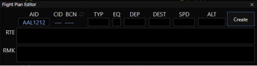
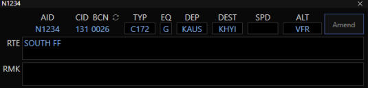
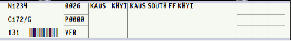

title: CRC Getting Started
# CRC Getting Started

??? warning "Disclaimer"
    This document is provided for Houston ARTCC controllers to use when providing virtual ATC services on the VATSIM network. The information herein is **not intended for use in any real-world aviation applications**.

## FAQ
**Where do I get the CRC download?**

All downloads and web apps will be located on the [vNAS website](https://vnas.vatsim.net/).

**Where can I find documentation/help?**

- The Official CRC [documentation](https://crc.virtualnas.net/docs/#/)
- vStrips web app and documentation are [here](https://strips.virtualnas.net/docs/#/).
- vTDLS web app and documentation are [here](https://tdls.virtualnas.net/docs/#/).
- YouTube [CRC Getting Started](https://www.youtube.com/watch?v=7KHjynNJJHs) video by ZOA.
- List of [Radar Vector Maps (RVM)](https://rvm.houston.center/) available to STARS scopes.
- The following Getting Started tips.
- The `#tech-support` and `#bugs-and-requests` channels in the ZHU discord.

## Getting Started Guide
### Profile Creation
1. *(First time only)* Click on `Manage Installed ARTCCs`, scroll down and press `Install` next to Houston ARTCC - ZHU (and any additional ARTCC data you desire).
1. Exit the Manage Installed ARTCCs window by pressing `X` at the top right.
1. Press `New Profile` on the bottom left and ensure the appropriate ARTCC is selected in the ARTCC drop down menu.
1. Choose the desired facility.
1. Choose a display type depending on position to be staffed (see table below).
    1. If STARS is selected, choose an `Initial Area` to display. Most up/down TRACONS include one area. I90, for example, has different areas with appropriate visibility centers pre-set.
    1. If ASDE-X or Tower Cab are selected, this field will not be shown.
1. Give your profile a name.
1. Press `Create Profile`.

!!! info
    The positions to which you can sign on are determined by the first type of CRC window you choose when creating a new profile:

    | Position Type | Starting Window |
    | --- | --- |
    | Delivery Ground/Ramp Local (non-radar) | Start with a Tower Can or ASDE-X (IAH, HOU, MSY) view |
    | Local (radar) TRACON | Start with a STARS view |
    | Center | Start with an ERAM view |

    If you choose Tower Map or ASDE-X window in profile creation, you’ll be offered Delivery, Ramp, Ground, and non-radar Local positions. If you choose STARS, you’ll be offered only radar Local and TRACON positions. Once connected you can add additional windows of any type.

Local positions with a radar feed from their overlying TRACON must open a STARS window as their first CRC window during profile creation (see Appendix below).

### Logging In
1. Go to the CRC hamburger menu (three lines top left of the window) and press `Connect` or `Ctrl`+`F12`.
1. Choose a position from the drop down. Starred positions are the default or consolidated positions if only one controller will be on that position level (i.e. no splits).
1. Choose the `Controller` role to control or `Observer` to observe. (Student and Instructor will apply to Sweatbox training scenarios.) Note that while logged on as Observer, some functions will be disabled.
1. Choose your highest certified `rating` (not the rating level of the position you are controlling). Observers should choose `Observer`.
1. When ready to control, press `Activate Session` from the hamburger menu or `Ctrl`+`Shift`+`F12` to activate the session. Activate Session is the new term for “priming up” as there is not an RDVS implemented.

### Adding New Views/Windows
1. In the hamburger menu, add a new window or new tab to the current window. (`Ctrl`+`N` or `Ctrl`+`Alt`+`N`, respectively).
2. Choose the desired display type and press `Add Display`.

### Voice Switch (Radios)
Read the [CRC Voice Switch reference](../reference/crc-voice.md) guide regarding the integrated Voice Switch in CRC

## Flight Plan Management
Flight plan management (creating and editing) is slightly different in CRC. Here is a typical workflow in the new system:

1. Flight plan is filed by the pilot.
1. Observe that either a flightstrip is generated (see vStrips docs) or an aircraft callsign appears in the vTDLS DCL list (see vTDLS docs).
1. Use CRC to view flight plans (`Ctrl`+`F` and type in callsign under AID). You may also `Shift`+`left click` an aircraft icon (in Tower Cab and ASDE-X views) or a STARS radar target to pull up the Flight Plan Editor. A successfully filed flight plan will automatically appear when the callsign is entered.

    

1. Make any required changes and press Amend (where the Create button is in above screenshot). Beacon codes are automatically assigned to valid flight plans from a predefined bank of codes and do not need to be changed. If required, press the refresh arrows next to `BCN` if a different squawk is needed/desired.
1. If working at an airport that supports TDLS, use vTDLS to send a PDC. Otherwise issue a voice clearance as usual.
1. Drag the flight plan strip to the desired bay in vStrips.

### VFR Flight Plans
Like most cases in the real world, CRC and vNAS do not have access to VFR flight plans filed on the VATSIM network. For local flights, tower cab controllers can create handwritten strips (see vStrips docs) to monitor local traffic.

If a computer-generated strip is desired (flight following to be handed to TRACON, for example):

1. Press `Ctrl`+`F` to open the flight plan editor and fill in callsign, type, equipment, departure, arrival (if known) and `VFR` or `VFR/###` for the altitude (where `###` is desired cruise altitude in flight level notation if known).

    

2. Press Create and the system will generate a beacon code for the flight plan.
3. vStrips will create a computer-generated strip for the flight that can be managed like any other strip.

    

### Flight Plan Edits After A PDC Is Sent
Flight Plans cannot be edited in vTDLS.

1. Make edits to the flight plan in CRC (Ctrl+F and type in callsign) and press Amend.
2. The aircraft will move back to the DCL bay in vTDLS.
3. Issue a new PDC.
4. Delete strip (if already printed), print and drag the new flight strip to the desired bay.

### Flight Plan Edits After A Strip Is Printed
Flight Plans cannot be edited in vStrips (only the 3x3 annotation boxes on the right of a strip can be marked).

1. Make edits to the flight plan in CRC.
2. Delete the old strip and print/drag the new strip to the desired bay.

!!! info
    - PDCs are automatically re-sent if a pilot disconnects and reconnects their pilot client.
    - If a pilot requests a re-send of their PDC, encourage them to disconnect and reconnect their pilot client as they will automatically receive the message in their pilot client again. If they prefer not to do this, issue a voice clearance.
    - PDCs can be viewed by the controller but cannot be edited or resent after being sent - you must make changes to the flight plan in CRC, rebuild and resend the new PDC.
    - Printed strips do not update/sync with CRC flight plan changes - they must be reprinted.

## ERAM Users
Top-down ability for ERAM still exists. The maps are in the [ALT] map groups and brightness controls. You may set bookmarks like before while using ERAM top down

Enroute controllers can (but are not required to) open one or more STARS windows and login to TRACON positions below them. This is called a “secondary position”.

Open a STARS window, select the desired position and scope areas, connect, and activate the session (see Logging In below).

!!! info
    - Secondary positions do not show up to pilots as additional controllers online.
    - Secondary positions DO show up to neighboring controllers - eligible for handoffs, point-outs, and other inter-STARS functions.
    - ERAM users must hand-off to themselves if they wish to use STARS commands and resources on a track while working top-down. Similarly, you must handoff to yourself from TRACON to Enroute to use ERAM processing on a track.
    !!! warning
        DO NOT tune or cross-couple TRACON frequencies when using ERAM and secondary positions (non-lateral frequency use is against VATSIM Code of Conduct).

## Appendix

**Airports with Surface Radar Displays (ASDE-X module in CRC)**

HOU, IAH, MSY, AUS, SAT

!!! info
    AUS and SAT surface radar are actually Surface Awareness Initiative Displays, SAID, and look like and is called a CRC ASDE-X display. SAID does not support the same safety logic features or data tag depth as traditional ASDE-X/ASSC.

**Airports with TDLS:**

AUS, HOU, IAH, MSY, SAT

**Local positions without Radar feed:**

BAZ, EDC, HDC, HSA, NGP, NGW, NWL, PQL, TME, VCT

!!! info
    These start with Tower Cab view, all others should start with a STARS view.