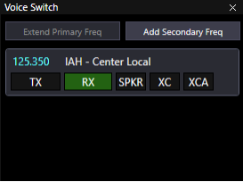
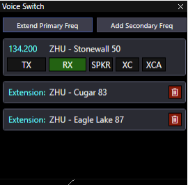
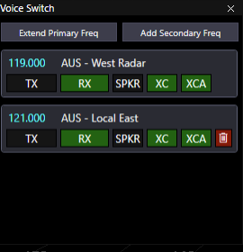
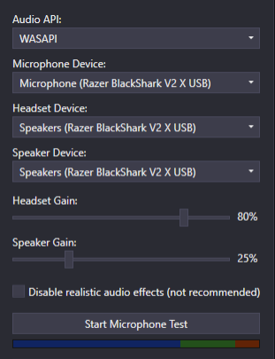
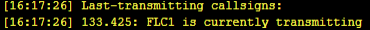
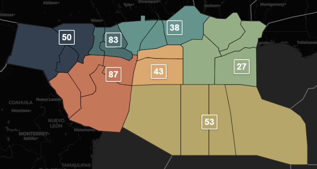

title: CRC Voice Integration
# CRC Voice Integration

??? warning "Disclaimer"
    This document is provided for Houston ARTCC controllers to use when providing virtual ATC services on the VATSIM network. The information herein is **not intended for use in any real-world aviation applications**.

AfV/Track Audio functionality has been integrated into CRC. The standalone AfV client will no
longer be used while controlling with CRC. Track Audio will also be phased out in the U.S.

## Voice Switch Overview
!!! info inline end "Voice Switch Overview"
    
| Feature | Function |
| --- | --- |
| Extend Primary Freq | Add a sector from the same facility to your frequency. Primarily used by enroute controllers. (Example: Working RSG, CRP, and AUS specialties.) |
| Add Secondary Freq | Add a second frequency. Primary done to cover another controller temporarily. (Example: Add IAH Local when working I90_D). |
| TX | Lights up when the controller is transmitting. |
| RX | Lights up when a transmission is being received. |
| SPKR | Play this frequency on the configured alternative speaker. |
| XC | Retransmit all pilot comms to all transceivers assigned to your position. Useful to eliminate blocks caused by pilots not hearing pilots in other areas of airspace. Recommend all Center and TRACON positions enable XC on their primary frequency. |
| XCA | Transmit your voice to all frequencies with XCA enabled. Useful when covering a lower or lateral position temporarily. |

## Extending A Frequency’s Coverage
!!! info inline end "Extended Primary Frequency"
    
In this example, the controller is logged into Stonewall 50 (134.200) is using the antennas assigned to Cugar 83 and Eagle Lake 87 (they are covering RSG, CRP, and AUS specialties).

Aircraft within range of any of the three specialties’ antennas will be able to hear the controller.

If the controller pressed `XC`, pilots throughout all three specialties would hear each other as well. Press the red trash can to remove an extension.

## Adding a Second Frequency
!!! info inline end "Adding Secondary Frequency"
    
If a controller needs to add a different lower or lateral frequency (i.e. covering another position temporarily), press `Add Secondary Freq` and choose the desired position.

In this example, Austin Approach 119.00 is temporarily sending and receiving on Austin Local East’s 121.00.

Press `XCA` to send controller transmissions on both frequencies at the same time. `XC` is automatically selected when `XCA` is pressed. This means pilots on both frequencies will hear pilots on either frequency (useful to avoid pilots stepping on each other).

Press the red trash can to remove a secondary frequency.

## New General Settings (`Ctrl`+`G`)
!!! info inline end "New General Settings"
    
Configure your CRC audio settings to match your particular hardware.

**Speaker Device** - if you choose SPKR on any frequency, received transmissions will be played on that audio output.

Adjust the **Gain** sliders to a comfortable level. Use the **Microphone Test** to test your mic distance until a normal speaking voice is regularly in the green. Top end of blue is okay. Avoid constant red.

## New Dot Command
`.lasttx`, `.h`, or `.who` will show any callsigns that are currently transmitting and the last three callsigns that transmitted. It will not show any callsigns that stopped transmitting more than 60 seconds ago.
!!! info "Transmitting Station(s)"
    

## ZHU Examples
!!! info "ZHU Enroute Specialties"
    
A controller is working RSG, AUS, and CRP specialties during an event:

1. Sign on to `HOU_50_CTR`.
1. Press `Extend Primary Freq` and add `HOU_83_CTR`.
1. Press `Extend Primary Freq` and add `HOU_87_CTR`.
1. Enable `XC` on `HOU_50_CTR`. Aircraft in any of the specialties will hear each other.

Another controller is working LFK, LCH, and NEW specialties during the event:

1. Sign on to `HOU_38_CTR`.
1. There is no need to extend frequency because 38 is the designated low consolidated and gets ARTCC-wide coverage already. (Same applies to 46.)
1. Enable `XC` on `HOU_38_CTR`. Aircraft in any of the specialties will hear each other.

A third controller is working OCN specialty:

1. Sign on to `HOU_53_CTR`.
1. Since 53 is the designated consolidated, no additional frequency extension is needed.
1. Enable `XC` on `HOU_53_CTR`. Aircraft in all areas of the specialty will hear each other.

!!! note
    Cab controllers cannot extend their primary frequency as all cab positions use the same single antenna based at the field.