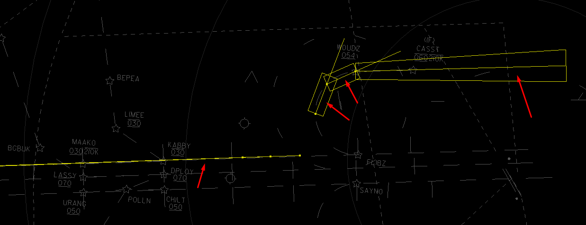
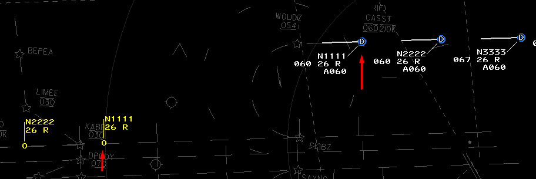
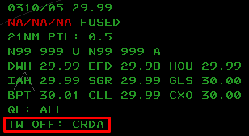
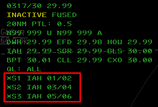
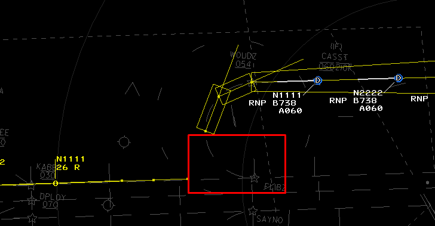
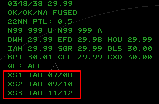
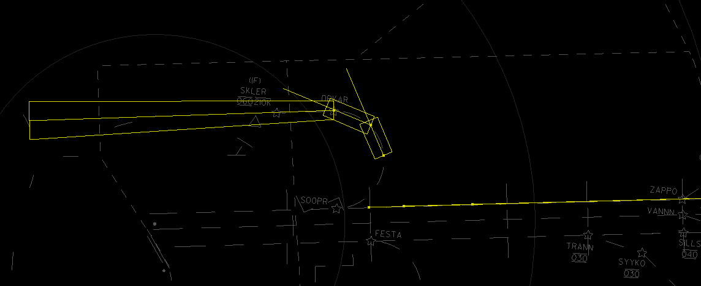

title: CRDA in ZHU
# CRDA in ZHU

??? warning "Disclaimer"
    This document is provided for Houston ARTCC controllers to use when providing virtual ATC services on the VATSIM network. The information herein is **not intended for use in any real-world aviation applications**.

CRDA (Converging Runway Display Aid) is designed to assist controllers with sequencing arrivals to converging runways or approach paths. CRDA can be enabled for one or more Runway Pair Configurations, or RPCs. Each RPC consists of a master runway, a slave runway, a horizontal qualification region, and a descent path profile. RPCs are defined by the facility engineer.

## How It Works
Under the hood, when a CRDA RPC (Runway Pair Configuration) has been activated, qualification regions and track lines are created (demonstrated below by the yellow lines and boxes). Whenever a real aircraft target enters one of the qualification regions, a corresponding ghost track will appear on the extended runway center line.

In CRDA **Stagger Mode** (the preferred mode for converging paths to final), the ghost target will be the same distance to the merge point as they are on the RNP segment(s). In this mode, controllers should aim to shoot the gaps between ghost tracks or use speeds to slot RNP arrivals into the straight-in sequence.

Ghost track datablocks are yellow and include callsign, altitude and weight category.

In the example below, N1111 has about 10-11 track miles to fly before reaching FLIBZ - the merge point with straight-in traffic. Its ghost track on the 8L extended centerline is about the same distance from FLIBZ.

!!! note
    CRC STARS does not natively support merging approach paths with curved segments. Expect some strange, but tolerable behavior from ghost tracks as they transition between qualification regions.
    
    Ghost tracks are NOT eligble for J-balls or P-cones, nor can they be slewed for RBLs.

## Toggle CRDA Processing
**CRDA processing is enabled by default.** If it has been turned off by the controller (indicated by an SSA message, image below), renable it by typing `[F7] N [ENTER]`. This command toggles CRDA processing on and off.

## KIAH
### RNAV-Y 8L
Enter the following commands into your STARS scope without spaces:

- `[F7] N IAH1S [ENTER]`
- `[F7] N IAH2S [ENTER]`
- `[F7] N IAH3S [ENTER]`

Your SSA should now indicate three active RPC pairs:

Due to limitations of CRC/Data Admin, only the first half of the RTF (Radius to Final) is programmed. Once aircraft finish half of the turn, their ghost track will disappear from the extended centerline. *Reminder: the yellow lines and boxes will NOT be visible on your scope.*

!!! warning
    Per real-world I90 SOP: only aircraft with `RNP` in their primary scratchpad will generate ghost tracks while in CRDA qualification regions.

### RNAV-Y 26R
Enter the following commands into your STARS scope without spaces:

- `[F7] N IAH4S [ENTER]`
- `[F7] N IAH5S [ENTER]`
- `[F7] N IAH6S [ENTER]`

*Reminder: the yellow lines and boxes will NOT be visible on your scope.*

!!! warning
    Per real-world I90 SOP: only aircraft with `RNP` in their primary scratchpad will generate ghost tracks while in CRDA qualification regions.

## KMSY
Crude CRDA currently available at MSY for runway pairs 11/20 and 11/2. Documentation coming soon.