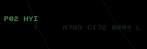

title: Rundown Lists
# Rundown Lists

??? warning "Disclaimer"
    This document is provided for Houston ARTCC controllers to use when providing virtual ATC services on the VATSIM network. The information herein is **not intended for use in any real-world aviation applications**.

## Overview
The Coordination List, also referred to as the "Rundown List," shows coordination message information for departing flights prior to their radar track association. Flights are removed from coordination lists upon their acquisition by radar. A coordination list provides a means where a tower controller typically can convey the sequence and related data of pending departures to the radar controller who will be handling the flight.

Tower controllers are referred to as the "senders" of coordination messages, while the radar controller(s) are referred to as the "receiver(s)." The senders and associated receivers constitute a coordination "channel."

!!! important
    Not all Coordination List features are enabled at ZHU facilities. Learn more about message states, all available commands, and other information in the [CRC Docs](https://crc.virtualnas.net/docs/#/stars?id=coordination-rundown-lists).

## Important Notes
- Coordination messages are for **departure releases only**. The acknowledgment of a coordination messages (automatic or manual) does not grant permission to violate SOP procedures or separation minima as outlined in the 7110.65.
- The primary field at an up/down facility will not use coordination messages, especially where the facility SOP specifies that the Local controller will tag and handoff all departures.
- If an aircraft will be departing from a non-advertised runway, turned in a direction other than SOP-defined headings, or any other unusual departure situation exists, a verbal coordination/call for release **is required**.
- Local controllers can continually build a departure sequence by sending subsequent messages.
- TRACON controllers can toggle automatic acknowledgment on any list by entering `<F13>(LISTID) A*<ENTER>` or `<F13>(LISTID) M*<ENTER>`. *Note: only messages without additional coordination text will be auto-acknowledged.*

!!! warning
    Until TRACON TCP hierarchy is established (coming to CRC soon) all relevant TRACON controllers will see coordination messages even if they aren't responsible for the departure. (Example: `I90_D`, `I90_M`, and `I90_J` all recieve BPT messages.) It is the responsibilty of the online controllers to determine who should acknowledge those messages.

## Message States
The entry of a flight in a coordination list is called a coordination message. A coordination message can be in any one of the following states:

- **Unsent:** Displayed in steady green at sender (tower) position.

    

- **Unacknowledged:** Displayed at sender and receiver positions in blinking green to indicate receiver acknowledgement is needed.

    

- **Acknowledged:** Displayed at sender and receiver positions in a steady color with plus symbol (+).

    

Each entry in the list will display the time remaining until release expiration (if released), the position in the sequence, a released indicator (`+`), the aircraft callsign, the aircraft type, the assigned beacon code, the weight class, and other information.

## How to Use
### General Commands
*Note:* `<F13>` = `<SHIFT>+<F3>`

| Command | Result |
| --- | --- |
| `<F7>(LISTID)<SLEW LOCATION>` | Relocate Coordination list (defaults to center of scope window) |
| `<F7>(LISTID) (1-100)<ENTER>` | Set Coordination list size (number of lines, default = 4) |
| `<F13>T<ENTER>` | Toggle display of Coordination list title temporarily (useful for relocating the list) |

### Local Commands
| Command | Result |
| --- | --- |
| `<F7>ZDE<ENTER>` | Enable departure release audible alarm |
| `<F7>ZDI<ENTER>` | Inhibit departure release audible alarm |
| `<F13>(ACID OR BEACON)<ENTER>` | Create and send message Recall exsisting message |
| `<F13>(ACID OR BEACON) (TEXT)<ENTER>` | Create and send message with free text |
| `<F13>(ACID OR BEACON) /<ENTER>` | Create but don't send message Send a previously created message Recall a sent message |
| `<F13>(ACID OR BEACON) / (TEXT)<ENTER>` | Create but don't send with free text |
| `<F13>(ACID OR BEACON) / ##<ENTER>` | Create but don't send message at line number ## (useful for resquencing) |
| `<F13>(ACID OR BEACON) ##<ENTER>` | Reorder existing unsent message |

### TRACON Commands
| Command | Result |
| --- | --- |
| `<F13>(LISTID) (FLID)<ENTER>` | Acknowledge specific message |
| `<F13><ENTER>` | Acknowledge message when only one is pending |
| `<F13>(LISTID) A*<ENTER>` | Enable automatic acknowledge for messages with no message text (`LISTID` required) |
| `<F13>(LISTID) M*<ENTER>` | Disable automatic acknowledge for messages with no message text (`LISTID` required) |

*Note: `LISTID` is optional when only one list is configured for the position.*

## Examples
### Austin TRACON
Austin TRACON is online with HYI Local. HYI is advertising RWY 13 for departures and arrivals. N789 is number 1 for RWY 13.

**Coordination Message Sequence:**

1. HYI Local `<F13>N789<ENTER>`. Both scopes:

    

1. AUS TRACON `<F13>P02 N789<ENTER>`. Both scopes:

    

1. HYI Local notices the message for N789 stops blinking, a `+` and countdown appears and clears N789 for take off.

### Sequence Reordering

HYI Local has prepared but not sent three coordination messages:

- Local: `<F13>N123 /<ENTER>`
- Local: `<F13>N456 /<ENTER>`
- Local: `<F13>N789 /<ENTER>`

    

N456 pulls off into a runup area and needs a few minutes. N789 is ready to go and will now be second. HYI Local can reorder the list:

- Local: `<F13>N789 2<ENTER>`

    

The sequence is now correct and all three messages can be sent to TRACON. Note how the same commands are used to send the prepared messages:

- Local: `<F13>N123 /<ENTER>`
- Local: `<F13>N789 /<ENTER>`
- Local: `<F13>N456 /<ENTER>`

    

TRACON will acknowledge the messages on rundown list #2:

- TRACON: `<F13>P02 N123<ENTER>`
- TRACON: `<F13>P02 N789<ENTER>`
- TRACON: `<F13>P02 N456<ENTER>`

HYI Local will receive audible beeps indicating message acknowledgment, the messages turn solid yellow with the `+` next to the sequence number, releases the aircraft and launches them using standard separation techniques.

## ZHU Rundown Lists

List of TRACONs and their paired coordination lists. TRACONs not on this list have no underlying fields with radar towers.

| TRACON | List ID | Airport | Recievers |
| --- | --- | --- | --- |
| I90 | P01 | BPT | J, M, D |	
| I90 | P02 | CLL | U, M, D |
| I90 | P03 | CXO | R, M, D |
| I90 | P04 | DWH | R, P, M, D |
| I90 | P05 | EFD | B, M, D |
| I90 | P06 | GLS | B, M, D |
| I90 | P07 | SGR | P, M, D |
| AUS | P01 | GTU | R, L, W |
| AUS | P02 | HYI | R, L, W |
| CRP | P01 | HRL | X, N |
| CRP | P02 | BRO | Z, X, N |
| CRP | P03 | MFE | Y, X, N |
| GPT | P01 | BIX | E, W |
| LCH | P01 | CWF | E |
| LFT | P01 | ARA | E, W |
| MOB | P01 | BFM | E, W |
| MSY | P01 | NEW | S, N, W |
| MSY | P02 | NBG | S, W |
| MSY | P03 | HUM | H, S, W |
| NQI | P01 | NOG | A |
| SAT | P01 | SKF | K, S, N |
| SAT | P02 | RND | R, N |
| SAT | P03 | SSF | K, S, N |