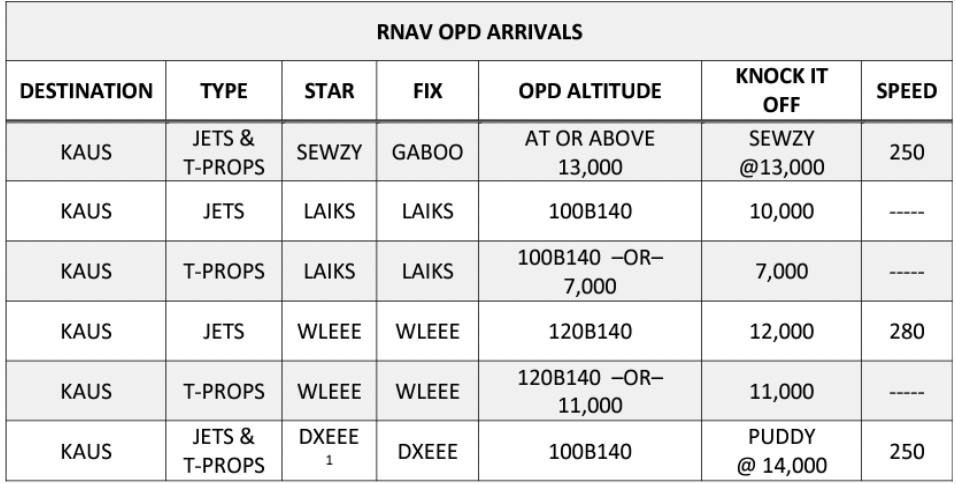
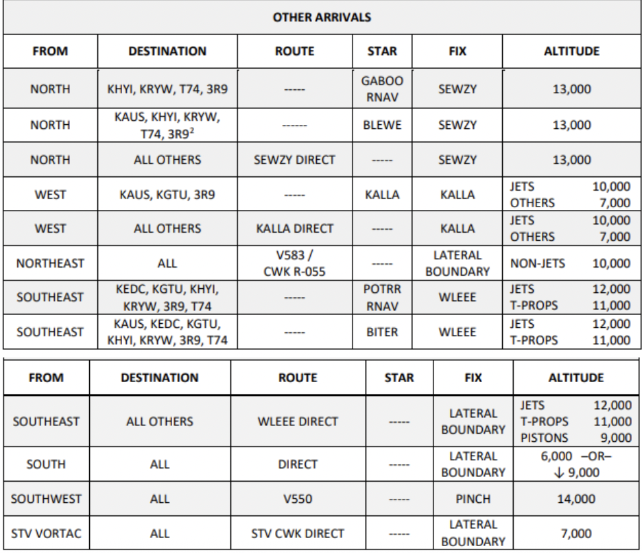
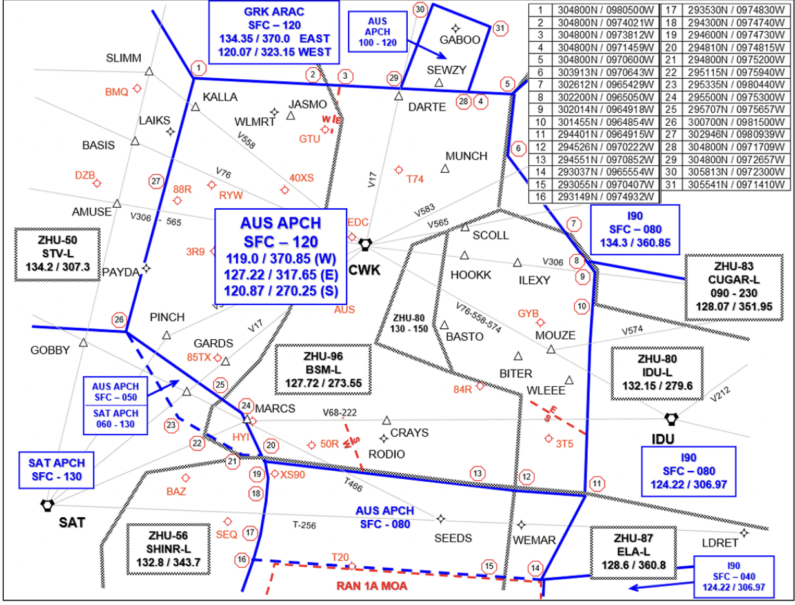
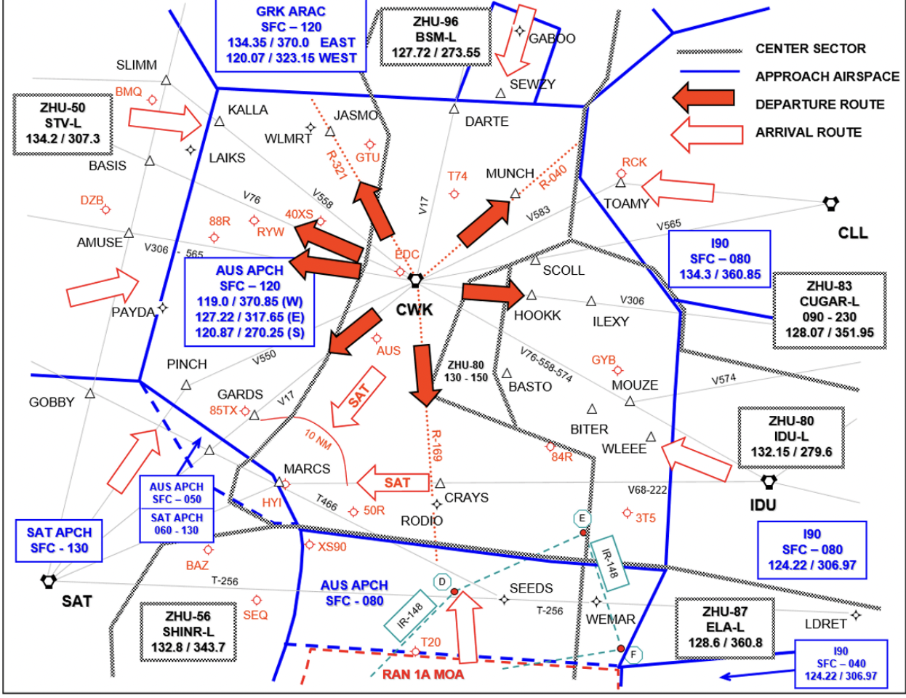
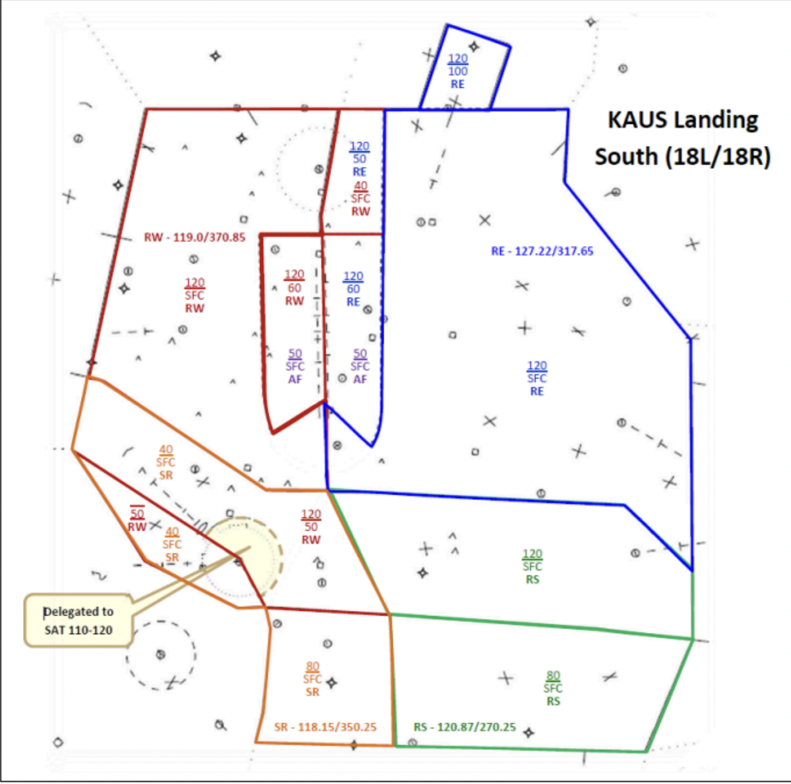
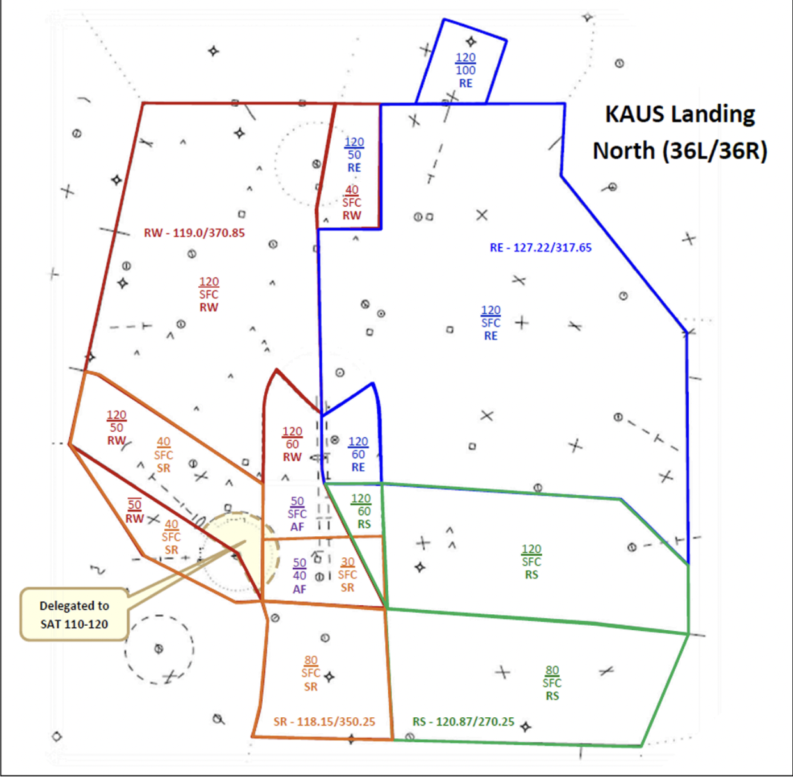
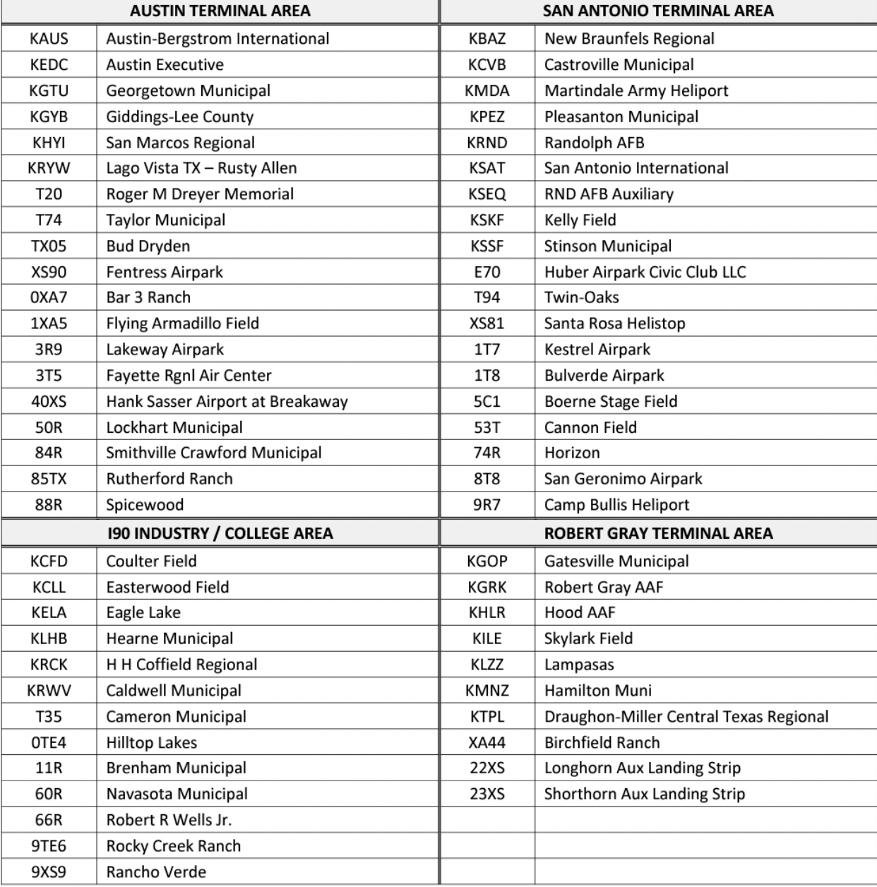
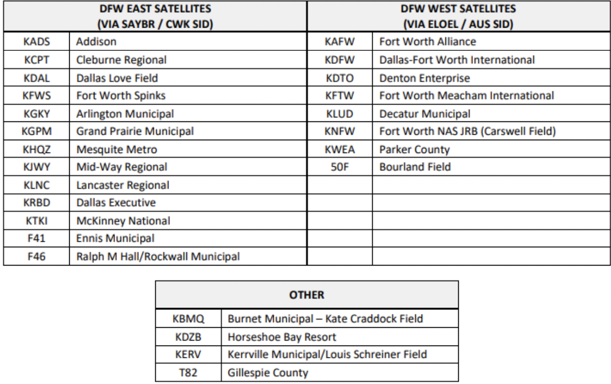

title: AUS<>ZHU
# AUS<>ZHU
??? warning "Disclaimer"
    This document is provided for Houston ARTCC controllers to use when providing virtual ATC services on the VATSIM network. The information herein is **not intended for use in any real-world aviation applications**.

!!! success "Effective Date"
    31 Jan 2024

## 1. Purpose
This agreement between Houston Air Route Traffic Control (ARTCC) and Austin Airport Traffic Control Tower/Terminal Radar Approach Control (ATCT/TRACON) defines responsibilities and procedures for the airspace delegated to Austin ATCT/ TRACON and is supplementary to the procedures contained in FAA JO 7110.65 and other FAA directives.
## 2. Cancellation
This is the initial letter of agreement between Houston ARTCC and Austin ATCT/TRACON.
## 3. Scope
The procedures and delegated airspace specified herein apply to Houston ARTCC Center and Austin ATCT/TRACON. Each party to this Letter of Agreement must ensure facility
personnel are familiar with these procedures.
## 4. Procedures
### 4-a. General

1. Deviations from procedures in this agreement may be affected after coordination has been accomplished.
1. Approach Control must be responsible, after receipt of a point-out from Center, for subsequent point-outs within their airspace. Center must be responsible, after receipt of a point-out from Approach Control, for subsequent point-outs within their airspace.
1. VFR Handoffs. If Center or Approach Control has not accepted the handoff of a VFR aircraft by the Approach Control boundary, Center/Approach Control must terminate radar service to the aircraft and transfer communication to the appropriate controller.
1. When an “OPD Altitude” is listed, ZHU shall issue a “Descend via” clearance.
1. “Knock it off” altitudes shall only be used when both AUS and ZHU determine that a “Descend via” clearance is impractical.

### 4-b. Radar Arrival Control
1. Center
    1. Must route all Austin Terminal Area arrivals via the appropriate routings and altitudes shown in Tables 1 and 2, except as otherwise noted.
    1. Must treat the following arrival route pairings as one with standard separation provided between like type aircraft:
        1. LAIKS and KALLA STAR
        1. WLEEE, POTRR and BITER
        1. DXEEE STAR and V550 arrivals over PINCH
    1. May route WLEEE, POTRR and BITER arrivals direct to WLEEE.
    1. May route aircraft destined KHYI via direct destination, descending to 7,000 feet from the northwest or descending to 13,000 feet from the east.
    1. May route aircraft destined KHYI from the north or northeast via direct CWK direct destination and cross CWK at 13,000 feet.
    1. May route aircraft destined KEDC or KGTU from the east via direct destination, descending to 10,000 feet.
    1. May route aircraft destined Austin Terminal Area satellite airports from the Northwest and West via direct destination, descending to 7,000 feet.

??? info "**Table 1: RNAV OPD Arrivals**"
    
    *^1^DXEEE STAR arrivals will be handed off to San Antonio TRACON.*

??? info "**Table 2: Other Arrivals**"
    
    *^2^KEDC arrivals from the north will be handed off to Robert Gray ARAC.*

### 4-c. Radar Departure Control

1. Departure aircraft must be:
    1. Established on a SID.
        1. Aircraft may be shortcut direct ELOEL or ILEXY.
        1. Aircraft on the PALMS# SID must be at or below 5,000.
    1. Direct the following fixes/VORs:
        1. AGJ
        1. JCT
        1. STV
        1. AMUSE
    1. Established on the following radials/airways:
        1. V17/J21
        1. V306
        1. CWK-040R
1. Aircraft departing AUS requesting 14,000 feet or above and overflying San Antonio TRACON airspace:
    1. When AUS is in a south flow, aircraft must be handed off to San Antonio TRACON.
    1. When AUS is in a north flow, aircraft must be handed off to the Center.
1. Approach Control may route KGTU departures to the east via direct CLL.

### 4-d. Overflights
1. Turboprop and piston aircraft overflying Austin Approach at or above 13,000 feet landing in the San Antonio Terminal Area must cross twenty (20) NM northeast of MARCS at 13,000 and be handed off to Austin Approach Control.
1. All aircraft overflying Approach Control airspace at or above 13,000 feet destined KBAZ and KSEQ Airports must be established at 13,000 feet no later than thirty (30) NM from MARCS and handed off to Approach Control.

## 5. Attachments
??? info "ANNEX 1: Delegation of Airspace"
    

??? info "ANNEX 2: Arrival / Departure Routes"
    

??? info "ANNEX 3: Austin TRACON Positions - North Flow"
    

??? info "ANNEX 4: Austin TRACON Positions - South Flow"
    

??? info "ANNEX 5: Terminal Area Airports"
    
    