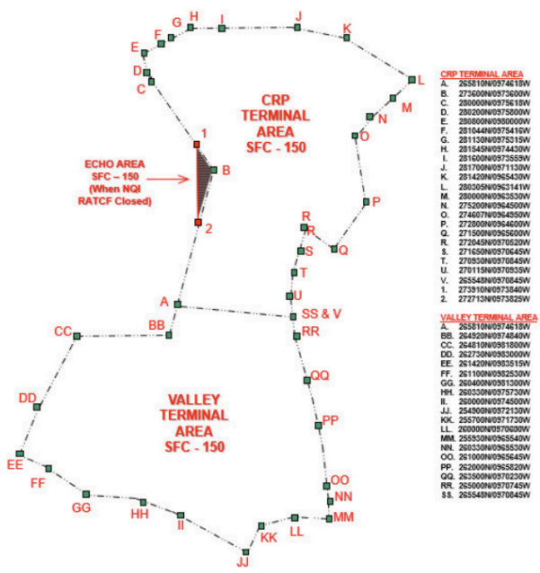
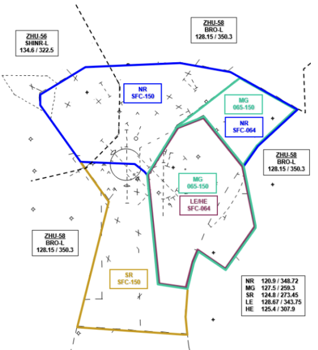
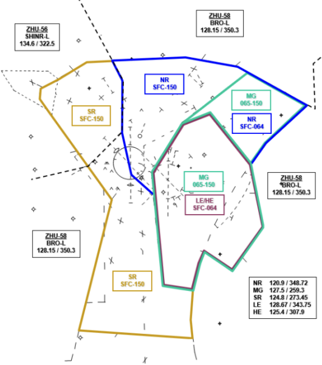
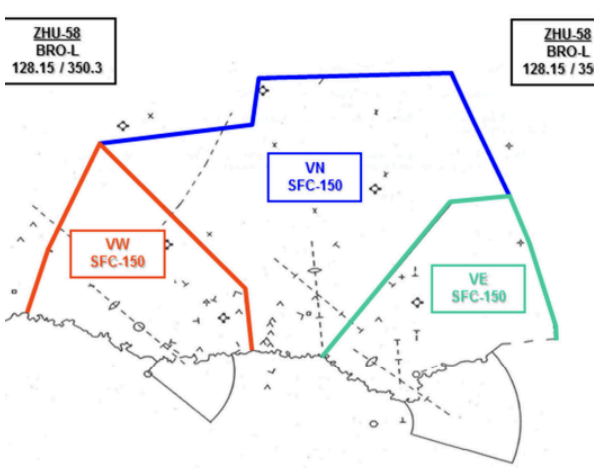
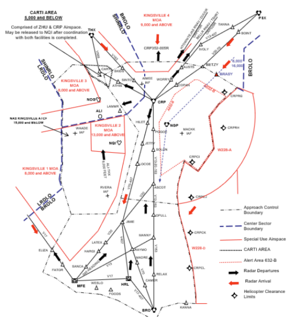
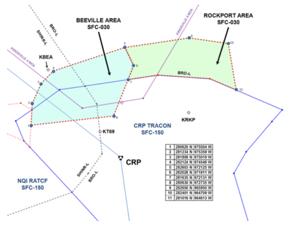
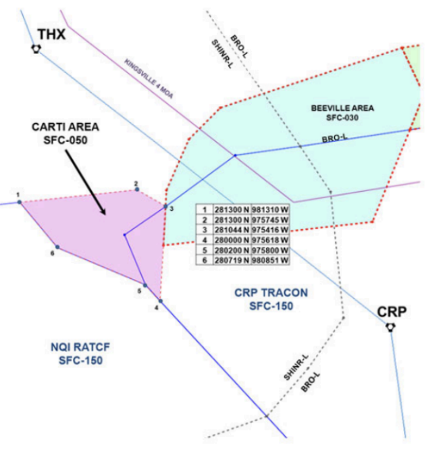
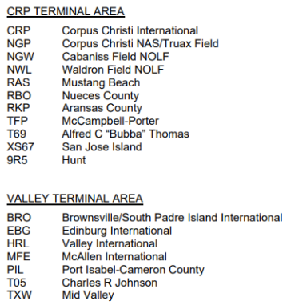

title: CRPT-ZHU
# CRPT-ZHU Letter of Agreement
??? warning "Disclaimer"
    This document is provided for Houston ARTCC controllers to use when providing virtual ATC services on the VATSIM network. The information herein is **not intended for use in any real-world aviation applications**.

!!! info "Effective Date"
    31 Jan 2024

## 1. Purpose
This agreement between Houston Air Route Traffic Control (ARTCC) and Corpus Christi Airport Traffic Control Tower/Terminal Radar Approach Control (ATCT/TRACON) defines responsibilities and procedures for the airspace delegated to Austin ATCT/ TRACON and is supplementary to the procedures contained in [FAA JO 7110.65](https://www.faa.gov/air_traffic/publications/atpubs/atc_html/) and other FAA directives.

## 2. Cancellation
This is the initial letter of agreement between Houston ARTCC and Corpus Christi ATCT/TRACON.

## 3. Scope
The procedures and delegated airspace specified herein apply to Houston ARTC Center and Corpus Christi ATCT/TRACON. Each party to this Letter of Agreement must ensure facility personnel are familiar with these procedures.

## 4. Procedures
### 4-1. General
1. Deviations from procedures in this agreement may be affected after coordination has been accomplished.
1. Approach Control must be responsible, after receipt of a point-out from Center, for subsequent point-outs within their airspace. Center must be responsible, after receipt of a point-out from Approach Control, for subsequent point-outs within their airspace.
1. VFR Handoffs. If Center or Approach Control has not accepted the handoff of a VFR aircraft by the Approach Control boundary, Center/Approach Control must terminate radar service to the aircraft and transfer communication to the appropriate controller.
1. The BEEVILLE South Area, as depicted in [Attachment A-6](#a-6-beeville-and-rockport-areas), may be released to ZHU by CRP APCH to accomplish holding and/or approach to the Beeville Municipal Airport (BEA). ZHU must obtain release from the adjacent ZHU sector as well as the CRP APCH North Radar and South Radar positions as appropriate.
1. The BEEVILLE North Area, as depicted in [Attachment A-6](#a-6-beeville-and-rockport-areas), may be released to CRP APCH by ZHU to accomplish holding and/or approach to the Alfred C. "Bubba" Thomas Airport (T69), or holding at SINTO intersection. CRP APCH must obtain release from both the ZHU ShinerLow and Brownsville-Low Sectors.
1. The ROCKPORT Area, as depicted in [Attachment A-6](#a-6-beeville-and-rockport-areas), may be released to CRP APCH by ZHU to accomplish holding and/or approach to the Aransas County (RKP) Airport.
1. The CARTI Area depicted in [Attachment A-7](#a-7-carti-area) is comprised of ZHU airspace and CRP APCH Sector airspace. This area may be delegated to NAS Kingsville ATCF from surface to 5,000 feet. The ATCF must obtain release of the CARTI Area from both ZHU and CRP APCH.

### 4-2. Corpus Terminal Area
1. Radar Arrival Control. ZHU Must:
    1. Route aircraft from the northeast via BETZY V20 CRP direct destination.
    1. Route aircraft from the north via direct CRP VORTAC between the CRP352R and the CRP005R, then direct destination.
    1. Route aircraft from the northwest via SKIDS V163 CRP direct destination.
    1. Ensure aircraft cross BETZY or SKIDS at the appropriate altitude below:
        1. Turbojets - 12,000
        1. Turboprops - 10,000
        1. Pistons - 6,000
    1. Ensure aircraft routed via the CRP352-005R are descending to 7,000 feet.
    1. Must route aircraft from the west, when NQI RATCF is closed, via direct destination level at 5,000 feet.
    1. Must route aircraft destined Aransas County (RKP), San Jose Island (XS67), McCampbell-Porter (TFP), Alfred C. “Bubba” Thomas (T69), and Mustang Beach (RAS) Airports direct destination at 4,000 feet.
1. Radar Departure Control. APCH Must:
    1. Route departing aircraft via the CRP248R, ATHIS V568 THX, WORRY V13 PSX, or the CRP transition to join the appropriate STAR into the I90.
    1. Aircraft requesting 16,000 feet or above must be assigned 15,000. Aircraft requesting 15,000 feet or below must be assigned an altitude correct for direction of flight.
    1. Must assign 6,000 feet or lower to aircraft departing via the CRP352-005R.

### 4-3. Valley Terminal Area
1. Radar Arrival Control. ZHU Must:
    1. Route aircraft direct destination descending to 16,000 or if lower, level at an altitude correct for direction of flight.
    1. Descend MFE arrivals from the west to 7,000.
1. Radar Departure Control. APCH Must:
    1. Route northbound aircraft via CRP, and westbound aircraft via MFE V17 LRD.
    1. Aircraft requesting 16,000 feet or above must be assigned 15,000. Aircraft requesting 15,000 feet or below must be assigned an altitude correct for direction of flight.

## 5. Attachments
### A-1: Delegation of Airspace

### A-2: CRP Terminal Airspace – North Flow

### A-3: CRP Terminal Airspace – South Flow

### A-4: Valley Terminal Airspace

### A-5: Radar Arrival/Departure Routes

### A-6: Beeville and Rockport Areas

### A-7: CARTI Area

### A-8: Terminal Area Airports
