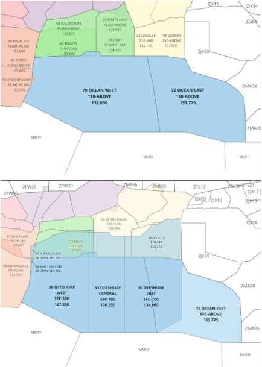
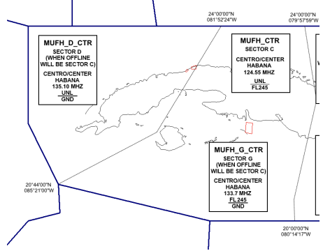

title: HAV-ZHU
# HAV-ZHU Letter of Agreement
??? warning "Disclaimer"
    This document is provided for Houston ARTCC controllers to use when providing virtual ATC services on the VATSIM network. The information herein is **not intended for use in any real-world aviation applications**.

!!! info "Effective Date"
    1 Jan 2024

## 1. Purpose
This document establishes the operational procedures for the coordination of air traffic between Houston ARTCC and Havana FIR. The procedures contained in this document will be applied to all air traffic operating under Instrument Flight Rules (IFR) that cross the common boundary, and are supplemental to appropriate ICAO documents.

## 2. Cancellation
This document cancels and supersedes all previous agreements between Houston ARTCC and Havana FIR.

## 3. Coordination Procedures
1. Transfer of control will occur at the Havana Center/Houston Center boundary unless otherwise coordinated.
1. Radar handoffs shall be initiated at least 10 miles from the common boundary.
1. Anytime Houston Center or Havana Center is split, all controllers must be notified how the center is being split.
1. Assigned Mach speeds must be coordinated.
1. Transfer of radar identification will be accomplished via an automated handoff.

## 4. Route/Altitude Assignments
1. All aircraft must be established on an airway. Coordination is required for direct routes.
1. Houston center must:
    1. Clear MUHA arrivals via an appropriate STAR after SHARQ.
    1. Clear MMUN arrivals via SHARQ UM463 WALKY UB879 NOSAT CUN MMUN.
        1. Havana Center may turn MMUN aircraft direct to NOSAT upon transfer of communications.
    1. Assign EVEN altitudes (e.g., FL280, FL300), or as coordinated.
1. Havana center must assign ODD altitudes (e.g., FL290, FL310), or as coordinated.

## 5. IFR Separation
1. Vertical Separation.
    1. Below FL290 - 1,000ft
    1. From FL290 through FL410 (Both Included)
        1. Affirmative RVSM - 1,000ft
        1. Negative RVSM - 2,000ft
    1. Above FL410 - 2,000ft
    1. Negative RVSM aircraft cruising from FL290 through FL410 must be coordinated.
1. Longitudinal Separation.
    1. Radar procedures will be utilized at all altitudes.
    1. Aircraft of similar type, altitude, and airspeed, on the same or crossing course, must be   separated by a minimum of ten (10) NM, constant or increasing.

## 6. Attachments
### A-1: Houston Airspace

### A-2: Havana Airspace
