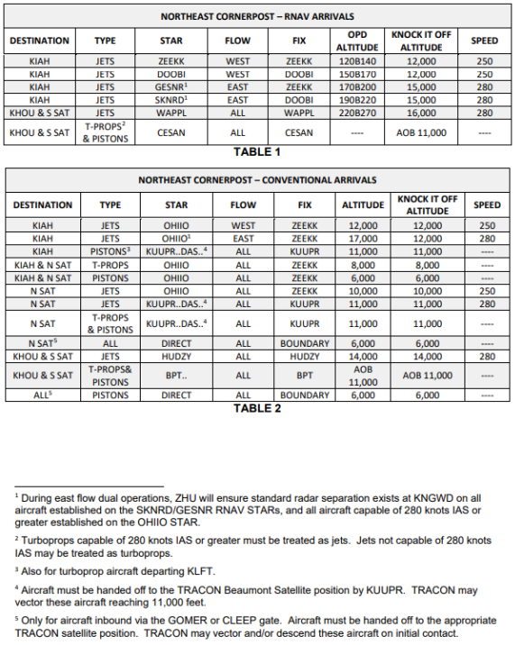
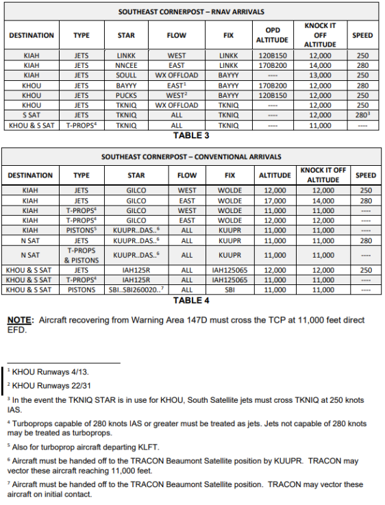
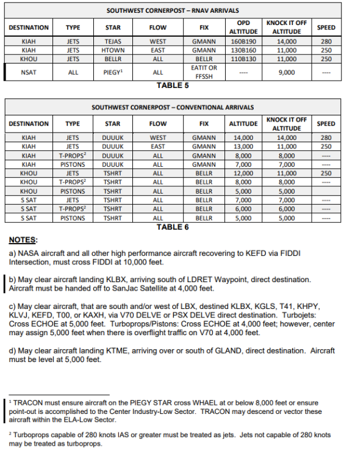
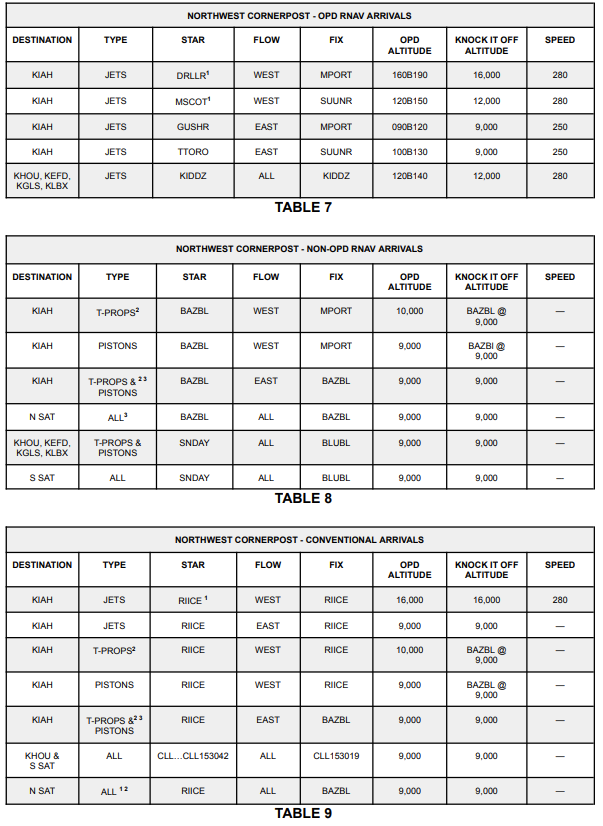
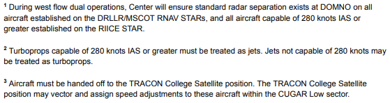
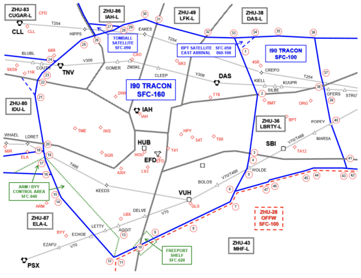
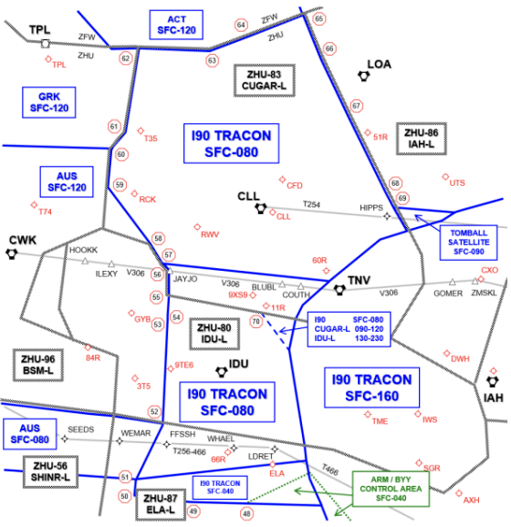
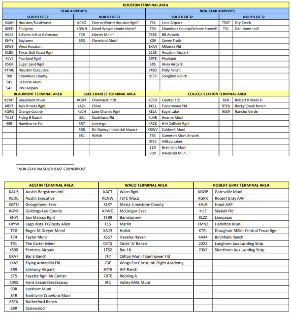
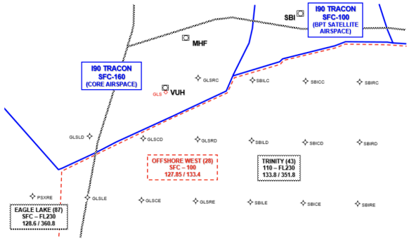

title: I90-ZHU
# I90-ZHU Letter of Agreement
??? warning "Disclaimer"
    This document is provided for Houston ARTCC controllers to use when providing virtual ATC services on the VATSIM network. The information herein is **not intended for use in any real-world aviation applications**.

!!! info "Effective Date"
    11 Apr 2025

## 1. Purpose
This agreement between Houston ARTC Center and Houston TRACON defines responsibilities and procedures for the airspace delegated to Houston TRACON and is supplementary to the procedures contained in [FAA JO 7110.65](https://www.faa.gov/air_traffic/publications/atpubs/atc_html/) and other FAA directives.

## 2. Cancellation
This is the initial letter of agreement between Houston ARTCC and Houston TRACON.

## 3. Scope
The procedures and delegated airspace specified herein are applicable to Houston ARTC Center and Houston TRACON. Each party to this Letter of Agreement must ensure facility personnel are familiar with these procedures.

## 4. Procedures
### 4-1 General
1. Deviations from procedures in this agreement may be effected on an individual basis after verbal coordination is accomplished by the controllers involved.
1. Upon acceptance of a point-out, the TRACON/Center controller as appropriate will be responsible for all further point-outs within their facility, provided the aircraft does not exit and re-enter the receiving facility’s airspace.
1. If a radar handoff on a VFR aircraft cannot be accomplished prior to the appropriate Center/TRACON boundary the Center/TRACON controller must terminate radar service and advise the aircraft of the next frequency.
1. TRACON must ensure that aircraft traveling between the Houston, Beaumont, and Lake Charles Terminal Areas remain within airspace delegated to the TRACON.
1. When an "OPD Altitude" is listed, ZHU shall issue a "Descend via" clearance.
1. "Knock it off" altitudes shall only be used when both I90 and ZHU determine that a "Descend via" clearance is impractical.

### 4-2. Houston Terminal Area Arrival Control
1. Center:
    1. Must route arrival aircraft via the appropriate STAR/AAR and assign the altitudes shown in Tables 1–9. Center must ensure aircraft are established on the appropriate STAR/AAR at or prior to the TCP, except as otherwise noted.
    1. For the purposes of arrival control, turboprops capable of 280 knots IAS or greater must be treated as jets, and jets not capable of 280 knots IAS or greater may be treated as turboprops.
    1. Must provide at least ten (10) NM separation behind an A380, or other aircraft designated as Super.
    1. Long-side (Downwind-side) dual arrivals must be treated as one.
    1. Must coordinate those aircraft that are unable to comply with prescribed procedures contained within the LOA with the TRACON receiving controller. The TRACON receiving controller will be responsible for further internal facility coordination
    1. Must clear aircraft requesting high altitude instrument approach procedures into EFD to DROPP or APRIL IAF and assign 17,000 feet, or the next higher altitude available.
    1. When aircraft on the RNAV STARs are unable to comply with the vertical navigation requirements, an altitude within the OPD restriction at the lateral TCP will be coordinated.

        
        
        
        
        

### 4-3 Houston Terminal Area Departure Control
1. TRACON:
    1. Must ensure all aircraft exit TRACON airspace established on an appropriate SID.
    1. May transfer communication to Center, on aircraft which are on diverging SIDs/ADRs/ADARs and separated by three (3) NM or more provided separation is constantly increasing.
    1. May stack KIAH/North Satellite departures with KHOU/South Satellite departures cleared via the TRIOS, GOMER or CLEEP gates.
    1. Must coordinate those aircraft that are unable to comply with prescribed procedures contained within the LOA with the Center receiving controller. The Center receiving controller will be responsible for all internal facility coordination.
    1. Must assign 16,000 feet if the requested altitude is 16,000 feet or above and assign all others their requested altitude, except:
        1. Assign 14,000 feet or below to all aircraft that will exit TRACON airspace overflying the TRACON College or Industry Satellite airspace via IDU direct CLL routing.
        1. If conditions prevent the integration of piston and/or turboprop aircraft with turbojet traffic, TRACON may assign an interim altitude appropriate for direction and advise Center.
    1. All aircraft requesting 10,000 feet or below destined KVCT, may be cleared direct KVCT at 6,000 feet.

### 4-4. Houston Terminal Area Overflights
1. Center must clear all en route overflight aircraft entering TRACON airspace on the routes below:
    1. T254 at 10,000 feet and below.
        1. Center must descend eastbound aircraft requesting 8,000 feet or below to cross HIPPS at 9,000 feet. These aircraft may be cleared direct HIPPS to join T254.
        1. Center must descend westbound aircraft to cross CREPO at 11,000 feet and initiate a handoff to the TRACON Beaumont Satellite (AIJ) position for further descent. These aircraft may be cleared direct CREPO to join T254.
    1. V306 at 8,000 feet and below.
        1. Center must descend eastbound conventional navigation aircraft to cross five (5) NM west of TNV VORTAC at 9,000 feet and initiate a handoff to the TRACON College Satellite (AIU) position, and transfer communications at or prior to BLUBL, for further descent. These aircraft may be cleared direct TNV to join V306.
        1. Center must descend westbound conventional navigation aircraft to cross at or abeam KUUPR at 11,000 feet and initiate a handoff to the TRACON Beaumont Satellite (AIJ) position for further descent. These aircraft may be cleared direct DAS to join V306.
    1. T466 at 8,000 feet and below.
        
        !!! note
            TRACON must verbally coordinate with Center Eagle Lake-Low Sector, all aircraft routed via T466 between 5,000 and 8,000 feet.

    1. V70 at 10,000 feet and below, or 14,000 – 16,000 feet.
    1. Clear aircraft landing KARM and KBYY Airports via one of the following:
        1. WAPPL STAR. Descend via the OPD profile.
        1. TKNIQ direct destination. Cross TKNIQ at 12,000 feet.
        1. CESAN STAR. Cross CESAN at or below 11,000 feet.
        
        !!! note
            KARM and KBYY arrivals under TRACON control that will next enter the Center Eagle Lake-Low sector, must be assigned 4,000 feet. Upon communication transfer, TRACON releases the ARM/BYY Control Area defined in [ANNEX A-1](#a-1-delegation-of-airspace-and-overflight-routes). The Eagle Lake-Low sector will have control for vectors and descent crossing the lateral boundary of the ARM/BYY Control Area, regardless of altitude. The Eagle Lake-Low sector must return the ARM/BYY Control Area to TRACON when no longer in use.

### 4-5. Beaumont Terminal Area Arrival Control
1. Aircraft inbound from the Center Daisetta-Low or Trinity-Low Sectors must be routed direct destination airport.
    1. Aircraft at or above 11,000 feet, must be level at or descending to 11,000 feet.
    1. Aircraft at or below 10,000 feet, must enter TRACON airspace level at an altitude appropriate for direction of flight.
1. Aircraft from west of the Houston Terminal Area at 17,000 feet or above that will overfly the primary airspace delegated to TRACON must be routed via IAH direct BPT direct destination.
    1. Aircraft must cross IAH VORTAC at 17,000 feet and be handed off to the TRACON Departure East (AIE) position. Communication transfer should be accomplished as soon as possible after handoff, but no later than the IAH VORTAC.
    1. TRACON must descend these aircraft and ensure they remain tower en route or complete the necessary point-out(s) upon re-entering Center airspace.
1. Aircraft inbound from west of the Houston Terminal Area at 16,000 feet or below, and north of LDRET Waypoint must be routed as follows:
    1. T254 CREPO direct destination, at an altitude appropriate for direction of flight, at or below 9,000 feet.
    1. V306 DAS direct destination. Center must descend eastbound conventional navigation aircraft to 9,000 feet and initiate a handoff to the TRACON College Satellite (AIU) position for further descent. These aircraft may be cleared direct TNV to join V306.
1. Aircraft inbound from west of the Houston Terminal Area at 16,000 feet or below and over or south of LDRET Waypoint must be routed as follows:
    1. T466 SBI direct destination, at an altitude appropriate for direction of flight, at or below 7,000 feet.
    1. V70 SBI direct destination, at an altitude appropriate for direction of flight, at or below 15,000 feet.

### 4-6. Beaumont Terminal Area Departure Control
1. TRACON must:
    1. Ensure all aircraft are on a heading or course to join the route of flight at or prior to the first NAVAID/fix outside the Beaumont Terminal Area lateral boundary.
    1. Altitude assignments must be:
        1. Aircraft requesting an altitude above 10,000 feet, assign 10,000.
        1. Aircraft requesting an altitude of 10,000 feet or below, assign the requested altitude, appropriate for direction of flight.

### 4-7. College Station Terminal Area Arrival Control
1. Center must route all aircraft direct destination.
1. Altitude assignments must be:
    1. Aircraft at or above 9,000 feet, must be level at or descending to 9,000 feet.
    1. Aircraft at or below 8,000 feet, must enter TRACON airspace level at an altitude appropriate for direction of flight.
    1. Aircraft destined KELA and 66R from the Center Eagle Lake-Low sector must be level at or descending to 5,000 feet.

### 4-8. College Station Terminal Area Departure Control
1. TRACON must:
    1. Aircraft departing on eastbound flight paths from airports 11R and north requesting at or above 9,000 feet must be assigned a heading towards LOA VOR. Center has control for vectors to the east.
    1. Ensure all aircraft are on course prior to communication transfer.
1. Altitude assignments must be:
    1. Aircraft requesting an altitude above 8,000 feet, assign 8,000.
    1. Aircraft requesting an altitude of 8,000 feet or below, assign the requested altitude, appropriate for direction of flight.
    
    !!! warning "Exception"
        Departures from KELA, 66R, or 9TE6 that will first enter the Center Eagle Lake Low Sector must be assigned 4,000.

### 4-9. Offshore IFR Helicopter Operations
1. General:
    1. IAFDOF is approved, unless otherwise coordinated.
    1. Arrivals and departures must be established on their filed route of flight.
    1. TRACON and Center Offshore airspace as described in this section is depicted in [ANNEX A-3](#a-3-offshore-airspace).

### 4-10. Freeport Shelf
1. Upon request, the Offshore West sector will release the FREEPORT Shelf as depicted in [ANNEX A-1](#a-1-delegation-of-airspace-and-overflight-routes), surface to 2,000 feet, to the TRACON. Center will provide radar separation of three (3) NM from the boundary of the FREEPORT Shelf when released to the TRACON. The TRACON must return the FREEPORT Shelf to the Offshore West sector when no longer in use.

## 5. Attachments
### A-1: Delegation of Airspace and Overflight Routes

### A-2: Satellite Airports

### A-3: Offshore Airspace
