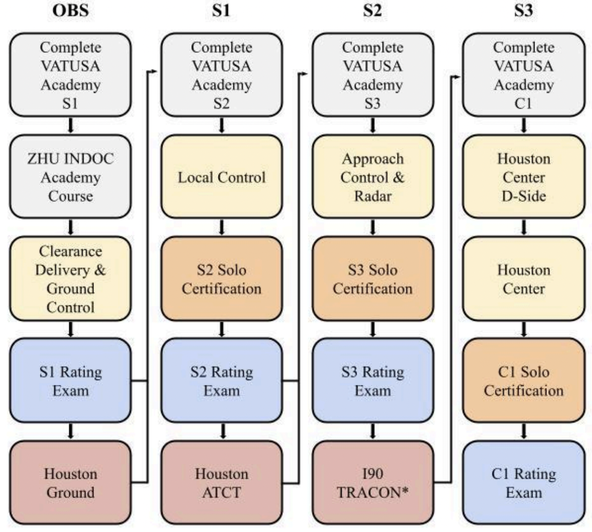
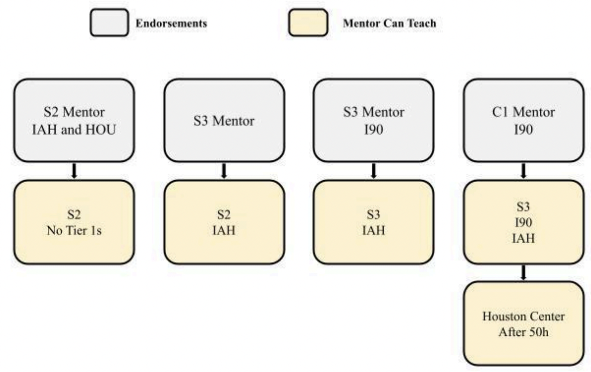

title: Training Policy
# Training Policy
??? warning "Disclaimer"
    This document is provided for Houston ARTCC controllers to use when providing virtual ATC services on the VATSIM network. The information herein is **not intended for use in any real-world aviation applications**.

??? info "Revision Information"
    - Document Number: ZHU P002.1C
    - Date: 4 Apr 2025
    - Revision: **1C**

    **Record of Revisions**

    | Date | Revision | Editor |
    |:---:|:---:|:---:|
    | 1 Jan 2025 | 1A | JN |
    | 2 Feb 2025 | 1B | JN |
    | 4 Apr 2025 | 1C | JN |

This training order establishes and provides the standards and requirements for the Virtual Houston ARTCC (ZHU) training program within the VATUSA division. All controllers are required to be familiar with the contents of this order to ensure consistent application of training policy and adherence to operational standards.

## 1. General
### 1-1. Introduction
#### 1-1-1. Purpose
This document governs and establishes standards for training operations within ZHU. This document is considered a supplement to any VATSIM, Executive Committee, VATUSA, and vZHU policies, procedures, and controller documentation.

#### 1-1-2. Audience
All ZHU home controllers and visiting controllers.

#### 1-1-3. Location
This order is available in digital PDF format on the ZHU ARTCC website at https://houston.center/ and can be accessed publicly within the CONTROLLERS-> RESOURCES menu and documents section under POLICIES.

#### 1-1-4. Cancellation
This training order cancels vZHU-P002 Rev. 5 dated 12/20/22.

#### 1-1-5. Explanation of Changes
1C: Added HOU ATCT Tier 1 to Tier 2 changes.

#### 1-1-6. Responsibility
The Virtual Houston ARTCC Training Administrator is responsible for updating the information contained in this order. The TA is also responsible for notifying the VATUSA Deputy Director - Training Services to gain approval for any necessary revisions to this order.

??? info "Abbreviations"
    | Abbreviations | |
    | --- | --- |
    | TA | Training Administrator |
    | ATA | Assistant to the Training Administrator |
    | ATCT | Air Traffic Control Tower |
    | GCAP | Global Controller Administration Policy |
    | MIT | Mentor in Training |

## 2. Training
### 2-1. Overview
#### 2-1-1. Training Flow
??? info "ZHU Training Flow"
    
    *An asterisk indicates that all Tier 1 endorsements must be completed to progress.*

#### 2-1-2. GCAP Compliance
All ZHU ARTCC training flow lessons are compliant with VATSIM GCAP and VATUSA DP002 policy. The ZHU ARTCC training flow is designed to be completed without gaining any extra endorsements up to the S3 rating, at the controller’s discretion, as required in GCAP 8.5(e).

#### 2-1-3. Repeating Lessons
Lessons contained in the ZHU Training Syllabus shall be repeated if necessary until the prescribed completion standards are met. Instructors or Mentors have discretion to repeat a lesson that was already completed, if they deem necessary.

#### 2-1-4. Prerequisite Requirements
Requirements before beginning certain training sessions can be waived at the discretion of the ZHU Training Administrator, such as controlling hour requirements. Such requests for waivers should be submitted via email to the Training Administrator.

#### 2-1-5. Tier 1 Endorsements
Tier 1 Endorsements are issued for IAH ATCT and I90 TRACON, in accordance with GCAP 7.5. These endorsements are optional to a controller up to the S3 rating.

#### 2-1-6. Tier 2 Endorsements
Tier 2 Endorsements are issued for HOU ATCT and all ZHU Enroute positions IAW GCAP 7.4. Those pursuing the HOU T2 endorsement must pass the respective ZHU Academy courses to gain the endorsement.

#### 2-1-7. Solo Endorsements
A. A solo endorsement is an opportunity for a student to practice a position before an S2, S3, or C1 Rating Exam is attempted. The solo endorsement shall not be issued due to lack of available practical training. Solo endorsements are issued by an Instructor or the Training Administrator.

&nbsp;&nbsp;&nbsp;&nbsp;a. A Subdivision shall issue solo endorsements for a continuous period with a duration of up to 45 days. The maximum duration of all solo endorsements can be extended to 90 days, at the permission of the Deputy Director Training Services.

&nbsp;&nbsp;&nbsp;&nbsp;b. The ZHU Events Policy outlines restrictions on controllers with solo certifications operating during certain events.

#### 2-1-8. Violations
Violations of this policy may suspend a student from pursuing training temporarily, at the discretion of the Training Administrator. Students may lose the ability to request and partake in training. Violations made by training staff will be dealt with on a case-by-case basis.

### 2-2. Training Sessions
#### 2-2-1. Requesting Training
All training requests must be made on the ZHU website, except as provided for by 2-2-2 of this policy. Students must only submit time blocks during which they are completely available. Instructors and Mentors will then schedule a session from that block of time. Students are permitted to submit up to 7 training requests at one time. Once a training staff member schedules a session, the student will be notified via email. All students are subject to 2-2-4 of this policy.

#### 2-2-2. Impromptu Training
Instructors and Mentors are permitted to announce their immediate training availability in the #impromptu-training channel in the ZHU Discord. Students shall not post their own availability in this channel, and instead use the guidelines in 2-2-1 of this document. Training staff must only use this channel when there is no student availability to choose from on the website.

#### 2-2-3. Improper Training Requests
Controllers may not solicit training from an Instructor or Mentor by any means. This includes, but is not limited to, asking in any text format or in the ZHU Discord or TeamSpeak. Training staff operate voluntarily, and students should respect that commitment.

#### 2-2-4. No-Shows
Students must make all efforts to attend training sessions that they are scheduled for. A student is considered a no-show if they fail to attend the session within 10 minutes of session start. A trainer is considered a no-show if they fail to attend the session within 10 minutes of session start. All student no-shows will be documented on the ZHU website. If a trainer is to no-show, the student may email the Training Administrator in writing, at `zhu-ta@vatusa.net`, with a complaint, no later than 24 hours after the occurrence.

#### 2-2-5. Cancelling Sessions
Students and Training Staff are encouraged to cancel sessions at least 12 hours in advance of session start. In the case of extenuating circumstances, this can be waived at the discretion of the trainer. Students or training staff seen continuously breaking this policy will receive one warning, and any further violations will be dealt with on a case-by-case basis. Training Staff are authorized to cancel an ongoing training session if a student is not prepared for said training session.

#### 2-2-6. Training Location & Observation
All training at ZHU must be conducted in one of the classroom channels within the ZHU Discord. The Instructor or Mentor has full discretion to allow students, controllers, staff, or a Mentor In Training to observe in these channels, only when the trainee permits. Observation is not permitted during a rating examination.

#### 2-2-7. Recurrent Training
Controllers who are already certified for a position can receive recurrent training. This can be done if the student wants to improve proficiency or wants a refresh. Evaluation for performance in recurrent training shouldn’t impact the student’s training record, and the training staff member should only suggest more recurring training if needed. Training staff must not remove certifications. It is at the discretion of the training staff member as to which sweatbox file to run or if the session is held on the network.

#### 2-2-8. Transferring/Visiting Controllers
Transferring and Visiting Controllers should familiarize themselves with ZHU policies and procedures before considering controlling a position. Transferring and visiting controllers are automatically given all unrestricted certifications through their current rating. Controllers are required to undergo IAH ATCT and I90 TRACON Tier 1 courses, and the online ZHU Academy HOU ATCT courses to gain those endorsements. Transferring or visiting controllers who are C1 rated must undergo Houston Center Tier 2 training before controlling a Houston Center position.

#### 2-2-9. Live Network Monitoring 
Live network monitoring should only be held if the pertinent ZHU lesson authorizes the trainer the option to do so. Exceptions to this rule can be given by the TA. Training staff are authorized to control a position above the student and simultaneously monitor the student, if traffic levels permit. Trainers may only be on a position above the student, and not below. Students may only be monitored during an event posted on the ZHU website with the approval of the Training Administrator and the Events Coordinator. If neither are present, consult the Air Traffic Manager.

#### 2-2-10. Rating Examinations
Rating (Previously “OTS”) Examinations test students on either a live (not including OBS to S1) or simulated basis on practical applications for the purpose of rating promotions. Rating examinations are required to gain VATSIM ratings S1 through C1. S3 and above rated Mentors are permitted to conduct the S1 rating examination. Only Instructors (I1, I3) are permitted to conduct S2 through C1 rating examinations. Instructors and Mentors must follow VATUSA guidelines when conducting rating examinations. Refer to VATUSA DP002 3-5.

## 3. Administration
### 3-1. Training Staff Applicants
#### 3-1-1. Mentor Selection
A. Controllers interested in becoming a training staff member should familiarize themselves with all ZHU policies and procedures.

B. Requirements for the Mentor role are as follows:

&nbsp;&nbsp;&nbsp;&nbsp;a. Must hold an S2 rating or greater with all pertinent Tier 1 and Tier 2 certifications.

&nbsp;&nbsp;&nbsp;b. No history of significant discipline the past 2 years within ZHU or on VATUSA action log.

&nbsp;&nbsp;&nbsp;c. Must be an active ZHU home controller, and must have met and exceeded activity requirements on record.

&nbsp;&nbsp;&nbsp;d. Must have a strong knowledge of the 7110.65 and ZHU policies and procedures.

C. Application process:

&nbsp;&nbsp;&nbsp;a. Interested controllers should submit to the Training Administrator, in writing at `zhu-ta@vatusa.net`, the following:

&nbsp;&nbsp;&nbsp;&nbsp;&nbsp;&nbsp;&nbsp;&nbsp;i. Name and VATSIM CID

&nbsp;&nbsp;&nbsp;&nbsp;&nbsp;&nbsp;&nbsp;&nbsp;ii. Resume including relevant VATSIM and/or real world experience.

&nbsp;&nbsp;&nbsp;&nbsp;&nbsp;&nbsp;&nbsp;&nbsp;iii. Letter of Intent explaining why you want to become a mentor.

&nbsp;&nbsp;&nbsp;&nbsp;b. Selection of Mentors, based on application data, is at the discretion of the Training Administrator.

&nbsp;&nbsp;&nbsp;&nbsp;c. Applicants are subject to an interview.

&nbsp;&nbsp;&nbsp;&nbsp;d. If selected, the student should receive a message from the Training Administrator to schedule a meeting. This onboarding meeting will discuss our training program, requirements, ATC Trainer software, and the ZHU website training section.

#### 3-1-2. Mentor In Training
A. Upon completion of the initial meeting, the Training Administrator shall issue the Mentor in Training (MIT) the “Training Staff”, “Mentor” and “MIT” roles in the ZHU discord. MITs will be considered a “Mentor” in VATUSA, and will have access to all pertinent information.

B. MITs are required to meet the following requirements before full Mentor certification during the MIT phase:

&nbsp;&nbsp;&nbsp;&nbsp;a. Must observe no less than 3 training sessions. The MIT must report to the TA when they observe a session. This rule only applies to sweatboxes.

&nbsp;&nbsp;&nbsp;&nbsp;b. Must complete no less than 2 shadowed training sessions. These sessions should be shadowed by the TA or the ATA. All sessions during the MIT phase that the MIT conducts should be shadowed.

C. MIT status should not last longer than 90 days.

#### 3-1-3. Mentor Certification
A. When MIT requirements are met, MITs will be reviewed by the TA for full certification.

B. Once fully certified, the MIT will be announced as a full mentor, and shadowed sessions are no longer required.

C. The TA has the authority to remove all mentor certifications from MITs if progress has not been made, or from other circumstances, such as disciplinary action.

#### 3-1-4. Instructor Applicants
A. Instructors are appointed by the VATUSA training department after a nomination from the ZHU TA, IAW VATUSA DP002 6-1.

B. Instructor applicants must hold a mentor position at ZHU.

C. Requirements to gain the I1 rating are listed on the VATUSA DP002 6-1.

D. Interested mentors should submit to the Training Administrator, in writing at `zhu-ta@vatusa.net`, the following:

&nbsp;&nbsp;&nbsp;&nbsp;a. Name and VATSIM CID

&nbsp;&nbsp;&nbsp;&nbsp;b. Resume including relevant VATSIM and/or real world experience.

&nbsp;&nbsp;&nbsp;&nbsp;c. Letter of Intent explaining why you want to become an instructor.

E. Applicants are subject to an interview.

F. If selected, the TA will nominate the applicant to the VATUSA training staff.

### 3-2. Training Staff
#### 3-2-1. Mentor Responsibilities
A. Mentor Responsibilities are as follows:

&nbsp;&nbsp;&nbsp;&nbsp;a. Reports to the TA.

&nbsp;&nbsp;&nbsp;&nbsp;b. Maintains an online and active presence within ZHU and the VATSIM Network.

&nbsp;&nbsp;&nbsp;&nbsp;c. Provide mentoring to students.

&nbsp;&nbsp;&nbsp;&nbsp;d. Comply with ZHU training policy and syllabus.

&nbsp;&nbsp;&nbsp;&nbsp;e. Recommend students for Solo Certifications and Rating Examinations.

&nbsp;&nbsp;&nbsp;&nbsp;f. For S3 and above Mentors, conduct the S1 rating examination as necessary.

&nbsp;&nbsp;&nbsp;&nbsp;g. Follow the Mentor Limitations listed in 3-2-3.

&nbsp;&nbsp;&nbsp;&nbsp;h. Issue Tier 1 endorsements as required.

#### 3-2-2. Instructor Responsibilities
A. Instructor Responsibilities are as follows:

&nbsp;&nbsp;&nbsp;&nbsp;a. Serve at the discretion of the Deputy Director Training Services, and report directly to the ZHU TA.

&nbsp;&nbsp;&nbsp;&nbsp;b. Maintains an online and active presence within ZHU and the VATSIM Network.

&nbsp;&nbsp;&nbsp;&nbsp;c. Mentor Responsibilities and,

&nbsp;&nbsp;&nbsp;&nbsp;d. Conduct rating examinations and certify students. Give Solo Certifications.

&nbsp;&nbsp;&nbsp;&nbsp;e. Provide mentoring and supervision to students and mentors.

&nbsp;&nbsp;&nbsp;&nbsp;f. Train all courses within the ZHU ARTCC.

#### 3-2-3. Mentor Limitations
A. Mentors can only teach at the level below their current level.

B. Mentor levels consist of unrestricted ratings and all pertinent Tier 1 endorsements.

??? info "Mentor Limitations"
    

C. Mentors that gain the C1 rating must have 50 controlling hours on Houston Center positions until that mentor can teach the ZHU C1 Program.

#### 3-2-4. Assistant to the Training Administrator
A. The TA may assign a current training staff member the Assistant to the Training Administrator position (ATA).

B. The ATA will be responsible for any tasks delegated by the TA, when applicable, and operates as an aid to the TA.

C. The ATA must at least hold a C1 rating.

D. The ATA position is not recognized by VATSIM and VATUSA as an official staff position, and shall not be required to be filled at all times.

#### 3-2-5. Training Staff Conduct
A. When conducting a training session, training staff shall remain professional at all times. Any training staff found to be violating ZHU Training Conduct or VATSIM Code of Conduct is subject to having their training privileges suspended and roles removed.

B. Training staff must:

&nbsp;&nbsp;&nbsp;&nbsp;a. Remain professional at all times.

&nbsp;&nbsp;&nbsp;&nbsp;b. Show up to training sessions prepared and ready to instruct.

&nbsp;&nbsp;&nbsp;&nbsp;c. Discuss student training records only if required to do so, and then, only
amongst ZHU training staff.

&nbsp;&nbsp;&nbsp;&nbsp;d. Complete training notes in a reasonable amount of time.

&nbsp;&nbsp;&nbsp;&nbsp;e. Complete all training sessions in the ZHU Discord.

&nbsp;&nbsp;&nbsp;&nbsp;f. Make the session enjoyable and productive for the student.

#### 3-2-6. Training Staff Activity Requirements
A. ZHU consistently has students who are in need of training; as such, members of ZHU’s Training Department are expected to be active members of the community in addition to conducting training sessions on a regular basis. Training Staff:

&nbsp;&nbsp;&nbsp;&nbsp;a. Must conduct at least 8 training sessions per quarter (ex. Oct-Dec).

&nbsp;&nbsp;&nbsp;&nbsp;b. Must make an effort to attend training staff meetings.

&nbsp;&nbsp;&nbsp;&nbsp;c. Must continue to meet and exceed ARTCC controlling activity requirements.

&nbsp;&nbsp;&nbsp;&nbsp;d. If a training staff member can not meet these requirements due to any reason, please consult with the TA.

#### 3-2-7. Standardization
Training staff must strictly adhere to the ZHU Training Syllabus to ensure training standards are met, and no two people are receiving different levels of training. A Mentor or Instructor must not progress a student unless the student meets the completion standards.

#### 3-2-8. Training Notes
Training notes are essential for the student, as they will have a written record of what occurred during the session, as well as any items on which they need to improve. Training staff members shall give a training report as soon as practical after the completion of a training session, but no later than 24 hours after the scheduled conclusion of the session. This should include the lesson covered.

#### 3-2-9. Training Staff Meetings
Training staff meetings should occur once every quarter at a minimum. These are to discuss the progress of the training department, and to focus on any problems that may arise. Staff meetings are important in the growth of the training department, and should be used to share ideas, and to come up with efficient planning.

#### 3-2-10. Review & Revisions
The TA and ATA should make an effort to review this policy and any training order every quarter to ensure policies align with present operations of the ARTCC. Should any revisions be made, the TA should present this document to ZHU senior staff for proofreading. All updates to training documentation must be submitted to the VATUSA Deputy Director - Training Services for approval.