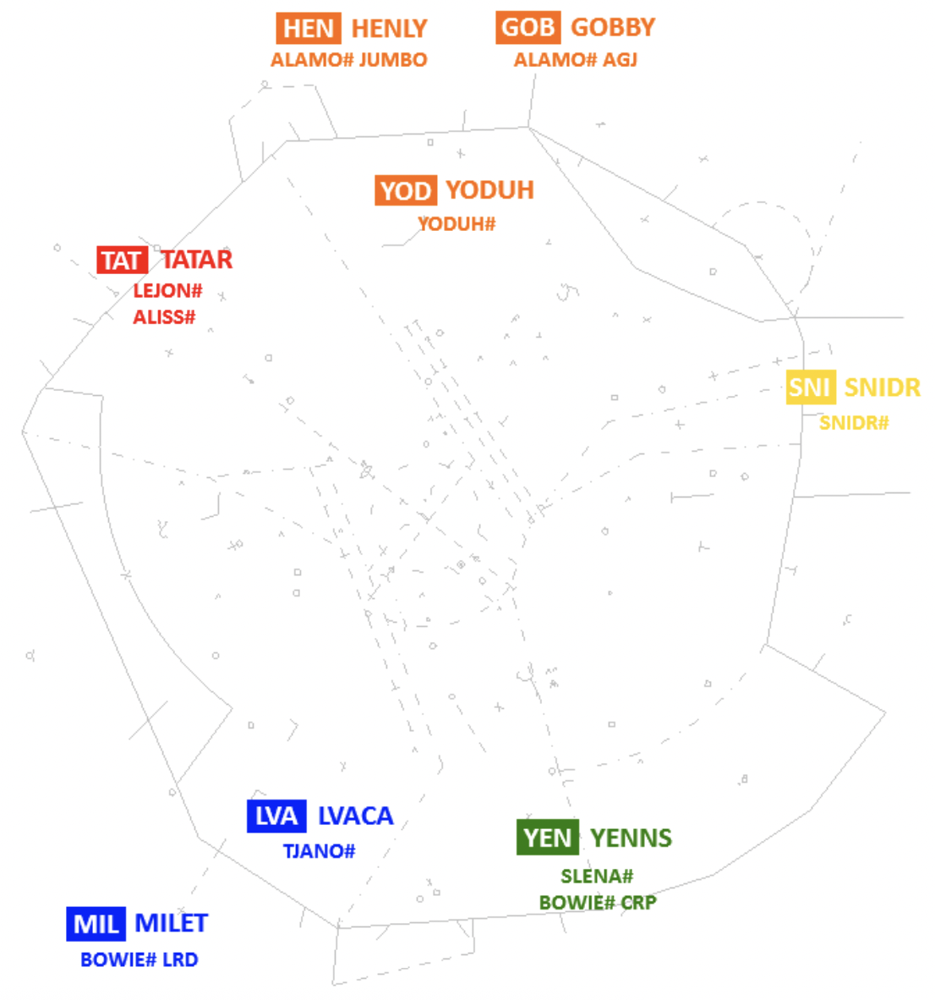
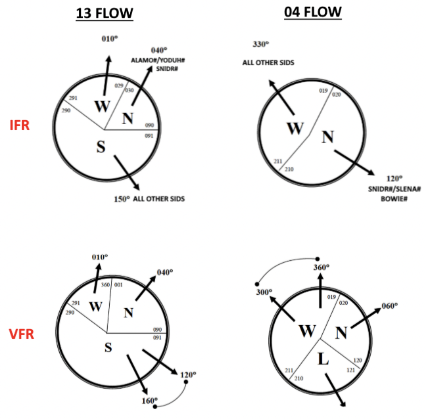
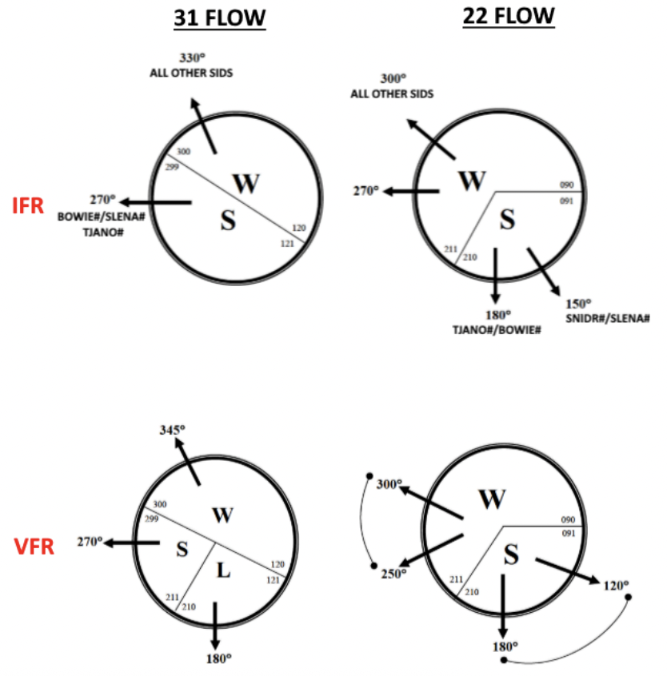

# SAT QRC
!!! info inline end "SAT Info"
    **Airspace** - Class C SFC-020
    
    **Equipment** - Radar
    
    **Operating Hours** - 24/7

### IFR Instructions

- Unless landing within SAT/AUS TRACON, assign all aircraft a SID.
- All aircraft maintain 5,000.
- All Jets/3+ engine props “Fly Runway Heading.” Other aircraft get heading per the diagram below.
- Issue a departure frequency and beacon code to all aircraft.

### VFR Instructions

- All jets/3+ engine props shall “Maintain VFR at or below 5,000”
- All Jets/3+ engine props “Fly Runway Heading.” Other aircraft get heading per the diagram below.

### Images & Figures
#### Scratchpad Departure Gates
??? info "Departure Gates"
    

#### Non-Turbojet Headings
??? info "Prop Depature Headings"
    
    