title: AUS Tower & TRACON SOP
# AUS Tower & TRACON SOP

??? warning "Disclaimer"
    This document is provided for Houston ARTCC controllers to use when providing virtual ATC services on the VATSIM network. The information herein is **not intended for use in any real-world aviation applications**.

    This order prescribes the standards of general operations at all controlled airports within the ZHU ARTCC that are not subject to their own facility-specific SOPs. Operational guidance on airspace division, transfer of control, internal agreements, flight strip usage, and more

    It is emphasized that the information continued herein is designed specifically for use only within the virtual controlling environment. It does not apply to, nor should it be referenced for, live operations in the United States National Airspace System (NAS). The procedures continued within this document show how the positions are to be operated and, in conjunction with [FAA Order 7110.65](https://www.faa.gov/air_traffic/publications/atpubs/atc_html/), will be the basis for performance evaluations, training, and certification.

??? info "Revision Information"
    - Document Number: AUS O 7110.1A
    - Date: 31 Jul 2024
    - Revision: **A**

    **Record of Revisions**

    | Date | Revision | Editor |
    |:---:|:---:|:---:|
    | 31 Jul 2024 | A | EH |

## 1. General
### 1-1. Introduction
#### 1-1-1. Purpose
This order transmits policy and specifies standard operating procedures for Houston ARTCC (ZHU) control positions. It is supplemental to [FAA Order 7110.65, Air Traffic Control](https://www.faa.gov/air_traffic/publications/atpubs/atc_html/); FAA JO 7610.4, Sensitive Procedures and Requirements for Special Operations; and [FAA JO 7210.3, Facility Administration and Operation](https://www.faa.gov/air_traffic/publications/atpubs/foa_html/). This document is considered a supplement to any VATSIM, Executive Committee, VATSIM Americas Region (VATNA), and United States of America Division (VATUSA) policies, procedures, and controlled documentation.

#### 1-1-2. Audience
All ZHU controllers and visitors. All personnel must be familiar with the provisions of this order and exercise their best judgment when encountering situations this order does not cover.

#### 1-1-3. Where Can I Find This Order
This order is available in digital PDF format on the ZHU ARTCC website at https://houston.center and can be accessed publicly within the FILES menu and documents section under SOPs.

#### 1-1-4. Cancellation
vZHU-P020v4, Austin ATCT/TRACON Standard Operating Procedures, dated 28 MAY 2020, and all changes thereto are canceled.

#### 1-1-5. Explanation Of Changes
This is the initial release of AUS 7110.1A. No changes have been made.

#### 1-1-6. Responsibility
1. The Houston ARTCC Air Traffic Manager is responsible for maintaining and updating the information contained in this order.
2. The Houston ARTCC Air Traffic Manager is responsible for notifying the VATUSA Southern Region Air Traffic Director of any necessary revisions to this order.

## 2. ATCT Procedures
### 2-1. General
#### 2-1-1. Duty Familiarization
Controllers shall follow the procedures outlined in [ZHU General Control SOP 1-2-1](../sop/general-control-sop.md#1-2-1-opening-a-position).

#### 2-1-2. Position Relief
Controllers shall follow the procedures outlined in [ZHU General Control SOP 1-2-2](../sop/general-control-sop.md#1-2-2-relief-of-a-position).

#### 2-1-3. Opposite Direction Operations
These procedures are intended for use only in cases of operational necessity or priority.

1. Procedures:
    1. For IFR aircraft conducting ODO to the same runway:
        1. The provisions of [FAA JO 7110.65 7-2-1, Visual Separation](https://www.faa.gov/air_traffic/publications/atpubs/atc_html/chap7_section_2.html), are not authorized.
        1. ODO IFR departures are prohibited with opposing IFR arrival traffic inside a 10 mile final.
        1. When opposing IFR arrival traffic is outside a 10 mile final:
            1. A departing IFR aircraft must be airborne and have commenced a turn to avoid conflict prior to an arriving IFR aircraft reaching a 10 mile final.
            1. An arriving IFR aircraft must cross the runway threshold prior to an opposite direction arriving IFR aircraft reaching a 10 mile final.
    1. For IFR aircraft conducting ODO to parallel runways:
        1. A departing IFR aircraft must be turned away from opposing IFR traffic inbound to the other parallel runway when the arrival is inside the IFR Cutoff Point.
        2. Visual separation may be applied after the departure has commenced a turn away from the opposing IFR arrival traffic.
    1. For VFR aircraft conducting ODO to the same or parallel runways/landing strips:
        1. A departing VFR aircraft must be turned to avoid conflict from opposing IFR or VFR arrival traffic.

### 2-2. Flight Data / Clearance Delivery
#### 2-2-1. Duties
1. Assign the departure runway that most closely aligns with an aircraft’s initial direction of flight.
2. FD/CD must inform GC and LC of all air traffic management initiatives and associated information. Flight strips shall be marked in accordance with the [ZHU General Control SOP 3-2](../sop/general-control-sop.md#3-2-strip-marking).
3. FD/CD shall post and update the ATIS
4. Flight strip marking shall be completed in accordance with the [ZHU General Control SOP 3-2](../sop/general-control-sop.md#3-2-strip-marking).

#### 2-2-2. IFR Aircraft
1. Route IFR aircraft in order of preference listed:
    1. Alias preferred route.
    1. For aircraft initially entering ZHU airspace, an appropriate SID.
    1. For all others, clear the aircraft as filed.
1. Issue the following initial altitudes to IFR aircraft:
    1. All IFR departures maintain 4,000.
    1. IFR departures landing within Austin TRACON maintain 3,000.

#### 2-2-3. VFR Aircraft
1. The following information must be obtained and entered into vNAS for all VFR departures:
    1. Aircraft Type
    1. Destination/On Course Heading
    1. Requested Altitude
1. All VFR departures shall be given:
    1. Maintain VFR at 3,500
    1. An appropriate departure frequency
    1. A squawk code
1. VFR aircraft requesting pattern work shall only be given a squawk code.

### 2-3. Ground Control
#### 2-3-1. Duties
1. GC must taxi all departures to the runway that most closely aligns with their direction of flight.
1. Ground Control must notify Local Control when an aircraft has been taxied to a runway other than the active runway(s).
1. Ground Control must notify Local Control of aircraft taxied to an intersection for takeoff. This may be accomplished non-verbally by marking the flight strip.
1. Flight strip marking shall be completed in accordance with the [ZHU General Control SOP 3-2](../sop/general-control-sop.md#3-2-strip-marking).
1. When possible, sequence traffic to local control by alternating SIDs/departure courses.
1. Must have traffic on Taxiway A give way to aircraft exiting RWY 18L/36R.
1. When “CFR” applies to the aircraft’s destination airport, coordinate with TMU for a departure time when the aircraft calls for taxi.

#### 2-3-2. Ground Split
If traffic conditions require, GC may be split into two positions, GE and GW. When GC is split, GE assumes GC responsibilities for Taxiway G2 and all ground operations east of Taxiway G2 while GW assumes GC responsibilities for all ground operations west of Taxiway G2.

### 2-4. Local Control
#### 2-4-1. Duties
1. Local East (LE) is responsible for runway 18L/36R. Local West (LW) is responsible for runway 18R/36L.
1. LE and LW shall assign headings to departing aircraft in accordance with [Appendix 1](#a-1-standard-departure-headings).
1. Tower airspace is depicted in [Appendix 2](#a-2-airspace-maps).
1. Local control may change the landing runway assignment of any aircraft without coordination if the change does not affect the Finals sequence.
1. Except for cross complex and ODO departures, local control shall have automatic releases on all departures, so long as the aircraft is on a standard heading in accordance with [Appendix 1](#a-1-standard-departure-headings).
1. Local shall radar identify all departures, initiate a STARS track, and execute an automated radar handoff to the appropriate controller prior to communications transfer. It is the TRACON’s responsibility to inform the aircraft that they are “Radar Contact.”
1. Local Control must use the STARS “Quick Look” function in order to view arrival information for all aircraft.

#### 2-4-2. Missed Approach Instructions
In the event of an unplanned go-around/missed approach and after establishing standard separation, local control shall issue the headings [Appendix 1](#a-1-standard-departure-headings) and an altitude of 4000 feet MSL and then coordinate with Final Radar.

#### 2-4-3. Cross Complex Departures
1. Definition:
    1. When LE must assign a westbound heading (West of heading 170° in a south flow or west of heading 020° in a north flow).
    1. When LW must assign an eastbound heading (East of heading 190° in a south flow or east of heading 360° in a north flow).
1. LE/LW must request release from the other controller by stating the following:
    1. The phrase “Request Release”
    1. Aircraft Callsign
    1. Aircraft Type
    1. Departure Heading
1. A cross complex release should not be requested until the aircraft is in a position allowing for imminent departure.
1. A verbal rolling call via “landline” must be utilized to notify the releasing controller of the departure aircraft commencing takeoff roll.

## 3. TRACON Procedures
### 3-1. General Operations
#### 3-1-1. Radar Position Duties
1. Planned missed approach instructions shall be verbally coordinated with local control. Use 4,000 and a standard departure heading in [Appendix 1](#a-1-standard-departure-headings).
1. All turbojet arrivals to Austin-Bergstrom International Airport, when being vectored, must be allowed to be established on the final no closer than 5 miles from the landing threshold.
1. Arrival aircraft shall have their scratchpad marked in accordance with the [General Control SOP 2-2](../sop/general-control-sop.md#2-2-scratchpad-rules).
1. All radar positions must avoid the tower departure area [Appendix 2](#a-2-airspace-maps) unless approved by Local Control.
1. Assign an initial IFR altitude of 3,000 for all non-towered satellite airport departures.

#### 3-1-2. Automated Point Out Procedures
To reduce verbal coordination, the STARS point out function may be used between all intra-facility positions within AUS ATCT/TRACON.

1. APO procedures are authorized when the following conditions are met:
    1. The initiating and receiving controllers must ensure the associated full data block information is correct, usable and easily understood.
    1. It shall be assumed that the aircraft is on course or is being vectored toward the information displayed in the scratchpad.
    1. Additional coordination may sometimes be required to complete the point out and grant approval. Any necessary traffic, restrictions, or additional coordination must be accomplished verbally.
    1. By approving the Automated point out, the receiving controller indicates the associated data block contains sufficient information to ensure aircraft separation is maintained, and authorizes the initiating controller to enter the receiving controller’s area of jurisdiction. If the information contained in the FDB is insufficient to approve the operation, verbal coordination must be accomplished prior to approving the automated point out.

#### 3-1-3. Transfer Of Control
Shall be accomplished in accordance with the [ZHU General Control SOP 1-4-1](../sop/general-control-sop.md#1-4-1-transfer-of-control).

#### 3-1-4. Airspace Delegation
1. Airspace maps can be found in [Appendix 2](#a-2-airspace-maps). If an IFR altitude is delegated to a position of operation, the VFR altitude 500 feet below the IFR altitude is also delegated to the same position of operation unless otherwise designated.
1. Radar West assumes the airspace of Austin Finals and Satellite Radar when closed.
1. Radar East assumes the airspace of Radar South when closed.
1. When Radar South is open, they may assume the airspace of Satellite Radar depending on traffic conditions.

#### 3-1-8. Non-RNAV STAR Altitudes
Aircraft shall be descended to the following altitudes when on a Non-RNAV STAR and being handed off to Final:

1. South Flow:
    1. Radar East 6,000
    1. Radar West 5,000
1. North Flow:
    1. Radar East 5,000
    1. Radar West 6,000

#### 3-1-9. Practice Instrument Approaches For VFR Aircraft
Approach Control feeder positions (RW, RE and RS) must issue climbout instructions to aircraft executing a missed approach or rerun at satellite airports.

1. IFR separation in accordance with [FAA JO 7110.65](https://www.faa.gov/air_traffic/publications/atpubs/atc_html/) must be provided to VFR aircraft conducting practice instrument approaches at:
    1. KAUS
    1. KEDC
    1. KGTU
    1. KHYI
1. IFR separation will not be provided to aircraft operating under VFR that practice instrument approaches to other satellite airports within the Austin terminal area.

#### 3-1-10. Simultaneous Approach Procedures
1. Simultaneous visual approaches shall be conducted in accordance with [7110.65 7-4-4](https://www.faa.gov/air_traffic/publications/atpubs/atc_html/chap7_section_4.html).
1. Simultaneous dependent (Staggered) instrument approaches shall be conducted in accordance with [7110.65 5-9-6](https://www.faa.gov/air_traffic/publications/atpubs/atc_html/chap5_section_9.html), and a 1.5NM stagger shall be applied.
1. Simultaneous independent approaches shall be conducted in accordance with [7110.65 5-9-7](https://www.faa.gov/air_traffic/publications/atpubs/atc_html/chap5_section_9.html). The following final monitor duties shall be performed by the Austin Finals controller:
    1. Instruct the aircraft to return to the correct final approach course when aircraft are observed to overshoot the turn-on or to continue on a track which will penetrate the NTZ.
    
        ??? example "Phraseology"
            YOU HAVE CROSSED THE FINAL APPROACH COURSE. TURN (left/right) IMMEDIATELY AND RETURN TO THE FINAL APPROACH COURSE, or TURN (left/right) AND RETURN TO THE FINAL APPROACH COURSE.

    1. Instruct aircraft on the adjacent final approach course to alter course to avoid the deviating aircraft when an aircraft is observed penetrating or in your judgment will penetrate the NTZ. 
    
        ??? example "Phraseology"
            TRAFFIC ALERT, (call sign), TURN (right/left) IMMEDIATELY HEADING (degrees), CLIMB AND MAINTAIN (altitude).

#### 3-1-10. Prearranged Coordination Procedures (P-ACP).
The controller using prearranged coordination to enter another controller’s airspace is responsible for maintaining approved separation between aircraft under their control and all aircraft in the airspace they will transit by observing the data blocks (position symbol, mode C readout, heavy aircraft/B757 information) of all radar positions with which they are utilizing prearranged coordination procedures to determine the appropriate separation to be applied.

1. Approved P-ACP areas for South Flow can be found in [Appendix 3](#a-3-prearranged-coordination).
1. Approved P-ACP areas for North Flow can be found in [Appendix 3](#a-3-prearranged-coordination).

## Appendices
### A-1. Standard Departure Headings
| | Jet Headings | Prop Headings |
| :---: | :---: | :---: |
| 18R | 190-210 |  190-240 |
| 18L | 150-170 | 120-170 |
| 36L | 360 | 270 or 360 |
| 36R | 020-040 | 360-060 |

### A-2. Airspace Maps
#### South Flow
??? info "Local Control (South Flow)"
    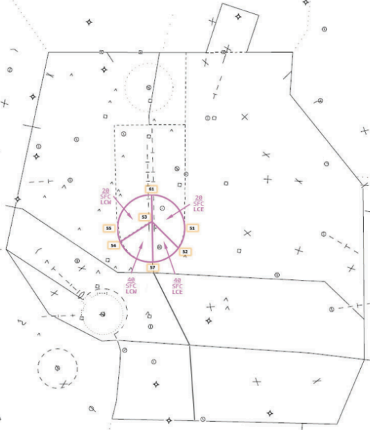
??? info "Radar West (South Flow)"
    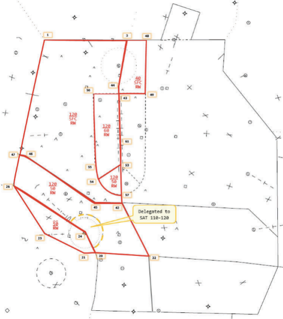
??? info "Radar East (South Flow)"
    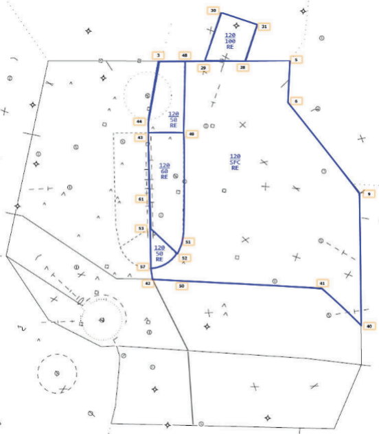
??? info "Radar Finals (South Flow)"
    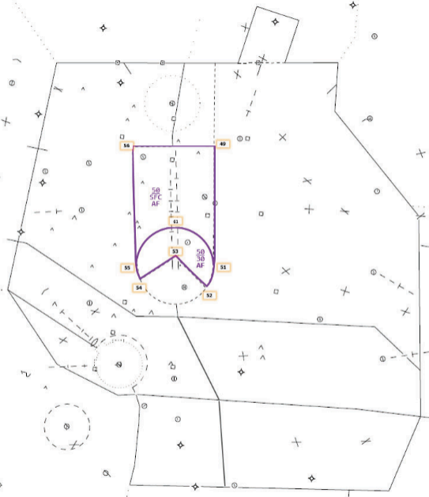
??? info "Radar South (South Flow)"
    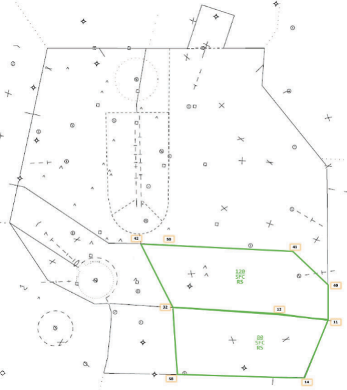
??? info "Satellite Radar (South Flow)"
    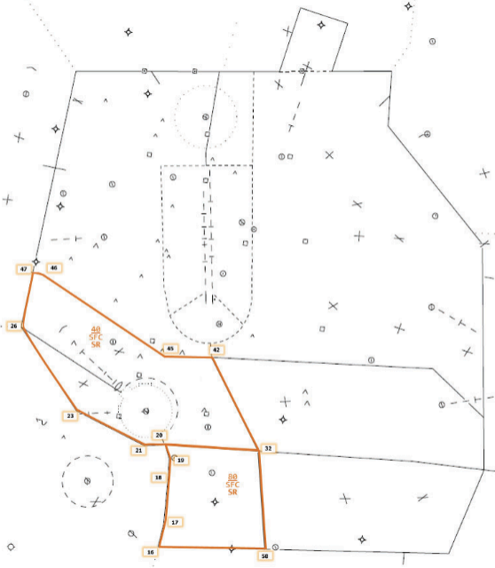

#### North Flow
??? info "Local Control (North Flow)"
    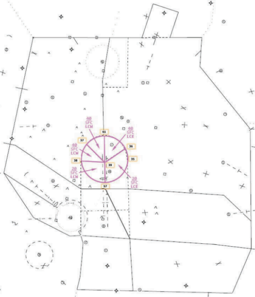
??? info "Radar West (North Flow)"
    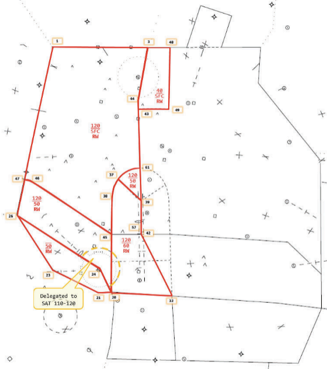
??? info "Radar East (North Flow)"
    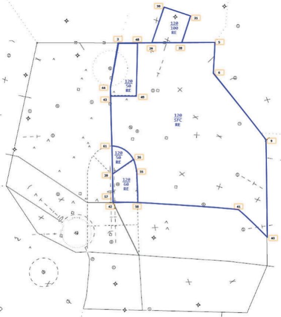
??? info "Finals (North Flow)"
    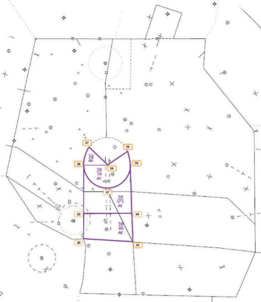
??? info "Radar South (North Flow)"
    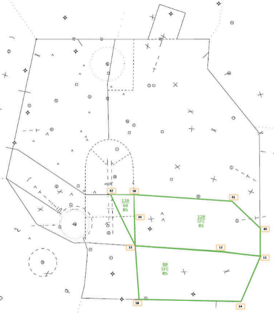
??? info "Satellite Radar (North Flow)"
    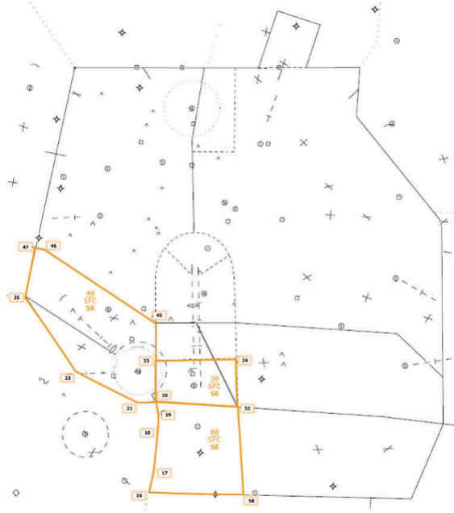

### A-3. Prearranged Coordination
#### South Flow

!!! info inline end "South Flow PAC"
    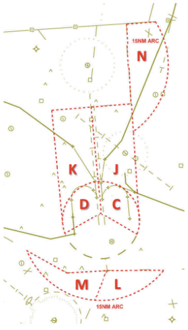

- **C & D** - Austin Finals in Local Control airspace AOB 2,000 MSL for AUS arrivals
- **C & J** - Radar East in Austin Finals airspace AOA 2,500 MSL for AUS departures
- **D & K** - Radar West in Austin Finals airspace AOA 2,500 MSL for AUS departures
- **L** - Radar East in Radar South airspace when AUS departures are assigned AOA 5,000 MSL and tuned toward the departure gate^1^
- **M** - Radar West in Satellite Radar airspace when AUS departures are assigned AOA 5,000 MSL and tuned toward the departure gate^2^
- **N** - Radar West in Radar East airspace for eastbound KGTU departures^3^ ^4^

^1^ The intent in area **L** is to allow slow climbing departures routed to the east to proceed without a point-out to Radar South.

^2^ The intent in area **M** is to allow slow climbing departures routed to the west to proceed without a point-out to Satellite Radar.

^3^ The eastbound KGTU departures in area **N** must be assigned heading 100° and 3,000 MSL and be in handoff status to Radar East by the common boundary. Upon acceptance of the radar handoff, Radar West may turn the aircraft to the departure gate then switch radio communications to Radar East.

^4^ Radar East must point out all T74 IFR arrivals and/or KEDC IFR arrivals to Radar West to allow for compliance with paragraphs 5-1-1 g-i (*this reference is to real world AUS SOP and is not relevant to VATSIM use*).

#### North Flow
!!! info inline end "North Flow PAC"
    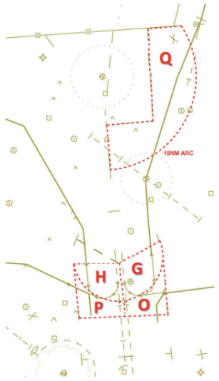

- **G & H** - Austin Finals in Local Control airspace AOB 2,000 MSL for AUS arrivals
- **C & O** - Radar East in Austin Finals airspace AOA 2,500 MSL for AUS departures
- **H & P** - Radar West in Austin Finals airspace AOA 2,500 MSL for AUS departures
- **Q** - Radar West in Radar East airspace for eastbound KGTU departures^1^ ^2^

    ^1^ The eastbound KGTU departures in area **Q** must be assigned heading 100° and 3,000 MSL and be in handoff status to Radar East by the common boundary. Upon acceptance of the radar handoff, Radar West may turn the aircraft to the departure gate then switch radio communications to Radar East.

    ^2^ Radar East must point out all T74 IFR departures and/or KEDC north IFR departures to Radar West to allow for compliance with paragraphs 5-1-1 g-i (*this reference is to real world AUS SOP and is not relevant to VATSIM use*).

### A-4. Departure Gates
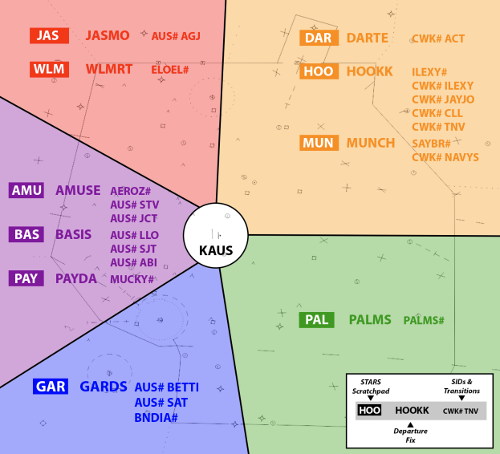