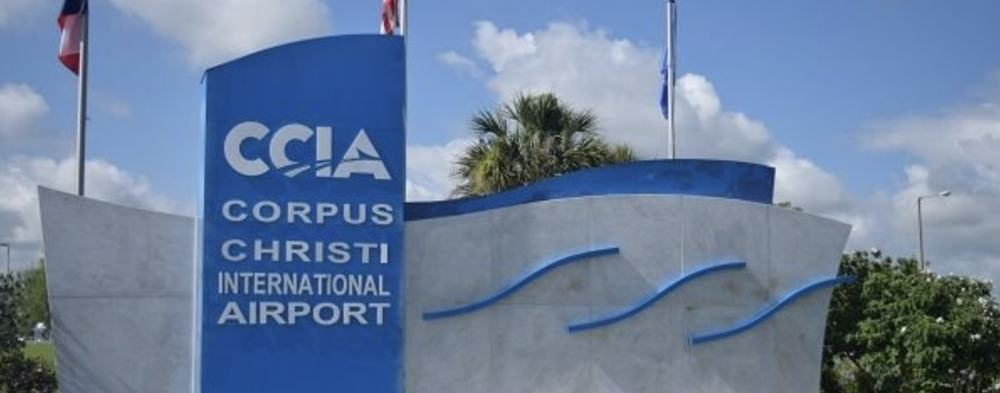
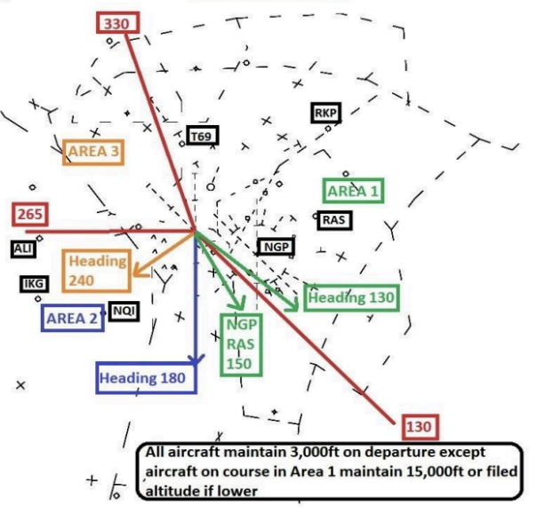
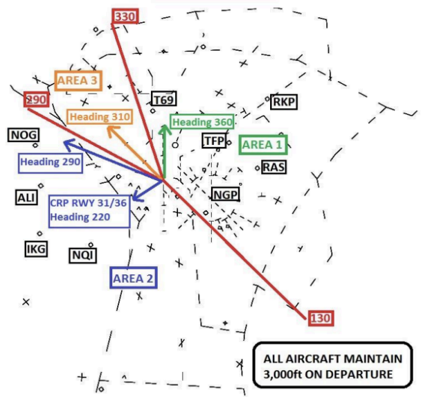
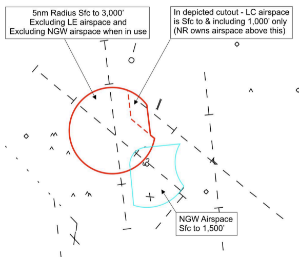
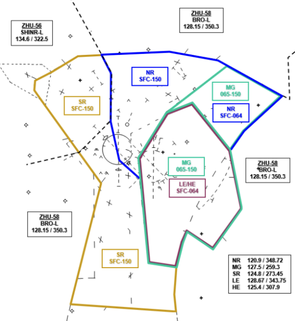
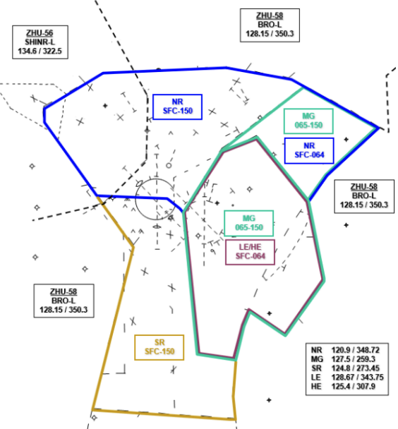
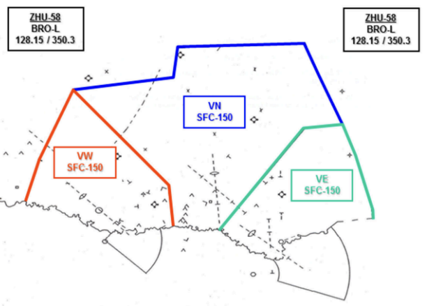

title: CRP Tower & TRACON SOP
# CRP Tower & TRACON SOP

??? warning "Disclaimer"
    This document is provided for Houston ARTCC controllers to use when providing virtual ATC services on the VATSIM network. The information herein is **not intended for use in any real-world aviation applications**.

    This order prescribes the standards of general operations at all controlled airports within the ZHU ARTCC that are not subject to their own facility-specific SOPs. Operational guidance on airspace division, transfer of control, internal agreements, flight strip usage, and more

    It is emphasized that the information continued herein is designed specifically for use only within the virtual controlling environment. It does not apply to, nor should it be referenced for, live operations in the United States National Airspace System (NAS). The procedures continued within this document show how the positions are to be operated and, in conjunction with [FAA Order 7110.65](https://www.faa.gov/air_traffic/publications/atpubs/atc_html/), will be the basis for performance evaluations, training, and certification.

??? info "Revision Information"
    - Document Number: CRP O 7200.2A
    - Date: 31 Mar 2024
    - Revision: **A**

    **Record of Revisions**

    | Date | Revision | Editor |
    |:---:|:---:|:---:|
    | 31 Mar 2024 | A | OS |

## 1. General
### 1-1. Introduction
#### 1-1-1. Purpose
This order transmits policy and specifies standard operating procedures for Houston ARTCC (ZHU) control positions. It is supplemental to [FAA Order 7110.65, Air Traffic Control](https://www.faa.gov/air_traffic/publications/atpubs/atc_html/); FAA JO 7610.4, Sensitive Procedures and Requirements for Special Operations; and [FAA JO 7210.3, Facility Administration and Operation](https://www.faa.gov/air_traffic/publications/atpubs/foa_html/). This document is considered a supplement to any VATSIM, Executive Committee, VATSIM Americas Region (VATNA), and United States of America Division (VATUSA) policies, procedures, and controlled documentation.

#### 1-1-2. Audience
All ZHU controllers and visitors. All personnel must be familiar with the provisions of this order and exercise their best judgment when encountering situations this order does not cover.

#### 1-1-3. Where Can I Find This Order
This order is available in digital PDF format on the ZHU ARTCC website at https://www.zhuartcc.org/ and can be accessed publicly within the FILES menu and documents section under SOPS.

#### 1-1-4. Cancellation
CRP 7200.2P, Corpus Christi ATCT/TRACON Standard Operating Procedures, dated 15 FEB 2024, and all changes thereto are canceled.

#### 1-1-5. Explanation Of Changes
This is the initial release of CRP 7200.2P. No changes have been made.

#### 1-1-6. Responsibility
1. The Houston ARTCC Air Traffic Manager is responsible for maintaining and updating the information contained in this order.
1. The Houston ARTCC Air Traffic Manager is responsible for notifying the VATUSA Southern Region Air Traffic Director of any necessary revisions to this order.

## 2. ATCT Procedures
### 2-1. Duty Preparation
#### 2-1-1. Duty Familiarization
Controllers shall follow the procedures outlined in [ZHU General Control SOP 1-2-1](../sop/general-control-sop.md#1-2-1-opening-a-position).

#### 2-1-2. Position Relief
Controllers shall follow the procedures outlined in [ZHU General Control SOP 1-2-2](../sop/general-control-sop.md#1-2-2-relief-of-a-position).

### 2-2. Flight Data / Clearance Delivery
#### 2-2-1. TMU / Flow Control
FD/CD must inform GC and LC of all air traffic management initiatives and associated information. Flight strips shall be marked in accordance with the ZHU General Control SOP.

#### 2-2-2. ATIS Information
FD/CD shall post and update the CRP ATIS. The ATIS shall include the following phrases, as appropriate:

1. When Corpus Christi is operating on a South Flow, and Runways 13 and 18 are open and available, advertise arrival information to both runways, and include the statement: “Simultaneous converging arrivals to Runways 13 and 18 in use.”
1. “Caution, Navy Cabaniss (NGW) airport, located five miles southeast of the airport, may be mistaken for Corpus Christi International Airport.”

#### 2-2-3. Strip Marking
Flight strip marking shall be completed in accordance with the ZHU General Control SOP. For entries into Box 3 - Departure Gate, mark the “Departure Area” as outlined in [Appendix 1](#a-1-departure-areas-south-flow) & [Appendix 2](#a-2-departure-areas-north-flow).

!!! example "Example"
    Mark “A1” for Area 1 departures

#### 2-2-4. IFR Departure Routing
1. Use the route system alias command to check for a preferred route. If one exists, issue the appropriate route.
1. If no preferred route exists and the aircraft is landing within the Corpus, Valley, or Kingsville terminal areas (TRACONs), clear the aircraft “As Filed.”
1. If no preferred route exists, and the aircraft is not landing within the Corpus, Valley, or Kingsville terminal areas (TRACONs), route the aircraft via one of the following departure routes:
    1. CRP LRD
    1. ATHIS V568 THX
    1. WORRY V13 PSX
    1. CRP transition to join the appropriate STAR into the I90

#### 2-2-5. IFR Altitude Assignment
1. On a South Flow, all aircraft that depart CRP airspace within Area 1 ([Appendix 1](#a-1-departure-areas-south-flow) & [Appendix 2](#a-2-departure-areas-north-flow)):
    1. 15,000 feet or requested altitude, if lower.
1. All other IFR departures:
    1. 3,000 feet.

#### 2-2-6. VFR Aircraft
1. Create VFR strips that contain at least the following information: Callsign, aircraft type, and route of flight/intentions.
1. All VFR departures shall be given a departure frequency and squawk code.
1. VFR aircraft requesting pattern work shall be given a squawk code.
1. Do not give altitude/heading restrictions to VFR aircraft.

#### 2-2-7. Special VFR Aircraft
1. Create an SVFR strip that contains at least the following information: Callsign, aircraft type, and route of flight/intentions.
1. All SVFR departures shall be told “Cleared out of Corpus Christi surface area. Maintain Special VFR conditions at or below 1,000. Departure frequency (Frequency). Squawk (Squawk).”
1. All SVFR pattern work aircraft shall be told “Cleared to enter Corpus Christi surface area. Maintain Special VFR conditions. Squawk (Squawk).”

### 2-3. Ground Control
#### 2-3-1. Coordination With Local
1. Ground Control must ensure that all aircraft, vehicles, mowers, and personnel contact Local Control directly for all operations on runways, along runways, or in the Runway Safety areas unless runway is closed.
1. Ground Control must notify Local Control when an aircraft has been taxied to a runway other than the active runway(s).
1. Ground Control must notify Local Control of aircraft taxied to an intersection for takeoff. This may be accomplished non-verbally by marking the flight strip.

#### 2-3-2. Strip Marking
Flight strip marking shall be completed in accordance with the [ZHU General Control SOP 3-2](../sop/general-control-sop.md#3-2-strip-marking).

#### 2-3-3. Low Visibility Operations
During periods of restricted visibility which limits the ground controller’s ability to see the movement area, aircraft taxiing to Runway 13 from or across the commercial ramp must be instructed to taxi via Foxtrot, Golf, then Bravo.

#### 2-3-4. Departure Sequencing
When possible, sequence traffic to local control by alternating departure areas.

### 2-4. Local Control
#### 2-4-1. Line Up And Wait Procedures
Line-Up-and-Wait (LUAW) procedures are authorized on a SOUTH flow configuration only. This procedure is only used to position aircraft for an imminent departure.

1. LC Responsibilities:
    1. Only one aircraft at a time is permitted to LUAW on the same runway.
    1. Must observe the aircraft’s position on the airport prior to issuing any LUAW   authorization.
    1. The LUAW memory aid strip must be placed under the appropriate runway when LUAW operations are in use.
    1. Must not authorize an aircraft to LUAW if an aircraft has been cleared to land, touch-and-go, stop-and-go, option, or unrestricted low approach on the same runway.
    1. Must not issue a landing clearance, touch-and-go, stop-and-go, option, or unrestricted low approach on the same runway with an aircraft that is holding in position or taxiing to line up and wait until the aircraft in position starts takeoff roll.
1. Traffic Information:
    1. When an aircraft is authorized to line up and wait, inform it of the closest traffic within 6−flying miles requesting a full−stop, touch−and−go, stop−and−go, option, or unrestricted low approach to the same runway.
    1. Traffic information may be omitted when the traffic is another aircraft which has landed on or is taking off the runway and is clearly visible to the holding aircraft.
1. Do not authorize aircraft to Line Up and Wait when:
    1. The reported weather conditions are lower than 800’ ceiling or 2 miles visibility.
    1. The point of departure is not visible from the tower.
    1. At an intersection between Sunset and Sunrise.
    1. While conducting a position relief briefing for LC.
    1. There is a NORDO aircraft inbound to the airport or when, in the opinion of the LC, two-way radio communication may become questionable.

#### 2-4-2. IFR Departures
IFR departures are automatically released on the following headings. Local shall track IFR departures, initiate a radar handoff to the TRACON, and transfer communications after acceptance. Departure shall issue the phrase “Radar Contact.”

1. South Flow (See Appendix 1):
    1. Departures routed into Area 1 (Includes AUS, CRP355R, V13, I90 traffic, RKP, T69, TFP, and CRP Runway 18 approaches):
        1. Arrivals to NGP or RAS: Heading 150
        1. All other aircraft: Heading 130
    1. Departures routed into Area 2 (Includes NQI, ALI, IKG, all Valley arrivals and Valley overflights, and does not include NGP or RAS): Heading 180
    1. Departures routed into Area 3 (Includes NOG, LRD, CRP248R, V568, RBO, and CRP Runway 13 approaches): Heading 240
1. North Flow (See Appendix 2):
    1. Departures routed into Area 1 (Includes AUS, CRP355R, V13, I90 traffic, NGP, RAS, RKP, T69, and TFP): Heading 360
    1. Departures routed into Area 2 (Includes NQI, ALI, IKG, NOG, LRD, CRP248R, RBO, and all Valley Arrivals and Valley overflights): Heading 290
    1. Departures routed into Area 3 (Includes V568): Heading 310
    1. Departures requesting CRP runways 36 and 31 approaches: Heading 220

#### 2-4-3. VFR Departures
All VFR departures are automatically released and must be cleared on course or issued a heading to avoid conflicts. If a heading is issued, verbally coordinate with the TRACON. LC shall track VFR departures, initiate a radar handoff to the TRACON, and transfer communications after acceptance. Departure shall issue the phrase “Radar Contact.”

#### 2-4-4. Special VFR Departures
LC must call the TRACON for release on all SVFR departures. LC is responsible for all separation requirements involving SVFR helicopter operations.

#### 2-4-5. Arrival Aircraft.
1. Permit arrival aircraft within LC airspace to circle to a runway other than the one to which sequenced, provided such action does not disrupt the traffic flow.
1. Provide visual separation between converging simultaneous arrivals landing Runways 13 and 18, and for aircraft circling to another runway. Advise the arrival radar controller when visual separation cannot be applied (e.g., when IFR conditions exist or when deemed necessary).
1. If a VFR arrival calls the tower directly, the tower controller shall assign a squawk code, radar identify the aircraft, and issue control instructions as necessary.
    1. The local controller may elect to send the VFR aircraft to approach control for sequence assistance to the airport in high-traffic volume scenarios.

#### 2-4-6. Missed Approach Instructions
LC must immediately coordinate with NR/SR any go-around/unplanned missed approach aircraft. All go-around/unplanned missed approach aircraft must be assigned runway heading, climb and maintain 3000’ unless otherwise coordinated. When simultaneous go-arounds/unplanned missed approaches are being conducted to Runway 13 and Runway 18, Local Control must first issue headings to de-conflict the two aircraft, and then coordinate with NR/SR. Local Control is responsible for IFR departure separation between successive departures/arrivals, and go-arounds/unplanned missed approaches, and must take into consideration aircraft characteristics, weather conditions, runway configuration, wake turbulence, traffic volume, and type approach being flown.

#### 2-4-7. LC Delegated Airspace
LC is a radar position, and responsible for providing radar services for IFR and VFR aircraft within the boundaries of Local Control airspace. LC may use the Tower Display Workstation (TDW) radar display for any terminal radar function, provided that the responsibilities regarding aircraft operating on the runways or within the airport traffic area are not impaired. LC airspace is depicted in Appendix 3.

## 3. TRACON Procedures
### 3-1. General Operations
#### 3-1-1. Corpus / Valley Combination
Corpus and Valley approach shall be treated as separate facilities that cannot be combined under one controller’s jurisdiction.

#### 3-1-2. Arrivals To CRP / HRL / MFE / BRO
1. IFR and VFR arrivals shall not be handed off to the tower. Tower shall utilize the STARS quick-look function to receive an aircraft’s arrival information.
1. The type of instrument approach need only be scratched if different than the ATIS advertised approach, or if multiple approaches/runways are being advertised.
1. Planned IFR missed approaches must be verbally coordinated with the tower.
1. VFR aircraft shall be sequenced to the airport with other IFR/VFR traffic, as necessary.

#### 3-1-3. Arrivals To NGP / NGW / NWL
1. IFR arrival information shall be coordinated via the FIDO-generated arrival fight strip.
1. The type of instrument approach must be verbally coordinated if different than the ATIS advertised approach, or if multiple approaches/runways are being advertised.
1. Planned IFR missed approaches must be verbally coordinated with the tower.
1. VFR arrival aircraft shall be told “RADAR SERVICE TERMINATED, SQUAWK VFR, CONTACT (facility) TOWER (frequency)” no later than 10 flying miles from the airport.
1. Arrivals to NGW from the northwest must be pointed out to CRP LC.

#### 3-1-4. Coordination Between NR/SR And LE/HE
1. Aircraft handed off from NR/SR to LE/HE must be assigned an odd cardinal altitude.
1. Aircraft handed off from LE /HE to NR/SR must be assigned an even cardinal altitude and may:
    1. Assign a heading of 350 degrees when handing off to NR, or a heading of 220 degrees when handing off to SR.
1. EXCEPTION - Unless otherwise coordinated, departures requesting an altitude at or above 15,000 feet may be assigned 15,000 feet. Coordination with MG, if necessary, must be accomplished by interphone or via APO procedures below

#### 3-1-5. Coordination Between SR And VN
1. Aircraft leaving VN airspace and entering SR airspace must be level at an odd altitude, even if northwest-bound, at least five miles from the SR boundary.
1. Aircraft leaving SR airspace and entering VN airspace must be level at an even altitude at least five miles from the VN boundary.

#### 3-1-6. Transfer Of Control
Shall be accomplished in accordance with the ZHU General Control SOP section 1-4-1.

#### 3-1-7. Automated Point Out (APO) Procedures
To reduce verbal coordination, the STARS point out function may be used between all intra-facility positions within CRP ATCT/TRACON.

1. APO procedures are authorized when the following conditions are met:
    1. The initiating and receiving controllers must ensure the associated full data block information is correct, usable and easily understood.
    1. It shall be assumed that the aircraft is on course or is being vectored toward the information displayed in the scratchpad.
    1. Additional coordination may sometimes be required to complete the point out and grant approval. Any necessary traffic, restrictions, or additional coordination must be accomplished.
    1. By approving the Automated point out, the receiving controller indicates the associated data block contains sufficient information to ensure aircraft separation is maintained, and authorizes the initiating controller to enter the receiving controller’s area of jurisdiction. If the information contained in the FDB is insufficient to approve the operation, verbal coordination must be accomplished prior to approving the automated point out.
    1. Any traffic or traffic restrictions shall be coordinated verbally.

#### 3-1-8. Prearranged Coordination
When utilizing another controller’s airspace, verbal coordination and/or automated point out procedures are not required for the following circumstances:

1. VN may use prearranged coordination procedures within airspace delegated to SR for arriving aircraft, handed off from ZHU to VN, destined for airports within VN, VW, and VE airspace. VN must provide separation from traffic within SR airspace.

#### 3-1-9. Converging Approaches
Stagger Runway 18 IFR arrivals with Runway 13 IFR arrivals when reported ceiling at CRP is below 1,000 feet and/or visibility is less than 3 miles (IFR conditions), or when LC advises that visual separation cannot be applied.

#### 3-1-10. Overflights
Coordinate overflights with CRP LC that may conflict with a south flow departure heading 130 and 15,000.

## Appendices
### A-1. Departure Areas (South Flow)

### A-2. Departure Areas (North Flow)

### A-3. Tower Airspace (South Flow)

### A-4. Airspace (South Flow)

### A-5. Airspace (North Flow)

### A-6. Valley Airspace
