title: Enroute SOP
# ZHU Enroute SOP

??? warning "Disclaimer"
    This document is provided for Houston ARTCC controllers to use when providing virtual ATC services on the VATSIM network. The information herein is **not intended for use in any real-world aviation applications**.

    This order prescribes the standards of general operations at all controlled airports within the ZHU ARTCC that are not subject to their own facility-specific SOPs. Operational guidance on airspace division, transfer of control, internal agreements, flight strip usage, and more

    It is emphasized that the information continued herein is designed specifically for use only within the virtual controlling environment. It does not apply to, nor should it be referenced for, live operations in the United States National Airspace System (NAS). The procedures continued within this document show how the positions are to be operated and, in conjunction with [FAA Order 7110.65](https://www.faa.gov/air_traffic/publications/atpubs/atc_html/), will be the basis for performance evaluations, training, and certification.

??? info "Revision Information"
    - Document Number: ZHU O 7230.1C
    - Date: 21 Jan 2025
    - Revision: **C**

    **Record of Revisions**

    | Date | Revision | Editor |
    |:---:|:---:|:---:|
    | 2 Nov 2023 | A | EH |
    | 26 Jan 2024 | B | OS |
    | 21 Jan 2025 | C | GA |

## 1. General
### 1-1. Introduction
#### 1-1-1. Purpose
This order transmits policy and specifies standard operating procedures for Houston ARTCC (ZHU) control positions. It is supplemental to [FAA Order 7110.65, Air Traffic Control](https://www.faa.gov/air_traffic/publications/atpubs/atc_html/); FAA JO 7610.4, Sensitive Procedures and Requirements for Special Operations; and [FAA JO 7210.3, Facility Administration and Operation](https://www.faa.gov/air_traffic/publications/atpubs/foa_html/). This document is considered a supplement to any VATSIM, Executive Committee, VATSIM Americas Region (VATNA), and United States of America Division (VATUSA) policies, procedures, and controlled documentation.

#### 1-1-2. Audience
All ZHU controllers and visitors. All personnel must be familiar with the provisions of this order and exercise their best judgment when encountering situations this order does not cover.

#### 1-1-3. Where Can I Find This Order
This order is available in digital PDF format on the ZHU ARTCC website at https://www.zhuartcc.org/ and can be accessed publicly within the Controllers menu on the Resources page.

#### 1-1-4. Cancellation
ZHU 7230.1V, Houston ARTCC Standard Operating Procedures, dated 2 NOV 2023, and all changes thereto are canceled.

#### 1-1-5. Explanation Of Changes
Deleted internal LOA with LRD and VCT tower. These procedures are now defined in the general control SOP.

Added section 2-2-7. General TRACON LOA to prescribe procedures for TRACONs without a specific ZHU LOA.

#### 1-1-6. Responsibility
1. The Virtual Houston ARTCC Air Traffic Manager is responsible for maintaining and updating the information contained in this order
2. The Virtual Houston ARTCC Air Traffic Manager is responsible for notifying the VATUSA Southern Region Air Traffic Director of any necessary revisions to this order.

#### 1-1-7. List Of All ZHU Sectors
??? abstract "List of All ZHU Sectors"
    | Number | Name           | Abbreviation | Frequency |
    |:------:|:--------------:|:------------:|-----------|
    | 23     | White Lake     | LLA          | 132.950   |
    | 24     | Leeville       | LEV          | 132.175   |
    | 25     | Brookley       | BFM          | 127.650   |
    | 26     | Woodville      | IZD          | 128.175   |
    | 27     | Picayune       | PCU          | 126.800   |
    | 28     | Offshore West  | OFFW         | 127.850   |
    | 30     | Offshore East  | OFFE         | 134.900   |
    | 34     | Baton Rouge    | BTR          | 126.350   |
    | 36     | Liberty        | LBRTY        | 124.700   |
    | 37     | Hattiesburg    | HBG          | 126.875   |
    | 38     | Daisetta       | DAS          | 126.950   |
    | 40     | Polk           | POE          | 120.975   |
    | 42     | Alexandria     | AEX          | 132.700   |
    | 43     | Trinity        | MHF          | 133.800   |
    | **46** | **Houston**    | **HOU**      | **132.775**|
    | 49     | Lufkin         | LFK          | 125.175   |
    | 50     | Stonewall      | STV          | 134.200   |
    | 53     | Offshore Central | OFFC       | 120.350   |
    | 56     | Shiner         | SHINR        | 134.600   |
    | 58     | Brownsville    | BRO          | 128.150   |
    | 59     | Corpus Christi | CRP          | 133.750   |
    | 63     | Mobile         | MOB          | 125.775   |
    | 65     | McComb         | MCB          | 119.725   |
    | 68     | Galveston      | GLS          | 123.825   |
    | 70     | Tibby          | TBD          | 134.925   |
    | 72     | Ocean East     | OCNE         | 135.775   |
    | 74     | Alamo          | ALAMO        | 126.850   |
    | 76     | Slimm          | SLIMM        | 125.625   |
    | 78     | Austin         | AUS          | 126.425   |
    | 79     | Ocean West     | OCNW         | 132.650   |
    | 80     | Industry       | IDU          | 132.150   |
    | 81     | Esler          | ESF          | 134.425   |
    | 82     | Bilee          | BILEE        | 123.725   |
    | 83     | Cugar          | CUGAR        | 128.075   |
    | 84     | Sotex          | SOTEX        | 135.425   |
    | 85     | Kelly          | SKF          | 134.950   |
    | 87     | Eagle Lake     | ELA          | 126.800   |
    | 88     | Frio           | FRIO         | 127.025   |
    | 92     | Voodo          | VOODO        | 132.600   |
    | 93     | Laredo         | LRD          | 127.800   |
    | 95     | Palacios       | PSX          | 123.600   |
    | 96     | Bergstrom      | BSM          | 127.725   |
    | 97     | Junction       | JCT          | 132.400   |
    | 98     | Rocksprings    | RSG          | 125.750   |

#### 1-1-8. Terminal Areas
For this order, Terminal Area definitions include the following airports:
??? abstract "Terminal Areas"
    | Terminal Area | Airports |
    |---------------|----------|
    | AEXT          | 3R4, KACP, KAEX, KDRI, KESF, KIER, KMKV, KPOE                                                |
    | AUST          | 3R9, 3T5, 50R, 84R, 88R, KAUS, KEDC, KGTU, KGYB, KHYI, KRYW, T20, T74, T91                    |
    | BPTT          | 45R, KBMT, KBPT, KORG                                                                        |
    | BTRT          | 7L9, KBTR, KHZR, KREG                                                                        |
    | CLLT          | 11R, 60R, KCLL, KCFD, KLHB, KRCK, KRWV, T35                                                  |
    | CRPT          | KCRP, KNGP, KNGW, KNWL, KRAS, KRBO, KRKP, KTFP, T69                                          |
    | D10           | 50R, F41, F46, KADS, KAFW, KCPT, KDAL, KDFW, KDTO, KFTW, KFWS, KGKY, KGPM, KHQZ, KJWY, KLNC, KLUD, KNFW, KRBD, KTKI, KWEA |
    | GPTT          | 5R2, KBIX, KGPT, KHSA, KMJD, M13, M24                                                        |
    | GRKT          | KGOP, KGRK, KHLR, KILE, KLZZ, KMNZ, KTPL                                                     |
    | I90           | 54T, 6R3, KAXH, KCXO, KDWH, KEFD, KGLS, KHOU, KHPY, KIAH, KIWS, KLBX, KLVJ, KSGR, KTME, T00, T41, T78 |
    | LCHT          | 3R7, 5R8, 6R1, KCWF, KLCH, KUXL                                                              |
    | LFTT          | 3R2, 4R7, KARA, KIYA, KLFT, KOPL                                                              |
    | MLUT          | 0M9, F86, F87, F88, F89, KBQP, KMLU, M79, KRSN                                               |
    | MOBT          | 1R8, KBFM, KCQF, KJKA, KMOB, KPQL                                                            |
    | MSYT          | KAPS, KASD, KHDC, KHUM, KMSY, KNBG, KNEW, KPTN                                               |
    | NQIT          | 07R, 67T, KALI, KBKS, KIKG, KNOG, KNQI                                                       |
    | PNST          | KNPA, KPNS                                                                                   |
    | SATT          | 5C1, KBAZ, KCVB, KRND, KSAT, KSKF, KSSF                                                      |
    | SHVT          | KASL, KBAD, KDTN, KMNE, KSHV                                                                 |
    | VLYT          | KBRO, KEBG, KHRL, KMFE, KPIL, KTXW, T05                                                      |

## 2. Domestic Procedures
### 2-1. Control Procedures
#### 2-1-1. Status Information Areas (SIAs)
Each controller is responsible for checking their own SIAs. The SIAs include but are not limited to, airport flows, traffic management initiatives, applicable NOTAMs, and adjacent airspace activity.

#### 2-1-2. Coordination Procedures
1. Route or altitude changes to an aircraft less than 5 minutes from the receiving controller's airspace must be coordinated.
2. Inappropriate altitude for direction of flight (IAFDOF) must be coordinated.
3. Automated Information Transfer (AIT or “Flash-Through”), procedures are authorized only as described below:
    1. The use of AIT must always be optional.
    2. Anytime data block information or actual aircraft trajectory is changed, manual coordination must be completed
    3. AIT of Radar Identification Only: Controller A initiates a handoff to Controller B before the aircraft enters Controller B’s airspace. Controller B accepts the handoff before the aircraft enters their airspace. Controller B, traffic permitting, then initiates a handoff to Controller C before the aircraft enters Controller C’s airspace. Controller A transfers aircraft communications to Controller C before the aircraft enters Controller C’s airspace and after Controller C has accepted the handoff.
    4. AIT of radar identification with altitude control must only be utilized via the procedures described in the Specialty and Interspecialty Procedures sections of this order.
4. International Flights entering Oceanic Sectors: Aircraft may not be issued a direct routing beyond the following waypoints without verbal approval from the appropriate Ocean Sector Controller:
    
    ??? abstract "Oceanic Routing Limits"
        | Airway | Fix |
        | --- | --- |
        | L207 | MUSYL |
        | L208 | ANKRR |
        | A766 / M345 / M575 | KENGS |
        | A770 | DOLPH |
        | L214 | PLNDR |
        | L333 | HOOCK |
        | L465 | NAVVL |

5. International Flights Across the Domestic Boundary: Aircraft with destinations south of the U.S. border must cross the Houston Center boundary on an airway/jet route, or a route specified in the appropriate LOA. Controllers must not alter the routing of an aircraft crossing the Houston Center boundary southbound unless the aircraft is re-cleared on a valid route.

#### 2-1-3. Opening A Sector
The combined enroute controller position for Houston ARTCC is the ‘Houston’ Sector (46). Splitting of enroute airspace sectors amongst additional controllers should only occur when operationally necessary. Enroute positions other than those listed as “primary” for each specialty in the ZHU ARTCC, such as an individual sector, will only be opened with ATM, DATM, or CIC approval. Staffing of individual sectors is often reserved for ZHU events and are strategically chosen to aid in event workload management.

This approach ensures controllers are distributed amongst the ARTCC appropriately outside of events to help boost ARTCC visibility and attract additional pilots on the VATSIM network to operate into, out of, or around the Houston ARTCC and its airports.

#### 2-1-4. Relieving Active Positions
The following procedures must be used when relieving, combining, or de-combining a
position:

1. The new controller shall review the SIA, observe the position of operation, and indicate to the current controller that the position has been previewed and that the verbal briefing may begin.
2. The current controller shall brief the new controller using the electronic ERAM checklist. The checklist items are broken down below:
    1. SIA - Airport flows, traffic management initiatives, applicable NOTAMs, and adjacent airspace activity.
    2. WX/PIREPS - Useability of FL180, Impacts of depicted precipitation, ride reports, and any other applicable PIREPs.
    3. NON-RVSM OPERATIONS - Any negative RVSM aircraft operating within RVSM airspace.
    4. TRAFFIC - Brief the new controller on each individual aircraft within your airspace to include at least the following:
        1. Callsign
        2. Communication status if not using VCIs (Voice Communication Indicators)
        3. Route of flight and assigned altitude
        4. Any special emphasis items
3. The current controller shall ask the new controller if they have any questions. After all questions have been answered, the new controller shall make a statement indicating that position responsibility has been assumed.
4. The current controller shall, if possible, observe the overall position operation for 2 minutes to ensure all pertinent information has been passed and understood.

### 2-2. Radar Procedures
#### 2-2-1. VFR Radar Service
When a VFR aircraft requests radar advisories (Flight following), enter a FP into the computer that contains at least the destination airport, aircraft type, and requested VFR altitude.

#### 2-2-2. Three Nautical Mile Reduced Separation Requirements
Controllers may apply 3NM separation across the entirety of ZHU airspace. To apply three 3NM separation, the following conditions must be met:

1. Aircraft must be ADS-B equipped displaying a reduced separation paired beacon target. If the reduced separation target is lost, the controller must take immediate action to regain standard separation.
2. Aircraft must be at or below FL230
3. Wake turbulence separation must be applied.
4. Formation flights are not authorized for 3NM separation.

#### 2-2-3. Waiver Of Interim Altitude Requirements
The use of the interim altitude on aircraft climbing from the low altitude stratum into the high altitude stratum or from the high altitude stratum to the ultrahigh altitude stratum is not required when the aircraft is assigned the highest altitude within the transferring controller’s stratum.

#### 2-2-4. Reduced Vertical Separation Minima (RVSM) Procedures
1. Non-RVSM aircraft at the top of a high altitude sector or the bottom of an ultra-high sector must be pointed out to the respective high/ultra-high sector.
2. Non-RVSM aircraft must be coordinated with the next receiving sector

#### 2-2-5. Advance Approach Information Responsibility
Per FAA JO 7110.65, paragraphs 4-7-10 and 4-7-12, the sector controller who issues approach clearance to an aircraft must be responsible for issuance of approach information (approach to expect, NOTAMs, weather information) to that aircraft.

#### 2-2-6. Shortcuts
Unless appropriate coordination has been accomplished with the affected sector(s), controllers shall not shortcut aircraft past the transition fix of a STAR or shortcut aircraft off of a SID.

#### 2-2-7. General TRACON LOA
When no LOA is published for the underlying TRACON, route the aircraft directly to the destination airport and descend the aircraft to 1,000 feet above the top altitude of the TRACON. If the aircraft is below this altitude, they should be level at an altitude correct for direction of flight.

### 2-3. Handoff Rules
#### 2-3-1. Within Austin Specialty
1. When sector 78 (AUSTIN) and sector 83 (BILEE) are split: The AUS sector may enter a temporary altitude to which descent may be approved for I90 arrivals. The AUS sector must then handoff the aircraft to the BILEE sector and transfer communications. The BILEE sector has control to descend the aircraft to the temporary altitude displayed in the data block.
2. AUST Departures routed via ILEXY: AUST will handoff to sector 80 INDUSTRY. Sector 80 INDUSTRY will climb the aircraft to FL230, pointout to sector 83 CUGAR if required, and handoff to sector 82 BILEE for further climb.

#### 2-3-2. Within New Orleans Specialty
1. Aircraft departing the MSY Terminal Area: Low controllers shall keep aircraft on headings that will parallel or diverge from the arrival route, climb the aircraft to FL230, and initiate a handoff to the high altitude sector. The high altitude sector shall have control for turns on course leaving FL180

#### 2-3-3. From Rock Springs Specialty
??? abstract "From Rock Springs Specialty"
    | Entering| To | Qualifier | Restriction |
    |---|---|---|---|
    | AUS Specialty | IAH | East Flow | AOB FL330 established at an ODD altitude |
    | AUS Specialty | HOU | KIDDZ# STAR | AOB FL370 established at an ODD altitude |
    | AUS Specialty | I90 | BLUBL# STAR | AOB FL290 established at an ODD altitude |
    | AUS Specialty | I90 | Non-RNAV STARs | AOB aircraft on RNAV STARs |
    | CRP Specialty | IAH | East Flow| AOB FL350 |
    | CRP Specialty | DWH, CXO, T78, 6R3 | ALL | AOB FL290 & all other I90 arrivals |
    | CRP Specialty | I90 South Satellites | ALL | AOB KHOU arrivals |
    | CRP Specialty | I90 | ALL | PSX-95/SOTEX-84 control for vectors/descent in “Dump Box” (Figure 1) |
    | CRP Specialty | CRPT or NQIT| ALL | Descending to FL240 |
    | CRP Specialty | CRP-59/SOTEX-84 | ALL | From ALAMO-74/SLIMM-76 at westbound altitudes |

    ??? info "Figure 1. PSX95/SOTEX84 "Dump Box""
        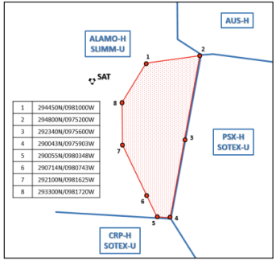

#### 2-3-4. From Corpus Christi Specialty
??? abstract "From Corpus Christi Specialty"
    | Entering | To | Qualifier | Restriction |
    |---|---|---|---|
    | RSG Specialty | D10 or overflying J23/J131/J21 | Entering ALAMO-74/ SLIMM-76 | At or climbing to an eastbound altitude |
    | RSG Specialty | AUS | DXEEE# STAR | CRP-59 will issue a descent to FL240 and put a temporary altitude of FL200 in the data block. STV-50 has control to issue a descend via clearance and update the data block. |
    | AUS Specialty | D10 | Entering AUS-78 | Routed over or east of a TNV..LOA line |

#### 2-3-5. From Austin Specialty
??? abstract "From Austin Specialty"
    | Entering        | To                 | Qualifier         | Restriction                                       |
    |-----------------|--------------------|-------------------|--------------------------------------------------|
    | LFK Specialty   | D10                | CLLT Departures   | Assigned a westbound altitude                    |
    | CRP Specialty   | PSX-95/SOTEX-84    | ALL               | Level at a westbound altitude                    |

#### 2-3-6. From Lufkin Specialty
??? abstract "From Lufkin Specialty"
    | Entering | To | Qualifier | Restriction |
    |----------|----|-----------|-------------|
    | NEW Specialty   | MSYT      | AWDAD# Arrivals AOA FL240    | 1. Crosses J22 AOB FL290, descending to FL240.  2. Temporary altitude to which descent can be approved in the data block.  3. NEW Specialty control for descent to the temporary altitude in the data block. |
    | NEW Specialty   | MSYT      | TRSSH# Arrivals AOA FL240    | AOB FL290, descending to FL240 |
    | NEW Specialty   | MOBT or GPTT | ALL                       | AOB FL330  |
    | LCH Specialty   | MSYT      | From IZD-26 entering GLS-68 east of LCH | AOB FL330  |
    | AUS Specialty   | AUST      | Entering AUS-78              | AOB FL320   |
    | AUS Specialty   | AUST or SATT | Entering AUS-78           | The HOU-46 sector may enter a temporary altitude to which descent can be approved and handoff the aircraft to the AUS sector. The AUS controller has control to descend the aircraft up to the temporary altitude in the data block. |
    | AUS Specialty   | GRKT      | Non-I90 Departures           | Routed via LOA VORTAC direct destination AOB FL220  |

#### 2-3-7. From Lake Charles Specialty
??? abstract "From Lake Charles Specialty"
    | Entering        | To                  | Qualifier         | Restriction                                                                 |
    |-----------------|---------------------|-------------------|------------------------------------------------------------------------------|
    | LFK Specialty   | CLLT                | ALL               | Route via OSCER direct destination                                           |
    | LFK Specialty   | AUST                | ALL               | AOB FL360                                                                    |
    | LFK Specialty   | D10                 | ALL               | Do not shortcut beyond AEX                                                   |
    | NEW Specialty   | MOBT                | ALL               | AOB FL330                                                                    |
    | NEW Specialty   | BTRT                | ALL               | AOB FL230 descending to FL190                                                |
    | NEW Specialty   | KGPT or KBIX        | ALL               | Route via HRV direct destination. AOB FL290 descending to FL240              |
    | OCN Specialty   | I90 Departures to OCNW-79 | ALL        | Climbing to FL310 or lower requested cruise. OCNW control for climb.        |
    | CRP Specialty   | AUST or SATT        | AOA FL180         | Routed to remain outside CRP specialty                                       |

#### 2-3-8. From New Orleans Specialty
??? abstract "From New Orleans Specialty"
    | Entering | To | Qualifier| Restriction |
    |---|---|---|---|
    | LCH Specialty   | MSYT Departures Westbound | Requesting FL240+ | 1. Assign a heading that will parallel or diverge from the arrival route. 2. Climb the aircraft to FL230. 3. Handoff to LCH specialty. 4. LCH specialty has control for turns on course leaving FL180. |
    | LCH Specialty   | BPT, BMT, DWH, CXO, 6R3, T78 | ALL  | AOB FL320  |
    | LCH Specialty   | LCHT | ALL  | The BTR-34 sector will descend aircraft landing the LCH Terminal Area to 11,000 feet and handoff the aircraft to Lake Charles TRACON |
    | LCH Specialty   | D10 | ALL  | Do not shortcut beyond AEX |
    | LFK Specialty   | D10 | ALL | Do not shortcut beyond AEX |
    | LFK Specialty   | MSYT Departures Northwestbound | Requesting FL240+ | 1. Assign a heading that will parallel or diverge from the arrival route. 2. Climb the aircraft to FL230. 3. Enter a temporary altitude up to FL340, not exceeding requested altitude, to which climb can be approved. 4. Handoff to LFK specialty. 5. LFK specialty has control for climb to the temporary altitude displayed and for turns on course leaving FL180. 6. LFK specialty responsible for point-outs to TBD-70 sector. |
    | LFK Specialty   | POET, LFTT, LCHT, SHVT, or MLUT | ALL  | AOB FL340  |

## 3. Oceanic Procedures
### 3-1. OCNE (72) & OCNW (79)
#### 3-1-1. Separation
1. All FIR boundary fixes with MTY and MID and require the application of appropriate non-radar separation. In accordance with FAA JO 7110.65, paragraph 8-5-5, all other boundary and crossing fixes allow for the application of radar separation during normal radar equipment operations.
2. Aircraft routed via the same MTY/MID boundary fix must have appropriate vertical or longitudinal separation as follows:
    1. Vertical Separation Minima:
        1. Up to and including FL 410− 1,000 feet.
        2. Above FL 410− 2,000 feet.
        3. Apply 2,000 feet at or above FL 290 between non−RVSM aircraft and all other aircraft at or above FL 290.
        4. Above FL 600 between military aircraft− 5,000 feet.
    2. Longitudinal Separation Minima:
        1. Turbojet operations at or above FL200:
            1. 15 minutes
            2. 10 minutes if the preceding aircraft is assigned a Mach number equal to or greater than that maintained by the following aircraft
            3. 5 minutes if the preceding aircraft is Mach 0.06 faster than the following aircraft.
        2. All other operations - 20 minutes

#### 3-1-2. Recording Non-Radar Information
1. The following non-radar control information shall recorded in the aircraft’s data block:
    1. The pilot’s Monterrey/Merida boundary fix estimate must be entered in the fourth line of the data block at least 20 minutes before the common boundary.
    2. Once the fix estimate has been passed to Monterrey/Merida, an asterisk shall be added onto the time.
    3. For aircraft entering Ocean airspace from Mexico, a track is started at the boundary fix that contains the aircraft’s callsign, altitude, and fix estimate in the fourth line.

#### 3-1-3. Radar Transition Procedures
1. Outbound aircraft to Mexico:
    1. Obtain the boundary fix estimate from the pilot.
        1. Phraseology - “SAY TIME ESTIMATE OVER (fix)”
    2. Coordinate the aircraft’s callsign, fix estimate, and altitude 20 minutes prior to the aircraft crossing the transfer of control point at the common boundary.

        !!! example "Example Text Coordination"
            **Caller:** “United ten thirty-two, Estimated IRDOV at one seven four six, flight level three five zero.” **Receiver:** “United ten thirty-two, Estimated IRDOV at one seven four six, flight level three five zero approved, H.C.” **Caller:** “A.L.”

        !!! example "Example Voice Coordination"
            **Caller:** “Houston Ocean West, Merida Gulfo.” **Receiver:** “Ocean West.” **Caller:** “At IPSEV, United fifteen-twenty.” **Receiver:** “United fifteen twenty, Go Ahead IPSEV.” **Caller:** “United fifteen twenty, Estimated IPSEV at two zero one five, flight level three six zero.” **Receiver:** “United fifteen twenty, Estimated IPSEV at two zero one five, unable flight level three six zero. Request United fifteen-twenty at flight level three four zero for traffic.” **Caller:** “Show United fifteen-twenty at flight level three four zero.” **Receiver:** “United fifteen twenty, Estimated IPSEV at two zero one five, flight level three four zero approved, D.O.” **Caller:** “J.M.”
    
    3. After eliminating any potential conflict with other aircraft in your airspace, terminate the aircraft’s radar service and transfer communications at or prior to the common boundary.

        !!! example "Phraseology"
            “RADAR SERVICE TERMINATED. CONTACT MONTERREY/MERIDA CENTER (frequency)”

2. Inbound aircraft from Mexico:
    1. Receive coordination time and altitude from Mexico.
    2. Ensure appropriate non-radar separation exists at the common boundary fix.
    3. Radar identify the aircraft using the IDENT feature or after receiving a direct position report from the pilot.

### 3-2. Offshore Sectors (28, 53, 30)
#### 3-2-1. Separation
1. ADS-B radar coverage reliably exists at or above 3,000ft north of the “M” GPS waypoint latitudes. As such, domestic radar separation standards/procedures will apply in Offshore airspace for aircraft operations. For negative ADS-B equipped aircraft, or any aircraft below radar coverage, non-radar separation must be applied.
2. In accordance with 7110.65 paragraph 8-8-3, 8-4-1, and 8-8-3, appropriate non-radar separation in offshore airspace requires:
    1. 1,000ft vertical separation, or
    2. 12NM lateral separation between aircraft whose flight paths are defined by published Grid System waypoints, or
    3. 20 minutes longitudinal separation

#### 3-2-2. Waypoint System
This system utilizes GPS and all distances are displayed to the next WP. Once an aircraft has overflown a WP, the WP information is deleted and the next WP informationis displayed. The WPs are latitudinally and longitudinally established at twenty (20) minute intervals except for the LCHLB, LCHCB, LCHRB, LLALB, LLACB, and LLARB waypoints. (See Figures 1 and 2.) These WPs vary between ten (10) to twelve (12) minutes of latitude from their respective row of “Charlie” waypoints. Holding pattern airspace at the aforementioned waypoints is separated from holding pattern airspace atthe “Charlie” waypoints. However, forty five (45) degree route-protected airspace from these WPs is not separated from the holding pattern airspace at the LCHCB and LLACB WPs. Aircraft departing the Lake Charles and Lafayette Terminal Area must file to the “Charlie” row prior to utilizing the forty-five (45) degree route option.

??? info "Figure 1: Lake Charles Bravo Waypoints"
    
??? info "Figure 2: White Lake Bravo Waypoints"
    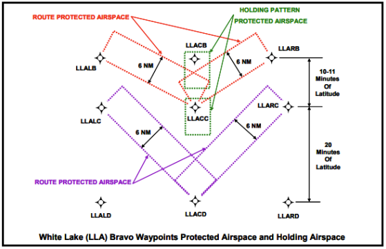
??? info "Figure: Offshore Waypoints"
    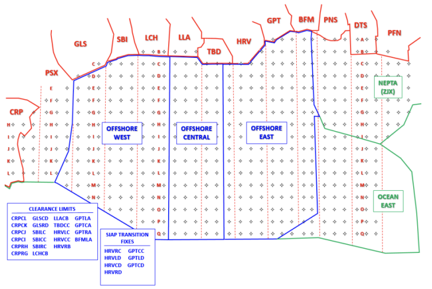

#### 3-2-3. Non-Radar Procedures
1. Aircraft must be cleared via the GPS waypoint system or their corresponding coordinates when radar contact is lost or expected to be lost.
2. When an aircraft is not in radar coverage, the pilot’s next GPS fix estimate shall be entered into the fourth line of the data block.
3. Per ICAO DOC 4444, aircraft on direct routes of flight without compulsory reporting points must report their position at least every 60 minutes.

## 4. Splits/Consolidations
### 4-1. Standard Center Splits
??? abstract "4-1-1. Houston ARTCC Wide"
    | Split         | Sector Name                   | Sector ID | Frequency |
    |---------------|-------------------------------|-----------|-----------|
    | High          | Houston                       | 46        | 132.775   |
    | Low           | Daisetta                      | 38        | 126.950   |
    | Combined      | Houston                       | 46        | 132.775   |
    | North         | LFK Specialty (Daisetta)      | 38        | 126.950   |
    | East          | NEW+OCN Specialty (Leeville)  | 24        | 132.175   |
    | South         | CRP+LCH Specialty (Eagle Lake)| 87        | 128.600   |
    | West          | AUS+RSG Specialty (Stonewall) | 50        | 134.200   |

??? abstract "4-1-2. Austin Specialty"
    | Split    | Sector Name | Sector ID | Frequency |
    |----------|-------------|-----------|-----------|
    | High     | Austin      | 78        | 126.425   |
    | Low      | Cugar       | 83        | 128.075   |
    | Combined | Cugar       | 83        | 128.075   |

??? abstract "4-1-3. Corpus Christi Specialty"
    | Split    | Sector Name  | Sector ID | Frequency |
    |----------|--------------|-----------|-----------|
    | High     | Sotex        | 84        | 135.425   |
    | Low      | Eagle Lake   | 87        | 128.600   |
    | Combined | Eagle Lake   | 87        | 128.600   |

??? abstract "4-1-4. Lake Charles Specialty"
    | Split    | Sector Name | Sector ID | Frequency |
    |----------|-------------|-----------|-----------|
    | High     | White Lake  | 23        | 124.725   |
    | Low      | Trinity     | 43        | 133.800   |
    | Combined | Trinity     | 43        | 133.800   |

??? abstract "4-1-5. Lufkin Specialty"
    | Split    | Sector Name | Sector ID | Frequency |
    |----------|-------------|-----------|-----------|
    | High     | Houston     | 46        | 132.775   |
    | Low      | Daisetta    | 38        | 126.950   |
    | Combined | Daisetta    | 38        | 126.950   |

??? abstract "4-1-6. New Orleans Specialty"
    | Split    | Sector Name   | Sector ID | Frequency |
    |----------|----------------|-----------|-----------|
    | High     | Hattiesburg    | 37        | 126.875   |
    | Low      | Leeville       | 24        | 132.175   |
    | Combined | Leeville       | 24        | 132.175   |

??? abstract "4-1-7. Ocean Specialty"
    | Split    | Sector Name       | Sector ID | Frequency |
    |----------|-------------------|-----------|-----------|
    | High     | Ocean West        | 79        | 132.650   |
    | Low      | Offshore Central  | 53        | 120.350   |
    | Combined | Offshore Central  | 53        | 120.350   |

??? abstract "4-1-8. Rock Springs Specialty"
    | Split    | Sector Name | Sector ID | Frequency |
    |----------|-------------|-----------|-----------|
    | High     | Frio        | 88        | 127.025   |
    | Low      | Stonewall   | 50        | 134.200   |
    | Combined | Stonewall   | 50        | 134.200   |

### 4-2. Standard TRACON Consolidation
#### 4-2-1. Austin Specialty
The Austin specialty shall own the AUS and I90 TRACONs.
#### 4-2-2. Corpus Christi Specialty
The Corpus Christi specialty shall own the CRP, VLY, and NQI TRACONs.
#### 4-2-3. Lake Charles Specialty
The Lake Charles specialty shall own the LCH TRACON.
#### 4-2-4. Lufkin Specialty
The Lufkin specialty shall own the POE ARAC.
#### 4-2-5. New Orleans Specialty
The New Orleans specialty shall own the LFT, BTR, MSY, GPT, and MOB TRACONs.
#### 4-2-6. Rock Springs Specialty
The Rock Springs specialty shall own the DLF and SAT TRACONs.

## 5. Airspace Maps
### 5-1. Ultra High & High
??? info "Ultra High & High"
    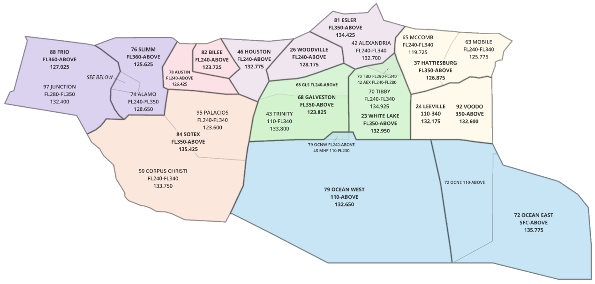
### 5-2. Low (West)
??? info "Low (West)"
    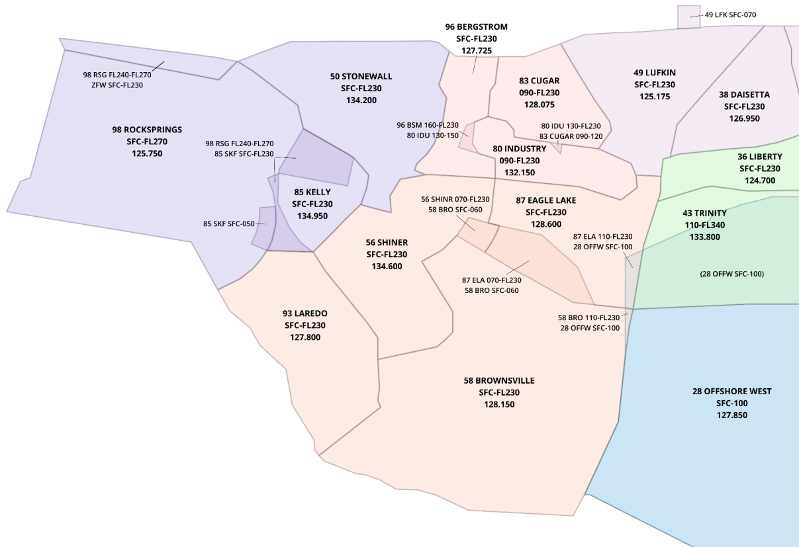
### 5-3. Low (East)
??? info "Low (East)"
    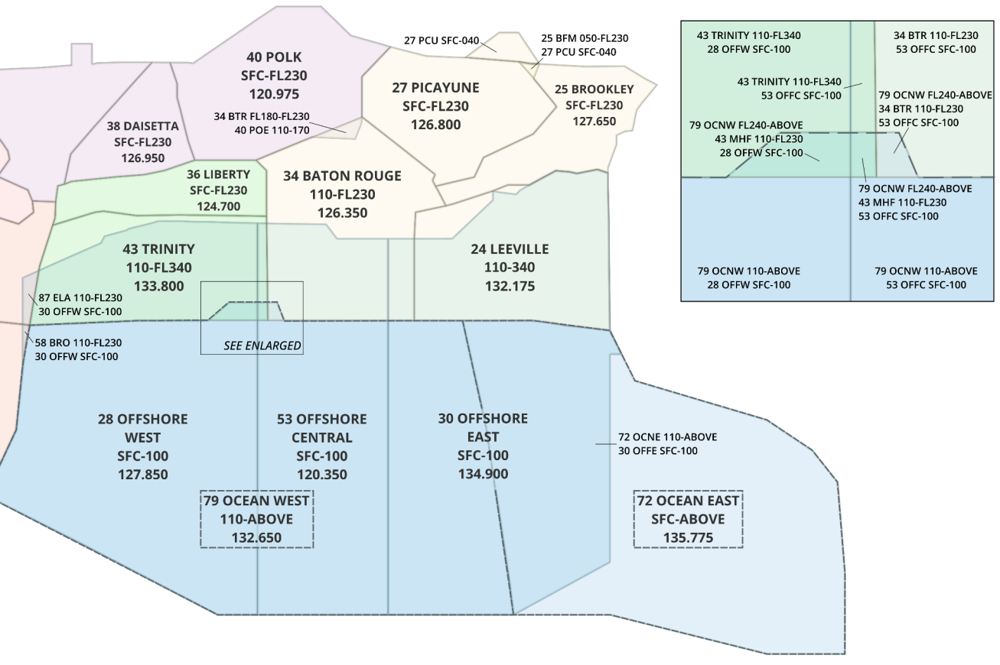
### 5-4. Austin Specialty
??? info "Austin Specialty"
    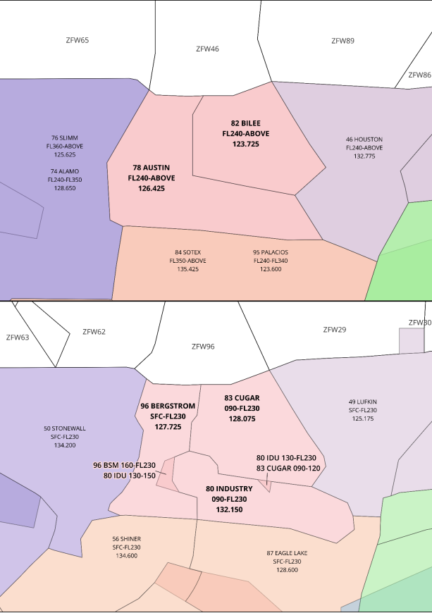
### 5-5. Corpus Christi Specialty
??? info "Corpus Christi Specialty"
    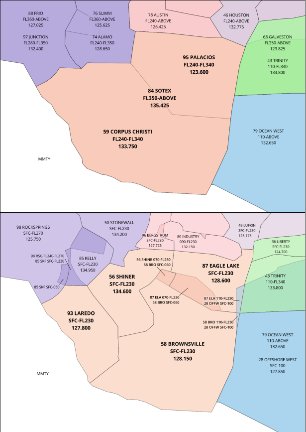
### 5-6. Lake Charles Specialty
??? info "Lake Charles Specialty"
    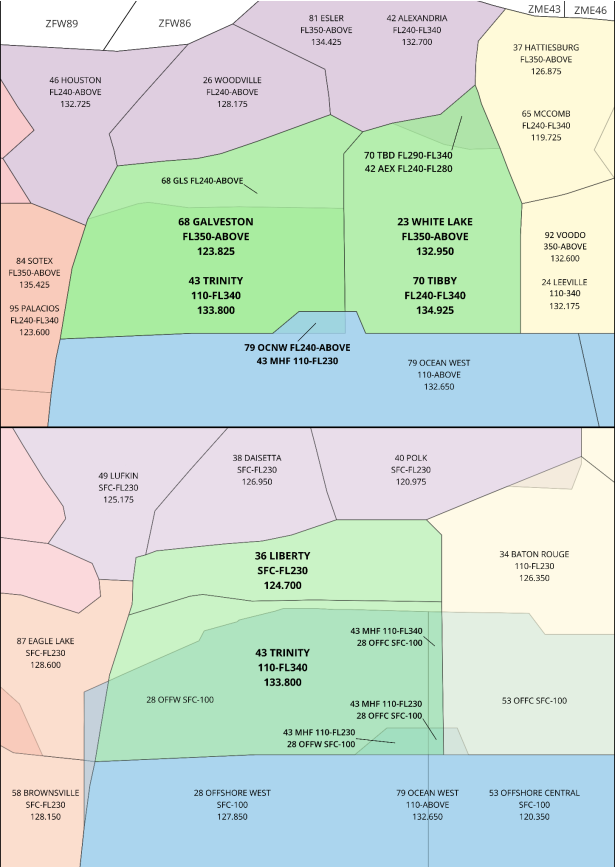
### 5-7. Lufkin Specialty
??? info "Lufkin Specialty"
    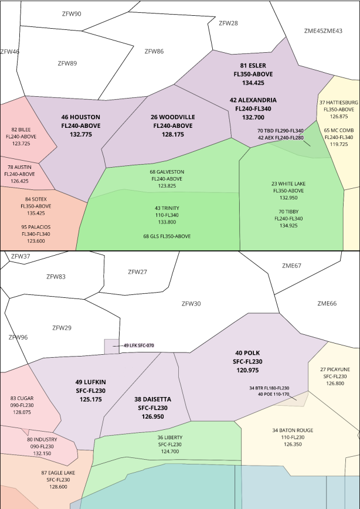
### 5-8. New Orleans Specialty
??? info "New Orleans Specialty"
    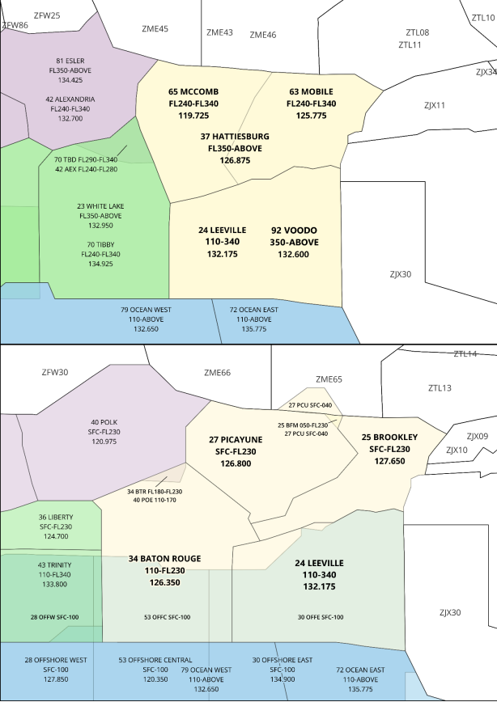
### 5-9. Rocksprings Specialty
??? info "Rocksprings Specialty"
    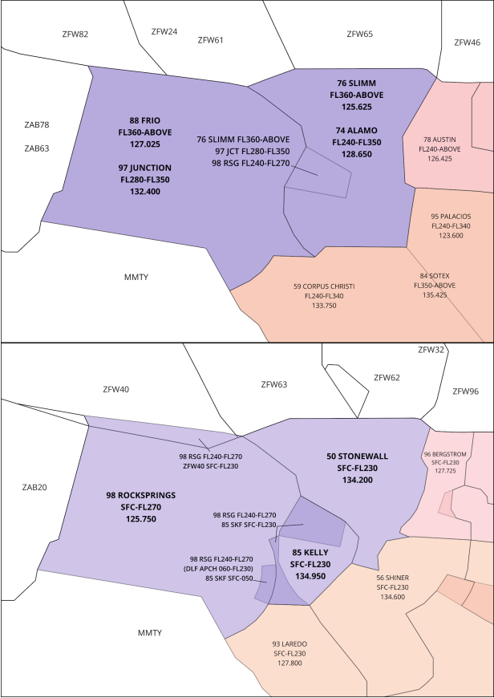
### 5-10. Ocean Specialty
??? info "Ocean Specialty"
    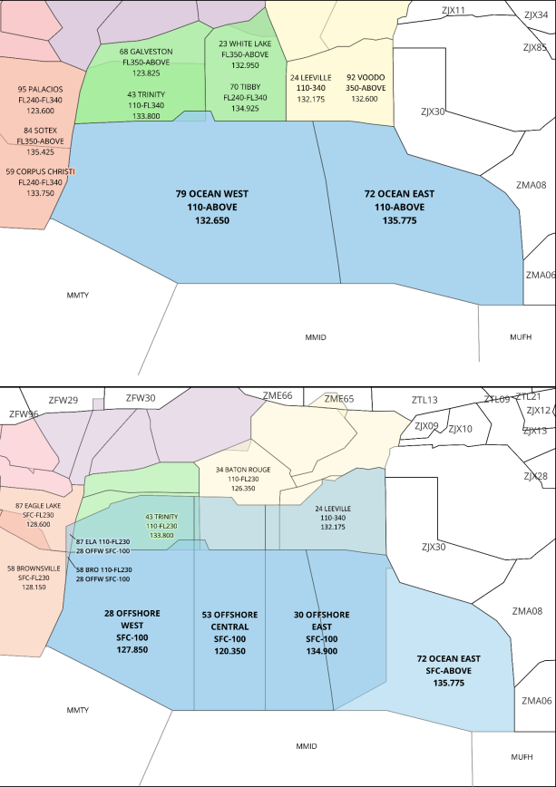
### 5-11. TRACONs
??? info "TRACONs"
    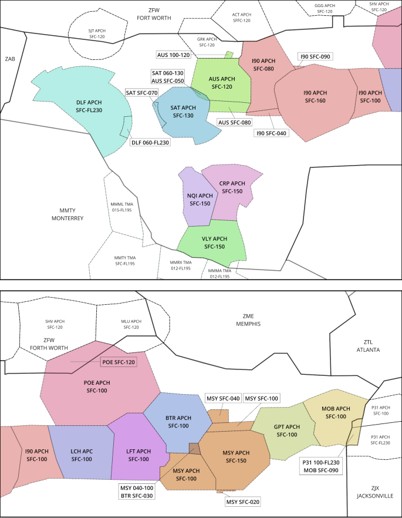