title: General Control SOP
# General Control SOP
??? warning "Disclaimer"
    This document is provided for Houston ARTCC controllers to use when providing virtual ATC services on the VATSIM network. The information herein is **not intended for use in any real-world aviation applications**.

    This order prescribes the standards of general operations at all controlled airports within the ZHU ARTCC that are not subject to their own facility-specific SOPs. Operational guidance on airspace division, transfer of control, internal agreements, flight strip usage, and more

    It is emphasized that the information continued herein is designed specifically for use only within the virtual controlling environment. It does not apply to, nor should it be referenced for, live operations in the United States National Airspace System (NAS). The procedures continued within this document show how the positions are to be operated and, in conjunction with [FAA Order 7110.65](https://www.faa.gov/air_traffic/publications/atpubs/atc_html/), will be the basis for performance evaluations, training, and certification.

??? info "Revision Information"
    - Document Number: ZHU O 7110.65C
    - Date: 30 May 2024
    - Revision: **C**

    **Record of Revisions**

    | Date | Revision | Editor |
    |:---:|:---:|:---:|
    | 11 Feb 2024 | A | EH |
    | 15 Feb 2024 | B | EH |
    | 29 Feb 2024 | C | OS |
    | 30 May 2024 | C | OS |

## 1. General
### 1-1. Introduction
#### 1-1-1. Purpose
This document outlines the standard operating procedures for all airports and positions within ZHU. All information contained in other facility-specific LOAs/SOPs shall take precedence over the procedures outlined in this SOP.

#### 1-1-2. Audience
All ZHU controllers and visitors.

##### 1-1-3. Where Can I Find This Order
This order is available in digital PDF format on the ZHU ARTCC website at https://www.zhuartcc.org/ and can be accessed publicly within the Controllers menu on the Resources page.

#### 1-1-4. Cancellation
Original issuance of this document, no cancellations required.

#### 1-1-5. Explanation Of Changes
- 5-1-3 Radar Identification Procedures simplified.

#### 1-1-6. Responsibility
a. The Virtual Houston ARTCC Air Traffic Manager is responsible for maintaining and updating the information contained in this order

b. The Virtual Houston ARTCC Air Traffic Manager is responsible for notifying the VATUSA Southern Region Air Traffic Director of any necessary revisions to this order.

### 1-2. Position Opening & Closing
#### 1-2-1. Opening A Position
When opening a position, controllers shall take time before signing on to gather necessary information regarding weather, current airport or airspace statuses and configuration, and identify any existing ATC staffing that will be impacted by the opening of the position before activating their controller session in CRC.

1. If assuming control of airspace or surface areas from another controller, controllers shall comply with the relief of an active position process as outlined in this section before assuming control.
2. If no existing ATC is online, the controller may activate their session and assume control of applicable airspace and surface areas with no prior coordination.

#### 1-2-2. Relief Of A Position
When relieving or transferring control to another controller, a position relief briefing shall be obtained before the controller change is complete. Controllers being relieved of an active position must maintain operational control throughout the transfer of control process.

1. Controllers relieving a tower cab position shall utilize the ATCT Position Relief checklist provided in Appendix 1 of this SOP.
2. Controllers relieving a TRACON position shall utilize the TRACON Position Relief checklist provided in Appendix 2 of this SOP.
3. Controllers shall strive to keep briefings concise while still complying with the required briefing items outlined in the later portions of this section. Relieving controllers shall also be aware of existing radio traffic when conducting briefings.
4. Controllers shall use the applicable position relief checklist when relieving a position.
5. Both the reliving controller and controller being relieved shall state “Your/My control” (Operating Initials)” when no further questions exist to finalize the transfer of control process.
6. The controller being relieved shall remain online and monitor their frequency for at least two minutes if possible after the transfer of control unless otherwise noted below to make sure all pertinent information and traffic situations are communicated and understood.
Note: This overlap monitoring period is only required if the airspace or area of the controller’s
responsibility has any pre-existing aircraft connected.

#### 1-2-3. Closing A Position
Controllers shall:

1. Attempt to give at least a five-minute notice to surrounding controllers and pilots before closing a controller position if it will not be relieved by another controller.
2. Perform general housekeeping of their flight strip bays by placing memory aids back under their appropriate rack and divider before signing offline.

### 1-2. Pilot Interactions
#### 1-2-1. ZHU ARTCC Pilot Mission Statement
ZHU ARTCC controllers must demonstrate a reasonably realistic, professional, and
constructive attitude when working with pilots on the network in addition to fulfilling
controller expectations of the ZHU ARTCC General Policy.

#### 1-2-2. Difficult Pilots And Aircraft
Pilots will never know that they are doing something wrong until it is brought to their attention. Failing to address the issue and passing it on to the next controller is not only a disservice to yourself in the future, but also to the pilot and controllers down the road.

It is paramount to remember that VATSIM is a learning environment that features people who are often not real-world experienced pilots from different languages, backgrounds, and capabilities. All controllers will encounter pilots who may not meet the minimum VATSIM Code of Conduct pilot skill standards or may encounter aircraft that have technical issues that sometimes occur in amateur computer-based flight simulators.

Controllers will utilize the following methods in counseling deficient pilots:

1. Calmly state the previous clearance, state what the pilot is currently doing incorrectly, then give new instructions.
    
    ??? example
        “AAL1025 the previous clearance was to descend and maintain 5,000. I show you descending through 3,500. Please climb and maintain 5,000.”

2. Send the pilot an appropriate ZHU ARTCC pilot help alias command (See the ZHU Alias Reference for more information).
3. Constructively and professionally counsel the pilot via private messages during periods of low workload.
4. As a final measure, pilots who continue to demonstrate a deficiency of skills or perform below the pilot standards outlined in the VATSIM Code of Conduct must be directed to the attention of a supervisor via a `.wallop` message and a brief description of the violation for further escalation.

    ??? example
        “`.wallop UAL123` is failing to maintain an assigned altitude and speed per VATSIM pilot competencies. They have already been warned twice.”

#### 1-2-3. ATC Contact Requests
ATC Contact Me requests MUST NOT be sent to an aircraft during a critical phase of flight. This includes takeoff, landing, and when an aircraft is on final approach inside of a 5nm final.

### 1-3. Closures
#### 1-3-1. NOTAMs
NOTAMs may be implemented at the controller’s discretion. Per VATSIM Policy, controllers shall not deny a pilot’s request to use an inactive runway/taxiway. However, this does not prevent controllers from delaying the aircraft until such time the operation can be conducted safely with minimal impact on other air traffic. When traffic conditions immediately prevent the operation, instruct the aircraft to hold and advise of the anticipated delay time and reason.

#### 1-3-2. Part-Time Controlled Airports
Control facilities that have a part-time control service shall be simulated open/closed during the corresponding published times. An exception can be made by ARTCC staff for events/extenuating circumstances. Published control facility closing times are available in Appendix 3 of this SOP titled ATCT Operations Reference Table.

### 1-4. Transfer of Control Rules
#### 1-4-1. Transfer of Control
Controllers receiving a handoff from another ZHU controller have control as follows:

1. Terminal to Terminal: Control for turns up to 45 degrees, climb departure aircraft, descend arriving aircraft, adjust airspeed on contact.
2. Terminal to Enroute: Control for turns up to 45 degrees and climbs on contact.
3. Enroute to Terminal: Control for turns up to 45 degrees and descents on contact.

### 1-5. Midnight Operations
#### 1-5-1. Procedure
Midnight operations are where internal SOPs and other procedures may be suspended during low traffic volume in favor of more efficient operations. Midnight operations shall only be conducted between 11 PM and 5 AM CST on an optional basis. When more than one controller is online, all ZHU controllers must agree to conduct midnight operations.

### 1-6. VFR Operations
#### 1-6-1. Class B/C/TRSA
VFR aircraft departing class B/C/TRSA airspace shall always be assigned a departure frequency and squawk code. This information can only be omitted when the aircraft explicitly requests “Negative radar services” or “Negative flight following.” VFR aircraft requesting pattern work at these locations shall be given a squawk code.

#### 1-6-2. Class D
VFR aircraft at class D airports shall only issue a departure frequency and squawk code when the aircraft explicitly requests radar service or flight following. VFR aircraft requesting pattern work at these locations shall not be given a squawk code.

#### 1-6-3. VFR Restrictions
Except for instructions contained in Appendix 3 or instructions required for separation, controllers may not restrict a departing VFR aircraft’s altitude or route of flight.

## 2. Radar Simulation
### 2-1. Tower Equipment Classification
#### 2-1-1. Certified Radar Towers
Certified radar towers can use all forms of radar separation, and are responsible for applying separation between the following aircraft:

1. IFR/IFR
2. IFR/VFR, when required by airspace
3. VFR/VFR, when required by airspace

Certified radar towers are considered a radar position, and as such, can issue control instructions that a normal approach/departure position would.
??? abstract "List of Certified Radar Towers"
    KARA, KAUS, KBFM, KBIX, KBRO, KBTR, KCLL, KEFD, KGLS, KGPT, KGTU, KHOU, KHRL, KHUM, KHYI, KIAH, KLCH, KLFT, KMFE, KMOB, KMSY, KNBG, KNEW, KNOG, KNQI, KPOE, KRND, KSAT, KSGR, KSKF, KSSF

#### 2-1-2. Uncertified Radar Towers
Per 7110.65 3-1-9: “Uncertified tower display workstations must be used only as an aid to assist controllers in visually locating aircraft. Radar services and traffic advisories are not to be provided using uncertified tower display workstations.”
??? abstract "List of Uncertified Radar Towers"
    KLRD

#### 2-1-3. VFR Towers
VFR towers cannot use any form of radar separation or control.

??? abstract "List of VFR Towers"
    KAEX, KBAZ, KEDC, KHDC, KHSA, KNWL, KNGP, KPQL, KTME, KVCT

### 2-2. Scratchpad Rules
#### 2-2-1. IFR Arrivals
Aircraft arriving at an airport shall have their scratch pad marked as follows:

The first character shall indicate the type of approach unless the aircraft is expecting a visual approach.

??? abstract "Scratch Pad Approach Type Codes"
    | Code | Approach Type |
    | --- | --- |
    | `V` | Visual - Cleared with a proceeding aircraft in sight |
    | `W` | Visual - Cleared with the airport in sight (separation still required with proceeding aircraft) |
    | `C` | Contact |
    | `I` | ILS |
    | `L` | Localizer |
    | `G` | GPS/GLS |
    | `P` | RNP |
    | `O` | VOR |
    | `N` | NDB |
    | `D` | LDA |
    | `T` | TACAN |
    | `A` | ASR/PAR |

The second and third characters shall be the runway number and designation (`L/C/R`). When the runway number is 3 characters, only use the last 2 characters.

??? example "Scratchpad Approach Examples"
    - `18R` - Expecting Visual 18R
    - `W8R` - Cleared visual approach runway 18R with the airport in sight
    - `I4` - ILS 4
    - `N14` - NDB 14
    - `P6L` - RNP 36L

#### 2-2-2. VFR Arrivals
If the radar controller working a VFR aircraft assigns a runway, the runway shall be scratched.

## 3. Flight Strips
### 3-1. General
#### 3-1-1. Usage Policy
1. Controllers, regardless of online traffic levels, shall comply with all flight strip policies and procedures.
2. Controllers may only utilize the flight strip bay that applies to their signed-on active controlling position, even when working a facility alone, to prevent confusion.
3. Controllers shall NOT add/delete/modify flight progress bay dividers, as these are used and stored in a standardized manner.
4. Controllers shall place any memory aids being used back into their correct positions before signing out of position. (Existing aircraft flight strips will be automatically deleted after 10 minutes)

#### 3-1-2. Tower Cab Usage
The use of flight strips is mandatory for all tower cab positions including clearance delivery, ground, and local control. Controllers shall use the flight strip bay for the position they are currently connected as.

#### 3-1-3. Approach Control Usage
Flight strip usage/marking in the approach control environment is mandatory for

1. IFR overflight aircraft
2. IFR satellite field departure aircraft
3. Airports that currently have a clearance delivery and/or ground control staffed.
4. All aircraft departing KIAH, KHOU, KAUS, KMSY, and KSAT.

Approach controllers are also encouraged, but not required to utilize flight strips during high-traffic periods when providing top-down services alone to an airport(s) to aid in aircraft tracking and organization.

#### 3-1-4. Enroute Control Usage
Flight strip usage when working enroute and fulfilling top-down control duties is not required and is purely at the enroute controller(s) discretion in the interest of maintaining adequate workload balance.

#### 3-1-5. Types Of Flight Strips
- **Standard Strips:** Reserved for IFR aircraft that have a flight plan on file.

    ??? example "Example: Standard Strip"
        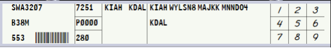

- **Blank Strips:** Reserved for VFR aircraft that are departing, arriving, or remaining in the local area/pattern if a computer-generated vNAS flight strip from a controller-input flight plan has not been made.

    ??? example "Example: Blank Strip"
        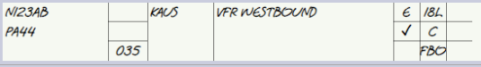

- **Arrival Flight Strips:** Arrival flight strips are to be used during low visibility operations at airports not equipped with a ground radar system (ASDE-X or ASSC). Arrival strips allow ground controllers to remain actively accountable for arrival aircraft when they may not be able to see the entirety of the airport due to visibility.

    ??? warning "Use of Strips in Low Visibility"
        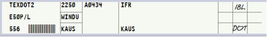
        
        As airport visibility begins to decrease, the use of arrival strips becomes appropriate for safety and positive control of inbound aircraft.

        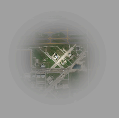

- **Full Blank Strips:** Are reserved for important controller notes or other items such as TMIs. If controllers are unable to fit TMI info onto a full strip, they may utilize a half strip to denote TMI info.

    ??? example "Example: Full Blank Strip"
        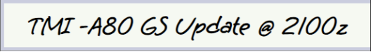

- **Half Blank Strips:** Allow for more detailed notes and shall be utilized for PIREPs and other similar more detailed controller messages or reports.

    ??? example "Example: Half Blank Strip"
        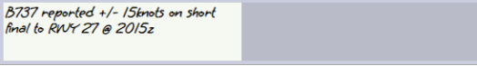

#### 3-1-6. Separators
- **Green Separators**
    - **Local Control:** Green separators designate each runway pairing the airport has. These are kept in local control’s rack # 1 (farthest left). Flight strips shall be sequenced in order under the appropriate runway separator. Aircraft that will utilize the runway first (next) shall be at the top nearest the runway separator.

        ??? example "Example: Tower Green Separators"
            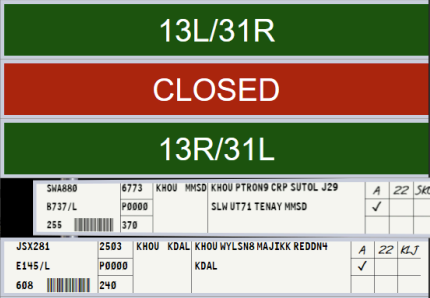
    
    - **Approach Control:** Green separators in approach control facilities are designed to divide shared flight strip bay work areas. All approach positions will drag incoming flight strips from the drop zone (center rack) into their respective sections under the appropriate green separator.

        ??? example "Example: TRACON Green Separators"
            Example of MSY TRACON’s flight strip bay. Each radar position owns the space underneath their labeled green divider up to the next position’s green divider:

            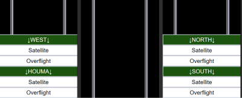

- **Red Separators** - Safety/Memory Aids: Safety and memory aids are used by local control positions and are stored in the right rack of the position’s flight strip bay underneath the “Safety and Memory Aids” divider. If a memory aid is used, it shall be placed underneath the applicable runway divider (green) that the memory aid applies to.
    
    ??? example "Example: Red Separators"
        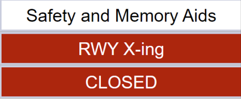

    Types of Safety and Memory Aids:

    - **Closed Runway Aid:** Place under a runway divider when the runway is actively closed. Local controllers may create additional red CLOSED safety aid dividers if more than one runway is closed. 
    
        ??? example "Example: Runway Closed"
            Runway 15R/33L is closed.
            
            
    - **Runway Crossing Aid:** Placed under a runway divider when an aircraft is approved to cross the runway. The safety aid shall remain under the runway divider until the crossing is observed or indicated to be complete.
    
        ??? example "Example: Runway Crossing"
            An aircraft was approved to cross 15L and N22TY is the next aircraft to depart:

            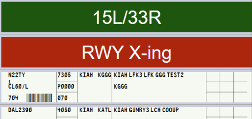

- **White Separators**
    - **Clearance Delivery Separators:** Clearance delivery has two dividers that apply to their position responsibilities in their flight strip bay for tracking informing the rest of the ATCT members as required.
        1. TMIs - TMIs applicable to ZHU and the airport of control shall be tracked and indicated with a blank flight strip under this divider.
        2. WX/Notes - Any notes related to airport operations, weather, and weather advisories shall be stored under the NOTES separator.

        ??? example "Example: Clearance Delivery Separators"
            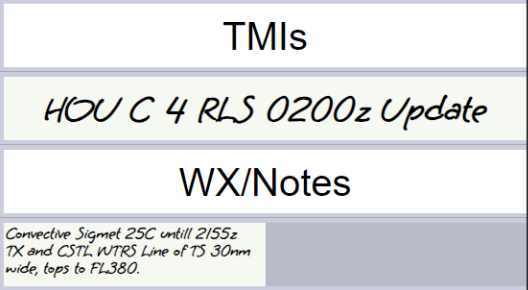

    - **Ground & Local Control Separators:** Airports with divisible ATCT positions utilize white dividers to delineate which position owns which side of the flight strip bay. Strips passed to local control will land in the drop zone (middle rack) and the appropriate control should move the strip to their respective side of the flight strip bay underneath their divider.

        ??? example "Example: Ground & Local Control Separators"
            West local owns the left side of the rack and East local owns the right side.
            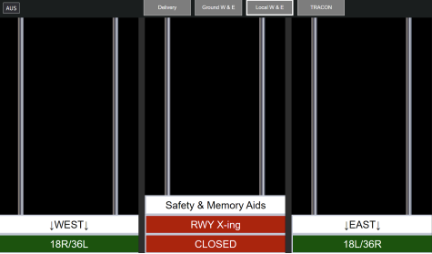

### 3-2. Strip Marking
#### 3-2-1. General
Flight strip markings are used to increase situational awareness, as a memory aid, and increase controller coordination capabilities. The right portion of a flight strip houses blocks numbered 1-9 as pictured below. These blocks are utilized in a coordinated manner as outlined in this section to aid in controlling activities.

Fulfillment of these blocks shall be completed by controllers as outlined in this SOP. Controllers are responsible for making annotations for positions that they are covered. For example, local control working alone must make all marks.

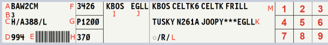

#### 3-2-2. Flight Strip Annotations
Flight strip marking duties may be an individual or shared task in the tower cab. Either clearance delivery or ground control may mark shared marking functions if the applicable information is received or given by either controller to the pilot. Other markings are individually completed by controllers as it pertains only to their position’s responsibilities and areas of control.

??? note "Flight Strip Annotations"
    
    **Box 1:** ATIS code reported by pilot
    
    **Box 2:** Assigned Departure Runway (if given in clearance)
    
    **Box 3:** *unused*
    
    **Box 4:** Clearance Given or Sent (Marked with an ✓ (`SHIFT`+`/`)
    
    **Box 5:** Intersection departure assignment (if other than the runway approach end)
    
    **Box 6:** Traffic Management Initiative (TMI) Type
    
    - `EDC` Estimated Departure Clearance Time (EDCT)
    - `GS` Ground Stop
    - `CFR` Call for release
    - `AC` Altitude Cap
    - `RR` Re-Route
    - `MIT` Miles-In-Trail
    - `TIT` Time-In-Trail
    
    **Box 7:** *unused*
    
    **Box 8:** Location on airfield (KIAH only)
    
    **Box 9:** TMI Assignment Data
    
    - **EDCTs:** All times marked as the last three digits Zulu time where times are assumed to be in the current or upcoming hour. EDCT and Call for release approval times shall be written in Box 9.
        - `010` 2010Z if the current time is in the 1900Z hour
        - `030` 0030Z if the current time is in the 0000Z hour
        - `445` 1445Z if the current time is in the 1400Z hour
    - **Altitude Caps:** Altitude caps are marked as three digit 100s of feet.
        - `070` 7,000 ft
        - `160` 16,000 ft
        - `270` FL270
    - **Miles in Trail (MIT):**
        - `5` 5 NM in trail
        - `20` 20 NM in trail
    - **Time in Trail (TIT):**
        - `5` Five minutes
        - `15` Fifteen minutes

#### 3-2-3. IFR Strip Markings
More examples of IFR Flight Strip Blocks 1-9 Markings

??? example "Examples: IFR Flight Strips"
    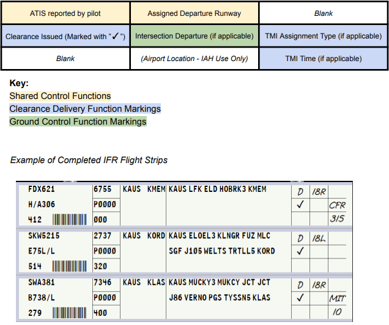

#### 3-2-4. VFR Strip Markings
More examples of VFR Flight Strip Blocks 1-9 Markings

??? example "Examples: VFR Flight Strips"
    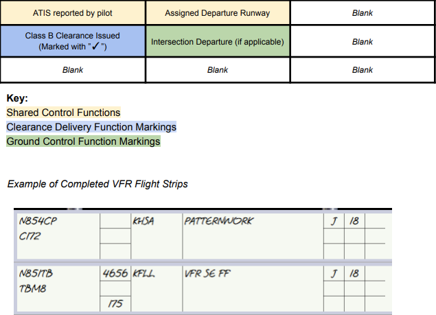

#### 3-2-5. Arrival Strip Markings
More examples of Arrival Flight Strip Blocks 1-9 Markings

??? example "Examples: Arrival Flight Strips"
    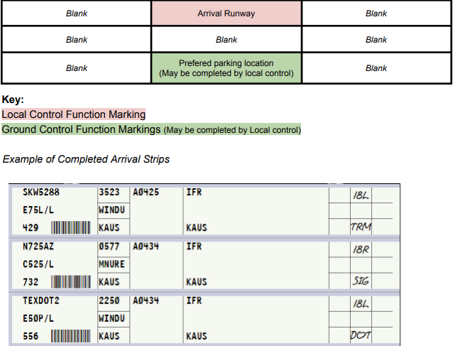

### 3-3. Strip Movement
### 3-3-1. Passing Of Flight Strips
Flight strips can be passed internally within a facility such as an ATCT or TRACON as outlined in vStrips documentation. Transfer of strips between positions shall be completed by each position as outlined in their position-specific procedures of this General, or any facility-specific SOPs.

#### 3-3-2. Offsetting Flight Strips
The offsetting of flight strips is used as a visual reminder tool for controllers. Offsetting flight strips must be used when a specific aircraft is instructed to do any of the following:

1. Issuance of a LUAW clearance (Local control)
2. Issuance of a Takeoff clearance (Local control)
3. Aircraft issued a runway crossing instruction (Ground control only). Re-center/Un-offset aircraft flight strip once aircraft has completed all approved runway crossings.

??? example "Example: Offsetting Strips"
    N721CA was cleared for takeoff or cleared to LUAW on runway 5.
    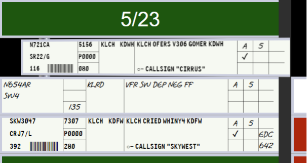

## 4. Position Duties & Responsibilities
### 4-1. Flight Data/Clearance Delivery (CD)

1. Uses the facility’s primary clearance delivery frequency
2. IAW FAA 7110.65: be the central source for collecting and disseminating SIGMET, AIRMET, CWA, PIREPs, NOTAMs, special information, and known observed weather that may affect aircraft safety to the appropriate tower position in a timely manner.
3. Distribute and operate the airport’s vATIS broadcast. Consult with the CIC and/or local control to determine the airport’s active configuration to use.
4. Prepare, update, and distribute flight strips for IFR and VFR departures.
5. Create a Virtual NAS flight plan for VFR departures using the STARS tower display workstation (TDW) or the CRC flight plan editor to include a minimum of:
    1. Aircraft destination
    2. Type of aircraft
6. Collect messages related to TMIs for retention and distribution.
7. Ensure that departing aircraft have received applicable delay/TMI information, current ATIS, and the appropriate clearance.
8. Issue clearances as applicable to IFR/SVFR/VFR aircraft departing the airport of control IAW Appendix 3 of this General SOP.
9. Forward flight strips to GC after clearance has been issued.
10. Update the facility’s Status Information Area (SIA) in the ZHU IDS
11. Route aircraft in order of preference listed:
    1. Alias preferred route system
    2. Appropriate SID
    3. Clear the aircraft as filed

### 4-2. Ground Control (GC)

1. Uses the facility’s primary ground control frequency
2. Ensure that all departing aircraft have received the current ATIS or appropriate departure information and indicate so on their flight strip in the appropriate block.
3. Actively monitor/control all aircraft and vehicles operating within the movement areas, coordinating with local control as necessary. Aircraft/vehicles that will operate on or near active runways may remain on GC frequency unless otherwise required by local control.
4. Do not approve or disapprove pushback or engine start operations in non-movement areas, however, include the area in scanning and provide advisory services to aircraft conducting these operations.
5. Coordinate with local control when an aircraft requests departure from a runway other than the actively indicated runway(s) or an intersection departure.
6. Coordinate a departure time with the appropriate TMU facility when any proposed departure requires a release for traffic management reasons.
7. Verbally inform local control of flow control or TMI restrictions on aircraft taxiing for departure prior to handing the aircraft off.
8. Ensure that departure flight strips are placed at the local control position in a timely manner.
9. Utilize arrival flight strips during periods of low visibility operations until aircraft are visually located or report reaching their desired airport parking location.
10. Unless otherwise coordinated, instruct all aircraft to monitor the appropriate local control frequency when local is specifically staffed.

### 4-3. Local Control (LC)
1. Uses the facility’s primary local control frequency
2. Provide initial separation between successive departures.
3. Provide ATC service for all aircraft operating in the airspace delegated to the position as depicted in Appendix 3.
4. LC is authorized to use the tower display workstation (TDW) at applicable airports for radar functions provided that their responsibilities regarding aircraft operating on the runways or within the surface area are not impaired.
5. Print and mark arrival flight strips during periods of low visibility operations
6. Push arrival strips to ground control before transferring communications for non-ASDE-X equipped airports.
7. When the radar is operational, provide initial separation (visual or radar) between successive departures and between departures and arrivals. Provide other appropriate radar services, i.e., traffic information, low altitude alerts, etc.
8. Enter flight plan information with the proper discrete beacon code and prepare flight progress strips on aircraft that have requested VFR, SVFR, or IFR departure from a secondary airport within the local controller’s surface area.
9. Advise appropriate radar/departure controller when visual separation will be provided between successive departures.
10. Complete coordination with GC before allowing any arriving or departing helicopter to overfly, depart, or land on a taxiway.
11. Obtain a release on any IFR, SVFR, or VFR aircraft departing the airport when automatic releases are not in effect.
12. Actively monitor/control all aircraft and vehicles operating within the applicable movement areas.

## 5. Internal LOAs
### 5-1. Tower-TRACON LOA
#### 5-1-1. Definitions
1. Up-down airports are those airports where the ATCT and TRACON are physically co-located at the same facility. (e.g. CRP, MSY)
2. Non-up-down airports are those airports where the tower and overlying radar controllers are not physically located at the same facilities. (e.g. HRL, NEW)

#### 5-1-2. Releases
1. At up-down airports, all aircraft shall automatically be released so long as the aircraft departs on the primary departure runway(s) on standard headings/altitudes.
2. At non-up-down airports, the local controller shall request a release for each individual IFR aircraft. VFR aircraft shall automatically be released on course without altitude restrictions unless otherwise specified by Appendix 3.
    1. When requesting release, the coordination must include at least the following information:
        1. The phrase `Request release`.
        2. The aircraft’s callsign.
        3. The departure runway.
    2. If the overlying controller does not specify a heading or altitude in the release, the aircraft shall be released according to the standard IFR climb-out instruction in Appendix 3.
    3. Releases are valid for 3 minutes.
    4. If the IFR climbout instruction in Appendix 3 states “As coordinated,” initially clear the aircraft as filed and maintain 3,000. Request release from the overlying controller and issue the heading/altitude coordinated with the takeoff clearance.

#### 5-1-3. Radar Identification Procedures
1. Certified Radar Towers:
    1. The local controller shall radar identify, start a track, and handoff all departures to the appropriate overlying radar position.
    2. The overlying radar position shall be responsible for informing the pilot that they are “Radar contact,” not the tower.
    3. The overlying radar position shall not auto-track the airport when local is staffed.
    4. VFR aircraft remaining in the pattern or requesting “Negative radar service” shall be tracked by the tower, but not informed that they are `Radar contact`.
2. All Other Towers:
    1. Rolling calls for departing aircraft shall not be given. Departures shall be radar-identified by the overlying radar controller using the “Ident” feature or other approved methods.

#### 5-1-4. Arrival Procedures
1. Certified Radar Towers:
    1. Arrivals (IFR or VFR) shall not be radar handed off to the tower. The local controller shall utilize the STARS quick-look function to receive an aircraft’s arrival information. The arrival shall be considered coordinated so long as the scratchpad entry is correct and up-to-date (If applicable).
    2. Planned missed approaches must be verbally coordinated with the tower.
    3. VFR aircraft shall be sequenced to the airport with other IFR/VFR traffic, as necessary. Any pattern entry instructions must be coordinated with the tower.
    4. If a VFR arrival calls the tower directly, the local controller shall radar identify the aircraft, but not use the phrase `Radar Contact.` The local controller may elect to send the VFR aircraft to approach control for sequencing to the airport in high-traffic volume scenarios.
2. All Other Towers:
    1. IFR arrival information shall be coordinated via the FIDO-generated arrival fight strip. The type of instrument approach must be verbally coordinated if different than the ATIS advertised approach, or if multiple approaches/runways are being advertised.
    2. Planned missed approaches must be verbally coordinated with the tower.
    3. VFR arrival aircraft shall be told `Radar service terminated, squawk VFR, contact (facility) tower (frequency)` no later than 10 flying miles from the airport.
    4. When controlling LRD or VCT, inform ZHU when an IFR arrival has landed: `N123AB arrived at 1322Z`.

#### 5-1-5. Go Around Aircraft
Go-Arounds shall be handled in the order of preference listed below:

1. As specified in the facility SOP or LOA.
2. Give the standard initial IFR departure heading/altitude assignment in Appendix 3.
3. Instruct the aircraft to fly the published missed approach.
4. If on a visual approach, instruct the aircraft to enter the traffic pattern.

### 5-2. TRACON-TRACON LOA
#### 5-2-1. Procedures
1. Departure aircraft shall be on their filed flight plan route at or climbing to an altitude correct for the direction of flight.
2. Arrival aircraft shall be on a STAR or direct destination airport at or descending to an altitude correct for the direction of flight.
3. Overflight aircraft shall be on their filed flight plan route at an altitude correct for the direction of flight.

### 5-3. TRACON-ZHU LOA
#### 5-3-1. Procedures
1. Departure aircraft shall be established on their filed flight plan route at or climbing to the top altitude of the TRACON. If the aircraft’s requested altitude is lower than the top altitude of the TRACON, the aircraft shall be at or climbing to an altitude correct for direction of flight.
2. Arrival aircraft shall be routed via direct destination, descending to an altitude 1,000ft above the top altitude of the TRACON. If the aircraft is below this altitude, they shall be established at a correct altitude for direction of flight.
3. Overflight aircraft shall be on their filed flight plan route at an altitude correct for the direction of flight.

## Appendices

### A-1. ATCT Position Briefing Checklist
??? abstract "ATCT Position Briefing Checklist"
    1. Status information areas (can be self-briefed if indicated so by relieving controller).
    2. Current applicable NOTAMS (simulated or not).
    3. Weather conditions.
        1. Current general weather conditions (VFR/MVFR/IFR/LIFR)
        2. PIREP’s.
        3. SIGMET’s/CWA’s.
        4. Trends.
        5. RVR. (if less than 6000 ft.)
    4. Current Traffic Management Initiatives (if applicable).
    5. Airport conditions.
        1. Airspace.
        2. Runway configuration.
            1. LAHSO operations (KIAH only)
    6. Equipment.
        1. STARS/Radar (if applicable).
        2. ASDE-X (if applicable).
    7. Airport activities.
        1. Restrictions/closures (if being simulated).
    8. Special activities. (Live training in progress, TFRs, etc.)
    9. Handwritten notes (Half strips). Abnormal Items.
    10. Runway status.
        1. Closed.
        2. Unavailable.
        3. Occupied.
    11. LUAW Status. (In use, prohibited, etc.)
    12. Traffic.
        1. IFR/VFR/SFVR Clearances (if covering clearance delivery duties).
        2. Taxiing (if covering ground control duties)
        3. Actively departing, arriving, and over-flight aircraft (if covering local control duties)

### A-2. TRACON Position Briefing Checklist
??? abstract "TRACON Position Briefing Checklist"
    1. Status information areas (can be self-briefed if indicated so by relieving controller).
    2. Current applicable NOTAMS (simulated or not).
    3. Weather conditions.
        1. Current general weather conditions (VFR/MVFR/IFR/LIFR)
        2. PIREP’s.
        3. SIGMET’s/CWA’s.
        4. Trends.
        5. RVR. (if less than 6000 ft.)
    4. Airspace/Runway configuration.
    5. Equipment.
        1. Navigational Aids (NAVAIDS) out of service (if simulated).
        2. ASDE-X/TDW status (if applicable).
    6. Airport activities.
        1. Restrictions/closures (if being simulated).
    7. Traffic Management Initiatives
    8. Special activities. (Live training in progress, TFRs, PAJA, etc.)
    9. Handwritten notes (Half strips). Abnormal Items.
    10. Satellite releases.
    11. Traffic.
        1. Special activity aircraft.
        2. Point-out aircraft.
        3. Holding aircraft.
        4. Aircraft handed off, but still in airspace.
        5. Aircraft released but not yet airborne.
        6. VFR advisory aircraft.
        7. Aircraft standing by for service.
        8. Coordination agreements with other positions.

### A-3. ATCT Operations Reference Table
??? abstract "ATCT Operations Reference Table"

    ??? info "AEX - Alexandria International"
        | AEX - Alexandria International | |
        | --- | --- |
        | Tower Airspace Dimensions | Class D SFC-2,600 |
        | Tower Equipment | VFR |
        | IFR Instructions | As Coordinated/10,000 |
        | VFR Instructions | - |
        | Operating Hours | 24/7 |

    ??? info "ARA - Acadiana Regional"
        | ARA - Acadiana Regional | |
        | --- | --- |
        | Tower Airspace Dimensions | Class D SFC-2,500 |
        | Tower Equipment | Radar |
        | IFR Instructions | H060/2,000 or H250/2,000 |
        | VFR Instructions | - |
        | Operating Hours | 0600-2100 |

    ??? info "BAZ - New Braunfels National"
        | BAZ - New Braunfels National | |
        | --- | --- |
        | Tower Airspace Dimensions | Class D SFC-2,700 |
        | Tower Equipment | VFR |
        | IFR Instructions | As Coordinated |
        | VFR Instructions | - |
        | Operating Hours | 0700-1900 |

    ??? info "BFM - Mobile International"
        | BFM - Mobile International | |
        | --- | --- |
        | Tower Airspace Dimensions | Class D SFC-2,500 |
        | Tower Equipment | Radar |
        | IFR Instructions | RH/2,000 |
        | VFR Instructions | - |
        | Operating Hours | Sun: 0700-1900 Tue-Fri: 0330-2200 Sat: 0400-1900 |

    ??? info "BIX - Keesler AFB"
        | BIX - Keesler AFB | |
        | --- | --- |
        | Tower Airspace Dimensions | Class D SFC-2,500 |
        | Tower Equipment | Radar |
        | IFR Instructions | RH/2,000 |
        | VFR Instructions | - |
        | Operating Hours | Mon-Fri: 0800-2300 Sat-Sun: 1100-1700 |

    ??? info "BPT - Jack Brooks Regional"
        | BPT - Jack Brooks Regional | |
        | --- | --- |
        | Tower Airspace Dimensions | Class D SFC-2,500 |
        | Tower Equipment | Radar |
        | IFR Instructions | North Flow DEP Area = BPT210R CW through BPT030R South Flow DEP Area = BPT030R, CW through BPT210R Assign any heading inside the DEP area, maintain 3,000 |
        | VFR Instructions | - |
        | Operating Hours | 0600-2200 |

    ??? info "BRO - Brownsville International"
        | BRO - Brownsville International | |
        | --- | --- |
        | Tower Airspace Dimensions | Class D SFC-2,500 |
        | Tower Equipment | Radar |
        | IFR Instructions | H010/3,000 |
        | VFR Instructions | - |
        | Operating Hours | 0600-0000 |

    ??? info "BTR - Baton Rouge Metro"
        | BTR - Baton Rouge Metro | |
        | --- | --- |
        | Tower Airspace Dimensions | Class C SFC-2,000 |
        | Tower Equipment | Radar |
        | IFR Instructions | Jets: RH/5,000 Non-Jets: Assigned a heading that diverges 20 degrees from RH and maintain 3,000 |
        | VFR Instructions | Assign a heading nearest to the pilot's request, except do not assign a heading within 30 degrees opposite the final |
        | Operating Hours | 0500-0000 |

    ??? info "CLL - Easterwood Field"
        | CLL - Easterwood Field | |
        | --- | --- |
        | Tower Airspace Dimensions | Class D SFC-2,500 |
        | Tower Equipment | Radar |
        | IFR Instructions | RH/3,000 |
        | VFR Instructions | - |
        | Operating Hours | 0800-2100 |

    ??? info "CWF - Chennault International"
        | CWF - Chennault International | |
        | --- | --- |
        | Tower Airspace Dimensions | Class D SFC-2,500 |
        | Tower Equipment | Radar |
        | IFR Instructions | As Coordinated |
        | VFR Instructions | - |
        | Operating Hours | 0600-2200 |

    ??? info "CXO - Conroe/North Houston Regional Airport"
        | CXO - Conroe/North Houston Regional Airport | |
        | --- | --- |
        | Tower Airspace Dimensions | Class D SFC-2,700 |
        | Tower Equipment | Radar |
        | IFR Instructions | South/West Gates: H250/2,000 North/East Gates: H060/2,000 |
        | VFR Instructions | - |
        | Operating Hours | 0600-2100 |

    ??? info "DLF - Laughlin AFB"
        | DLF - Laughlin AFB | |
        | --- | --- |
        | Tower Airspace Dimensions | Class C SFC-3,500 |
        | Tower Equipment | Radar |
        | IFR Instructions | RH/5,000 |
        | VFR Instructions | - |
        | Operating Hours | Mon-Fri: 0700-1900 Sat: Closed Sun: 1500-1759 |

    ??? info "DWH - David Wayne Hooks Memorial"
        | DWH - David Wayne Hooks Memorial | |
        | --- | --- |
        | Tower Airspace Dimensions | Class D SFC-1,999 |
        | Tower Equipment | Radar |
        | IFR Instructions | South Flow N/E Gate: H290 South Flow S/W Gate: H230  North Flow N/E Gate: H350 North Flow S/W Gate: H290 Maintain 2,000 |
        | VFR Instructions | - |
        | Operating Hours | 0700-2200 |

    ??? info "EDC - Austin Exec"
        | EDC - Austin Exec | |
        | --- | --- |
        | Tower Airspace Dimensions | Class D SFC-3,000 |
        | Tower Equipment | VFR |
        | IFR Instructions | RH/3,000 |
        | VFR Instructions | VFR FF: Maintain VFR AOB 3,000 |
        | Operating Hours | 0600-2200 |

    ??? info "EFD - Ellington"
        | EFD - Ellington | |
        | --- | --- |
        | Tower Airspace Dimensions | Class D SFC-2,000 |
        | Tower Equipment | Radar |
        | IFR Instructions | H090/2,000 |
        | VFR Instructions | - |
        | Operating Hours | 24/7 |

    ??? info "GLS - Scholes International At Galveston"
        | GLS - Scholes International At Galveston | |
        | --- | --- |
        | Tower Airspace Dimensions | Class D SFC-2,499 |
        | Tower Equipment | Radar |
        | IFR Instructions | H250/2,000 |
        | VFR Instructions | - |
        | Operating Hours | 0600-1800 |

    ??? info "GPT - Gulfport-Biloxi International"
        | GPT - Gulfport-Biloxi International | |
        | --- | --- |
        | Tower Airspace Dimensions | Class D SFC-2,500 |
        | Tower Equipment | Radar |
        | IFR Instructions | RH/2,000 |
        | VFR Instructions | - |
        | Operating Hours | 0600-2300 |

    ??? info "GTU - Georgetown Exec"
        | GTU - Georgetown Exec | |
        | --- | --- |
        | Tower Airspace Dimensions | Class D SFC-3,300 |
        | Tower Equipment | Radar |
        | IFR Instructions | H100/3,000 or H240/3,000 |
        | VFR Instructions | VFR FF: Jets/T-Props maintain VFR AOB 3,500 |
        | Operating Hours | 0700-2200 |

    ??? info "HDC - Hammond Northshore Regional"
        | HDC - Hammond Northshore Regional | |
        | --- | --- |
        | Tower Airspace Dimensions | Class D SFC-2,500 |
        | Tower Equipment | VFR |
        | IFR Instructions | RH/2,000 |
        | VFR Instructions | - |
        | Operating Hours | 0800-1800 |

    ??? info "HRL - Valley International"
        | HRL - Valley International | |
        | --- | --- |
        | Tower Airspace Dimensions | Class C SFC-2,500 |
        | Tower Equipment | Radar |
        | IFR Instructions | H060/3,000 |
        | VFR Instructions | - |
        | Operating Hours | 0600-0000 |

    ??? info "HSA - Stennis International"
        | HSA - Stennis International | |
        | --- | --- |
        | Tower Airspace Dimensions | Class D SFC-2,500 |
        | Tower Equipment | VFR |
        | IFR Instructions | RH/2,000 |
        | VFR Instructions | - |
        | Operating Hours | 0700-2100 |

    ??? info "HUM - Houma-Terrebonne"
        | HUM - Houma-Terrebonne | |
        | --- | --- |
        | Tower Airspace Dimensions | Class D SFC-2,500 |
        | Tower Equipment | Radar |
        | IFR Instructions | RH/10,000 |
        | VFR Instructions | - |
        | Operating Hours | 0600-1900 |

    ??? info "HYI - San Marcos Regional"
        | HYI - San Marcos Regional | |
        | --- | --- |
        | Tower Airspace Dimensions | Class D SFC-3,100 |
        | Tower Equipment | Radar |
        | IFR Instructions | RWY 26/31/35: H360/3,000 RWY 08/13/17: H080/3,000 |
        | VFR Instructions | - |
        | Operating Hours | 0700-2100 |

    ??? info "LCH - Lake Charles Regional"
        | LCH - Lake Charles Regional | |
        | --- | --- |
        | Tower Airspace Dimensions | Class D SFC-2,500 |
        | Tower Equipment | Radar |
        | IFR Instructions | RWY 15: H120-180 RWY 33: H300-360 RWY 05: H020-080 RWY 23: H200-260 Maintain 10,000 |
        | VFR Instructions | Assign IFR headings to all departures, no altitude restriction |
        | Operating Hours | 0600-2200 |

    ??? info "LFT - Hammond Northshore Regional"
        | LFT - Hammond Northshore Regional | |
        | --- | --- |
        | Tower Airspace Dimensions | Class C SFC-2,000 |
        | Tower Equipment | Radar |
        | IFR Instructions | RWY 4L/R: H040-060/2,000 RWY 22L/R: H220-240/2,000 RWY 29: H290-310/2,000 RWY 11: As Coordinated. CFR |
        | VFR Instructions | Assign IFR headings, maintain VFR AOB 2,000 |
        | Operating Hours | 0530-2230 |

    ??? info "LRD - Laredo International"
        | LRD - Laredo International | |
        | --- | --- |
        | Tower Airspace Dimensions | Class D SFC-3,000 |
        | Tower Equipment | Limited Radar |
        | IFR Instructions | As coordinated with ZHU |
        | VFR Instructions | - |
        | Operating Hours | 0600-0000 |

    ??? info "MFE - McAllen International"
        | MFE - McAllen International | |
        | --- | --- |
        | Tower Airspace Dimensions | Class D SFC-2,600 |
        | Tower Equipment | Radar |
        | IFR Instructions | H040/3,000 |
        | VFR Instructions | - |
        | Operating Hours | 0600-0000 |

    ??? info "MOB - Mobile Regional"
        | MOB - Mobile Regional | |
        | --- | --- |
        | Tower Airspace Dimensions | Class C within 30 degrees of departure runway SFC-3,000. All other areas SFC-2,000. |
        | Tower Equipment | Radar |
        | IFR Instructions | RWY 15: H120-180/3,000 RWY 33: H300-360/3,000 RWY 18/36: As coordinated. CFR |
        | VFR Instructions | Assign IFR headings, maintain VFR AOB 3,000 |
        | Operating Hours | 0600-2300 |

    ??? info "NBG - New Orleans NAS"
        | NBG - New Orleans NAS | |
        | --- | --- |
        | Tower Airspace Dimensions | Class D SFC-2,500 |
        | Tower Equipment | Radar |
        | IFR Instructions | RH/15,000 |
        | VFR Instructions | - |
        | Operating Hours | Mon-Fri: 0700-2300 Sat-Sun: 0900-1700 |

    ??? info "NEW - Lakefront"
        | NEW - Lakefront | |
        | --- | --- |
        | Tower Airspace Dimensions | Class D SFC-2,500 |
        | Tower Equipment | Radar |
        | IFR Instructions | RWY 18s/36s: Automatic releases RH/2,000 RWY 9/27: As coordinated. CFR. |
        | VFR Instructions | - |
        | Operating Hours | 0700-2100 |

    ??? info "NOG - Orange Grove NALF"
        | NOG - Orange Grove NALF | |
        | --- | --- |
        | Tower Airspace Dimensions | Class D SFC-2,800 |
        | Tower Equipment | Radar |
        | IFR Instructions | RH/3,000 |
        | VFR Instructions | - |
        | Operating Hours | Mon-Fri: 0730-1530 |

    ??? info "NQI - Kingsville NAS"
        | NQI - Kingsville NAS | |
        | --- | --- |
        | Tower Airspace Dimensions | Class D SFC-2,500 |
        | Tower Equipment | Radar |
        | IFR Instructions | RH/3,000 |
        | VFR Instructions | - |
        | Operating Hours | Mon-Thu: 0745-0000 Fri: 0745-1745 |

    ??? info "NWL - Waldron Field NOLF"
        | NWL - Waldron Field NOLF | |
        | --- | --- |
        | Tower Airspace Dimensions | Class D SFC-2,000 |
        | Tower Equipment | VFR |
        | IFR Instructions | As coordinated with CRP TRACON |
        | VFR Instructions | - |
        | Operating Hours | Mon-Fri: 0730-Sunset |

    ??? info "NGP - Corpus Christi NAS"
        | NGP - Corpus Christi NAS | |
        | --- | --- |
        | Tower Airspace Dimensions | Class D SFC-2,500 |
        | Tower Equipment | VFR |
        | IFR Instructions | Automatic Releases RWY 04/13/36: RH/1,600 RWY 18: H130/2,500 RWY 31: RH until 2.5 DME, then H040/1,600 |
        | VFR Instructions | - |
        | Operating Hours | Mon-Thu: 0700-2300 Fri: 0700-1900 |

    ??? info "NGW - Cabaniss Field NOLF"
        | NGW - Cabaniss Field NOLF | |
        | --- | --- |
        | Tower Airspace Dimensions | Class D SFC-1,199 |
        | Tower Equipment | VFR |
        | IFR Instructions | As coordinated with CRP TRACON |
        | VFR Instructions | - |
        | Operating Hours | Mon-Thur: 0800-2300 Fri: 0800-1900 |

    ??? info "POE - Polk AAF"
        | POE - Polk AAF | |
        | --- | --- |
        | Tower Airspace Dimensions | Class D SFC-2,800 |
        | Tower Equipment | Radar |
        | IFR Instructions | RH/3,000 |
        | VFR Instructions | - |
        | Operating Hours | 0700-2300 |

    ??? info "PQL - Trent Lott International"
        | PQL - Trent Lott International | |
        | --- | --- |
        | Tower Airspace Dimensions | Class D SFC-2,500 |
        | Tower Equipment | VFR |
        | IFR Instructions | RH/2,000 |
        | VFR Instructions | - |
        | Operating Hours | Mon-Fri: 0600-2000 Sat-Sun: 0800-1800 |

    ??? info "RND - Randolph AFB"
        | RND - Randolph AFB | |
        | --- | --- |
        | Tower Airspace Dimensions | Class D SFC-3,300 |
        | Tower Equipment | Radar |
        | IFR Instructions | 15L: RH/3,000 15R: H170/3,000 33R: H350/3,000 33L: RH/3,000 |
        | VFR Instructions | VFR FF: RH, maintain VFR AOB 3,000 |
        | Operating Hours | Mon-Fri: 0700-1900 |

    ??? info "SGR - Sugar Land Regional"
        | SGR - Sugar Land Regional | |
        | --- | --- |
        | Tower Airspace Dimensions | Class D SFC-2,600 |
        | Tower Equipment | Radar |
        | IFR Instructions | RH/2,000 |
        | VFR Instructions | - |
        | Operating Hours | 0600-2200 |

    ??? info "SKF - Kelly Field"
        | SKF - Kelly Field | |
        | --- | --- |
        | Tower Airspace Dimensions | Class D SFC-3,200 |
        | Tower Equipment | Radar |
        | IFR Instructions | RWY 16: RH/3,000 except SAT Landing RWY4 RWY 16 & SAT 04: RH/2,500 until KSY 8 DME, then maintain 3,000 RWY 34 South Gates: H210/2,500 until KSY 15 DME, then maintain 3,000 RWY 34 Other Gates: RH/2,500 until KSY 9 DME, then maintain 3,000 |
        | VFR Instructions | - |
        | Operating Hours | 24/7 |

    ??? info "SSF - Stinson Municipal"
        | SSF - Stinson Municipal | |
        | --- | --- |
        | Tower Airspace Dimensions | Class D SFC-3,100 |
        | Tower Equipment | Radar |
        | IFR Instructions | H140/2,500 |
        | VFR Instructions | VFR FF: H050, H110, or H200 |
        | Operating Hours | 0700-2200 |

    ??? info "TME - Houston Exec"
        | TME - Houston Exec | |
        | --- | --- |
        | Tower Airspace Dimensions | Class D SFC-2,500 |
        | Tower Equipment | VFR |
        | IFR Instructions | RH/2,000 |
        | VFR Instructions | - |
        | Operating Hours | 0600-2200 |

    ??? info "VCT - Victoria Regional"
        | VCT - Victoria Regional | |
        | --- | --- |
        | Tower Airspace Dimensions | Class D SFC-2,600 |
        | Tower Equipment | VFR |
        | IFR Instructions | As Coordinated with ZHU |
        | VFR Instructions | - |
        | Operating Hours | 0700-2200 |

### A-4. TRACON Split Maps
??? abstract "Del Rio Approach"
    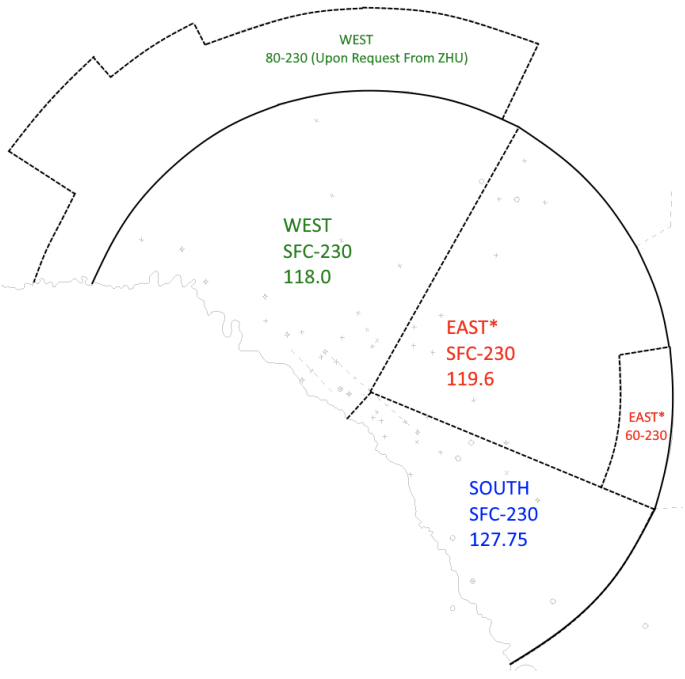

??? abstract "Baton Rouge Approach"
    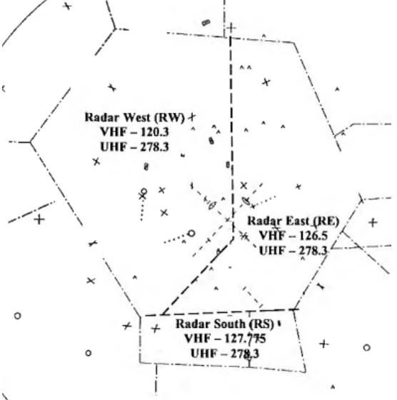

??? abstract "Gulfport Approach"
    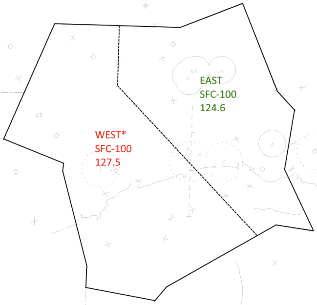

??? abstract "Lake Charles Approach"
    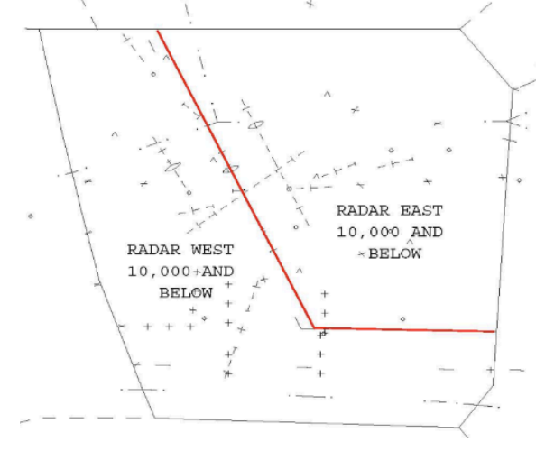

??? abstract "Lafayette Approach"
    

??? abstract "Mobile Approach"
    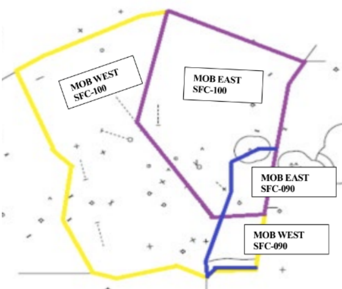

??? abstract "Kingsville Approach"
    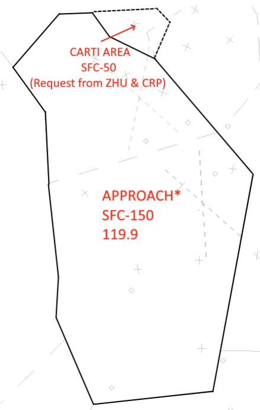

??? abstract "Polk Approach"
    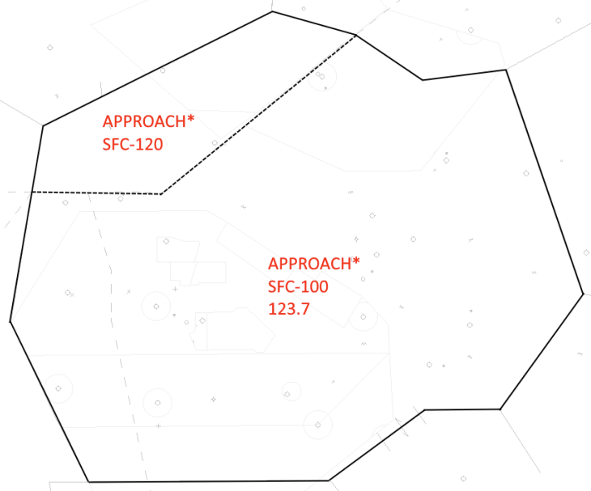