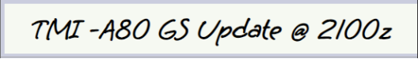
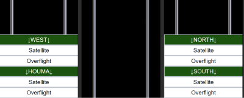
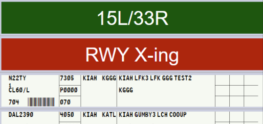
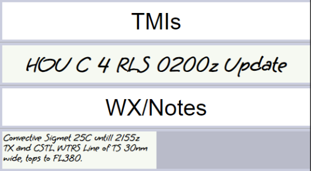
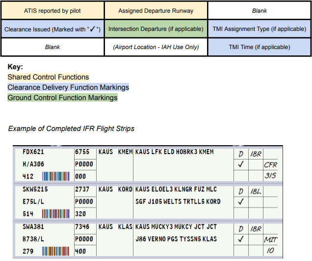
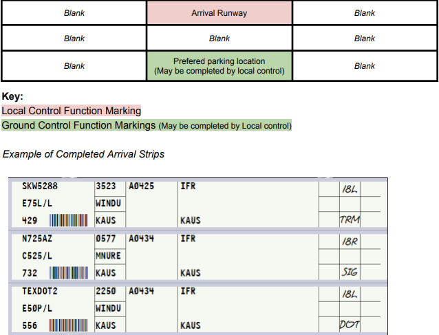

title: General Control SOP
# General Control SOP
??? warning "Disclaimer"
    This document is provided for Houston ARTCC controllers to use when providing virtual ATC services on the VATSIM network. The information herein is **not intended for use in any real-world aviation applications**.

??? info "Revision Information"
    - Document Number: ZHU O 7110.65C
    - Date: 30 May 2024
    - Revision: **C**

    **Record of Revisions**

    | Date | Revision | Editor |
    |:---:|:---:|:---:|
    | 11 Feb 2024 | A | EH |
    | 15 Feb 2024 | B | EH |
    | 29 Feb 2024 | C | WS |
    | 30 May 2024 | C | WS |

This order prescribes the standards of general operations at all controlled airports within the ZHU ARTCC that are not subject to their own facility-specific SOPs. Operational guidance on airspace division, transfer of control, internal agreements, flight strip usage, and more

It is emphasized that the information continued herein is designed specifically for use only within the virtual controlling environment. It does not apply to, nor should it be referenced for, live operations in the United States National Airspace System (NAS). The procedures continued within this document show how the positions are to be operated and, in conjunction with FAA Order 7110.65, will be the basis for performance evaluations, training, and certification.

## 1. General
### 1-1. Introduction
#### 1-1-1. Purpose
This document outlines the standard operating procedures for all airports and positions within ZHU. All information contained in other facility-specific LOAs/SOPs shall take precedence over the procedures outlined in this SOP.

#### 1-1-2. Audience
All ZHU controllers and visitors.

##### 1-1-3. Where Can I Find This Order
This order is available in digital PDF format on the ZHU ARTCC website at https://www.zhuartcc.org/ and can be accessed publicly within the Controllers menu on the Resources page.

#### 1-1-4. Cancellation
Original issuance of this document, no cancellations required.

#### 1-1-5. Explanation Of Changes
- 5-1-3 Radar Identification Procedures simplified.

#### 1-1-6. Responsibility
a. The Virtual Houston ARTCC Air Traffic Manager is responsible for maintaining and updating the information contained in this order

b. The Virtual Houston ARTCC Air Traffic Manager is responsible for notifying the VATUSA Southern Region Air Traffic Director of any necessary revisions to this order.

### 1-2. Position Opening & Closing
#### 1-2-1. Opening A Position
When opening a position, controllers shall take time before signing on to gather necessary information regarding weather, current airport or airspace statuses and configuration, and identify any existing ATC staffing that will be impacted by the opening of the position before activating their controller session in CRC.

1. If assuming control of airspace or surface areas from another controller, controllers shall comply with the relief of an active position process as outlined in this section before assuming control.
2. If no existing ATC is online, the controller may activate their session and assume control of applicable airspace and surface areas with no prior coordination.

#### 1-2-2. Relief Of A Position
When relieving or transferring control to another controller, a position relief briefing shall be obtained before the controller change is complete. Controllers being relieved of an active position must maintain operational control throughout the transfer of control process.

1. Controllers relieving a tower cab position shall utilize the ATCT Position Relief checklist provided in Appendix 1 of this SOP.
2. Controllers relieving a TRACON position shall utilize the TRACON Position Relief checklist provided in Appendix 2 of this SOP.
3. Controllers shall strive to keep briefings concise while still complying with the required briefing items outlined in the later portions of this section. Relieving controllers shall also be aware of existing radio traffic when conducting briefings.
4. Controllers shall use the applicable position relief checklist when relieving a position.
5. Both the reliving controller and controller being relieved shall state “Your/My control” (Operating Initials)” when no further questions exist to finalize the transfer of control process.
6. The controller being relieved shall remain online and monitor their frequency for at least two minutes if possible after the transfer of control unless otherwise noted below to make sure all pertinent information and traffic situations are communicated and understood.
Note: This overlap monitoring period is only required if the airspace or area of the controller’s
responsibility has any pre-existing aircraft connected.

#### 1-2-3. Closing A Position
Controllers shall:

1. Attempt to give at least a five-minute notice to surrounding controllers and pilots before closing a controller position if it will not be relieved by another controller.
2. Perform general housekeeping of their flight strip bays by placing memory aids back under their appropriate rack and divider before signing offline.

### 1-2. Pilot Interactions
#### 1-2-1. ZHU ARTCC Pilot Mission Statement
ZHU ARTCC controllers must demonstrate a reasonably realistic, professional, and
constructive attitude when working with pilots on the network in addition to fulfilling
controller expectations of the ZHU ARTCC General Policy.

#### 1-2-2. Difficult Pilots And Aircraft
Pilots will never know that they are doing something wrong until it is brought to their attention. Failing to address the issue and passing it on to the next controller is not only a disservice to yourself in the future, but also to the pilot and controllers down the road.

It is paramount to remember that VATSIM is a learning environment that features people who are often not real-world experienced pilots from different languages, backgrounds, and capabilities. All controllers will encounter pilots who may not meet the minimum VATSIM Code of Conduct pilot skill standards or may encounter aircraft that have technical issues that sometimes occur in amateur computer-based flight simulators.

Controllers will utilize the following methods in counseling deficient pilots:

1. Calmly state the previous clearance, state what the pilot is currently doing incorrectly, then give new instructions.
!!! example
    “AAL1025 the previous clearance was to descend and maintain 5,000. I show you descending through 3,500. Please climb and maintain 5,000.”
2. Send the pilot an appropriate ZHU ARTCC pilot help alias command (See the ZHU Alias Reference for more information).
3. Constructively and professionally counsel the pilot via private messages during periods of low workload.
4. As a final measure, pilots who continue to demonstrate a deficiency of skills or perform below the pilot standards outlined in the VATSIM Code of Conduct must be directed to the attention of a supervisor via a `.wallop` message and a brief description of the violation for further escalation.

!!! example
    “`.wallop UAL123` is failing to maintain an assigned altitude and speed per VATSIM pilot competencies. They have already been warned twice.”

#### 1-2-3. ATC CONTACT REQUESTS
ATC Contact Me requests MUST NOT be sent to an aircraft during a critical phase of flight. This includes takeoff, landing, and when an aircraft is on final approach inside of a 5nm final.

### 1-3. Closures
#### 1-3-1. NOTAMs
NOTAMs may be implemented at the controller’s discretion. Per VATSIM Policy, controllers shall not deny a pilot’s request to use an inactive runway/taxiway. However, this does not prevent controllers from delaying the aircraft until such time the operation can be conducted safely with minimal impact on other air traffic. When traffic conditions immediately prevent the operation, instruct the aircraft to hold and advise of the anticipated delay time and reason.

#### 1-3-2. Part-Time Controlled Airports
Control facilities that have a part-time control service shall be simulated open/closed during the corresponding published times. An exception can be made by ARTCC staff for events/extenuating circumstances. Published control facility closing times are available in Appendix 3 of this SOP titled ATCT Operations Reference Table.

### 1-4. Transfer of Control Rules
#### 1-4-1. Transfer of Control
Controllers receiving a handoff from another ZHU controller have control as follows:

1. Terminal to Terminal: Control for turns up to 45 degrees, climb departure aircraft, descend arriving aircraft, adjust airspeed on contact.
2. Terminal to Enroute: Control for turns up to 45 degrees and climbs on contact.
3. Enroute to Terminal: Control for turns up to 45 degrees and descents on contact.

### 1-5. Midnight Operations
#### 1-5-1. Procedure
Midnight operations are where internal SOPs and other procedures may be suspended during low traffic volume in favor of more efficient operations. Midnight operations shall only be conducted between 11 PM and 5 AM CST on an optional basis. When more than one controller is online, all ZHU controllers must agree to conduct midnight operations.

### 1-6. VFR Operations
#### 1-6-1. Class B/C/TRSA
VFR aircraft departing class B/C/TRSA airspace shall always be assigned a departure frequency and squawk code. This information can only be omitted when the aircraft explicitly requests “Negative radar services” or “Negative flight following.” VFR aircraft requesting pattern work at these locations shall be given a squawk code.

#### 1-6-2. Class D
VFR aircraft at class D airports shall only issue a departure frequency and squawk code when the aircraft explicitly requests radar service or flight following. VFR aircraft requesting pattern work at these locations shall not be given a squawk code.

#### 1-6-3. VFR Restrictions
Except for instructions contained in Appendix 3 or instructions required for separation, controllers may not restrict a departing VFR aircraft’s altitude or route of flight.

## 2. Radar Simulation
### 2-1. Tower Equipment Classification
#### 2-1-1. Certified Radar Towers
Certified radar towers can use all forms of radar separation, and are responsible for applying separation between the following aircraft:

1. IFR/IFR
2. IFR/VFR, when required by airspace
3. VFR/VFR, when required by airspace

Certified radar towers are considered a radar position, and as such, can issue control instructions that a normal approach/departure position would.
??? info "List of Certified Radar Towers"
    KARA, KAUS, KBFM, KBIX, KBRO, KBTR, KCLL, KEFD, KGLS, KGPT, KGTU, KHOU, KHRL, KHUM, KHYI, KIAH, KLCH, KLFT, KMFE, KMOB, KMSY, KNBG, KNEW, KNOG, KNQI, KPOE, KRND, KSAT, KSGR, KSKF, KSSF

#### 2-1-2. Uncertified Radar Towers
Per 7110.65 3-1-9: “Uncertified tower display workstations must be used only as an aid to assist controllers in visually locating aircraft. Radar services and traffic advisories are not to be provided using uncertified tower display workstations.”
??? info "List of Uncertified Radar Towers"
    KLRD

#### 2-1-3. VFR Towers
VFR towers cannot use any form of radar separation or control.

??? info "List of VFR Towers"
    KAEX, KBAZ, KEDC, KHDC, KHSA, KNWL, KNGP, KPQL, KTME, KVCT

### 2-2. Scratchpad Rules
#### 2-2-1. IFR Arrivals
Aircraft arriving at an airport shall have their scratch pad marked as follows:

The first character shall indicate the type of approach unless the aircraft is expecting a visual approach.

??? info "Scratch Pad Approach Type Codes"
    | Code | Approach Type |
    | --- | --- |
    | `V` | Visual - Cleared with a proceeding aircraft in sight |
    | `W` | Visual - Cleared with the airport in sight (separation still required with proceeding aircraft) |
    | `C` | Contact |
    | `I` | ILS |
    | `L` | Localizer |
    | `G` | GPS/GLS |
    | `P` | RNP |
    | `O` | VOR |
    | `N` | NDB |
    | `D` | LDA |
    | `T` | TACAN |
    | `A` | ASR/PAR |

The second and third characters shall be the runway number and designation (`L/C/R`). When the runway number is 3 characters, only use the last 2 characters.

??? example "Scratchpad Approach Examples"
    - `18R` - Expecting Visual 18R
    - `W8R` - Cleared visual approach runway 18R with the airport in sight
    - `I4` - ILS 4
    - `N14` - NDB 14
    - `P6L` - RNP 36L

#### 2-2-2. VFR Arrivals
If the radar controller working a VFR aircraft assigns a runway, the runway shall be scratched.

## 3. Flight Strips
### 3-1. General
#### 3-1-1. Usage Policy
1. Controllers, regardless of online traffic levels, shall comply with all flight strip policies and procedures.
2. Controllers may only utilize the flight strip bay that applies to their signed-on active controlling position, even when working a facility alone, to prevent confusion.
3. Controllers shall NOT add/delete/modify flight progress bay dividers, as these are used and stored in a standardized manner.
4. Controllers shall place any memory aids being used back into their correct positions before signing out of position. (Existing aircraft flight strips will be automatically deleted after 10 minutes)

#### 3-1-2. Tower Cab Usage
The use of flight strips is mandatory for all tower cab positions including clearance delivery, ground, and local control. Controllers shall use the flight strip bay for the position they are currently connected as.

#### 3-1-3. Approach Control Usage
Flight strip usage/marking in the approach control environment is mandatory for

1. IFR overflight aircraft
2. IFR satellite field departure aircraft
3. Airports that currently have a clearance delivery and/or ground control staffed.
4. All aircraft departing KIAH, KHOU, KAUS, KMSY, and KSAT.

Approach controllers are also encouraged, but not required to utilize flight strips during high-traffic periods when providing top-down services alone to an airport(s) to aid in aircraft tracking and organization.

#### 3-1-4. Enroute Control Usage
Flight strip usage when working enroute and fulfilling top-down control duties is not required and is purely at the enroute controller(s) discretion in the interest of maintaining adequate workload balance.

#### 3-1-5. Types Of Flight Strips
- **Standard Strips:** Reserved for IFR aircraft that have a flight plan on file.

    ??? example "Example: Standard Strip"
        

- **Blank Strips:** Reserved for VFR aircraft that are departing, arriving, or remaining in the local area/pattern if a computer-generated vNAS flight strip from a controller-input flight plan has not been made.

    ??? example "Example: Blank Strip"
        

- **Arrival Flight Strips:** Arrival flight strips are to be used during low visibility operations at airports not equipped with a ground radar system (ASDE-X or ASSC). Arrival strips allow ground controllers to remain actively accountable for arrival aircraft when they may not be able to see the entirety of the airport due to visibility.

    ??? warning "Use of Strips in Low Visibility"
        
        
        As airport visibility begins to decrease, the use of arrival strips becomes appropriate for safety and positive control of inbound aircraft.

        

- **Full Blank Strips:** Are reserved for important controller notes or other items such as TMIs. If controllers are unable to fit TMI info onto a full strip, they may utilize a half strip to denote TMI info.

    ??? example "Example: Full Blank Strip"
        

- **Half Blank Strips:** Allow for more detailed notes and shall be utilized for PIREPs and other similar more detailed controller messages or reports.

    ??? example "Example: Half Blank Strip"
        

#### 3-1-6. Separators
- **Green Separators**
    - **Local Control:** Green separators designate each runway pairing the airport has. These are kept in local control’s rack # 1 (farthest left). Flight strips shall be sequenced in order under the appropriate runway separator. Aircraft that will utilize the runway first (next) shall be at the top nearest the runway separator.

        ??? example "Example: Tower Green Separators"
            
    
    - **Approach Control:** Green separators in approach control facilities are designed to divide shared flight strip bay work areas. All approach positions will drag incoming flight strips from the drop zone (center rack) into their respective sections under the appropriate green separator.

        ??? example "TRACON Green Separators"
            Example of MSY TRACON’s flight strip bay. Each radar position owns the space underneath their labeled green divider up to the next position’s green divider:

            

- **Red Separators** - Safety/Memory Aids: Safety and memory aids are used by local control positions and are stored in the right rack of the position’s flight strip bay underneath the “Safety and Memory Aids” divider. If a memory aid is used, it shall be placed underneath the applicable runway divider (green) that the memory aid applies to.
    
    ??? example "Example: Red Separators"
        

    Types of Safety and Memory Aids:

    - **Closed Runway Aid:** Place under a runway divider when the runway is actively closed. Local controllers may create additional red CLOSED safety aid dividers if more than one runway is closed. 
    
        ??? example "Example: Runway Closed"
            Runway 15R/33L is closed.
            
            
    - **Runway Crossing Aid:** Placed under a runway divider when an aircraft is approved to cross the runway. The safety aid shall remain under the runway divider until the crossing is observed or indicated to be complete.
    
        ??? example "Example: Runway Crossing"
            An aircraft was approved to cross 15L and N22TY is the next aircraft to depart:

            

- **White Separators**
    - **Clearance Delivery Separators:** Clearance delivery has two dividers that apply to their position responsibilities in their flight strip bay for tracking informing the rest of the ATCT members as required.
        1. TMIs - TMIs applicable to ZHU and the airport of control shall be tracked and indicated with a blank flight strip under this divider.
        2. WX/Notes - Any notes related to airport operations, weather, and weather advisories shall be stored under the NOTES separator.

        ??? example "Example: Clearance Delivery Separators"
            

    - **Ground & Local Control Separators:** Airports with divisible ATCT positions utilize white dividers to delineate which position owns which side of the flight strip bay. Strips passed to local control will land in the drop zone (middle rack) and the appropriate control should move the strip to their respective side of the flight strip bay underneath their divider.

        ??? example "Ground & Local Control Separators"
            West local owns the left side of the rack and East local owns the right side.
            

### 3-2. Strip Marking
#### 3-2-1. General
Flight strip markings are used to increase situational awareness, as a memory aid, and increase controller coordination capabilities. The right portion of a flight strip houses blocks numbered 1-9 as pictured below. These blocks are utilized in a coordinated manner as outlined in this section to aid in controlling activities.

Fulfillment of these blocks shall be completed by controllers as outlined in this SOP. Controllers are responsible for making annotations for positions that they are covered. For example, local control working alone must make all marks.

#### 3-2-2. Flight Strip Annotations
Flight strip marking duties may be an individual or shared task in the tower cab. Either clearance delivery or ground control may mark shared marking functions if the applicable information is received or given by either controller to the pilot. Other markings are individually completed by controllers as it pertains only to their position’s responsibilities and areas of control.

??? note "Flight Strip Annotations"
    
    **Box 1:** ATIS code reported by pilot
    
    **Box 2:** Assigned Departure Runway (if given in clearance)
    
    **Box 3:** *unused*
    
    **Box 4:** Clearance Given or Sent (Marked with an ✓ (`SHIFT`+`/`)
    
    **Box 5:** Intersection departure assignment (if other than the runway approach end)
    
    **Box 6:** Traffic Management Initiative (TMI) Type
    
    - `EDC` Estimated Departure Clearance Time (EDCT)
    - `GS` Ground Stop
    - `CFR` Call for release
    - `AC` Altitude Cap
    - `RR` Re-Route
    - `MIT` Miles-In-Trail
    - `TIT` Time-In-Trail
    
    **Box 7:** *unused*
    
    **Box 8:** Location on airfield (KIAH only)
    
    **Box 9:** TMI Assignment Data
    
    - **EDCTs:** All times marked as the last three digits Zulu time where times are assumed to be in the current or upcoming hour. EDCT and Call for release approval times shall be written in Box 9.
        - `010` 2010Z if the current time is in the 1900Z hour
        - `030` 0030Z if the current time is in the 0000Z hour
        - `445` 1445Z if the current time is in the 1400Z hour
    - **Altitude Caps:** Altitude caps are marked as three digit 100s of feet.
        - `070` 7,000 ft
        - `160` 16,000 ft
        - `270` FL270
    - **Miles in Trail (MIT):**
        - `5` 5 NM in trail
        - `20` 20 NM in trail
    - **Time in Trail (TIT):**
        - `5` Five minutes
        - `15` Fifteen minutes

#### 3-2-3. IFR Strip Markings
More examples of IFR Flight Strip Blocks 1-9 Markings

??? example "Examples: IFR Flight Strips"
    

#### 3-2-4. VFR Strip Markings
More examples of VFR Flight Strip Blocks 1-9 Markings

??? example "Examples: VFR Flight Strips"
    

#### 3-2-5. Arrival Strip Markings
More examples of Arrival Flight Strip Blocks 1-9 Markings

??? example "Examples: Arrival Flight Strips"
    