title: HOU Tower SOP
# HOU Tower SOP
??? warning "Disclaimer"
    This document is provided for Houston ARTCC controllers to use when providing virtual ATC services on the VATSIM network. The information herein is **not intended for use in any real-world aviation applications**.

    This order prescribes the standards of general operations at all controlled airports within the ZHU ARTCC that are not subject to their own facility-specific SOPs. Operational guidance on airspace division, transfer of control, internal agreements, flight strip usage, and more

    It is emphasized that the information continued herein is designed specifically for use only within the virtual controlling environment. It does not apply to, nor should it be referenced for, live operations in the United States National Airspace System (NAS). The procedures continued within this document show how the positions are to be operated and, in conjunction with [FAA Order 7110.65](https://www.faa.gov/air_traffic/publications/atpubs/atc_html/), will be the basis for performance evaluations, training, and certification.

??? info "Revision Information"
    - Document Number: HOU O 7110.65A
    - Date: 22 Apr 2024
    - Revision: **A**

    **Record of Revisions**

    | Date | Revision | Editor |
    |:---:|:---:|:---:|
    | 22 Apr 2024 | A | EH |

## 1. General
### 1-1. Introduction
#### 1-1-1. Purpose
This order transmits policy and specifies standard operating procedures for Houston ARTCC (ZHU) control positions. It is supplemental to [FAA Order 7110.65, Air Traffic Control](https://www.faa.gov/air_traffic/publications/atpubs/atc_html/); FAA JO 7610.4, Sensitive Procedures and Requirements for Special Operations; and [FAA JO 7210.3, Facility Administration and Operation](https://www.faa.gov/air_traffic/publications/atpubs/foa_html/). This document is considered a supplement to any VATSIM, Executive Committee, VATSIM Americas Region (VATNA), and United States of America Division (VATUSA) policies, procedures, and controlled documentation.

#### 1-1-2. Audience
All ZHU controllers and visitors. All personnel must be familiar with the provisions of this order and exercise their best judgment when encountering situations this order does not cover.

#### 1-1-3. Where Can I Find This Order
This order is available in digital PDF format on the ZHU ARTCC website at https://www.houston.center/ and can be accessed publicly within the FILES menu and documents section under SOPs.

#### 1-1-4. Cancelation
vZHU-P014 HOU ATCT SOP and all changes thereto are canceled.

#### 1-1-5. Explanation Of Changes
This is the initial release of HOU 7110.65A. No changes have been made.

#### 1-1-6. Responsibility
1. The Houston ARTCC Air Traffic Manager is responsible for maintaining and updating the information contained in this order.
1. The Houston ARTCC Air Traffic Manager is responsible for notifying the VATUSA Southern Region Air Traffic Director of any necessary revisions to this order.

## 2. Procedures
### 2-1. General
#### 2-1-1. Runway Utilization
| Flow   | Landing  | Departing   | Notes |
|--------|:--------:|:-----------:|-------|
| South  | 13R, 13L | 13R, 13L, 22 |       |
| North  | 31L, 31R | 31L, 31R    | RWY 22 may be used with coordination between LC and GC. |
| East   | 4        | 4, 31L, 31R |       |
| West   | 22       | 22          | RWY 13R/31L active only if operationally needed |
| Church | 4        | 4, 13R, 13L | Sunday 1000–1200 LCL (see restrictions below)  |
| SMGCS  | 4        | 4           | RVR ≤ 1600 or Surface Visibility < 1/2 SM |
| Mid    | 4        | 22          | Nightly 0000–0600 LCL (see restrictions below) |

!!! note
    Runway assignments outside of the designated flows above may be authorized subject to the following conditions:*

    1. *Coordination and full concurrence between LC and GC*
    2. *Consideration of known factors such as surface winds, existing airborne or ground traffic, opposite direction operations, severe weather etc.*
    3. *Local and Ground Control may coordinate to deactivate runways if operationally advantageous.*

#### 2-1-2. Noise Abatement Procedures
1. Restrict turbojet aircraft to land on Runway 4 and depart on Runway 13R and 13L:
    1. Between 1000 to 1200 local time on Sundays
    1. Departures shall exit Hobby airspace via Runway 4 departure gates unless otherwise coordinated with Houston Approach Control.
1. Restrict turbojet aircraft to land Runway 4 and depart Runway 22 daily between midnight and 0600 local. All opposite-direction departures shall be coordinated with I90 during these operations.

!!! note 
    These procedures shall be used unless wind, weather, runway/taxiway closures, runway conditions, NAVAID outages, or traffic, dictate otherwise.

#### 2-1-3. Opening/Closing A Position
Position opening and closing shall be done in accordance with [General Control SOP 1-2](../sop/general-control-sop.md#1-2-1-opening-a-position).

#### 2-1-4. Surface Memory Aid Procedures
Controllers shall utilize the flight strip memory aids in accordance with [General Control SOP 3-1-6.b](../sop/general-control-sop.md#3-1-6-separators).

#### 2-1-5. ASDE-X Temp Data
Controllers shall not add, delete, or modify ASDE-X temporary data to include closed taxiway and runways, restricted areas, or text areas unless the modification is consistent with current real-world NOTAMs.

### 2-2. Flight Data / Clearance Delivery
#### 2-2-1. General Duties
1. Mark flight strips in accordance with [General Control SOP 3-2](../sop/general-control-sop.md#3-2-strip-marking).
1. Send PDCs through vTDLS for all IFR aircraft, with or without amendments.
1. Aircraft shall be assigned the appropriate departure runway based on the current airport configuration and [runway utilization](#2-1-1-runway-utilization) section of this SOP.
1. Inform or issue aircraft a TDLS message that gate hold procedures are in effect when used.
1. Instruct all aircraft parked at the terminal to contact the appropriate controller for pushback. All other aircraft not parked at a terminal ramp shall be instructed to contact the appropriate controller for taxi.
1. Operate the ATIS and include “Gate Hold Procedures are in effect” when utilized by the TMU/CIC.

#### 2-2-2. IFR Aircraft
1. Routing:
    1. Route aircraft in order of preference listed:
        1. The alias preferred route.
        1. An appropriate SID.
        1. Clear the aircraft as filed.
1. Initial Altitude:
    1. All aircraft shall be instructed to “Climb and maintain” the appropriate altitudes below:
        1. Assign 5,000 feet MSL to turbojet/turboprop aircraft requesting 11,000 feet MSL or above and expect filed altitude 10 minutes after departure.
        1. Assign 3,000 feet MSL to all piston aircraft and to turbojet/turboprop aircraft requesting 10,000 feet MSL or below, and expect field altitude 10 minutes after departure.
        1. Assign 3,000 feet MSL to all aircraft remaining within the I90 TRACON.
1. Cruise Altitude:
    1. IFR aircraft landing within the following terminal areas shall be capped at the listed maximum cruise altitudes below:
        1. College Station/Industry Terminal Areas
            1. Limited to 8,000 feet MSL or below
        2. Beaumont Terminal Area
            1. Limited to 7,000 feet MSL or below
        3. Lake Charles Terminal Area
            1. Limited to 9,000 feet MSL or below

#### 2-2-3. VFR Aircraft
1. Create vNAS flight plans for VFR aircraft that include the following:
    1. Aircraft type
    1. Destination/route of flight/intentions
    1. Requested altitude
1. Issue a Class B clearance, departure frequency, and beacon code to all aircraft.
1. Altitude Assignments:
    1. Local (I90) VFR traffic - Maintain VFR at or below 3,000 feet
    1. VFR jet/turboprop aircraft requesting 10,500 feet MSL or above - Maintain 5,000 feet
    1. VFR aircraft requesting 9,500 feet MSL or below - Maintain 3,000 feet

### 2-3. Ground Control
#### 2-3-1. General Duties
1. Assist Local Control by pushing flight progress strips according to the aircraft’s intended takeoff position/sequence.
1. Approve/Stipulate/Restrict an aircraft's push back request at the terminal when it will cause the aircraft to enter a movement area. Due to simulator limitations, special attention should be made to aircraft pushing onto Taxiway Yankee. Deep pushbacks can easily result in blocking both terminal taxiways (Yankee and Zulu) and prevent circulation of terminal area taxiing aircraft.
    1. This typically occurs on the: South Terminal ramp (Gates 29, 31, 32, 50, 51)
    ??? example "Example Phraseology"
        - “(ACID) pushback approved” or “(ACID) push approved”
        - “(ACID) pushback approved tail West onto Yankee”
        - “(ACID) push onto Yankee approved”
        - “(ACID) give way to company aircraft parking at the gate next to you, once clear, pushback approved.”
1. Prior to assigning/approving an intersection departure and/or prior to making runway assignments that are other than the advertised runways you must:
    1. Obtain CIC approval for the operation.
    1. Obtain approval from the appropriate Local control.
    1. Indicate on the flight progress strip the departure runway/intersection.
1. GC must obtain approval from LC prior to assigning a departure runway that is not part of the designated flow.
    1. The assignment and use of a runway for departure contrary to the prescribed flow in use is subject to situational factors such as MEDEVAC priority, weather and wind conditions, existing traffic demands, etc.
1. GC shall verbally advise LC of any aircraft assigned an intersection departure in addition to marking the strip with the runway and intersection assigned IAW the [ZHU General SOP Flight Strip marking](../sop/general-control-sop.md#3-2-strip-marking) guidelines.
1. Instruct departure aircraft to monitor the tower when appropriate.
1. Ground control should attempt to utilize standardized aircraft taxi routing as depicted in [Appendix 4](#3-4-preferred-taxi-routes) dependent on the airport’s active configuration.
1. Solicit all corporate aircraft arriving at Hobby Airport for their desired parking location. Preferred parking locations for arrival aircraft can be marked by any controller on the ASDE-X primary scratchpad with the abbreviations listed in the table below.

    ??? abstract "Parking Location Scratchpad Codes"
        | Location | Symbol | Location | Symbol |
        | --- | :---: | --- | :---: |
        | SCI Ramp | SCI | Galaxy | G |
        | NE Ramp | NE | Customs | C |
        | E Ramp (off TWY R) | R | S Ramp | S |
        | E Ramp (off TWY p) | P | W Ramp | W |
        | E Ramp | E | | |

When coordinating to cross or use any portion of an active runway Ground Control:

1. Must, before coordinating, determine if the operation is feasible.
1. Must obtain approval from LC, via the controller coordination channel
1. Must, with specificity, reference any LC airborne or ground traffic
    1. (ACID/type/position) they wish to cross behind or ahead of.

    ??? example "Phraseology Examples"
        - “After (ACID/type/position)/ [AFTER/AHEAD OF (ACID/type/position)] CROSS (crossing coordination)”.
        - “After SWA12 and ahead of SWA432 cross runway 22 at Charlie”.
        - “After/ahead of the Gulfstream [departure] cross runway 22 at Bravo”. If there is more than one departure, GC must specify a call sign.
        - “After the aircraft on short final, cross runway 13R at Lima”.
        - “Cross runway 13L at Delta”.

#### 2-3-2. Coded Crossings.
Hobby Tower possesses an FAA approved waiver that allows multiple runway crossings to be issued with a single clearance at the intersections listed below. Internal coded crossing phraseology associated with parallel runway crossings is utilized as an effort to significantly reduce the probability of internal miscommunication between controllers and to eliminate all probability of transposing/confusing runway numbering (RWY 13R/31L, RWY 13L/31R). Coded Crossings phraseology shall be utilized as follows:

??? abstract "Coded Crossings"
    | Crossing     | Path                                                                 |
    |--------------|----------------------------------------------------------------------|
    | Echo East    | Cross RWYs 13R/31L, and 13L/31R on TWY E to the north ramp.        |
    | Echo West    | Cross RWYs 13L/31R, and 13R/31L on TWY E to the west ramp.         |
    | Hotel East   | Cross RWYs 13R/31L and 13L/31R on TWY H from the East              |
    | Hotel West   | Cross RWYs 13L/31R and 13R/31L on TWY H from the West              |
    | Kilo East    | Cross RWYs 13R/31L and 13L/31R on TWY K from the East              |
    | Kilo West    | Cross RWYs 13R/31L and 13L/31R on TWY K from the West              |
    | Lima East    | Cross RWYs 13R/31L and 13L/31R on TWY L from the East              |
    | Lima West    | Cross RWYs 13R/31L and 13L/31R on TWY L from the West              |
    | Cross Exec   | Cross RWY 4/22 from/to TWY K1 to/from TWY G                        |

#### 2-3-3. Areas Of Control
1. South & North Flow operations: LC shall retain control of arrivals operating between the parallel runways.
1. GC shall give way to LC’s traffic at points highlighted in [Appendix 5](#3-5-airfield-helicopter-aiming-points) according to the active airport configuration
1. LC and GC shall have priority on taxiways as depicted in the “Preferred taxi and ground movement” maps in [Appendix 5](#3-5-airfield-helicopter-aiming-points).

#### 2-3-4. Transfer Of Control Points (TCP)
Runway 13R departures on taxiways Delta and Echo shall be instructed to monitor tower holding short of Runway 13L. LC shall be responsible for runway crossings at the TCP.

### 2-4. Local Control
#### 2-4-1. General Duties
Be responsible for:

1. Shall utilize strip bay management and memory aid procedures as outlined in the [ZHU General Control SOP Flight Strip](../sop/general-control-sop.md#3-2-strip-marking) chapter.
1. Issue clearances for movement on active runways and within the airspace depicted in [Appendix 1](#3-1-hou-airspace-maps) from the surface up to and including 5000 MSL,
1. May approve and/or reference non movement area helicopter operations only to helicopter pilots locally familiar with HOU helicopter operations referencing areas such as “The Triangle” or “The Plate” as seen in [Appendix 5](#3-5-airfield-helicopter-aiming-points).
1. LC shall advise GC when an aircraft’s departure runway assignment is changed
    1. The assignment and use of a runway for departure contrary to the prescribed flow in use is subject to situational factors such as MEDEVAC priority, weather and wind conditions, existing traffic demands etc.
1. LC shall coordinate with GC prior to allowing a vehicle or aircraft to utilize a runway that is closed or not previously designated as active.

#### 2-4-2. Departure Procedures
1. Anytime a radar heading is assigned or issued with a specified direction in a takeoff clearance or in the air, Local Control must ensure that the pilot reads back the direction of turn (Left/Right).
1. Shall control departures to ensure they do not turn early into designated helicopter aiming points “Triangle” and “Plate” depicted in [Appendix 5](#3-5-airfield-helicopter-aiming-points).
1. Aircraft shall be established on a heading to remain within the lateral confines of the appropriate departure corridor ([Appendix 1](#3-1-hou-airspace-maps)). In accordance with FAA 7110.65, Tower may utilize course divergence out departure corridors where applicable. Course divergence shall not be used out the North corridor.
1. Local control shall radar identify all departures, initiate a STARS track, and execute an automated radar handoff to the appropriate controller prior to the aircraft entering the departure corridor and prior to communications transfer. It is the TRACON’s responsibility to inform the aircraft that they are “Radar Contact.”
1. Suggested initial turns and headings are provided in [Appendix 7](#3-7-suggested-initial-departure-headings) of this document when initially assigning a heading to departing aircraft in a takeoff clearance. Winds aloft correction may need to be provided to suggested headings.

#### 2-4-3. Departure Releases
1. Local control shall automatically release and retain control of all departures until radar or vertical separation exists. Point out any aircraft that may enter airspace other than that owned by the receiving controller.

#### 2-4-4. Arrival Procedures
1. “Quick look" the I90 controller working HOU final to receive aircraft’s arrival information.
1. LC shall advise GC and Hobby final (if necessary) when an aircraft’s landing runway is other than that displayed in the STARS field 2 (scratch pad).
1. Aircraft that have acknowledged a landing clearance shall have their STARS data blocks changed to “Blue” in color (middle click).
1. Local control has the option of changing the landing runway assignments of arriving aircraft, provided that separation is ensured with all successive arrivals.
1. Local control shall be responsible for the separation of aircraft 5 nm from the runway or the final approach fix, whichever is farther.
1. Handle missed approaches in accordance with [section 2-4-5](#2-4-5-missed-approaches) outlined in this SOP.

#### 2-4-5. Missed Approaches
1. RWYs 13R/L and RWYs 31L/R- Treat as a satellite departure and vector out the Lakeside Satellite gate, assigning 3,000 ft. MSL.

    !!! note
        HOU may keep VFR go-arounds for the 13/31 flows in the local traffic pattern.

1. RWY’s 4 and 22- Treat as a satellite departure and vector out the SanJac Satellite gate, assigning 3,000 ft. MSL.
1. Time and traffic permitting, HOU may coordinate with HOU Final for a heading and altitude to re-enter HOU Final’s airspace.

#### 2-4-6. I90 Airspace Delegated To HOU.
HOU is authorized use of I90 Airspace depicted in Area B in [Appendix 3](#3-2-i90-airspace-delegated-to-iah-and-hou-atct). If I90 desires to use this airspace, coordination with IAH must be required. If I90 has traffic below 1,500 feet MSL within the lateral confines of airspace depicted in Area B in [Appendix 3](#3-2-i90-airspace-delegated-to-iah-and-hou-atct) they must force the target onto Hobby Local’s STARS display.

#### 2-4-7. Automated Point Out Procedures
1. When using an automated point out, the initiating controller must ensure that scratchpad information is correct.
1. The receiving controller must, either via automation or verbal means:
    1. Approve the point out
    1. Unable to point out
    1. Accept control of the aircraft

#### 2-4-8. Opposite Direction Operations (ODO).
!!! quote "Opposite Direction Operations (ODO)"
    IFR/VFR Operations conducted to the same or parallel runway where an aircraft is operating in a reciprocal direction of another aircraft arriving, departing, or conducting an approach.

Same Runway Procedures:

1. For ODO: Runway 13R/L and 31L/R are considered same runway
1. HOU Local Control and I90 Controlling Sectors are responsible for initiating coordination required to accomplish an opposite direction arrival or departure.
1. HOU Local Control is responsible for applying the cutoff point between arriving and departing aircraft.
1. The I90 Controlling Sector is responsible to apply the cutoff point between successive ODO arrivals.
1. All coordination concerning the ODO must be done via a recorded line and state “Opposite Direction.” Initial coordination must include call sign, type, and arrival or departure runway.
1. Do not allow opposite direction same runway operations with opposing traffic inside the cutoff point unless an emergency exists.
1. Traffic advisories must be issued to both aircraft.
    
    ??? example "Examples"
        - OPPOSITE DIRECTION TRAFFIC (distance) MILE FINAL, (type aircraft).
        - OPPOSITE DIRECTION TRAFFIC DEPARTING RUNWAY (number), (type aircraft).
        - OPPOSITE DIRECTION TRAFFIC (position), (type aircraft).

1. Once an ODO has been approved, any further operations from that runway must be verbally coordinated until the ODO is completed.
1. The cutoff points (CP) are defined as 10 flying miles from the runway threshold.
1. Arrival/Arrival: I90 must ensure the first arrival has crossed the runway threshold prior to the second aircraft reaching the cutoff point.
1. Arrival/Departure: HOU Tower must ensure a departing aircraft is airborne and issued a turn to avoid conflict prior to opposing traffic reaching the cutoff point. I90 must ensure the arrival aircraft does not cross the CP prior to the departing aircraft becoming airborne.
1. Visual separation is not authorized for Same Runway ODO.
1. If the conditions in Paragraphs 10 and 11 are not met, action must be taken to ensure control instructions are issued to protect the integrity of the cut off points.

## 3. Appendices
### 3-1. HOU Airspace Maps
??? info "HOU Airspace Maps"
    ??? info "East/Church Flow"
        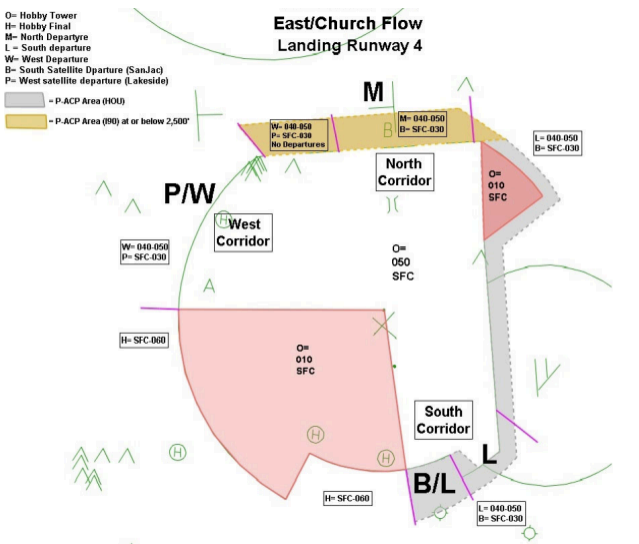
    ??? info "South Flow"
        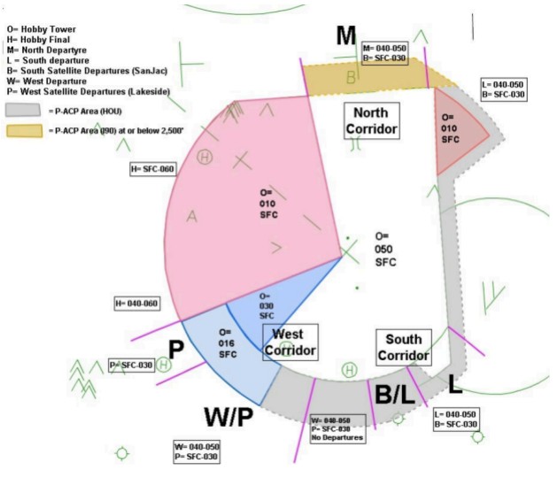
    ??? info "North Flow"
        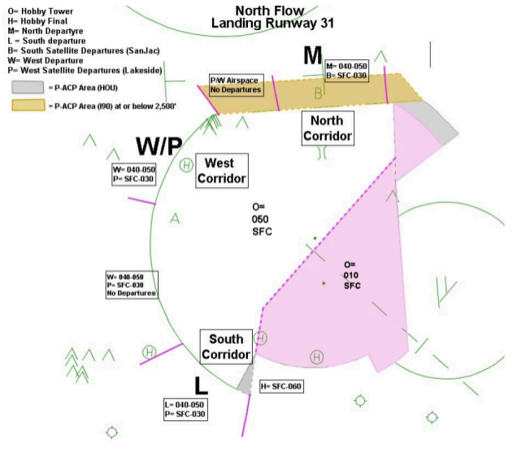
    ??? info "West Flow"
        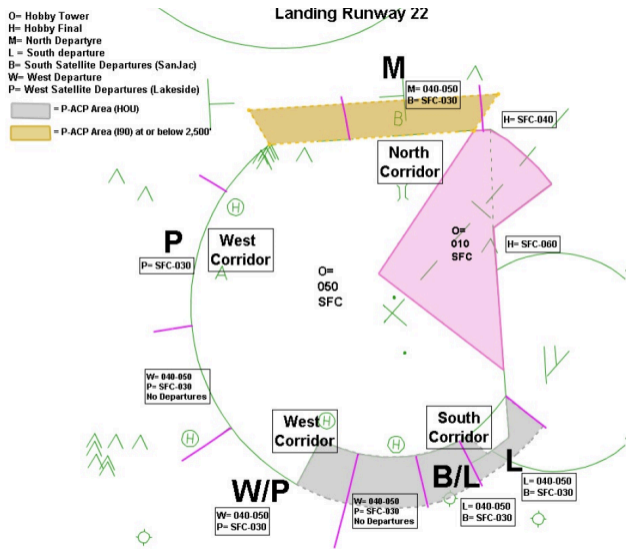
### 3-2. I90 Airspace Delegated to IAH and HOU ATCT
??? info "I90 Airspace Delegated to IAH and HOU ATCT"
    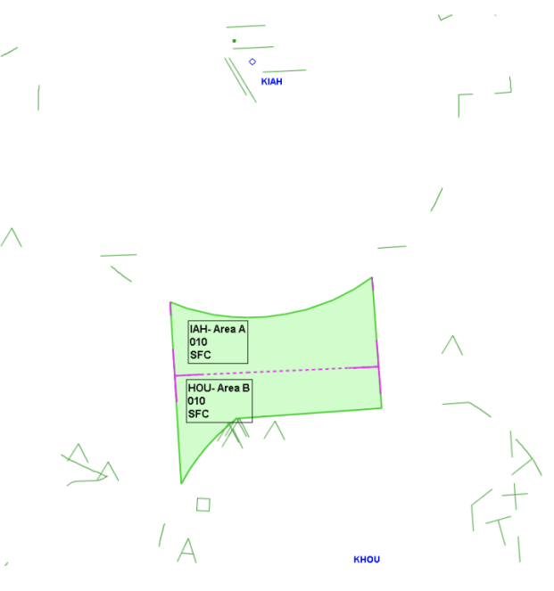
### 3-3. ASDE-X/STARS Departure Gate Scratchpads
??? info "ASDE-X/STARS Departure Gate Scratchpads"
    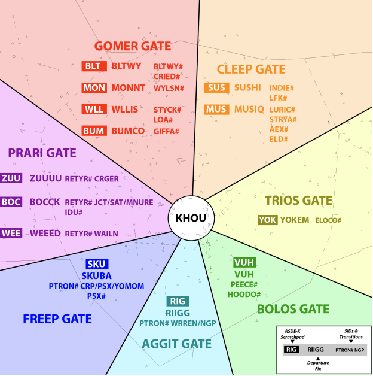
### 3-4. Preferred Taxi Routes
??? info "Preferred Taxi Routes"
    ??? info "South Flow"
        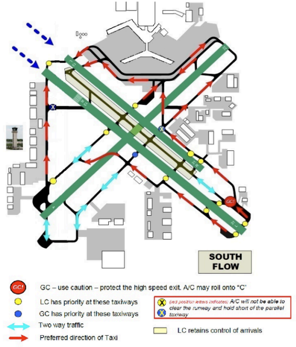
    ??? info "North Flow"
        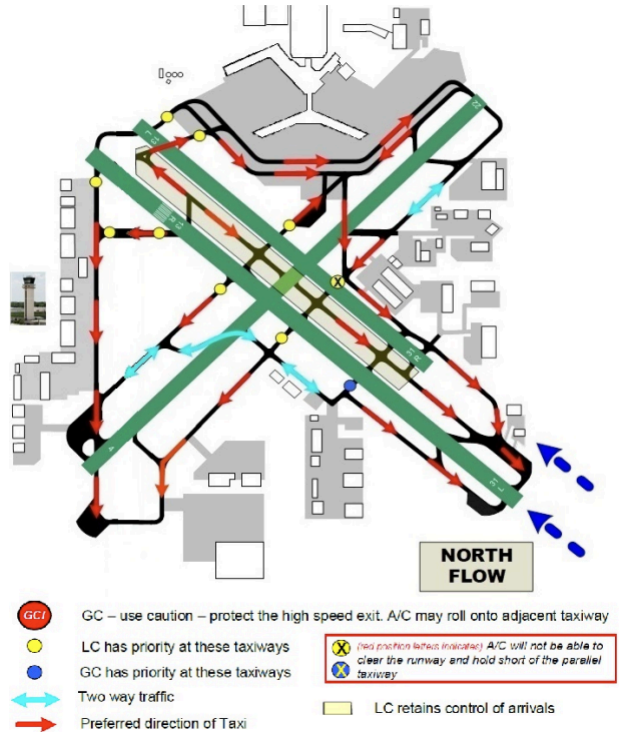
    ??? info "East Flow"
        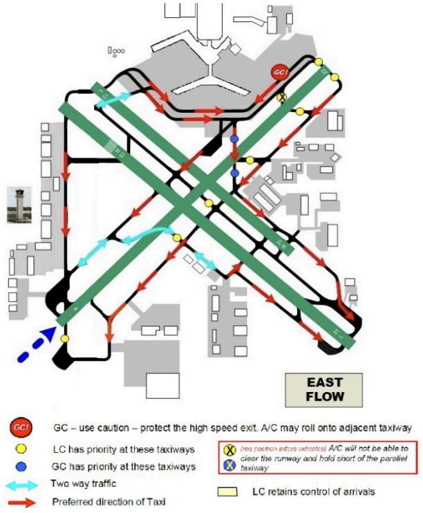
    ??? info "Church Flow"
        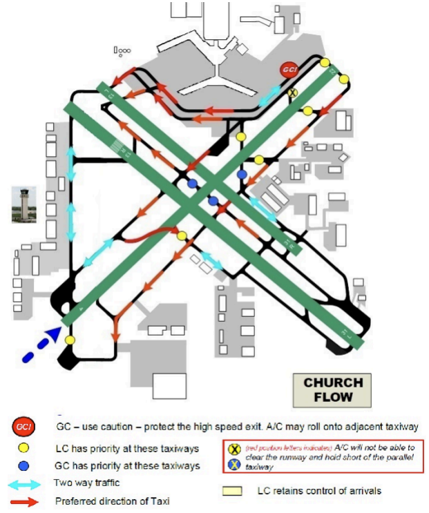
    ??? info "West Flow"
        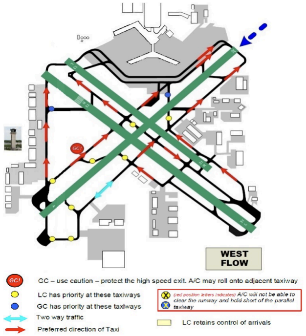
    ??? info "SMGCS Flow"
        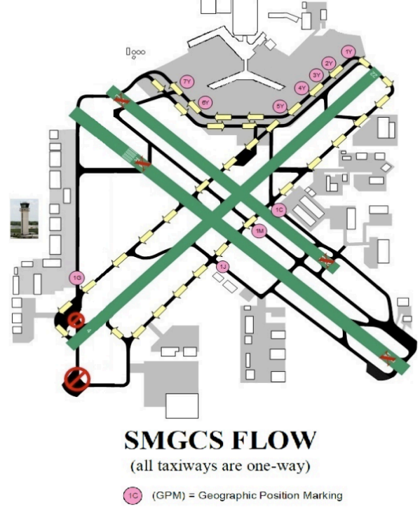
### 3-5. Airfield Helicopter Aiming Points
??? info "Airfield Helicopter Aiming Points"
    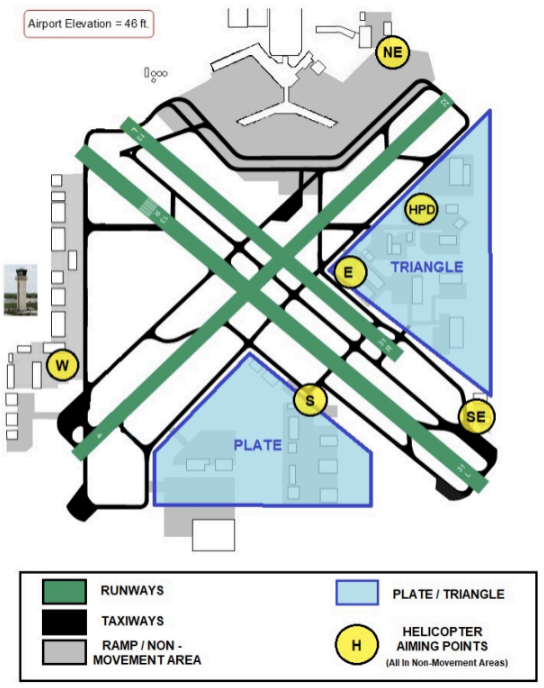
### 3-6. Intersection Departure Distances
??? info "Intersection Departure Distances"
    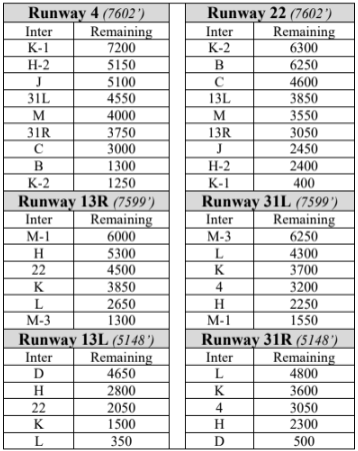
### 3-7. Suggested Initial Departure Headings
??? info "Suggested Initial Departure Headings"
    ??? info "East Flow (Land 4, Depart 31)"
        | Fixes          | Instructions                             |
        |----------------|------------------------------------------|
        | GOMER CLEEP | 31: Right 360 - 020 4: Left 350 - 010 |
        | PRARI          | Left 300 - 280                           |
        | TRIOS BOLOS AGGIT FREEP | Right 160 - 180        |
    ??? info "West Flow (Land 22)"
        | Fixes          | Instructions   |
        |----------------|----------------|
        | GOMER CLEEP | Right 010      |
        | PRARI          | Left 300 - 280 |
        | TRIOS BOLOS | Left 130 - 150 |
        | AGGIT FREEP | RWY HDG        |
    ??? info "North Flow (Land 31)"
        | Fixes          | Instructions       |
        |----------------|--------------------|
        | GOMER CLEEP | Right 360 - 020    |
        | PRARI          | Left 290 - RWY HDG |
        | TRIOS BOLOS AGGIT FREEP | Left 130 - 150 |
    ??? info "South Flow (Land 13)"
        | Fixes          | Instructions       |
        |----------------|--------------------|
        | GOMER CLEEP | Left 350 - 010    |
        | PRARI          | 22: RWY HDG 13: Right 220 - 240 |
        | TRIOS BOLOS AGGIT FREEP | 22: Left 130 - 150 13: Right 140 - 165 |
    ??? info "Church Flow (Land 4, Depart 13)"
        | Fixes          | Instructions       |
        |----------------|--------------------|
        | GOMER CLEEP | Left 350 - 010    |
        | PRARI          | Left 270 - 290 |
        | TRIOS BOLOS AGGIT FREEP | 13: Right 140 - 165 4: Right 170 - 180 |