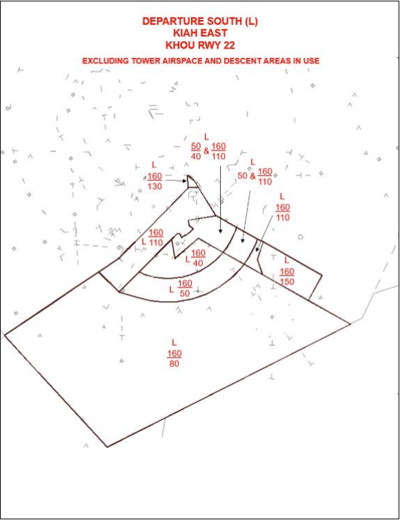

title: I90 TRACON SOP
# I90 TRACON SOP
??? warning "Disclaimer"
    This document is provided for Houston ARTCC controllers to use when providing virtual ATC services on the VATSIM network. The information herein is **not intended for use in any real-world aviation applications**.

    This order prescribes standard operating procedures for use by Air Traffic Control Specialists in the Houston ARTCC on the Virtual Air Traffic Simulation (VATSIM) network. Controllers are required to be familiar with the provisions of this document that pertain to their operational responsibilities and to exercise their best judgment if they encounter situations not covered herein.

    It is emphasized that the information continued herein is designed specifically for use only within the virtual controlling environment. It does not apply to, nor should it be referenced for, live operations in the United States National Airspace System (NAS). The procedures continued within this document show how the positions are to be operated and, in conjunction with FAA Order 7110.65, will be the basis for performance evaluations, training, and certification.

??? info "Revision Information"
    - Document Number: I90 O 7110.1A
    - Date: 1 Jul 2024
    - Revision: **A**

    **Record of Revisions**

    | Date | Revision | Editor |
    |:---:|:---:|:---:|
    | 1 Jul 2024 | A | EH |

## 1. General
### 1-1. Introduction
#### 1-1-1. Purpose
This order transmits policy and specifies standard operating procedures for Houston ARTCC (ZHU) control positions. It is supplemental to FAA JO 7110.65, Air Traffic Control; FAA JO 7610.4, and FAA JO 7210.3, Facility Administration and Operation. This document is considered a supplement to any VATSIM, Executive Committee, VATSIM Americas Region (VATNA), and United States of America Division (VATUSA) policies, procedures, and controlled documentation.

#### 1-1-2. Audience
All ZHU controllers and visitors. All personnel must be familiar with the provisions of this order and exercise their best judgment when encountering situations this order does not cover.

#### 1-1-3. Where Can I Find This Order
This order is available in digital PDF format on the ZHU ARTCC website at https://www.houston.center/ and can be accessed publicly within the FILES menu and documents section under SOPS.

#### 1-1-4. Cancellation
vZHU-P012 I90 TRACON SOP and all changes thereto are canceled.

#### 1-1-5. Explanation Of Changes
This is the initial release of I90 7110.1A. No changes have been made.

#### 1-1-6. Responsibility
1. The Houston ARTCC Air Traffic Manager is responsible for maintaining and updating the information contained in this order.
2. The Houston ARTCC Air Traffic Manager is responsible for notifying the VATUSA Southern Region Air Traffic Director of any necessary revisions to this order.

## 2. Procedures
### 2-1. General
#### 2-1-1. Definitions
1. The Houston Terminal Area is that area contained within the Houston TRACON airspace, excluding these satellite sectors:
    1. Beaumont
    2. College
    3. Industry
2. The College Station Terminal Area is that area contained within these satellite sectors:
    1. College
    2. Industry
3. Satellite airports in the Houston Terminal Area are defined as:
    1. South Satellite if south of V222
    2. North Satellite if north of V222

#### 2-1-2. Deviations
If operationally advantageous, deviations from these procedures may be coordinated on an individual basis, except as noted in paragraph 3-17-2 Final Position Duties.

#### 2-1-3. Control Transfer
Control must be transferred in accordance with vZHU General Control SOP 1-4-1.

#### 2-1-4. Runway Utilization
1. KIAH runway configuration shall be set by IAH local, utilizing the flows outlined in vZHU IAH SOP 2-1-1.
2. When performing an East/West Flow runway change at KIAH, utilize the following checklist.
    1. IAH local shall initiate the flow change and verbally inform all I90 controllers.
    2. I90 shall identify to IAH the last arrival to land on each runway in the old configuration and the first aircraft to land under the new runway configuration.
        1. It is recommended that all aircraft currently on a downwind or on the Final’s side of the TRACON should continue with the old configuration. All other aircraft should be vectored for the new configuration.
        2. If arrivals must land opposite direction, the outboard runways shall be used. Example – 8L/27.
    3. Ensure Hobby Final is on the “Short Box” if landing KHOU RWY 13R prior to activating both final boxes.
    4. Notify KHOU Tower when a runway change has occurred at KIAH.
    5. Notify Houston Air Route Traffic Control Center (ZHU) of the new runway configuration.
3. When changing runways at KHOU:
    1. HOU local shall initiate the flow change and verbally inform all I90 controllers.
    2. I90 shall identify to HOU the last arrival to land in the old configuration and the first aircraft to land under the new runway configuration.
4. When changing runways at KDWH:
    1. DWH local shall initiate the flow change and verbally inform all I90 controllers.
    2. I90 shall identify to DWH the last arrival to land in the old configuration and the first aircraft to land under the new runway configuration.

#### 2-1-5. Reduced Longitudinal Separation
Reduced longitudinal separation (2.5 NM) between arrivals may be applied for all East/West runways at KIAH for aircraft established on the Final Approach Course (FAC) within ten (10) NM for the landing runway.

#### 2-1-6. KIAH Authorized Approach Pairings
The following RNAV RNP approaches are authorized for simultaneous use:

1. Simultaneous Independent Approaches to Widely-Spaced Parallel Runways without Final Monitors:
    1. RNAV (RNP) Y RWY 26R with all RWY 27 instrument approaches.
    2. RNAV (RNP) Y RWY 9 with all RWY 8L instrument approaches.
2. Simultaneous Independent Approaches- Dual & Triple:
    1. RNAV (RNP) Y RWY 26R with all RWY 26L and/or RWY 27 instrument approaches.
    2. RNAV (RNP) Y RWY 9 with all RWY 8R and/or RWY 8L instrument approaches.

#### 2-1-7. Mode C Altitude
Aircraft being handed off in level flight with altitude information displayed (Mode C or Scratchpad) must be considered to be at their assigned altitude.

#### 2-1-8. Approach Breakout Areas
Satellite or Departure airspace, at or below 3,000 feet MSL, within the lateral confines of Final airspace is for KIAH departures, go-arounds, and/or breakouts only. Final controllers, Final Monitor controllers, and KIAH Local Control positions have control to vector breakouts within this airspace for resequencing.

#### 2-1-9. Practice Approaches
A Letter to Airmen (LTA) has been published for the IFR separation for VFR aircraft practicing instrument approaches. See Appendix A.

#### 2-1-10. Optimized Profile Descent (OPD) Operations
Aircraft that are capable of utilizing OPD (Descend Via) procedures but have been altitude restricted must be coordinated with the receiving controller if the altitude is different from the bottom altitude on the procedure. Controllers may utilize the temporary altitude field in the data block as an automated method of coordination.

#### 2-1-11. Off-Route (Vectored) Aircraft
Controllers that vector an aircraft off an OPD (Descend via) STAR must coordinate the heading and altitude with the next controller. The altitude may be omitted if displayed in the data block.

#### 2-1-12. Altitude Restrictions For PRARI Gate Departures
10,000 feet MSL and 12,000 feet MSL must not be assigned to aircraft departing via the PRARI Gate. This restriction separates from the KIDDZ and SNIFY Standard Terminal Arrival Routes (STARs).

#### 2-1-13. Approach Information
The first controller to work an aircraft that will land at an airport inside their Terminal Area (Houston, College, Beaumont) must satisfy the requirements of 7110.65 4-7-10 Approach Information.

#### 2-1-14. Arrival Runway Assignments
1. Unless otherwise stated in this order, aircraft being handed off to Final controllers must be assigned 6,000 feet and no greater than 210 knots.
2. Provide runway assignment information in the primary scratchpad for all IFR arrival aircraft in accordance with vZHU General Control SOP 2-2-1.
3. Utilize the charts below for optimal runway assignment and altitudes related thereto.
4. The East Arrival and West Arrival short-side (Base-side) feeders are responsible for runway balancing. Runway balancing is defined as keeping equal pressure on the available arrival runways. Gulf Arrival and Eagle Lake Arrival must assist East Arrival and West Arrival when balancing needs exist (e.g., vectors for spacing).
5. If short-side feeders assign a runway that is not on a STAR transition, the aircraft must be vectored. (Shown as **bold** in the tables below).
    
    ??? abstract "Arrival East (D)"
        | Destination | Flow | Arrival | RWY(s) | Altitude |
        | --- | --- | --- | --- | --- |
        | IAH | West | DOOBI | 26L **26R** **27** | 8,000 **6,000** **6,000** |
        | IAH | West | ZEEKK | 26L 27 26R | 8,000 4,000 6,000 |
        | IAH | East | GESNR | 8L 8R 9 | 6,000 6,000 6,000 |
        | IAH | East | SKNRD | 8L 8R 9 | 6,000 6,000 6,000 |
        | IAH | West | OHIIO (Conv) | **26L** **27** **26R** | **8,000** **6,000** **6,000** |
        | IAH | East | OHIIO (Conv) | **8L** **8R** **9** | **6,000** **6,000** **6,000** |
        | HOU | All | WAPPL | 13R/4/31L 22 | 6,000 7,000 |
        | HOU | All | HUDZY (Conv) | **13R/4/31L** **22** | **6,000** **7,000** |
    
    ??? abstract "Eagle Lake Arrival (X)"
        | Destination | Flow | Arrival | RWY(s) | Altitude |
        | --- | --- | --- | --- | --- |
        | IAH | West | TEJAS | 27 26R 26L | 6,000 6,000 6,000 |
        | IAH | East | HTOWN | 8R **9** **8L** | 7,000 **6,000** **6,000** |
        | IAH | West | DUUUK (Conv) | **27** **26L** **26R** | **6,000** **6,000** **6,000** |
        | IAH | East | DUUUK | 8R 9 8L | **7,000** **6,000** **6,000** |
        | HOU | All | KIDDZ | 13R 4 22 31L| 6,000 6,000 6,000 6,000 |
        | HOU | All | BELLR | 13R 4 22 31L| 6,000 6,000 6,000 6,000 |
        | HOU | All | SNIFY (Conv) | **13R** **4**| **6,000** **6,000** |
        | HOU | All | TSHRT (Conv) | **22** **31L**| **6,000** **6,000** |
    
    ??? abstract "Arrival West (N)"
        | Destination | Flow | Arrival | RWY(s) | Altitude |
        | --- | --- | --- | --- | --- |
        | IAH | West | DRLLR | 26R 26L 27 | 6,000 7,000 6,000 |
        | IAH | West | MSCOT | 26R 26L 27 | 6,000 7,000 6,000 |
        | IAH | East | GUSHR | **8R** 8L **9** | **8,000** 6,000 **6,000** |
        | IAH | East | TTORO | 8R **8L** **9** | 8,000 **6,000** **6,000** |
        | IAH | West | RIICE (Conv) | **26R** **26L** **27** | **6,000** **7,000** **6,000** |
        | IAH | East | RIICE (Conv) | **8R** **8L** **9** | **8,000** **6,000** **6,000** |

    ??? abstract "Gulf Arrival (G)"
        | Destination | Flow | Arrival | RWY(s) | Altitude |
        | --- | --- | --- | --- | --- |
        | IAH | West | LINKK | 27 26L **26R** | 6,000 7,000 **6,000** |
        | IAH | East | NNCEE | 8R 9 8L | 6,000 6,000 6,000 |
        | HOU | 13/4 | BAYYY | 13R 4 | 6,000 6,000 |
        | HOU | 22/31 | PUCKS | 22 31 | 4,000 6,000 |
        | IAH | West | GILCO (Conv) | **27** **26L** **26R** | **6,000** **7,000** **6,000** |
        | IAH | East | GILCO (Conv) | **8** **9** **8L** | **6,000** **6,000** **6,000** |
        | HOU | All | HUB 110/050 (Conv) | **Radar Vectors** | **6,000** |
        | HOU | All | TKNIQ | **Radar Vectors** | **6,000** |
        | IAH | WX Offload | SOULL | **26L** **All Others** | **7,000** **6,000** |
        | HOU | WX Offload | TKNIQ | **Radar Vectors** | **6,000** |

#### 2-1-15. Wharton/Bay City (KARM/KBYY) Shelf Procedures
1. KARM and KBYY arrivals under TRACON control that will next enter the Center Eagle Lake-Low sector, must be assigned 4,000 feet. Upon communication transfer, TRACON releases the ARM/BYY Control Area to ZHU. The Eagle Lake-Low sector must return the ARM/BYY Control Area to TRACON when no longer in use.
2. Automated point outs may be used for coordinating the release of the ARM/BYY Shelf. The STARS Scratchpad must contain “ARM/BYY” identifying these aircraft. Acceptance of the point-out grants approval for the release of the ARM/BYY Shelf to ZHU Eagle Lake Low Sector.

    ??? info "Wharton/Bay City Shelf"
        

### 2-2. Automated Internal Coordination
#### 2-2-1. Automated Point Out Procedures
To reduce verbal coordination, the STARS point out function may be used between all intra-facility positions within the I90 TRACON.

1. APO procedures are authorized when the following conditions are met:
    1. The initiating and receiving controllers must ensure the associated full data block information is correct, usable and easily understood.
    2. It shall be assumed that the aircraft is on course or is being vectored toward the information displayed in the scratchpad.
    3. Additional coordination may sometimes be required to complete the point out and grant approval. Any necessary traffic, restrictions, or additional coordination must be accomplished verbally.
    4. By approving the Automated point out, the receiving controller indicates the associated data block contains sufficient information to ensure aircraft separation is maintained, and authorizes the initiating controller to enter the receiving controller’s area of jurisdiction. If the information contained in the FDB is insufficient to approve the operation, verbal coordination must be accomplished prior to approving the automated point out.

#### 2-2-2. Prearranged Coordination Procedures
Positions permitted to use P-ACP must be responsible for maintaining separation from all aircraft within the P-ACP area.

1. Controllers who penetrate another controller’s airspace using P-ACP must display data block information of that controller’s aircraft that must contain, at a minimum, the position symbol and altitude information.
2. Arrival controllers must coordinate verbally, or by use of automation, with the appropriate Departure controller(s) for all aircraft when their route does not follow a published STAR, PAR or other defined route.
3. The Hobby Final controller must coordinate verbally, or by use of automation, with the appropriate Departure Controller(s) prior to altering any aircraft’s route that does not follow the published STAR, PAR, or other defined route.
4. P-ACP may be used as follows:
    1. When departure is combined to one position, departure may use P-ACP to climb aircraft through any portion of arrival (Feeder) airspace. When departure is split, P-ACP through feeder airspace is limited to the respective departure controller’s lateral boundaries only.
    2. Hobby Final may use P-ACP to descend aircraft landing KHOU:
        1. Within Lakeside Satellite airspace that underlies the Hobby Final airspace, when KHOU is landing RWY 13R/L.
        2. Within Lakeside airspace when KHOU is landing RWY 4 as depicted in this chapter, Figure 1.
            
            ??? info "Figure 1: Prearranged Coordination KHOU RWY 4"
                
    
    3. Final North may use P-ACP within Departure North airspace, in a West Flow, in the area specified in this chapter, Figure 2.

        ??? info "Figure 2: KIAH Final (West) Prearranged Coordination"
            
    
    4. Final South may use P-ACP within Departure South/East airspace, in a West Flow, in the area specified in this chapter, Figure 2.
    5. IAH Final(s) may use P-ACP when KIAH is in an East Flow with Lakeside Satellite and Tomball Satellite airspace east of DWH RWY 17R/35L extended centerline.
    6. SanJac Satellite may use P-ACP for turns only within Departure South/East airspace that is within the KIAH departure corridor once the satellite departure aircraft is clear of the KIAH Surface Area airspace (this includes KIAH airspace that is surface to 1,200 feet MSL).
    7. Lakeside Satellite may use P-ACP for turns only within Departure West airspace that is within the KIAH departure corridor, once the satellite departure aircraft is clear of the KIAH Surface Area airspace (this included KIAH airspace that is surface to 1,200 feet MSL).
    8. Tomball Satellite may use P-ACP for turns only within Departure North airspace that is within the KIAH departure corridor, once the satellite departure aircraft is clear of the KIAH Surface Area airspace (this includes KIAH airspace that is surface to 1,200 feet MSL).

### 2-3. Opposite Direction Operations (ODO)
#### 2-3-1. Procedures
**DEFINITION:** IFR/VFR Operations conducted to the same or parallel runway where an aircraft is operating in a reciprocal direction of another aircraft arriving, departing, or conducting an approach.

1. Same Runway Procedures:
    1. IAH Local Control and I90 Controlling Sectors are responsible for initiating coordination required to accomplish an opposite direction arrival or departure.
    2. The I90 Controlling Sector is responsible for applying the cutoff point between successive ODO arrivals.
    3. All coordination concerning the ODO must be done via a recorded line and state “Opposite Direction.” Initial coordination must include call sign, type, and arrival or departure runway.
    4. Do not allow opposite direction same runway operations with opposing traffic inside the cutoff point unless an emergency exists.
    5. Once an ODO has been approved, any further operations from that runway must be verbally coordinated until the ODO is completed.
    6. Arrival/Arrival: I90 must ensure the first arrival has crossed the runway threshold prior to the second aircraft reaching a 10-mile final.
    7. Visual separation is not authorized for Same Runway ODO.
2. Parallel Runway Procedures:
    1. Arrivals to parallel runways:
        1. Simultaneous ODO Arrivals may be conducted to Parallel Runways, provided an aircraft executing a go-around or missed approach is issued a turn away from any opposing traffic when inside of the Cutoff Point to the runway.
        2. Traffic advisories are not mandatory unless a missed approach or go around occurs.

## 3. Position Duties, Responsibilities & Maps
### 3-1. Departure North (M)
#### 3-1-1. Duties
Departure North must:

1. Provide radar service to aircraft in airspace depicted in this section.
2. Upon completion of communications transfer from the appropriate Local Control, advise departure aircraft of radar identification and validate Mode C altitude information. Prior to turning departure aircraft, ensure separation exists between his/her aircraft and aircraft under control of the underlying Satellite position.
3. Vector OHIIO STAR North Satellite arrivals clear of the final box at KIAH and handoff to Tomball Satellite.
4. Advise Tomball Satellite of any aircraft, at or below 3,000 feel MSL, other than KIAH departures that will enter the Departure North surface to 5,000 feet MSL airspace.
5. Provide Class B services within the lateral boundaries of Departure North airspace from 500 feet below delegated IFR altitudes to the vertical limits of Class B airspace.

??? abstract "Departure North (M) Airspace Maps"
    ??? info "KIAH RWY 33"
        
    ??? info "KIAH RWY 15"
        
    ??? info "KIAH West KHOU All"
        
    ??? info "KIAH East & West"
        
    ??? info "KIAH East KHOU All"
        

### 3-2. Tomball Satellite (R)
#### 3-2-1. Duties
Tomball Satellite must:

1. Provide radar service to aircraft in airspace depicted in this section.
2. Upon completion of communications transfer from Local Control, advise departure aircraft of radar identification and validate Mode C altitude information of aircraft. Tomball Satellite must not turn, climb, or adjust the speed of departure aircraft until clear of the KIAH Surface Area airspace (this includes KIAH airspace that is surface to 1,200 feet MSL).
3. When KIAH is in any flow other than an East Flow, and KDWH is landing RWY 17L/R, advise KIAH of all approaches to RWY 35L/R.
4. When KIAH is on an East Flow, all Non-KDWH satellite traffic must be vectored to remain west of fifteen (15) NM from IAH VORTAC.
5. Unless utilizing visual separation, ensure IFR satellite aircraft remain west of KDWH RWY 17R/35L extended runway centerline on a heading that ensures divergence from KIAH straight-in arrivals when KIAH is on an East Flow.
6. Provide Class B service within the lateral boundaries of Class B airspace within Tomball Satellite airspace.
7. When KDWH Tower is closed, coordinate all IFR and/or practice IAPs to KDWH with Lakeside Satellite.
8. Ensure the correct assigned runway is entered in the FDB (Scratchpad 1) for aircraft landing KIAH.

??? abstract "Tomball Satellite (R) Airspace Maps"
    ??? info "KIAH West"
        
    ??? info "KIAH East & West"
        
    ??? info "KIAH 15 or 33"
        
    ??? info "KIAH East"
        

### 3-3. Departure West (W)
#### 3-3-1. Duties
Departure West must:

1. Provide radar services to aircraft in airspace depicted in this section.
2. Upon completion of communications transfer from Local Control, advise departure aircraft of radar identification and validate Mode C altitude information of aircraft. Prior to turning departure aircraft, ensure separation exists between his/her aircraft and aircraft under control of the underlying satellite position.
3. Provide Class B services within the lateral boundaries of Departure West airspace from 500 feet below delegated IFR altitudes to the vertical limits of Class B airspace.
4. Climb South Satellite departures via the TRIOS Gate to 11,000 feet MSL on a southeast heading and handoff to Departure South, when Departure East is open.

??? abstract "Departure West (W) Airspace Maps"
    ??? info "KIAH West/15/33 KHOU 13"
        
    ??? info "KIAH East KHOU 13"
        
    ??? info "KIAH West/15 KHOU 4"
        
    ??? info "KIAH East/E&W KHOU 4"
        
    ??? info "KIAH East KHOU 22"
        
    ??? info "KIAH East KHOU 31"
        
    ??? info "KIAH West/15 KHOU 31"
        
    ??? info "KIAH West/15 KHOU 22"
        

### 3-4. Lakeside Satellite (P)
#### 3-4-1. Duties
Lakeside Satellite must:

1. Provide radar service to aircraft in airspace depicted in this section.
2. Upon completion of communications transfer from Local Control, advise departure aircraft of radar identification and validate Mode C altitude information of aircraft. Lakeside Satellite must not climb or adjust the speed of departure aircraft until clear of the KIAH Surface Area airspace (this includes KIAH airspace that is surface to 1,200 feet) or KHOU airspace.
3. When KDWH is landing RWY 35L/R and KIAH is in an East Flow, ensure all IFR aircraft landing KDWH are established on the final approach course prior to an 8-mile final.
4. When KIAH is on an East Flow, ensure all Non-KDWH satellite aircraft are vectored to remain west of fifteen (15) NM from IAH VORTAC.
5. Advise Tomball Satellite of any aircraft that are within eight (8) NM west of KDWH at or below 2,000 feet MSL when KDWH is departing RWY 17L/R. (This refers to departures off KDWH to Tomball Satellite that make a wide turn.)
6. Unless utilizing visual separation, ensure IFR satellite aircraft remain west of KDWH RWY 17R/35L extended runway centerline on a heading that ensures divergence from KIAH straight-in arrivals, when KIAH is on an East Flow.
7. When KDWH is landing RWY 17L/R, advise KIAH Tower of all approaches to RWY 35L/R.
8. When DWH Tower is closed, coordinate all IFR and/or practice IAPs to KDWH with Tomball Satellite.
9. Ensure turbojet/turboprop aircraft landing KHOU, originating inside the Houston Core airspace, are coordinated with, or handed off to, Eagle Lake Arrival.
10. Ensure turbojet/turboprop aircraft landing KHOU, originating outside of the Houston Core airspace, are handed off to Eagle Lake Arrival at or above 6,000 feet MSL.
11. Force the display of FDBs (i.e., *), on all piston aircraft landing KHOU, to Eagle Lake Arrival and Gulf Arrival.
12. Provide Class B service within the lateral boundaries of Class B airspace within Lakeside Satellite airspace.
13. Ensure the correct assigned runway is entered in the FDB (Scratchpad 1) for aircraft landing KIAH.

??? abstract "Lakeside Satellite (P) Airspace Maps"
    ??? info "KIAH West/15/33 KHOU 13"
        
    ??? info "KIAH East KHOU 13"
        
    ??? info "KIAH West 15 KHOU 4"
        
    ??? info "KIAH East KHOU 4"
        
    ??? info "KIAH West KHOU 22/31"
        
    ??? info "KIAH East KHOU 22/31"
        

### 3-5. West Arrival (N)
#### 3-5-1. Duties
West Arrival must:

1. Provide radar service to aircraft in airspace depicted in this section.
2. Ensure arrivals are assigned the appropriate runway transition, if applicable, and airspeed in accordance with paragraph 2-1-14.
3. Provide Class B service between 5,500 feet MSL and 10,000 feet MSL, within the lateral boundaries of Class B airspace, within West Arrival airspace.
4. Provide runway assignment information in the primary scratchpad for all IFR arrival aircraft in accordance with vZHU General Control SOP 2-2-1.
5. Coordinate the use of KIAH RWY 8R with Eagle Lake Arrival.
6. Coordinate “Wrong Side” downwind aircraft that will overfly KIAH with the corresponding feeder controller and point out the aircraft to all Departure controllers.
7. When assigning an aircraft an RNP approach with RF legs, ensure the aircraft is handed off and communications transferred prior to the Final Controller’s lateral boundary.

??? abstract "West Arrival (N) Airspace Maps"
    ??? info "KIAH 15"
        
    ??? info "KIAH 33"
        
    ??? info "KIAH East KHOU All"
        
    ??? info "KIAH East & West"
        
    ??? info "KIAH West/15 KHOU All"
        

### 3-6. Eagle Lake Arrival (X)
#### 3-6-1. Duties
Eagle Lake Arrival must:

1. Provide radar service to aircraft in airspace depicted in this section.
2. Ensure arrivals are assigned appropriate runway transition if applicable and airspeed in accordance with paragraph 2-1-14.
3. When it becomes necessary to vector KIDDZ# or BELLR# aircraft onto a KHOU RWY 13R downwind, assign the aircraft 7,000 feet MSL.
4. Provide Class B service between 5,500 feet MSL and 10,000 feet MSL, within the lateral boundaries of Class B airspace, within Eagle Lake Arrival airspace.
5. Provide runway assignment information in the primary scratchpad for all IFR arrival aircraft in accordance with vZHU General Control SOP 2-2-1.
6. Coordinate “Wrong Side” downwind aircraft that will overfly KIAH with the corresponding feeder controller and point out the aircraft to all Departure controllers.
7. When assigning an aircraft an RNP approach with RF legs, ensure the aircraft is handed off and communications transferred prior to the Final Controller’s lateral boundary.

??? abstract "Eagle Lake Arrival (X) Airspace Maps"
    ??? info "KIAH West/West 15 KHOU 13"
        
    ??? info "KIAH West/15 KHOU 4"
        
    ??? info "KIAH West/15 KHOU 31"
        
    ??? info "KIAH West/15 KHOU 22"
        
    ??? info "KIAH 15"
        
    ??? info "KIAH 33"
        
    ??? info "KIAH East KHOU 13"
        
    ??? info "KIAH East & West KHOU 4"
        
    ??? info "KIAH East KHOU 31"
        
    ??? info "KIAH East KHOU 22"
        

### 3-7. College Satellite (U)
#### 3-7-1. Duties
College Satellite must:

1. Provide radar service to aircraft in airspace depicted in this section.
2. Upon completion of communications transfer from KCLL Tower, advise departure aircraft of radar identification and validate Mode C altitude information of aircraft.
3. Handoff aircraft that are above 5,000 feet MSL to College Final prior to ten (10) NM from KCLL, descending to or level at 5,000 feet MSL.

??? abstract "College Satellite (U) Airspace Maps"
    ??? info "KIAH West/15/33 KHOU All"
        
    ??? info "KIAH East KHOU All"
        

### 3-8. College Final (T)
#### 3-8-1. Duties
College Final must:

1. Provide radar service to aircraft in airspace depicted in this section.

??? abstract "College Final (T) Airspace Maps"
    ??? info "CLL North"
        
    ??? info "CLL South"
        

### 3-9. Industry Satellite (Z)
#### 3-9-1. Duties
Industry Satellite must:

1. Provide radar service to aircraft in airspace depicted in this section.
2. Ensure PIEGY STAR arrivals cross WHAEL INT at or below 8,000 feet MSL, or the aircraft must be pointed out to the ZHU Industry Low Sector.

??? abstract "Industry Satellite (Z) Airspace Maps"
    ??? info "KIAH West/15/33"
        
    ??? info "KIAH East KHOU All"
        

### 3-10. Departure East (E)
#### 3-10-1. Duties
Departure East must:

1. Provide radar service to aircraft in airspace depicted in this section.
2. Upon completion of communications transfer from Local Control, advise departure aircraft of radar identification and validate Mode C altitude information of aircraft. Prior to turning departure aircraft, ensure separation exists between his/her aircraft and aircraft under control of the underlying satellite position.
3. Provide Class B services within the lateral boundaries of Departure East airspace from 500 feet below delegated IFR altitudes to the vertical limits of Class B airspace.
4. Departure East and Departure South split:
    1. Due to complex pre-arranged coordination procedures and airspace design, departure east and departure south should only be split as a last resort. If the departure position needs to be split, a NW/SE split is highly recommended.
    2. If Departure East and South need to be split, Departure East shall initially work all TRIOS departures off KIAH, even if Departure South initially owns the airspace. Departure East shall have control to climb eastbound departure aircraft inside of Departure South airspace, reference mutual traffic.

??? abstract "Departure East (E) Airspace Maps"
    ??? info "KIAH West/15 KHOU All but 22"
        
    ??? info "KIAH West/15 KHOU 22"
        
    ??? info "KIAH East KHOU 4/13"
        
    ??? info "KIAH 15"
        
    ??? info "KIAH 33"
        
    ??? info "KIAH East KHOU 31"
        
    ??? info "KIAH East KHOU 22"
        

### 3-11. Departure South (L)
#### 3-11-1. Duties
Departure South must:

1. Provide radar services to aircraft in airspace depicted in this section.
2. Upon completion of communications transfer from Local Control, advise departure aircraft of radar identification and validate Mode C altitude information of aircraft. Prior to turning departure aircraft, ensure separation exists between his/her aircraft and aircraft under control of the underlying satellite position.
3. Initially work KHOU departures assigned the ELOCO Standard Instrument Departure (SID) and SBI270016 ADR.
4. Work BAYYY/TKNIQ STAR arrivals landing south satellite airports and handoff to SanJac Satellite on a heading clear of the final box at KHOU.
5. Provide Class B services within the lateral boundaries of Departure South airspace from 500 feet below delegated IFR altitudes to the vertical limits of Class B airspace.
6. Departure East and Departure South split:
    1. Due to complex pre-arranged coordination procedures and airspace design, Departure East and Departure South should only be split as a last resort. If the departure position needs to be split, a NW/SE split is highly recommended.
    2. If Departure East and South need to be split, Departure South shall initially work all FREEP / AGGIT / BOLOS departures off KIAH, even if Departure East initially owns the airspace. Departure South shall have control to climb southbound departure aircraft inside of Departure East airspace, reference mutual traffic.
    3. Advise Departure East of any aircraft other than KIAH departures that are within Departure South airspace within twenty (20) NM of KIAH.
    4. Climb KHOU departures via the TRIOS Gate to 10,000 feet MSL, direct CHPEE Waypoint (WP) and handoff to Departure East when KIAH is on an East Flow and Departure East is open.
    5. Climb KHOU departures via the TRIOS Gate to 11,000 feet MSL, direct CHPEE WP and handoff to Departure East, when KIAH is on a West Flow and Departure East is open.

??? abstract "Departure South (L) Airspace Maps"
    ??? info "KIAH West/15 KHOU 13"
        
    ??? info "KIAH West/15 KHOU 4"
        
    ??? info "KIAH West/15 KHOU 31"
        
    ??? info "KIAH West/15 KHOU 22"
        
    ??? info "KIAH East/15/33 KHOU 13"
        
    ??? info "KIAH East KHOU 4"
        
    ??? info "KIAH East KHOU 31"
        
    ??? info "KIAH East KHOU 22"
        

### 3-12. San Jac Satellite (B)
#### 3-12-1. Duties
SanJac Satellite must:

1. Provide radar service to aircraft in airspace depicted in this section.
2. Upon completion of communications transfer from Local Control, advise departure aircraft of radar identification and validate Mode C altitude information of aircraft. SanJac Satellite must not climb or adjust the speed of departure aircraft until clear of the KIAH Surface Area airspace (this includes KIAH airspace that is surface to 1,200 feet) and the KHOU airspace.
3. Advise KHOU Tower prior to releasing KLVJ departures.
4. Point-out to KHOU Tower (4O) aircraft that will execute an IAP to KEFD RWY 04 and KEFD TACAN RWY 17R.
5. Provide Class B service within the lateral boundaries of Class B airspace within SanJac Satellite airspace.
6. Ensure turbojet/turboprop aircraft landing KHOU, originating inside the Houston Core airspace, are coordinated with, or handed off to, Gulf Arrival.
7. Force the display of FDBs (i.e., *), on all piston aircraft landing KHOU, to Gulf Arrival and Eagle Lake Arrival.

??? abstract "San Jac Satillite (B) Airspace Maps"
    ??? info "KIAH West/15 KHOU All"
        
    ??? info "KIAH East KHOU 22/31"
        
    ??? info "KIAH East/15/33 KHOU 4/13"
        

### 3-13. Beaumont Satellite (J)
#### 3-13-1. Duties
Beaumont Satellite must:

1. Provide radar service to aircraft in airspace depicted in this section.
2. Upon completion of communications transfer from KBPT Tower, advise departure aircraft of radar identification and validate Mode C altitude information of aircraft.
3. Provide TRSA service within the lateral boundaries of TRSA airspace.
4. Restrict all departures via the PRARI/FREEP Gate requesting at or below 16,000 feet to 6,000 feet or below.
5. Ensure aircraft on the CESAN STAR landing KHOU are assigned the appropriate runway transition.
6. Handoff aircraft on the CESAN STAR to the appropriate sector, dependent upon flow, level at, or descending to an altitude at or above 6,000 feet.
7. Ensure turbojet/turboprop aircraft landing KHOU, originating outside of the Houston Core airspace, are handed off to Gulf Arrival, at or above 6,000 feet MSL.

??? abstract "Beaumont Satillite (J) Airspace Maps"
    ??? info "KIAH West/15 KHOU All"
        
    ??? info "KIAH East/15 KHOU All"
        

### 3-14. East Arrival (D)
#### 3-14-1. Duties
East Arrival must:

1. Provide radar service to aircraft in airspace depicted in this section.
2. Ensure arrivals are assigned appropriate runway transition, if applicable, and airspeed in accordance with paragraph 2-1-14.
3. Handoff KHOU arrivals not on the WAPPL# to Gulf Arrival at 10,000 feet MSL. Gulf Arrival has control for descent to 8,000 feet MSL.
4. Handoff HUDZY# arrivals destined KGLS, KLBX, KEFD, KBYY, KARM and KSGR to Gulf Arrival at 10,000 feet MSL. Gulf Arrival has control for descent to 8,000 feet MSL.
5. Descend and vector all other satellite arrivals to remain clear of the final boxes, and handoff to the appropriate controller.
6. Provide Class B service between 5,500 feet and 10,000 feet MSL within the lateral boundaries of Class B airspace within East Arrival airspace.
7. Provide runway assignment information in the primary scratchpad for all IFR arrival aircraft in accordance with vZHU General Control SOP 2-2-1.
8. Coordinate with Gulf Arrival prior to assigning KIAH RWY 27.
9. Coordinate “Wrong Side” downwind aircraft that will overfly KIAH with the corresponding feeder controller and point out the aircraft to all Departure controllers.
10. When assigning an aircraft, a RNP approach with RF legs, ensure the aircraft is handed off and communications transferred prior to the Final Controller’s lateral boundary.

??? abstract "East Arrival (D) Airspace Maps"
    ??? info "KIAH West KHOU All"
        
    ??? info "KIAH East & West"
        
    ??? info "KIAH East/15/33 KHOU All"
        

### 3-15. Gulf Arrival (G)
#### 3-15-1. Duties
Gulf Arrival must:

1. Provide radar service to aircraft in airspace depicted in this section.
2. Ensure arrivals are assigned appropriate runway transition, if applicable, and airspeed in accordance with paragraph 2-1-14.
3. Point-out Jets/Turboprops landing KEFD RWY 17/22, T41, KRWJ, T00, and KHPY to Departure South at or prior to FRDDY WP, descending to 6,000 feet MSL on a north heading outside of the KHOU final box. Handoff to SanJac Satellite.
4. Point-out Jets/Turboprops landing KEFD RWY 35/04, KAXH, KGLS, KIWS, KLBX, KLVJ, KSGR, TKME, and 54T to Departure South at or prior to DOCCC WP, descending to 1,000ft above SanJac airspace on a southwest heading outside of the KHOU final box. Handoff to SanJac Satellite.
5. Handoff KGLS, KLBX, KEFD, KBYY, KARM and KSGR arrivals on the WAPPL/HUDZY STAR to Departure South at or above 8,000 feet MSL. Assign HUDZY STAR arrivals a heading that ensures the arrival remains east of KHOU but no further east than KEFD.
6. Work KHOU arrivals on the CESAN STAR on the appropriate runway transition.
    1. Piston aircraft not capable of at least 180 knots that may impede upon other high-performance aircraft may be handed off to the SanJac Satellite.
7. Work KHOU arrivals assigned the non-RNAV IAH125065 or HUDZY STAR routing and assign a heading to enter the appropriate descent area in use.
8. Provide Class B service between 5,500 feet MSL and 10,000 feet MSL, as applicable, within the lateral boundaries of Class B airspace and within Gulf Arrival airspace.
9. Coordinate with East Arrival prior to assigning KIAH RWY 26L/R.
10. Coordinate “Wrong Side” downwind aircraft that will overfly KIAH with the corresponding feeder controller and point out the aircraft to all Departure controllers.
11. Provide runway assignment information in the primary scratchpad for all IFR arrival aircraft in accordance with vZHU General Control SOP 2-2-1.
12. When assigning an aircraft a RNP approach with RF legs, ensure the aircraft is handed off and communications transferred prior to the Final Controller’s lateral boundary.

??? abstract "Gulf Arrival (G) Airspace Maps"
    ??? info "KIAH West/15 KHOU 13"
        
    ??? info "KIAH West/15/East & West KHOU 4"
        
    ??? info "KIAH West/15 KHOU 31"
        
    ??? info "KIAH West/15 KHOU 22"
        
    ??? info "KIAH East/15/33 KHOU 4/13"
        
    ??? info "KIAH East KHOU 31"
        
    ??? info "KIAH East KHOU 22"
        

### 3-16. Hobby Final (H)
#### 3-16-1. Duties
Hobby Final must:

1. Provide radar service to aircraft in airspace depicted in this section.
2. Provide Class B service within the lateral boundaries of Class B airspace within Hobby Final airspace.

??? abstract "Hobby Final (H) Airspace Maps"
    ??? info "KIAH West/15/33 KHOU 13"
        
    ??? info "KIAH East KHOU 13"
        
    ??? info "KHOU 4"
        
    ??? info "KHOU 31"
        
    ??? info "KHOU 22"
        

### 3-17. Final Positions (A, I, O)
#### 3-17-1. Final Positions
1. Final North (FN), position symbol [`A`] frequency is 119.10
2. Final Center (FC), position symbol [`I`] frequency is 120.65
3. Final South (FS), position symbol [`O`] frequency is 134.00

#### 3-17-2. Duties
Final North, Final Center, and Final South must:

1. Provide radar service to aircraft in delegated airspace, as depicted in this section.
2. Transfer communications to the appropriate KIAH Local Control frequency once the aircraft has been cleared for an approach, and at or prior to the Final Approach Fix.
    1. When simultaneous independent approaches are being conducted, have the aircraft contact tower at the Final Approach Fix (FAF). Final controllers are responsible for monitoring the NTZ until the FAF.
3. Turn base leg at or less than 210 knots
4. Ensure that the required runway Scratchpad entries are made. This includes updating the scratchpad when an aircraft has been cleared for a visual approach.
5. When conducting Visual Approaches during East Flow, instruct aircraft assigned KIAH RWY 8L/8R/9 to cross FLIBZ/EELPO/SAYNO WP at or above 3,000 feet MSL. Final(s) must utilize P-ACP with Lakeside Satellite and Tomball Satellite airspace east of KDWH RWY 17R/35L extended centerline.
6. When conducting simultaneous independent approaches, each final controller shall be responsible for performing final monitor duties for the runway(s) controlled.
    1. Instruct the aircraft to return to the correct final approach course when aircraft are observed to overshoot the turn-on or to continue on a track which will penetrate the NTZ.
    ??? example "Phraseology"
        YOU HAVE CROSSED THE FINAL APPROACH COURSE. TURN (left/right) IMMEDIATELY AND RETURN TO THE FINAL APPROACH COURSE.  TURN (left/right) AND RETURN TO THE FINAL APPROACH COURSE.
    
    2. Instruct aircraft on the adjacent final approach course to alter course to avoid the deviating aircraft when an aircraft is observed penetrating or in your judgment will penetrate the NTZ
    ??? example "Phraseology"
        TRAFFIC ALERT, (call sign), TURN (right/left) IMMEDIATELY HEADING (degrees), CLIMB AND MAINTAIN (altitude).

7. When more than one final is open, use the following altitudes:
    1. West Flow:
        1. RWY 26L/27:
            1. Straight-in traffic to RWY 26L must enter Zone A at or above 7,000 feet MSL or Zone B at or above 5,000 feet MSL. Downwind traffic must enter Zones A or B at or above 5,000 feet MSL.
            2. All traffic to RWY 27 must enter Zone A or B at or below 4,000 feet MSL, or enter Zone C at 2,000 feet MSL.
        2. RWY 26R/26L:
            1. All traffic to RWY 26R must enter Zones A or B at or below 4,000 feet MSL, or enter Zone C at 2,000 feet MSL.
            2. Straight-in traffic to RWY 26L must enter Zone A at or above 6,000 feet MSL, or Zone B at or above 5,000 feet MSL. Downwind traffic must enter Zones A or B at or above 5,000 feet MSL.
        3. RWY 26R/27:
            1. All traffic to RWY 26R must enter Zone A at or above 5,000 feet MSL.
            2. All traffic to RWY 27 must enter Zone A at or below 4,000 feet MSL, or enter Zone B at or below 3,000 feet MSL, or enter Zone C at or below 2,000 feet MSL.
        4. RWY 26R/26L/27:
            1. All traffic to RWY 26R must enter Zone A at 5,000 to 6,000 feet MSL.
            2. All traffic to RWY 26L must enter Zone A at or above 7,000 feet MSL.
            3. All traffic to RWY 27 must enter Zone A at or below 4,000 feet MSL, or enter Zone B at or below 3,000 feet MSL, or enter Zone C at or below 2,000 feet MSL.
    2. East Flow:
        1. RWY 8L/8R:
            1. All traffic to RWY 8L must be enter Zones A or B at or below 4,000 feet MSL, or enter Zone C at 3,000 feet MSL.
            2. Straight-in traffic to RWY 8R must enter Zone A at or above 6,000 feet MSL, or Zone B at or above 5,000 feet MSL. Downwind traffic must enter Zones A or B at or above 5,000 feet MSL.
        2. RWY 8R/9:
            1. Straight-in traffic to RWY 8R must enter Zone A at or above 6,000 feet MSL, or Zone B at or above 5,000 feet MSL. Downwind traffic must enter Zones A or B at or above 5,000 feet MSL.
            2. All traffic to RWY 9 must enter Zones A or B at or below 4,000 feet MSL, or enter Zone C at 3,000 feet MSL.
        3. RWY 8L/9:
            1. All traffic to RWY 8L must enter Zone A at or below 4,000 feet MSL, or enter Zones B or C at 3,000 feet MSL. All traffic to RWY 9 must enter Zone A at or above 5,000 feet MSL.
        4. RWY 8L/8R/9:
            1. All traffic to RWY 8L must enter Zone A at or below 4,000 feet MSL, or enter Zones B or C at 3,000 feet MSL.
            2. All traffic to RWY 8R must enter Zone A at or above 7,000 feet MSL.
            3. All traffic to RWY 9 must be enter Zone A at 5,000 to 6,000 feet MSL.

    ??? abstract "Final Positions (A, I, O) Airspace Maps"
        ??? info "KIAH West"
            
        ??? info "KIAH East"
            
        ??? info "KIAH East & West"
            
        ??? info "KIAH 15 (FN)"
            
        ??? info "KIAH 33 (FS)"
            
        ??? info "KIAH West Final Zones"
            
        ??? info "KIAH East Final Zones"
            

## Appendix A: LTA-I90-11
To the maximum extent possible, provide IFR separation for VFR aircraft conducting practice instrument approaches at the locations listed below, subject to traffic and workload conditions.

1. Separation services begin at the point where the approach clearance becomes effective and terminates at the missed approach point, unless prior authorization to conduct the published missed approach procedure has been requested and approval has been recieved from Air Traffic Control (ATC).
2. When utilizing separations services, 500 feet vertical separation may be applied between VFR aircraft and between a VFR and an IFR aircraft.
3. Pilots on VFR flight plans are required to comply with basic visual flight rules (14 CFR Part 91). Application of ATC procedures does not relieve IFR and VFR pilots of their responsibility to see an avoid other traffic while operating in VFR conditions.
4. Ensure that practice approaches do not disrupt the flow of other arriving or departing traffic; therefore; during busier times it may be necessary to refuse, delay, or withdraw authorization for the practice approach.
5. Airport Locations:

    

## Appendix B: IAH Departure Gates
