title: IAH Tower SOP
# IAH Tower SOP
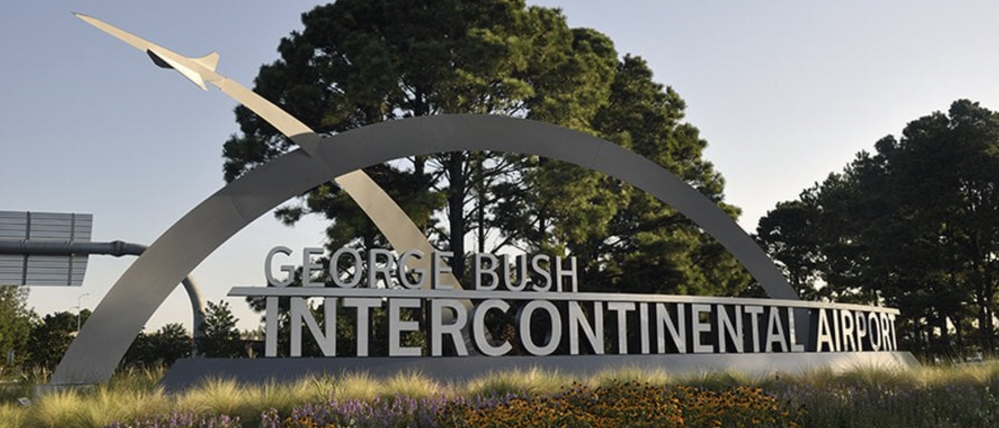

??? warning "Disclaimer"
    This document is provided for Houston ARTCC controllers to use when providing virtual ATC services on the VATSIM network. The information herein is **not intended for use in any real-world aviation applications**.

    This order prescribes the standards of general operations at all controlled airports within the ZHU ARTCC that are not subject to their own facility-specific SOPs. Operational guidance on airspace division, transfer of control, internal agreements, flight strip usage, and more

    It is emphasized that the information continued herein is designed specifically for use only within the virtual controlling environment. It does not apply to, nor should it be referenced for, live operations in the United States National Airspace System (NAS). The procedures continued within this document show how the positions are to be operated and, in conjunction with [FAA Order 7110.65](https://www.faa.gov/air_traffic/publications/atpubs/atc_html/), will be the basis for performance evaluations, training, and certification.

??? info "Revision Information"
    - Document Number: IAH O 7110.65A
    - Date: 31 Mat 2024
    - Revision: **A**

    **Record of Revisions**

    | Date | Revision | Editor |
    |:---:|:---:|:---:|
    | 31 Mar 2024 | A | OS |

## 1. General
### 1-1. Introduction
#### 1-1-1. Purpose
This order transmits policy and specifies standard operating procedures for Houston ARTCC (ZHU) control positions. It is supplemental to [FAA Order 7110.65, Air Traffic Control](https://www.faa.gov/air_traffic/publications/atpubs/atc_html/); FAA JO 7610.4, Sensitive Procedures and Requirements for Special Operations; and [FAA JO 7210.3, Facility Administration and Operation](https://www.faa.gov/air_traffic/publications/atpubs/foa_html/). This document is considered a supplement to any VATSIM, Executive Committee, VATSIM Americas Region (VATNA), and United States of America Division (VATUSA) policies, procedures, and controlled documentation.

#### 1-1-2. Audience
All ZHU controllers and visitors. All personnel must be familiar with the provisions of this order and exercise their best judgment when encountering situations this order does not cover.

#### 1-1-3. Where Can I Find This Order
This order is available in digital PDF format on the ZHU ARTCC website at https://www.houston.center/ and can be accessed publicly within the FILES menu and documents section under SOPS.

#### 1-1-4. Cancellation
vZHU-P013 rev 2.1, Bush ATCT SOP, dated 8 FEB 2023, and all changes thereto are canceled.

#### 1-1-5. Explanation Of Changes
This is the initial release of IAH 7110.65A. No changes have been made.

#### 1-1-6. Responsibility
1. The Houston ARTCC Air Traffic Manager is responsible for maintaining and updating the information contained in this order.
1. The Houston ARTCC Air Traffic Manager is responsible for notifying the VATUSA Southern Region Air Traffic Director of any necessary revisions to this order.

## 2. Procedures
### 2-1. General
#### 2-1-1. Runway Utilization
The following preferential runway configuration must be used at IAH to the extent possible:

1. West Flow/Departing South:
    1. Arrivals on Runways 26L/26R/27.
    1. Departures on Runways 15L/15R/26L/26R.
1. West Flow/Departing North:
    1. Arrivals on Runways 26L/26R/27.
    1. Departures on Runways 33R/33L.
        
    ??? note
        When ceilings reduce to 2,500 feet or visibility prevents visual observation of Runways 27/26L/26R arrival traffic at the FAF, a straight west flow configuration must be utilized.

1. East Flow:
    1. Arrivals on Runways 8L/8R/9.
    1. Departures on Runways 15L/15R/9.
1. Straight West Flow:
    1. Arrivals on Runways 26L/26R.
    1. Departures on Runway 27.
1. 15 Flow
    1. Arrivals on Runway 15R
    1. Departures on Runway 15L
    1. NOTE: Reserved for when crosswinds exceed aircraft limitations or convective weather dictates
1. 33 Flow
    1. Arrivals on Runway 33R
    1. Departures on Runway 33L
    1. NOTE: Reserved for when crosswinds exceed aircraft limitations or convective weather dictates
1. Midnight Flow
    1. West Arrivals on Runway 8R. East Arrivals on Runway 27
    1. Departures on Runway 8R and 27.
    1. NOTE: Reserved for use between the hours of 0000 - 0500 CST

#### 2-1-2. Opening/Closing A Position.
Position opening and closing shall be done in accordance with [General Control SOP 1-2](../sop/general-control-sop.md#1-2-1-opening-a-position). The following restrictions apply to opening positions at IAH:

1. Ground must be staffed before Clearance is opened.
1. Ground and Clearance must be staffed before Ramp is opened.
1. Ground, Clearance, and Ramp must be staffed before Ground Metering is opened.

#### 2-1-3. Surface Memory Aid Procedures
Controllers shall utilize the flight strip memory aids in accordance with [General Control SOP Chapter 3-1-6](../sop/general-control-sop.md#3-1-6-separators). In addition, local controllers shall change an aircraft’s data block from white to teal on the STARS TDW when an arrival has accepted a LAHSO clearance.

#### 2-1-4. ASDE-X Temp Data
Controllers shall not add, delete, and/or modify ASDE-X temporary data to include closed taxiways and runways, restricted areas, or text areas unless the modification is consistent with current real-world NOTAMs.

#### 2-1-5. Authorized Approach Pairings
The following RNAV RNP approaches are authorized for simultaneous use:

1. Simultaneous Independent Approaches to Widely-Spaced Parallel Runways without Final Monitors:
    1. RNAV (RNP) Y RWY 26R with all RWY 27 instrument approaches.
    1. RNAV (RNP) Y RWY 9 with all RWY 8L instrument approaches.
1. Simultaneous Independent Approaches- Dual & Triple:
    1. RNAV (RNP) Y RWY 26R with all RWY 26L and/or RWY 27 instrument approaches.
    1. RNAV (RNP) Y RWY 9 with all RWY 8R and/or RWY 8L instrument approaches.

#### 2-1-6. Parking Location Scratchpads
Preferred parking locations for arrival aircraft can be marked by any controller on the ASDE-X primary scratchpad with the abbreviations listed in paragraph [2-5-1](#2-5-1-general-duties).

#### 2-1-7. Departure Runway Change Procedures
1. The advertised departure runway direction may be changed at the local controller’s discretion.
1. When the decision is made to change the standard departure runway(s), the local controller(s) shall verbally inform all positions inside the tower cab, the event CIC/TMU, and all I90 satellite/departure positions.
1. Flight Data / Clearance Delivery shall begin issuing clearances with the new standard departure runway(s), and update the ATIS.
1. Ramp shall deliver all aircraft under their control to the new standard runway’s outbound spots, if applicable.
1. Ground shall inform all aircraft under their control of the new runway to expect, and change their taxi routes to the new departure runway(s).
1. Local shall continue to depart aircraft in the old configuration, unless deemed impractical due to wind.

#### 2-1-8. Arrival Runway Change Procedures
1. Arrival flow changes shall be initiated by the local controller(s) or an event CIC.
1. When the decision is made to change the arrival flow, the local controller(s) shall:
    1. Verbally inform the event CIC of the change. If present, the event CIC can complete the below tasks in place of the local controller(s).
    1. Verbally inform all positions inside the tower cab. Clearance delivery is responsible for updating the ATIS.
    1. Verbally inform all I90 controllers of the change.
    1. After deliberation, I90 must identify to IAH the last aircraft to land on each runway in the old configuration and the first aircraft to land under the new runway configuration.
    1. Immediately after the above aircraft are identified, IAH will use the East/West flow departure corridors as depicted in [Appendix 1](#a-1-iah-airspace-maps). These corridors will be used until the last aircraft in the old configuration has landed.
    1. Local control shall continue to turn northbound departures in the original direction until conflicting aircraft start approaching from the new direction. Northbound departures shall then be held until it is safe to turn them in the new direction.

### 2-2. Flight Data / Clearance Delivery
#### 2-2-1. General Duties
1. Mark flight strips in accordance with [General Control SOP Chapter 3-2](../sop/general-control-sop.md#3-2-strip-marking).
1. Send PDCs through TDLS for all IFR aircraft, with or without amendments.
1. Aircraft shall be assigned the appropriate departure runway based on [Appendix 3](#a-3-standard-departure-runways).
1. Aircraft that will initially maintain 3,000 feet shall be given the appropriate I90 satellite position’s frequency for departure.
1. Inform or issue aircraft a TDLS message that gate hold procedures are in effect when used.
1. Instruct all aircraft parked at a terminal ramp to contact the appropriate controller for push back. All other aircraft not parked at a terminal ramp shall be instructed to contact the appropriate controller for taxi.
1. Push all flight strips to ground metering when staffed. When ground metering is not staffed, push strips to the appropriate ground controller based on aircraft location.
1. Operate the ATIS and include the following information:
    1. Advertise `“Simultaneous Approaches in Use”`
    1. Advertise `“RNAV or GLS approaches are available upon request”`
    1. Advertise Flow dependent RNAV-Y approach.
    1. `“Gate Hold Procedures are in effect”` when utilized by the TMU/CIC

#### 2-2-2. IFR Aircraft
1. Routing:
    1. Route aircraft in order of preference listed:
        1. The alias route reference system preferred route.
        2. An appropriate SID.
        3. Clear the aircraft as filed.
1. Initial Altitude:
    1. All aircraft on a SID shall be instructed to `“Climb via SID, except maintain”` the appropriate altitudes below. Aircraft not on a SID shall be instructed to “Climb and maintain” the appropriate altitudes below:
        1. Jets:
            1. Assign 4,000
            1. Assign 3,000 when landing at I90 core airports
        1. Props:
            1. Assign 3,000
1. Cruise Altitude:
    1. IFR aircraft landing within the College Station, Beaumont, and Lake Charles terminal areas shall have their cruise altitude amended to an altitude not higher than 9,000 feet, correct for direction of flight.

#### 2-2-3. VFR Aircraft
1. Create vNAS flight plans for VFR aircraft that include the following:
    1. Aircraft type
    1. Destination/route of flight/intentions
    1. Requested altitude
1. Issue a Class B clearance, departure frequency, and beacon code to all aircraft.
1. Altitude Assignments:
    1. VFR aircraft requesting above 2,000 feet shall be instructed to maintain following altitudes:
        1. Jets:
            1. Maintain VFR at 4,000.
            1. Maintain VFR at 3,000 when landing at I90 core airports.
        2. Props:
            1. Maintain VFR at 3,000.
    1. VFR aircraft requesting at or below 2,000 feet shall be instructed to `“Maintain VFR at or below 1,900”` and not be given a departure frequency.

### 2-3. Ramp Procedures
#### 2-3-1. Ramp Control General
The primary goal of ramp control is to maintain the orderly flow of aircraft entering and exiting within its designated area, while ensuring that ground control's areas remain operational. Since ramp control is not frequently staffed, it may be unfamiliar to many VATSIM pilots. To assist them, the Houston ARTCC website offers a pilot briefing section walking them through how ramp control operates.

However, differences in VATSIM pilots' scenery, such as markings, gate positions, and the availability of ramp-specific charts, as well as limitations in directing pushbacks precisely, can impact the efficiency of ramp operations compared to real life. Ramp control must be practical when issuing pushback instructions and intervene if pilots fail to comply.

Additionally, ramp control cannot see which gates are occupied by other aircraft, and many simulator pilots are content to occupy any available gate. It is assumed that the pilot will wish to park at terminals and/or gates that their airline or virtual airline affiliation indicate unless indicated otherwise by the pilot. While pilots may be asked their preferred terminal or gate, the main focus of ground and ramp control is to direct them to their designated terminal. Although ramp control may try to accommodate specific gate requests, it is not mandatory. If a pilot insists on waiting for their assigned gate, they should be reminded that the current occupant may remain there indefinitely, as gate utilization on VATSIM is typically first-come, first-served basis.

#### 2-3-2. Ramp Control Tools
Ramp control shall rely primarily on tower cab view and the IAH ASDE-X feed to direct ramp traffic. United, Delta and all regional carrier aircraft parking at the terminal ramp will be given an ASDE-X primary scratchpad entry indicating the requested gate. Approved scratchpad abbreviations can be found in paragraph [2-5-1](#2-5-1-general-duties).

#### 2-3-3. Ramp Splits
1. The primary combined ramp position will be North Ramp control.
1. In a two ramp controller position split, North and West Ramp control will be utilized.
    1. North Ramp control is responsible for all North terminal ramp areas of control
    1. West Ramp control is responsible for all South terminal ramp areas of control.
1. In a three ramp controller position split, North, East, and West Ramp control will be utilized.
    1. North Ramp control is responsible for all North terminal ramp areas of control
    1. East Ramp control is responsible for all South terminal ramp areas of control East of the taxiway RA/RB bridges.
    1. West Ramp control is responsible for all South terminal ramp areas of control West of the taxiway RA/RB bridges.
    1. For aircraft transitioning between east and west ramps, the ramp controller shall issue a taxi clearance and instruct the aircraft to contact the other ramp controller’s frequency when reaching the RA/RB bridge.
    
        ??? example "Phraseology"
            `“United 1, taxi via R2 RA, contact West ramp at the RA bridge 123.45”`

#### 2-3-4. Ramp Tower Area Of Control.
All terminal ramps, taxiway NC between NG and ND, taxilanes RA, RB, RC, R2, and taxiway SC north of spot 22.

#### 2-3-5. Transfer Control Points (TCP) “Spots”
See [Appendix 6](#a-6-ramp-entryexit-spots) for a visual diagram.

1. Normal inbound TCP spots: 3, 6, 10, 16, 18, 20, 21, and 22.
1. Normal outbound TCP spots: 1, 2, 5, 7, 8, 9, 12, 14 and 17.
1. Flow specific outbound TCP spots:
    1. Spot 12 - when departing runway 9, or runway 27, 26L, 26R.
    1. Spot 20 and 21 - when departing runway 26L or 26R
    1. Spot 22 - when departing runway 27 or 9.
    1. Standard Group VI (A388/B748) inbound/outbound - spot 18A and 19
    1. Spots not specifically dedicated as inbound or outbound are normally used as both inbound and outbound TCPs.

#### 2-3-6. Procedures
1. Ramp control shall utilize standardized RA/RB bridge taxi flows unless optionally necessary and coordinated between East and West ramp control when staffed.
    1. RA for westbound taxiing aircraft
    1. RB for eastbound taxiing aircraft
1. No pushback clearances shall be given to aircraft when gate hold procedures are effective until terminated by TMU.
1. Ramp control and IAH ground must resolve all conflicts with their own traffic before releasing an aircraft to the other facility’s control.
1. Ramp control will advise aircraft at gates A29 and A30 to contact ground metering for pushback when all conflicts are resolved. IAH ground may use the ramp area south of these gates for pushback.
1. IAH ground traffic must have priority over ramp control traffic.
1. Ramp control and IAH ground must transfer communications prior to the aircraft reaching the TCP.
1. Arrivals:
    1. IAH ground must deliver arrivals to the appropriate TCP.
    1. Ramp control must not stop or otherwise delay an arrival without prior coordination with IAH ground.
    1. Ramp control must not change aircraft taxi routing as assigned by IAH ground without prior coordination.
1. Departures:
    1. Ramp control must deliver departures to ground control at the appropriate TCP.
    1. Ramp control must instruct departure traffic to contact the ground metering frequency when reaching their assigned exit TCP. When ground metering is not staffed, instruct the aircraft to contact the appropriate ground controller.
    1. To the extent practical, Ramp control must stage departures in the preferred departure sequence with regard to the aircraft’s route.

2-3-7. Phraseology Examples
??? example "Phraseology Examples"
    **Departures:**
    
    1. Pushbacks:
        1. “Push approved, advise when ready to taxi.”
        1. “Push onto RB approved, tail east, advise when ready to taxi.”
        1. “Push deep abeam gate E18, advise when ready to taxi.”
    1. Taxi-out:
        1. “Taxi via RB to spot 2, when number 1 at spot 2 contact ground metering
        119.95.”
        1. “Behind the United 737, taxi to spot 17. Contact ground point 7.”

     **Arrivals:**
    
    1. “Taxi to parking”
    1. “Taxi via RB to gate E18.”
    1. “Give way to an American Airbus, taxi via RC to the gate.”

### 2-4. Ground Metering
#### 2-4-1. General Duties
1. Aircraft should contact ground metering with their assigned spot number and current ATIS information.
    1. Mark the current ATIS on the flight strip when received from the aircraft.
    1. Mark the outbound spot number in box 8 on the flight strip. When the aircraft is not at the terminal ramp, mark the following in place of the spot number:
        1. When a pushback request from gate A29 or A30 is received, mark "A29" or "A30" and advise the pilot to monitor the appropriate Ground Control position.
        1. For all other aircraft, use the abbreviations in [2-5-1](#2-5-1-general-duties).
    1. Ensure there are no updated clearance amendments that need to be given or new TMIs that apply to the aircraft. Advise the aircraft if any of these changes occur with applicable information. Clearance delivery may elect to defer individual routing amendment clearances to ground metering when coordinated.
1. After all the above has been completed, inform the pilot to monitor the appropriate Ground Control frequency for taxi instructions and forward the flight progress strip to the appropriate Ground Control position.
1. Issue taxi instructions to Runway 9 from spot 22.
1. When pilots advise "ready to taxi" from a general aviation or cargo ramp area, inform the pilot to monitor the appropriate Ground Control frequency for taxi instructions and forward the flight progress strip to the appropriate Ground Control position.

### 2-5. Ground Control
#### 2-5-1. General Duties
1. Ground Metering and Ramp staffed:
    1. Upon receipt of the flight progress strip from ground metering, consider the aircraft monitoring the appropriate Ground Control frequency and ready to taxi.
1. Ground Metering offline, Ramp staffed:
    1. Flight strips will be received from clearance delivery and aircraft will contact ground at their assigned spot with the current ATIS information.
    1. Mark the ATIS information when received, then issue the taxi instructions.
1. Ground Metering and Ramp offline:
    1. Flight strips will be received from clearance delivery and aircraft will contact ground for push at the terminal ramp, or for taxi outside the terminal ramp.
    1. Ensure aircraft have the correct ATIS, mark the strip, then issue the taxi instructions.
1. Assist Local Control by pushing flight progress strips according to the aircraft’s intended takeoff position/sequence.
1. Prior to assigning/approving an intersection departure and/or prior to making runway assignments that are other than the advertised runways you must:
    1. Obtain CIC approval for the operation.
    1. Obtain approval from the appropriate Local control.
    1. Indicate on the flight progress strip the departure runway/intersection.
1. Instruct departure aircraft to monitor the tower when appropriate.
1. Hold aircraft/vehicles that will penetrate the Runway 15L/15R approach areas when aircraft on final approach to Runways 15L/15R are 2 NM or less from the runway.
1. Ground control may optionally utilize aircraft size and routing restrictions, as depicted in [Appendix 7](#a-7-aircraft-taxi-restrictions).
1. When multiple Ground Control positions are in use, utilize the taxiways and Ground Control procedures contained in [Appendix 4](#a-4-ground-splits).
1. Ask United, Delta, and all regional aircraft for their requested gate number. Assume all other aircraft are parking at the standard locations in [Appendix 5](#a-5-standard-parking-locations). Mark the ASDE-X scratchpad with the requested parking location, as appropriate.

    ??? example "Examples"
        | Parking | Code | Parking | Code |
        | ------- | :---: | ------- | :---: |
        | Normal Gate | C12 | Any Gate | ANY |
        | East Cargo | EC | Central Cargo | CC |
        | Atlantic | ATL | Signature | SIG |

### 2-6. Local Control
#### 2-6-1. General Duties
1. Be responsible for:
    1. Providing approved separation between all arrivals/departures, planned/unplanned missed approaches, and potential pullouts within IAH airspace.
    1. Movement of aircraft within the airspace depicted in [Appendix 1](#a-1-iah-airspace-maps).
    1. Operations conducted on active runways.
    1. Notifying ground when arriving on runway 15L/R.
    1. All runway crossings must be completed on the Local Control frequency responsible for the runway to be crossed.
    1. Crossing of Runways 15L/33R and 15R/33L with a single transmission is only authorized at taxiway WL and WW.
    1. Optionally utilize aircraft size and routing restrictions, as depicted in [Appendix 7](#a-7-aircraft-taxi-restrictions).
    1. Anytime a radar heading is issued with a specified direction, Local Control must ensure that the pilot reads back the direction of turn (Left/Right).
1. When responsible for handling departures/arrivals to parallel Runways 15/33 or 8/26, keep the aircraft on frequency until the aircraft is across the parallel runway.

#### 2-6-2. Prearranged Coordination
1. Positions permitted to use Pre-Arranged Coordination Procedures (P-ACP) must be responsible for maintaining separation from all aircraft within the prearranged area. P-ACP may be used as follows:
    1. IAH is authorized to utilize prearranged coordination and penetrate the western boundary of the protected adjacent airspace of the west flow descent area with TRIOS/SanJac satellite departures.
    1. IAH is authorized to utilize prearranged coordination and penetrate the protected adjacent airspace of Departure East with departures transferred to Departure South.
    1. IAH is authorized to utilize prearranged coordination within SanJac (B), Tomball (R), and Lakeside (P) airspace for IAH departure aircraft climbing within the appropriate tower departure corridor as depicted in [Appendix 1](#a-1-iah-airspace-maps).

#### 2-6-3. Departure Procedures
1. Radar identify all departures, initiate a STARS track, and execute an automated radar handoff to the appropriate controller prior to the aircraft entering the departure corridor and prior to communications transfer. It is the TRACON’s responsibility to inform the aircraft that they are “Radar Contact.”
1. Suggested initial turns and headings are provided in [Appendix 9](#a-9-suggested-initial-departure-headings) of this document when initially assigning a heading to departing aircraft in a takeoff clearance. Winds aloft correction may need to be provided to suggested headings.
1. When utilizing course divergence, ensure the succeeding aircraft has tagged, prior to transferring communications of the first aircraft to I90.
1. Advise the appropriate departure controller when applying pilot to pilot visual separation, prior to communications transfer.
1. Unless otherwise coordinated, RNAV off the ground SID's must be on the assigned route and ensure that all northbound departures are established on a heading to exit IAH airspace via the appropriate departure corridor as depicted in [Appendix 1](#a-1-iah-airspace-maps).
1. Ensure that a north bound departure from RWY 26L and/or RWY 27 does not initiate a turn prior to the departure end of RWY 26R.
1. Successive departures must be issued a takeoff clearance to stay in trail, cross behind or remain inside of preceding departures until all conflicts are resolved and appropriate IFR separation is established. Controllers must issue departure clearances that prevent the cutoff of the preceding departure.
    1. Aircraft characteristics must be taken into account in every situation.
    
        ??? example
            E145/E175 will turn sooner off the runway than a B739 or other large aircraft.

1. When David Wayne Hooks Airport (DWH) is landing Runways 35L/R ensure all traffic exiting the west departure corridor is at or above 3,000 feet MSL prior to 1.5 NM from the IAH airspace boundary
1. Provide 5 NM departure spacing between like-type aircraft routed via the same departure route (Traffic Management Initiative).

#### 2-6-4. Departure Releases
1. Except as provided in paragraph (b) and (c), all aircraft are automatically released, so long as they exit IAH airspace via the appropriate departure corridor as depicted in [Appendix 1](#a-1-iah-airspace-maps).
1. When an aircraft is departing a non-standard runway, request a release from the affected local controller.

    ??? example
        An aircraft is departing runway 26R on a west/departing south flow. The runway 26R local controller shall request a release from the 15L/R controller for the departure.

1. Coordinate a release and departure heading with I90 for aircraft landing KHOU.

#### 2-6-5. Arrival Procedures
1. Reduced longitudinal separation (2.5 NM) between arrivals may be applied for all east/west runways at IAH for aircraft established on the final approach course within 10 NM of the landing runway.
1. The local controller shall utilize the STARS quick-look function to receive an aircraft’s arrival information. The arrival shall be considered coordinated so long as the scratchpad entry is correct and up-to-date.
1. IAH must coordinate prior to making changes to any aircraft that would affect the I90 arrival sequence.

#### 2-6-6. Missed Approaches
When a missed approach and/or go around occurs, the applicable Local control must:

1. Make a verbal announcement audible to all personnel in the Tower cab.

    ??? example
        `“Go around, (runway), (location of aircraft), (call sign, if able).”`

1. For aircraft inside the final approach fix, but not over the runway:

    ??? example
        `“(call sign), go around, (track the localizer or track the final approach course), maintain 2,000.”`

1. For aircraft over the runway:

    ??? example
        `“(call sign), go around, (fly runway heading or assign a compass heading for wind correction), maintain 1,700.”`

1. Issue safety/traffic alerts in a timely manner to all affected aircraft.
1. After completion of coordination with the appropriate Local Controller, issue additional control instructions to ensure missed approach/go around aircraft will exit the IAH airspace via an appropriate departure gate, at or climbing to 3,000.
1. Handoff the missed approach/go around aircraft to the appropriate Satellite controller.
    1. If the aircraft is still being tracked by Final, coordinate so that the appropriate satellite controller has track control of the aircraft.
1. When necessary, coordinate via the landline any pertinent information related to the missed approach/go around aircraft with the TRACON.

#### 2-6-7. Arrival/Departure Separation
1. Unless visual separation can be applied, ensure that departure aircraft have begun takeoff roll at or prior to the following:
    1. May continue to depart 15L/15R with all commercial jet and cargo jet aircraft when visual separation cannot be maintained with runway 27 arrivals provided that applicable radar separation to arrival aircraft landing runway 27 is maintained.
    1. Ensure that corporate/general aviation jets, props, and turbo-prop departure aircraft have begun takeoff roll on 15L/15R at or prior to an arrival reaching 2NM from the runway 27 threshold.
    1. Departing Runway 15L/15R – Runway 9 arrival is 5 NM from Runway 9. Once the Runway 9 arrival has passed Runway 15L/15R (ASDE-X, ASR-9, or visually observed), Runway 15L/15R departures may be released reference other Runway 9 arrivals. All provisions of FAA JO 7110.65, applicable paragraphs, Non-Intersecting Converging Runway Operations/Intersecting Runway Separation must apply.

        ??? note
            In real life, red runway status hold lights will appear on runways 15L/R when a runway 9 arrival passes a 2.8nm final. When these lights are activated, pilots are expected to abort their takeoff. Due to simulator limitations, these runway status lights do not exist, but controllers should strive to have aircraft rolling on 15L/R before the next runway 9 arrival hits a 3.3nm final in visual conditions. A memory aid has been placed at this point on the STARS TDW scope.

1. Dependent Operations – Regardless of weather conditions, Local Control must use the following restrictions when departing the runway pairings below.:
    1. Departing 33R and landing 27:
        1. The Arrival Departure Window (ADW) map(s) must be depicted on the local control STARS map.
        1. Departure aircraft must be rolling prior to the landing aircraft entering the ADW.
        1. Departure aircraft may takeoff after an arrival aircraft has landed and/or exited the ADW.
    1. Departing 33L/R and landing 26L:
        1. The Arrival Departure Window (ADW) map(s) must be depicted on the local control STARS map.
        1. Departure aircraft must be rolling prior to landing aircraft entering the ADW.
        1. Departure aircraft may takeoff after an arrival aircraft has landed and/or exited the ADW.
        1. All north-bound departure aircraft must be assigned runway heading. Once the departing aircraft flies through the extended centerline of Runway 26L, the aircraft will be assigned a heading to exit IAH airspace via the north departure gate.

            ??? note
                The West most (larger) ADW box is for 33L. The full (both combined) ADW box is for 33R.

1. Northwest Flow Clarification:
    1. When ceilings are greater than 2,500 feet and visibility allows for visual observation of Runways 27/26L/26R arrival traffic at the FAF, the following runway pairings may be used independently:
        1. Departing 33L/R and landing 26R
        1. Departing 33L and landing 27
    1. When ceilings reduce to 2,500 feet or visibility prevents visual observation of Runways 27/26L/26R arrival traffic at the FAF, a straight west flow configuration must be utilized.

    ??? info "Arrival Departure Window (ADW) Boxes"
        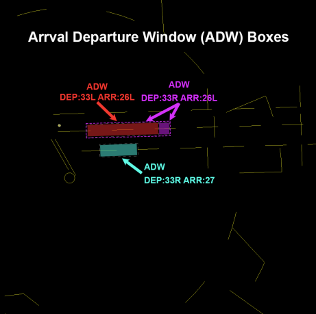

#### 2-6-8. I90 Airspace Delegated To IAH
IAH is authorized use of I90 Airspace depicted in Area A, [Appendix 2](#a-2-i90-airspace-delegated-to-iah-and-hou-atct). If I90 desires to use this airspace, coordination with IAH must be required. If I90 has traffic below 1,500 feet MSL within the lateral confines of airspace depicted in Area A, [Appendix 2](#a-2-i90-airspace-delegated-to-iah-and-hou-atct) they must force the target onto Local West (4T) display.

#### 2-6-9. Automated Point Out Procedures
1. When using an automated point out, the initiating controller must ensure that scratchpad information is correct.
1. The receiving controller must, either via automation or verbal means:
    1. Approve the point out
    1. Unable to point out
    1. Accept control of the aircraft

#### 2-6-10. Opposite Direction Operations (ODO)

**Definition:** IFR/VFR Operations conducted to the same or parallel runway where an aircraft is operating in a reciprocal direction of another aircraft arriving, departing, or conducting an approach.

1. Same Runway Procedures:
    1. IAH Local Control and I90 Controlling Sectors are responsible for initiating coordination required to accomplish an opposite direction arrival or departure.
    1. IAH Local Control is responsible for applying the cutoff point between arriving and departing aircraft.
    1. The I90 Controlling Sector is responsible to apply the cutoff point between successive ODO arrivals.
    1. All coordination concerning the ODO must be done via a recorded line and state “Opposite Direction.” Initial coordination must include call sign, type, and arrival or departure runway.
    1. Do not allow opposite direction same runway operations with opposing traffic inside the cutoff point unless an emergency exists.
    1. Traffic advisories must be issued to both aircraft

        ??? example
            - `"OPPOSITE DIRECTION TRAFFIC (distance) MILE FINAL, (type aircraft)."`
            - `"OPPOSITE DIRECTION TRAFFIC DEPARTING RUNWAY (number), (type aircraft)."`
            - `"OPPOSITE DIRECTION TRAFFIC (position), (type aircraft)."`

    1. Once an ODO has been approved, any further operations from that runway must be verbally coordinated until the ODO is completed.
    1. The cutoff points (CP) are defined as 10 flying miles from the runway threshold.
    1. Arrival/Arrival: I90 must ensure the first arrival has crossed the runway threshold prior to the second aircraft reaching the cutoff point.
    1. Arrival/Departure: IAH Tower must ensure a departing aircraft is airborne and issued a turn to avoid conflict prior to opposing traffic reaching the cutoff point. I90 must ensure the arrival aircraft does not cross the CP prior to the departing aircraft becoming airborne.
    1. Visual separation is not authorized for Same Runway ODO.
    1. If the conditions in Paragraphs j and k are not met, action must be taken to ensure control instructions are issued to protect the integrity of the cut off points.

1. Parallel Runway Procedures:
    1. Arrivals to parallel runways:
        1. Simultaneous ODO Arrivals may be conducted to Parallel Runways, provided an aircraft executing a go-around or missed approach is issued a turn away from any opposing traffic when inside of the CP to the runway.
            
            ??? note
                Landing Runways 8R/27, 8L/26L, or 8L/27 are not considered an ODO operation unless an aircraft executes a missed approach or go-around.

        1. Traffic advisories are not mandatory unless a missed approach or go-around occurs.
    
    1. Departure and Arrival to Parallel Runways:
        1. Opposite Direction Departures from parallel runways may be conducted, provided the departure is issued a turn away from any opposing traffic when inside of the CP.
    1. Visual separation may be applied after the turn away from the conflicting traffic is issued.
    1. North West Flow: When operating in a North West flow (arriving Runways 26L/26R, departing Runways 33L/33R), depart Runway 9 only when:
        1. Ceiling is at or above 3,000 feet.
        1. Runway 26L arrival traffic is in sight by JEPNI.
        1. Runway 9 departures must be issued a turn away from opposing traffic inside the cutoff point to Runways 26L and observed in a turn away from finals prior to communications transfer.
        1. Traffic must be issued to arrivals and departures of the ODO.
                
            ??? example
                `"Opposite direction traffic landing runway (number), (type aircraft)."`
                
                `"Opposite direction traffic departing runway (number), (type aircraft)."`

## 3. Appendices
### A-1: IAH Airspace Maps
??? info "IAH West Flow"
    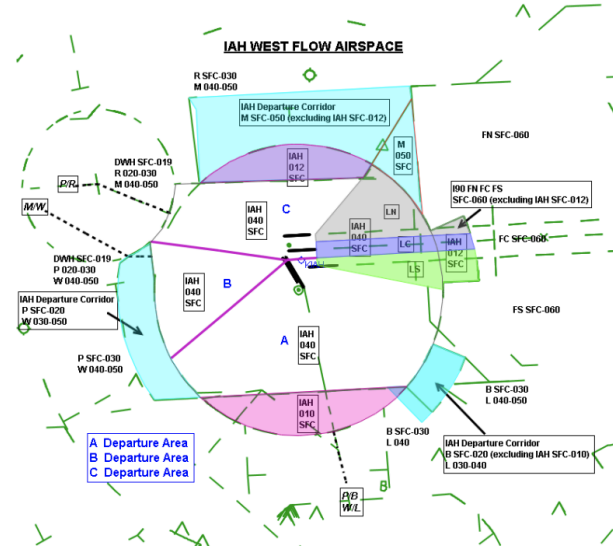
??? info "IAH West Flow Departing 33 and 9"
    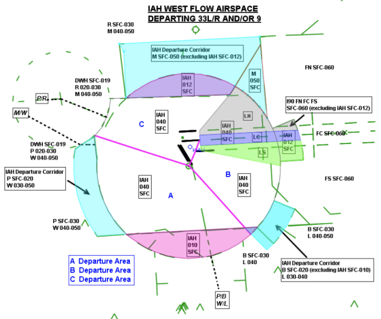
??? info "East Flow Maps"
    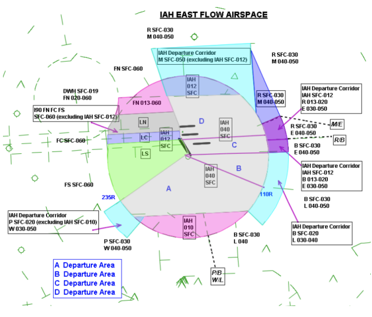
??? info "IAH East/West Flow"
    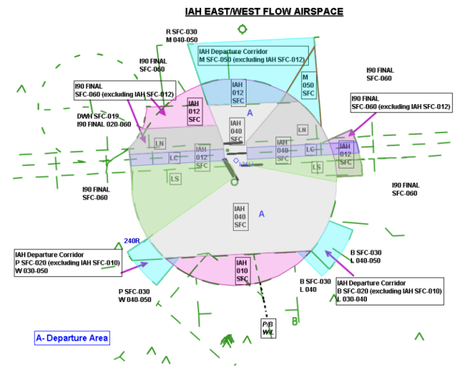
??? info "IAH 15 Flow"
    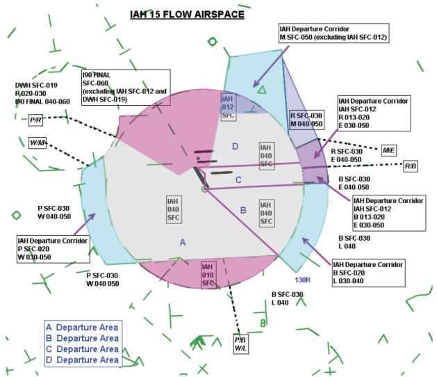
??? info "IAH 33 Flow"
    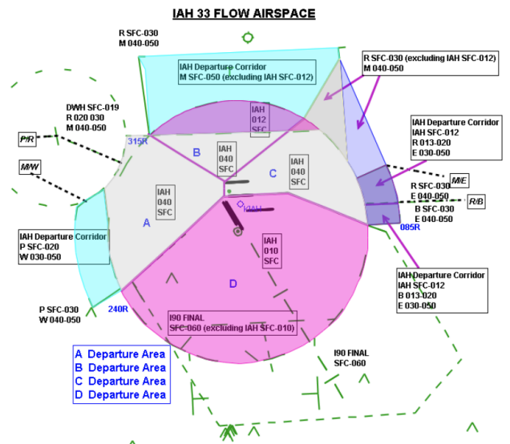

### A-2: I90 Airspace Delegated to IAH and HOU ATCT
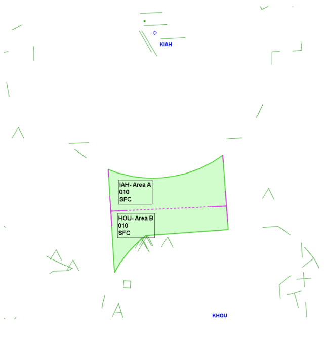

### A-3: Standard Departure Runways
??? info "West Flow"
    | 15R | 15L |
    | :---: | :---: |
    | CLEEP GOMER PRARI | FREEP AGGIT BOLOS TRIOS |

??? info "East Flow"
    | 15R | 15L |
    | :---: | :---: |
    | PRARI | CLEEP GOMER FREEP AGGIT BOLOS TRIOS |

??? info "East Flow & RWY 9"
    | 15R | 15L | 9 |
    | :---: | :---: | :---: |
    | PRARI | FREEP AGGIT BOLOS TRIOS | CLEEP GOMER |

??? info "Northwest Flow"
    | 33L | 33R |
    | :---: | :---: |
    | PRARI FREEP AGGIT BOLOS TRIOS | CLEEP GOMER |

??? info "Northwest Flow & RWY 9"
    | 33L | 33R | 9 |
    | :---: | :---: | :---: |
    | PRARI | CLEEP GOMER | FREEP AGGIT BOLOS TRIOS |

??? info "Straight East"
    | 8L | 9 |
    | :---: | :---: |
    | CLEEP GOMER | PRARI FREEP AGGIT BOLOS TRIOS |

??? info "Straight West"
    | 26R | 27 |
    | :---: | :---: |
    | CLEEP GOMER | PRARI FREEP AGGIT BOLOS TRIOS |

### A-4: Ground Splits
??? info "Standard Split"
    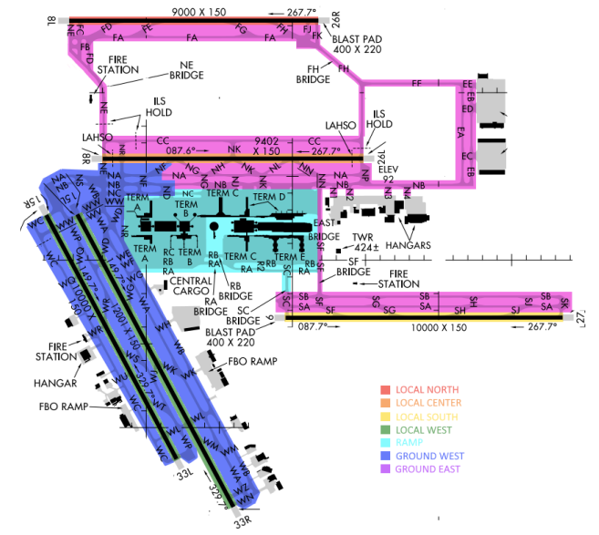

??? info "Straight East or West Split"
    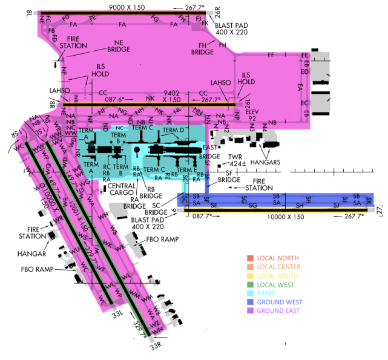

### A-5: Standard Parking Locations
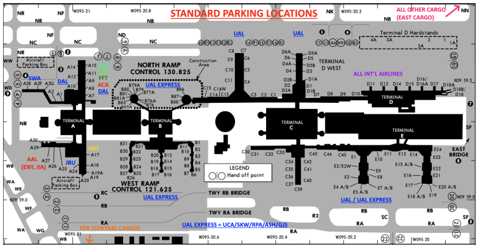

### A-6: Ramp Entry/Exit Spots
| TCP Spot Direction Key | |
| --- | --- |
| Green Spots | Inbound Aircraft |
| Red Spots | Outbound Aircraft |
| Blue Spots | Bi-directional |
| Purple Spots | AGD IV Aircraft |

??? info "Normal Flow (Departing 15/33)"
    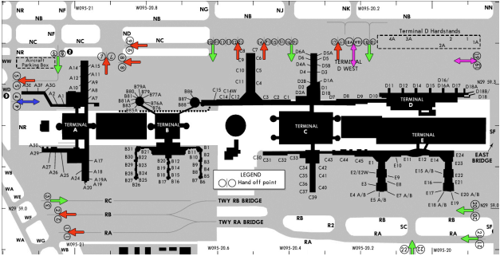

??? info "Departing 26L or 26R"
    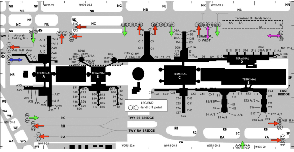

??? info "Departing 9 or 27"
    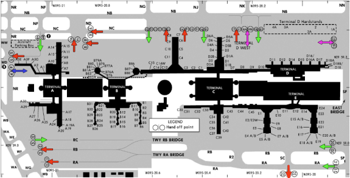

### A-7: Aircraft Taxi Restrictions
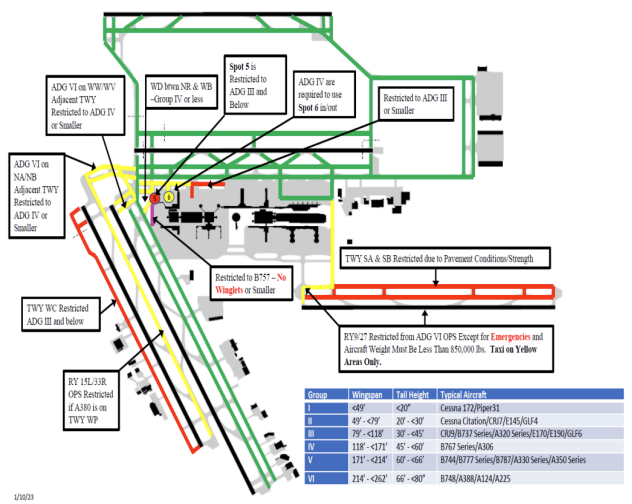

### A-8: ASDE-X/STARS Departure Gate Scratchpads
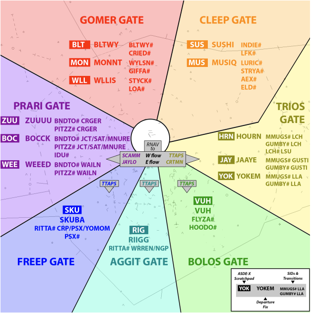

### A-9: Suggested Initial Departure Headings
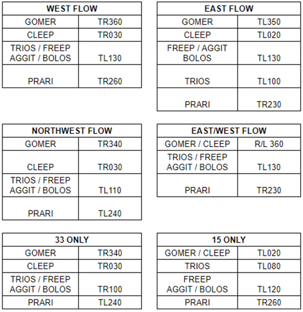