title: MSY Tower & TRACON SOP
# MSY Tower & TRACON SOP
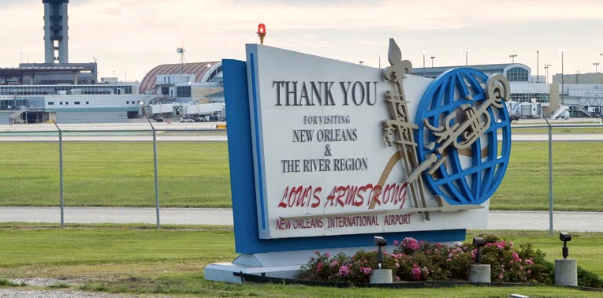

??? warning "Disclaimer"
    This document is provided for Houston ARTCC controllers to use when providing virtual ATC services on the VATSIM network. The information herein is **not intended for use in any real-world aviation applications**.

    This order prescribes the standards of general operations at all controlled airports within the ZHU ARTCC that are not subject to their own facility-specific SOPs. Operational guidance on airspace division, transfer of control, internal agreements, flight strip usage, and more

    It is emphasized that the information continued herein is designed specifically for use only within the virtual controlling environment. It does not apply to, nor should it be referenced for, live operations in the United States National Airspace System (NAS). The procedures continued within this document show how the positions are to be operated and, in conjunction with [FAA Order 7110.65](https://www.faa.gov/air_traffic/publications/atpubs/atc_html/), will be the basis for performance evaluations, training, and certification.

??? info "Revision Information"
    - Document Number: MSY O 7110.1A
    - Date: 31 Jul 2024
    - Revision: **A**

    **Record of Revisions**

    | Date | Revision | Editor |
    |:---:|:---:|:---:|
    | 31 Jul 2024 | A | OS |

## 1. General
### 1-1. Introduction
#### 1-1-1. Purpose
This order transmits policy and specifies standard operating procedures for Houston ARTCC (ZHU) control positions. It is supplemental to [FAA Order 7110.65, Air Traffic Control](https://www.faa.gov/air_traffic/publications/atpubs/atc_html/); FAA JO 7610.4, Sensitive Procedures and Requirements for Special Operations; and [FAA JO 7210.3, Facility Administration and Operation](https://www.faa.gov/air_traffic/publications/atpubs/foa_html/). This document is considered a supplement to any VATSIM, Executive Committee, VATSIM Americas Region (VATNA), and United States of America Division (VATUSA) policies, procedures, and controlled documentation.

#### 1-1-2. Audience
All ZHU controllers and visitors. All personnel must be familiar with the provisions of this order and exercise their best judgment when encountering situations this order does not cover.

#### 1-1-3. Where Can I Find This Order
This order is available in digital PDF format on the ZHU ARTCC website at https://houston.center and can be accessed publicly within the FILES menu and documents section under SOPS.

#### 1-1-4. Cancellation
vZHU-P031v6, New Orleans ATCT/TRACON Standard Operating Procedures, dated 22 AUG 2023, and all changes thereto are canceled.

#### 1-1-5. Explanation Of Changes
This is the initial release of MSY 7110.1A. No changes have been made.

#### 1-1-6. Responsibility
1. The Houston ARTCC Air Traffic Manager is responsible for maintaining and updating the information contained in this order.
1. The Houston ARTCC Air Traffic Manager is responsible for notifying the VATUSA Southern Region Air Traffic Director of any necessary revisions to this order.

## 2. ATCT Procedures
### 2-1. General
#### 2-1-1. Duty Familiarization
Controllers shall follow the procedures outlined in [General Control SOP 1-2-1](../sop/general-control-sop.md#1-2-1-opening-a-position).

#### 2-1-2. Position Relief
Controllers shall follow the procedures outlined in [General Control SOP 1-2-2](../sop/general-control-sop.md#1-2-2-relief-of-a-position).

#### 2-1-3. Runway Configurations
The following runway configurations shall be utilized, based on current wind conditions. The default/calm wind flow is SE, and should be utilized when the wind is less than 5 knots. A “Straight” configuration may be used when wind conditions favor the use of only one runway.

1. SE Flow: Land 11/20, Depart 20.
1. NE Flow: Land 11/2, Depart 2.
1. NW Flow: Land 2, Depart 29.
1. SW Flow: Land 20, Depart 29.

#### 2-1-4. Strip Marking
Flight strip marking shall be completed in accordance with the [General Control SOP 3-2](../sop/general-control-sop.md#3-2-strip-marking).

### 2-2. Flight Data / Clearance Delivery
#### 2-2-1. Duties
1. Send PDCs through TDLS for all IFR aircraft, with or without amendments.
1. FD/CD must inform GC and LC of all air traffic management initiatives and associated information.
1. FD/CD shall post and update the ATIS

#### 2-2-2. IFR Aircraft
1. Route IFR aircraft in order of preference listed:
    1. Alias preferred route.
    1. For aircraft entering ZHU airspace, one of the following first fixes:
        1. NW-Bound: AEX / MCB / SQS / NTCHZ
        1. NE-Bound: LBY / GARTS / CATLN / PCU
        1. E-Bound: CEW
        1. SE-Bound: BLVNS / REDFN
        1. S-Bound: LEV
        1. W-Bound: Valid I90 STAR Transition / PEKON / LFT
    1. For all other aircraft, clear `“As Filed.”`
1. Issue the following initial altitudes to IFR aircraft:
    1. Turbojets maintain 4,000.
    1. Non-Turbojets maintain 2,000.

#### 2-2-3. VFR Aircraft
1. The following information must be obtained and entered into vNAS for all VFR departures:
    1. Aircraft Type
    1. Destination/On Course Heading
    1. Requested Altitude
1. All VFR departures shall be given:
    1. Class Bravo Clearance
    1. The following altitudes:
        1. Turbojets maintain VFR at 4,000.
        1. Non-Turbojets maintain VFR at 2,000.
        1. An appropriate departure frequency
        1. A squawk code
1. VFR aircraft requesting pattern work shall only be given bravo clearance and squawk code.

### 2-3. Ground Control
#### 2-3-1. Duties
1. Ground Control must notify Local Control when an aircraft has been taxied to a runway other than the active runway(s).
1. Ground Control must notify Local Control of aircraft taxied to an intersection for takeoff. This may be accomplished non-verbally by marking the flight strip.
1. When possible, sequence traffic to local control by alternating SIDs/departure courses.
1. When “CFR” applies to the aircraft’s destination airport, coordinate with TMU for a deprture time when the aircraft calls for taxi.
1. Coordinate with LC to the extent necessary to ensure that arrival aircraft are able to exit the runway without conflicting with aircraft taxiing on adjacent taxiways. Whenever necessary, adjust the ground traffic flow to allow arrival aircraft to exit the runway unimpeded.
1. GC must coordinate any request that crosses or uses any portion of an active/inactive runway with LC on the recorded line. Prior to coordinating, GC should reference any of LC's traffic to determine if the operation is feasible.

### 2-4. Local Control
#### 2-4-1. Duties
1. All turbojets shall be instructed to `“Fly Runway Heading.”` All non-turbojets shall be assigned headings in accordance with [Appendix 2](#a-2-non-turbojet-headings).
1. Tower airspace SFC-1,500ft is depicted in Appendix 1. When departing runway 20 or 2, a departure climb corridor is in effect for the corresponding runway.
1. Local control shall have automatic releases on all departures, so long as the aircraft is departing on the ATIS advertised runway, and on a standard heading in accordance with appendix 2.
1. Local shall radar identify all departures, initiate a STARS track, and execute an automated radar handoff to the appropriate controller prior to communications transfer. It is the TRACON’s responsibility to inform the aircraft that they are `“Radar Contact.”`
1. Local Control must use the STARS Quick Look function in order to view arrival information for all aircraft.
1. Line up and wait procedures are authorized in accordance with [FAA Order 7110.65 3-9-4](https://www.faa.gov/air_traffic/publications/atpubs/atc_html/chap3_section_9.html).

#### 2-4-2. Missed Approach Instructions
Issue control instructions to establish approved separation (i.e. visual, vertical, passing or diverging, or vectors), with other known traffic, as soon as feasible. Coordinate with the corresponding radar controller and issue runway heading/2,000.

#### 2-4-3. Converging Runway Operations
During VFR weather conditions, LC must visually separate all aircraft making simultaneous approaches to multiple runways. Any time that LC cannot accomplish the duties of this paragraph, LC must notify the appropriate approach controller(s).

1. For simultaneous approaches to converging runways, apply procedures outlined in [7110.65 3-10-4](https://www.faa.gov/air_traffic/publications/atpubs/atc_html/chap3_section_10.html):
    1. The first arrival must have completed one of the following before the second arrival crosses the landing threshold:
        1. Cleared the runway
        1. Completed landing roll and will hold short of the projected intersection
        1. Passed the projected intersection
1. For a departure taking off after a converging arrival, apply procedures outlined in [7110.65 3-9-9](https://www.faa.gov/air_traffic/publications/atpubs/atc_html/chap3_section_9.html):
    1. The arrival must have completed one of the following before the departure begins its takeoff roll:
        1. Cleared the runway
        1. Completed landing roll and will hold short of the projected intersection
        1. Passed the projected intersection
1. For an arrival landing after a converging departure, apply the procedures outlined in [7110.65 3-10-4](https://www.faa.gov/air_traffic/publications/atpubs/atc_html/chap3_section_10.html):
    1. The departure must be passed the projected intersection path or is airborne and turning to avert any conflict before the arrival crosses the landing threshold.
1. Specific procedures for departing runway 29 and landing runway 2:
    1. A heavy jet/B757 must not be authorized to LUAW on Runway 29 when an arriving aircraft is anticipated to land behind the heavy jet on Runway 2.
    1. A turbojet may depart Runway 29 from the full length provided the departure will be 6,000 feet down the runway prior to the arriving aircraft crossing the landing threshold of Runway 2.

## 3. TRACON Procedures
### 3-1. General Operations
#### 3-1-1. Radar Position Duties
1. Must provide radar service to aircraft operating in their respective airspace as depicted in [Appendix 3](#a-3-tracon-airspace-maps).
1. Planned missed approach instructions shall be verbally coordinated with local control.
1. Arrival aircraft shall have their scratchpad marked in accordance with the [General Control SOP 2-2](../sop/general-control-sop.md#2-2-scratchpad-rules).
1. All radar positions must avoid the tower departure area ([Appendix 1](#a-1-tower-airspace)) unless approved by Local Control.

#### 3-1-2. Automated Point Out Procedures
To reduce verbal coordination, the STARS point out function may be used between all intra-facility positions within MSY ATCT/TRACON.

1. APO procedures are authorized when the following conditions are met:
    1. The initiating and receiving controllers must ensure the associated full data block information is correct, usable and easily understood.
    1. It shall be assumed that the aircraft is on course or is being vectored toward the information displayed in the scratchpad.
    1. Additional coordination may sometimes be required to complete the point out and grant approval. Any necessary traffic, restrictions, or additional coordination must be accomplished verbally.
    1. By approving the Automated point out, the receiving controller indicates the associated data block contains sufficient information to ensure aircraft separation is maintained, and authorizes the initiating controller to enter the receiving controller’s area of jurisdiction. If the information contained in the FDB is insufficient to approve the operation, verbal coordination must be accomplished prior to approving the automated point out.

#### 3-1-3. Transfer Of Control
Shall be accomplished in accordance with the [General Control SOP 1-4-1](../sop/general-control-sop.md#1-4-1-transfer-of-control).

#### 3-1-4. Practice Instrument Approaches For VFR Aircraft
To the maximum extent possible, New Orleans Approach Control will provide radar services and IFR separation from all IFR traffic and other VFR aircraft practicing instrument approach procedures at MSY, NEW, HUM, NBG, and HDC during published operational hours of their respective control towers.

#### 3-1-5. Simultaneous Approach Procedures
1. When more than one arrival runway is in use, the final controller working either Runway 11 or 29 shall be responsible for the approach sequence.
1. In IMC conditions or when local control cannot provide visual separation between arrivals, standard IFR separation must be maintained throughout the entire approach and potential missed approach.
1. In VMC conditions, converging aircraft must be sequenced/staggered in such a manner that allows for runway separation to exist in accordance with 7110.65 3-10-4. The following examples are meant to help explain runway separation standards, not be hard-and-fast rules:

    ??? example "Example 1"
        A runway 11 arrival cannot cross the landing threshold until a runway 20 arrival is clear of the runway, passed the projected intersection, or will hold short of the projected intersection. Since no LAHSO exists for the projected intersection, and most arrivals exit runway 20 at taxiway E, the earliest point at which separation will exist is likely after the arrival passes the projected 11/20 intersection. This point is around 1NM down runway 20, but the arrival will be slowing down on the runway simultaneously. Therefore if a runway 20 arrival is on a 7 mile final, the runway 11 arrival should be around a 9 mile final with similar speeds.

    ??? example "Example 2"
        A runway 2 arrival cannot cross the landing threshold until a runway 11 arrival is clear of the runway, passed the projected intersection, or has completed the landing roll and will hold short of the projected intersection. The earliest point at which separation will exist is likely after the runway 11 arrival completes its landing roll. Since most aircraft complete the landing roll around 1NM down the runway, a runway 2 arrival should be staggered around 1NM behind a runway 11 arrival.

## Appendices
### A-1 Tower Airspace
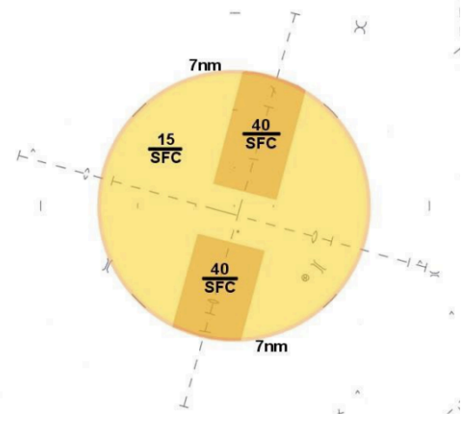

### A-2 Non-Turbojet Headings
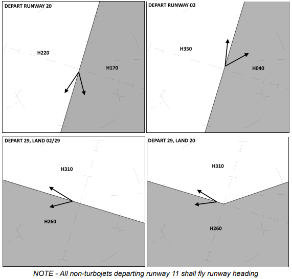

### A-3 TRACON Airspace Maps
??? info "SE and SW Flow"
    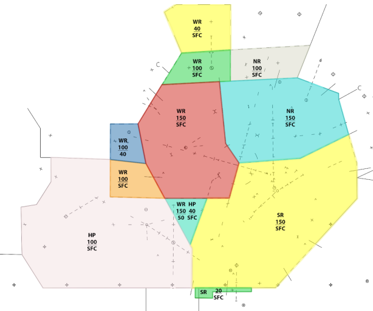
??? info "NE Flow"
    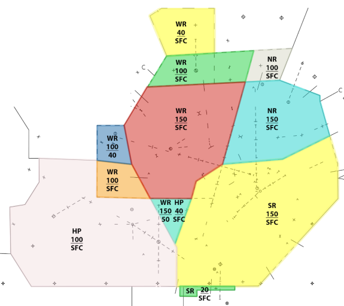
??? info "NW Flow"
    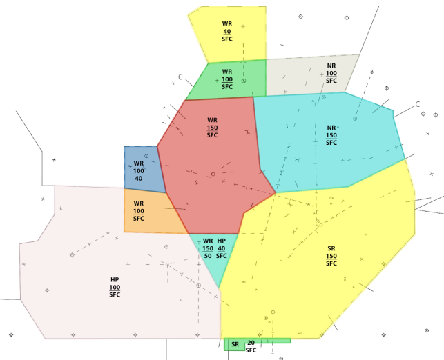
??? info "Final Radar MSY 11"
    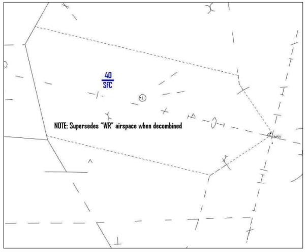
??? info "Final Radar MSY 20"
    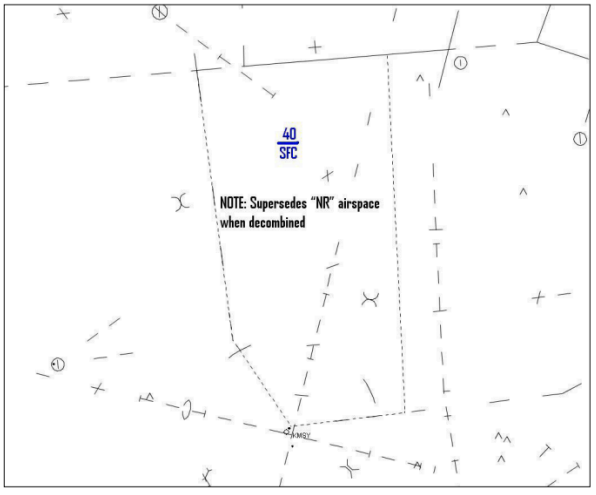
??? info "Final Radar MSY 2"
    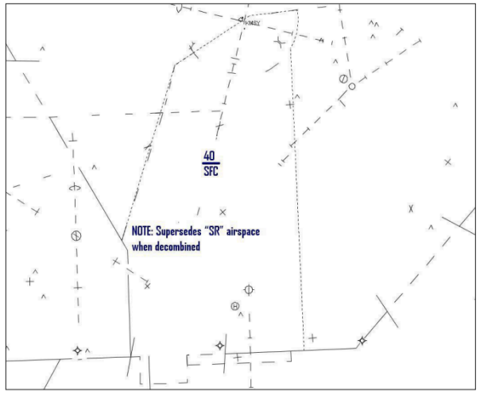
??? info "Final Radar NEW 18R"
    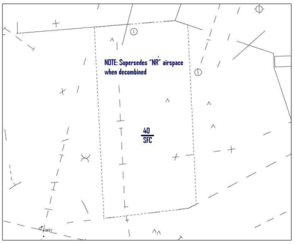
??? info "Final Radar NEW 36LR"
    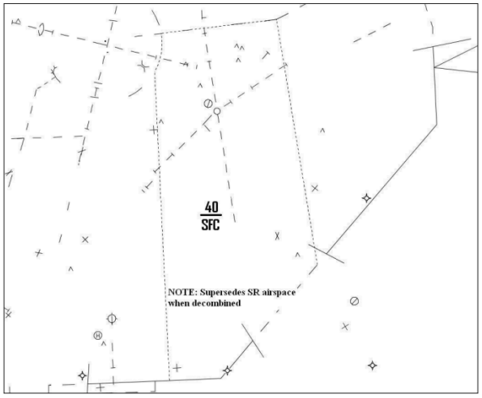

### A-4 ASSC Departure Gates
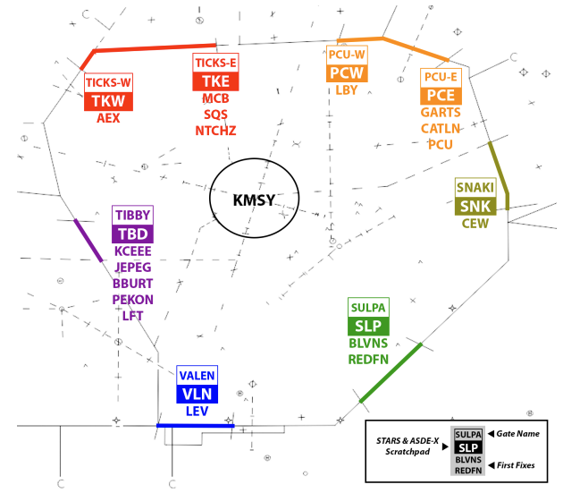