title: SAT Tower & TRACON SOP
# SAT Tower & TRACON SOP
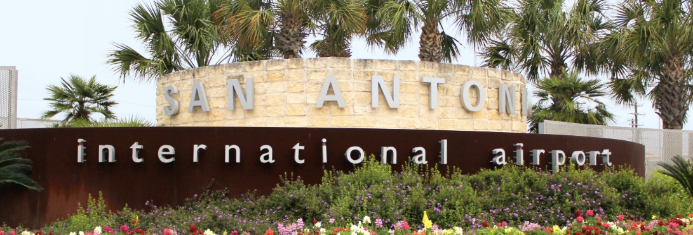

??? warning "Disclaimer"
    This document is provided for Houston ARTCC controllers to use when providing virtual ATC services on the VATSIM network. The information herein is **not intended for use in any real-world aviation applications**.

    This order prescribes the standards of general operations at all controlled airports within the ZHU ARTCC that are not subject to their own facility-specific SOPs. Operational guidance on airspace division, transfer of control, internal agreements, flight strip usage, and more

    It is emphasized that the information continued herein is designed specifically for use only within the virtual controlling environment. It does not apply to, nor should it be referenced for, live operations in the United States National Airspace System (NAS). The procedures continued within this document show how the positions are to be operated and, in conjunction with [FAA Order 7110.65](https://www.faa.gov/air_traffic/publications/atpubs/atc_html/), will be the basis for performance evaluations, training, and certification.

??? info "Revision Information"
    - Document Number: SAT O 7110.1B
    - Date: 11 Apr 2025
    - Revision: **B**

    **Record of Revisions**

    | Date | Revision | Editor |
    |:---:|:---:|:---:|
    | 1 Jun 2024 | A | OS |
    | 11 Apr 2024 | B | GA |

## 1. General
### 1-1. Introduction
#### 1-1-1. Purpose
This order transmits policy and specifies standard operating procedures for Houston ARTCC (ZHU) control positions. It is supplemental to [FAA Order 7110.65, Air Traffic Control](https://www.faa.gov/air_traffic/publications/atpubs/atc_html/); FAA JO 7610.4, Sensitive Procedures and Requirements for Special Operations; and [FAA JO 7210.3, Facility Administration and Operation](https://www.faa.gov/air_traffic/publications/atpubs/foa_html/). This document is considered a supplement to any VATSIM, Executive Committee, VATSIM Americas Region (VATNA), and United States of America Division (VATUSA) policies, procedures, and controlled documentation.

#### 1-1-2. Audience
All ZHU controllers and visitors. All personnel must be familiar with the provisions of this order and exercise their best judgment when encountering situations this order does not cover.

#### 1-1-3. Where Can I Find This Order
This order is available in digital PDF format on the ZHU ARTCC website at https://www.houston.center/ and can be accessed publicly within the FILES menu and documents section under SOPS.

#### 1-1-4. Cancellation
SAT vZHU-P034, San Antonio ATCT/TRACON Standard Operating Procedures, dated 28 MAY 2020, and all changes thereto are canceled.

#### 1-1-5. Explanation Of Changes
This is the initial release of SAT 7110.1A. No changes have been made.

#### 1-1-6. Responsibility
1. The Houston ARTCC Air Traffic Manager is responsible for maintaining and updating the information contained in this order.
1. The Houston ARTCC Air Traffic Manager is responsible for notifying the VATUSA Southern Region Air Traffic Director of any necessary revisions to this order.

## 2. Procedures
### 2-1. General
#### 2-1-1. Opening/Closing A Position
Position opening and closing shall be done in accordance with [General Control SOP 1-2](../sop/general-control-sop.md#1-2-1-opening-a-position).

#### 2-1-2. Strip Marking
Flight strip marking shall be completed in accordance with the [General Control SOP 3-2](../sop/general-control-sop.md#3-2-strip-marking).

### 2-2. Flight Data / Clearance Delivery
#### 2-2-1. General Duties
1. Mark flight strips in accordance with [General Control SOP 3-2](../sop/general-control-sop.md#3-2-strip-marking).
1. Send PDCs through TDLS for all IFR aircraft, with or without amendments.
1. Post and update the ATIS.
1. Issue the correct departure frequency in accordance with [Appendix 3](#a-3-turbojet-departure-frequencies), [Appendix 4](#a-4-non-turbojet-ifr-headingsdeparture-frequencies), and [Appendix 5](#a-5-vfr-headingsdeparture-frequencies).

#### 2-2-2. IFR Aircraft
1. Route aircraft in order of preference listed:
    1. The alias preferred route.
    1. An appropriate SID.
    1. Clear the aircraft as filed.
1. All aircraft shall be instructed to maintain 5,000.

#### 2-2-3. VFR Aircraft
1. Create vNAS flight plans for VFR aircraft that include the following:
    1. Aircraft type
    1. Destination/route of flight/intentions
    1. Requested altitude
1. Issue a departure frequency, and beacon code to all VFR departures. Aircraft remaining in the traffic pattern shall only be given a beacon code.
1. Instruct VFR Jets or 3+ engine props to `“Maintain VFR at or below 5,000”.`

### 2-3. Ground Control
#### 2-3-1. General Duties
1. Ground control may optionally utilize aircraft size and routing restrictions, as depicted in [Appendix 2](#a-2-runwaytaxiway-restrictions).
1. Coordinate with local control for all intersection departures and mark flight progress strips.
1. Ensure taxiways are kept clear for traffic exiting the runway. Ground control must give priority to traffic exiting the runway.
1. Ensure aircraft have the correct departure frequency and current ATIS.
1. Forward flight progress strips to local control in order of departure sequence.
1. Verbally coordinate all runway crossings/operations with local control.
1. Coordinate a CFR time with TMU after an aircraft calls for taxi.

#### 2-3-2. Multiple Runway Crossings
SAT Tower has a waiver that grants approval for issuing clearances to cross multiple runways simultaneously. This operation is allowed only on runways 13L/R and 31L/R at taxiways S, R, A, D, and N.

### 2-4. Local Control
#### 2-4-1. General Duties
1. Local control owns the airspace as depicted in [Appendix 6](#a-6-local-control-airspace), appropriate for flow.
1. Ensure appropriate separation is maintained for aircraft within their airspace jurisdiction.
1. Line up and wait operations shall be conducted in accordance with [FAA Order 7110.65 3-9-4](https://www.faa.gov/air_traffic/publications/atpubs/atc_html/chap3_section_9.html).

#### 2-4-2. Departure Procedures
1. All aircraft are automatically released so long as the aircraft departs on the primary departure runway(s) on standard headings/altitudes.
1. Assign all IFR turbojets and props with 3+ engines Runway Heading. Assign all other IFR departures a heading in accordance with [Appendix 4](#a-4-non-turbojet-ifr-headingsdeparture-frequencies).
    1. When an aircraft is not on a SID (landing within SAT TRACON), issue the heading in Appendix [A-4](#a-4-non-turbojet-ifr-headingsdeparture-frequencies) that corresponds to the aircraft’s on-course heading.
1. Assign VFR departures a heading in accordance with [Appendix 5](#a-5-vfr-headingsdeparture-frequencies).
1. Radar identify all departures, initiate a STARS track, and execute an automated radar handoff to the appropriate controller prior to communications transfer. It is the TRACON’s responsibility to inform the aircraft that they are `“Radar Contact.”`

#### 2-4-3. Arrival Procedures
1. Provide visual separation between successive arrivals to the same runway, parallel or converging runways in accordance with [7110.65 7-2-1(a) and (b)](https://www.faa.gov/air_traffic/publications/atpubs/atc_html/chap7_section_2.html). Must inform the final controller when visual separation cannot be provided.
1. May change landing runway assignment for aircraft to the parallel runway if it will not affect the approach sequence. May change to any other runway with proper coordination.
1. Retain arrivals landing RWY 13R/L or 31L/R that need to cross an active parallel runway on Local Control frequency until the crossing is complete.
1. Do not retain arrivals landing RWY 04/22 on Local Control frequency after exiting the runway unless coordinated with Ground Control.

#### 2-4-4. Missed Approach Procedures
Assign missed approaches to an applicable local IFR heading contained in Appendix 4, and an altitude of 5,000.

#### 2-4-5. Non-Intersecting Converging Runway Operations (CRO).
Runways 13L/31R and 04/22 shall be considered dependent runways. Non-Intersecting converging runway operations are authorized only during VFR weather conditions.

### 2-5. TRACON
#### 2-5-1. General Duties
1. Provide CLASS C (VFR) and IFR service to aircraft in assigned airspace.
1. Maintain vertical separation until another type of separation is ensured/established whenever it is necessary to have two aircraft on opposite base legs that will converge to less than standard lateral separation.
1. Unless otherwise coordinated, arrival aircraft will follow the preferred routing chart in [Appendix 7](#a-7-preferred-arrival-routing-diagrams).
1. Broadcast changes in ATIS/altimeter setting.
1. Coordinate with underlying towers using the [General Control SOP Chapter 5](../sop/general-control-sop.md#5-internal-loas).

#### 2-5-2. Airspace
1. The Airspace Allocations for each position on each Flow are depicted in Appendix 8.
1. In addition to altitudes depicted in Appendix 8, airspace includes airspace 500' MSL below the depicted altitudes for VFR aircraft.
1. Local Control airspace for the flow in use supersedes the airspace depicted for all affected positions.

#### 2-5-3. Internal Handoffs
1. Departure traffic must be on-course and climbing to or level at 11000' MSL or lower requested altitude. Do not climb into overlying airspace without coordination.
1. Unless otherwise required by airspace allocations and/or destination airport, arrival traffic should normally be assigned an altitude of 6000' MSL.

#### 2-5-4. Silent Handoffs
1. The final controller shall retain ownership of the data block after communications transfer to local control.
1. Arrival aircraft shall have their scratchpad marked in accordance with the [General Control SOP 2-2](../sop/general-control-sop.md#2-2-scratchpad-rules).
1. Local Control must use the STARS “Quick Look” function in order to view the final controller position at all times.

#### 2-5-5. Transfer Of Control
Between positions within SAT TRACON, the receiving controller shall have control upon initial communication contact.

#### 2-5-6. Automated Point Out Procedures (APOP).
To reduce verbal coordination, the STARS point out function may be used between all intra-facility positions within SAT ATCT/TRACON.

1. APO procedures are authorized when the following conditions are met:
    1. The initiating and receiving controllers must ensure the associated full data block information is correct, usable and easily understood.
    1. It shall be assumed that the aircraft is on course or is being vectored toward the information displayed in the scratchpad.
    1. Additional coordination may sometimes be required to complete the point out and grant approval. Any necessary traffic, restrictions, or additional coordination must be accomplished verbally.
    1. By approving the Automated point out, the receiving controller indicates the associated data block contains sufficient information to ensure aircraft separation is maintained, and authorizes the initiating controller to enter the receiving controller’s area of jurisdiction. If the information contained in the FDB is insufficient to approve the operation, verbal coordination must be accomplished prior to approving the automated point out.

#### 2-5-7. Military Route and SFO Box Procedures
*Reserved for future use.*

#### 2-5-8. MOA Airspace
*Reserved for future use.*

#### 2-5-9. Approach Control South (S) Responsibilities
1. Works CRVZA, LEMIG and HDO arrivals on all Flows.
1. Works CENTERPOINT and DNKIN arrivals on 04 and 31 Flows.
1. Works DUBBY arrivals on all Flows.
1. Works all WMOA recoveries on all Flows (except WMOA recoveries to SKF on 22 Flow).
1. Provides departure service for SKF on 04 and 31 Flows.
1. Provides departure service for SAT on 13, 22, and 31 Flows.

#### 2-5-10. Approach Control West (W) Responsibilities
1. Works POPPO and STONEWALL arrivals on all Flows (except landing RND and BAZ on 13 Flow).
1. Works CENTERPOINT and DNKIN arrivals on 13 and 22 Flows.
1. Provides final sequence to SAT on 13 Flow (excluding Tower Arrivals).
1. Provides departure service for SAT on all Flows.

#### 2-5-11. Approach Control North (N) Responsibilities
1. Works BETTI, MARCS, and QERVO arrivals on all Flows.
1. Works STONEWALL arrivals to RND and BAZ on 13 Flow.
1. Provides final sequence to SAT on 22 Flow.
1. Provides departure service for SAT on 13 and 04 Flows, and RND on 04 and 31 Flows.
1. Issues Heading 125 and 11,000, or lower requested altitude, to aircraft departing Runway 33L that need to be vectored to APR and updates scratchpad, as needed.
1. Provides departure and arrival service to BAZ on 04 and 31 Flows (Coordination with APR may be necessary).

#### 2-5-12. Approach Control Low (L) Responsibilities
1. Provides final sequencing to SAT on 31 Flow (excluding Tower Arrivals) and 04 Flow.
1. Provides departure service for SAT southbound VFR’s on 04 and 31 Flows.

#### 2-5-13. Approach Control Randolph (R) Responsibilities
1. Provides departure service for Randolph AFB on 13 and 22 Flows.
1. Provides final sequence to Randolph AFB on 04 and 31 Flows.
1. Works all East and SE MOA recoveries and TALLON arrivals on all Flows.

#### 2-5-14. Approach Control Final (Q) Responsibilities
1. Provides final sequence to Randolph AFB on 13 and 22 Flows.
1. Provides departure and arrival service to BAZ on 13 and 22 Flows (Coordination with APR may be necessary).

#### 2-5-15. Approach Control Kelly (K) Responsibilities
1. Provides departure service for SKF as follows:
    1. All departures on 13 and 22 Flows.
    1. YENNS and SOMER departures on 04 and 31 Flows.
1. Provides departure and arrival service to SSF on 04, 31 and 22 Flows.
1. Provides final sequence to SKF on all Flows. d. Works all WMOA recoveries to SKF on 22 Flow.

## 3. Appendices
### A-1: Non-Movement Areas
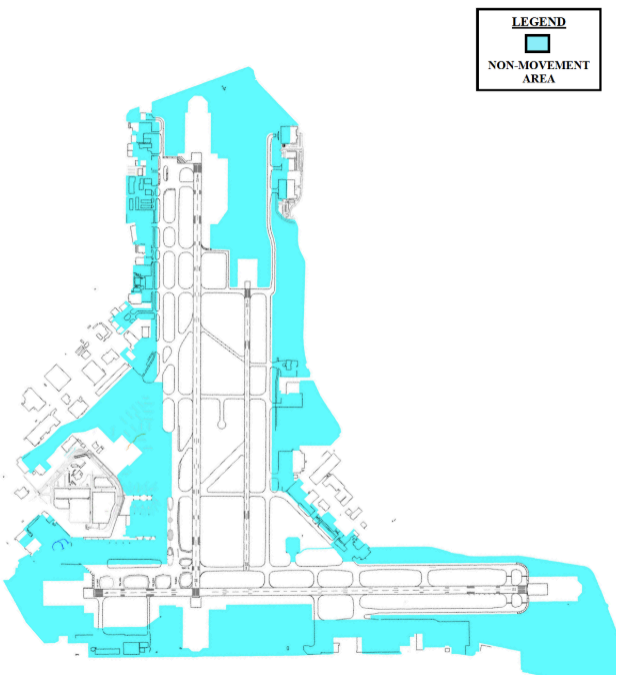

### A-2: Runway/Taxiway Restrictions
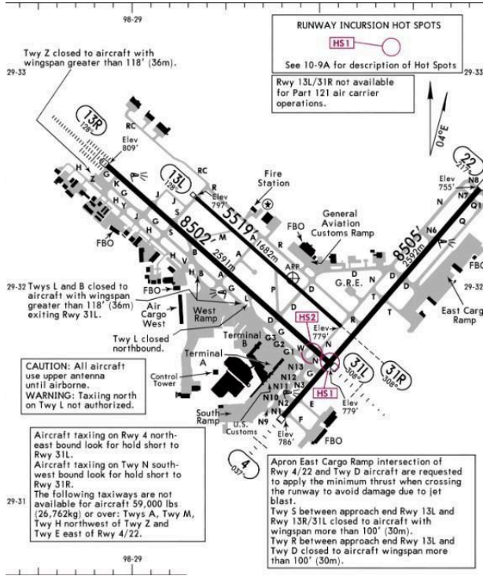

### A-3: Turbojet Departure Frequencies
| SID/Destination | 13 Flow | 31 Flow | 4 Flow | 22 Flow |
| --- | --- | --- | --- | --- |
| ALAMO# YODUH# | (N) 127.10 | (W) 125.10 | (W) 125.10 | (W) 125.10 |
| SNIDR# | (N) 127.10 | (W) 125.10 | (N) 127.10 | (S) 125.70 |
| SLENA# BOWIE# THX/CRP | (S) 125.70 | (S) 125.70 | (N) 127.10 | (S) 125.70 |
| TJANO# BOWIE# LRD | (S) 125.70 | (S) 125.70 | (W) 125.10 | (S) 125.7 |
| ALISS# LEJON# | (S) 125.70 | (W) 125.10 | (W) 125.10 | (W) 125.10 |

### A-4: Non-Turbojet IFR Headings/Departure Frequencies
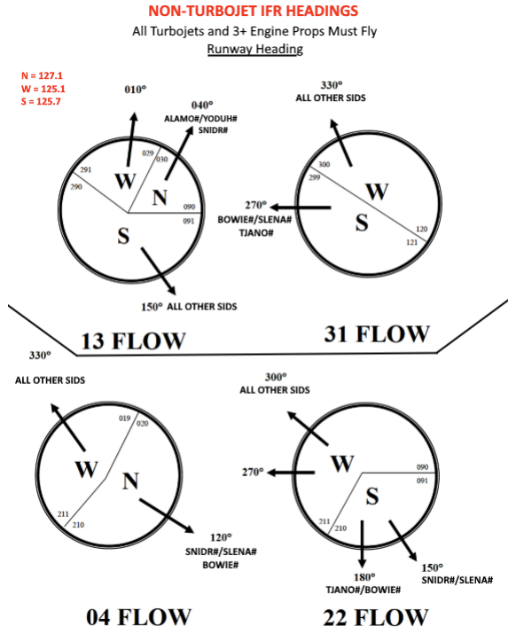

### A-5: VFR Headings/Departure Frequencies
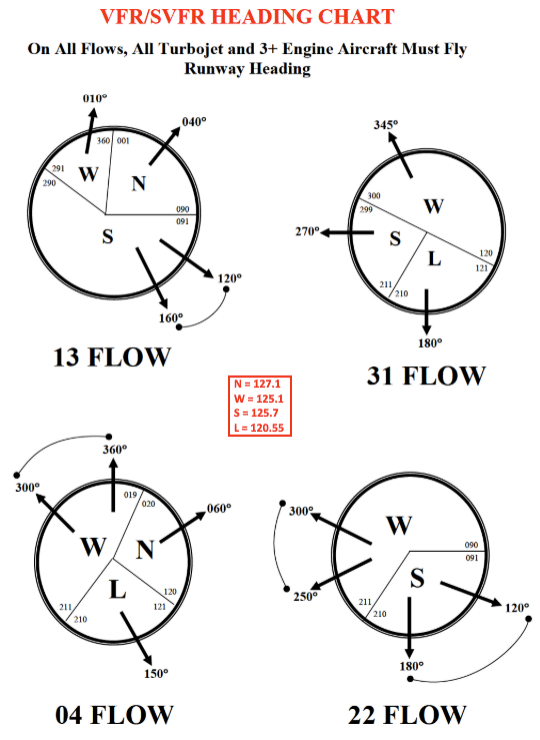

### A-6: Local Control Airspace
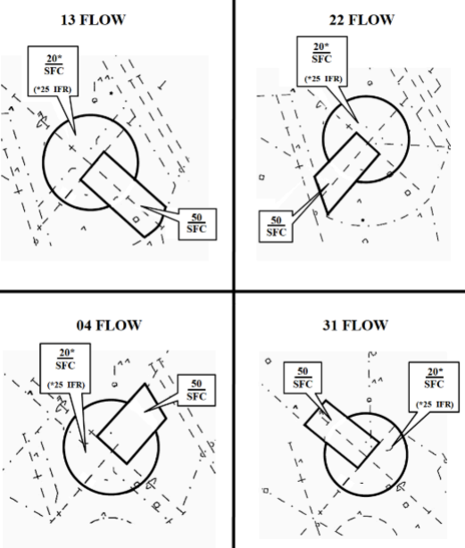

### A-7: Preferred Arrival Routing Diagrams
#### 13 Flow
??? info "SAT 13 Arrivals"
    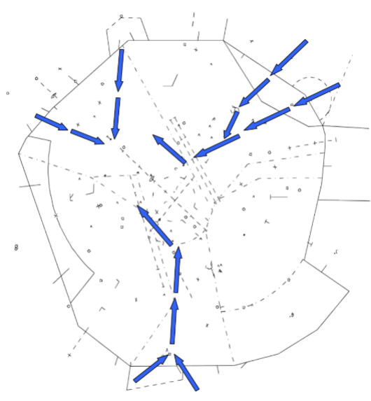
??? info "SKF 16 Arrivals"
    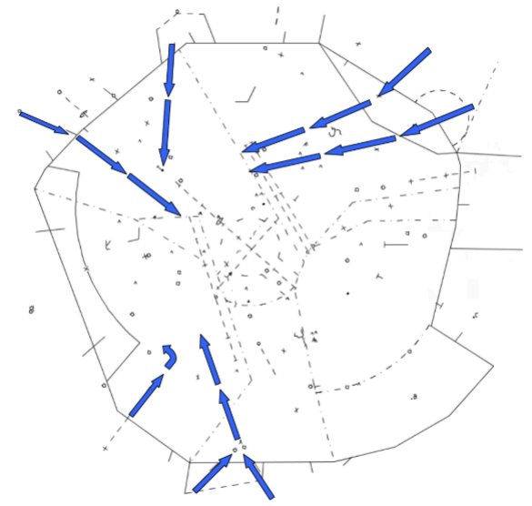
??? info "RND 15 Arrivals"
    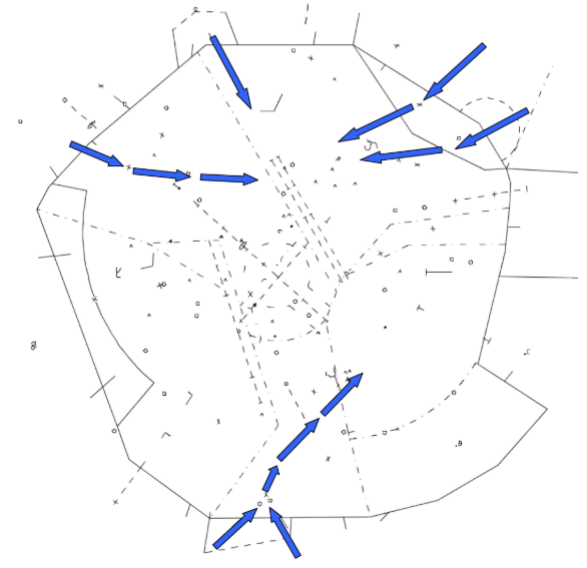

#### 31 Flow
??? info "SAT 31 Arrivals"
    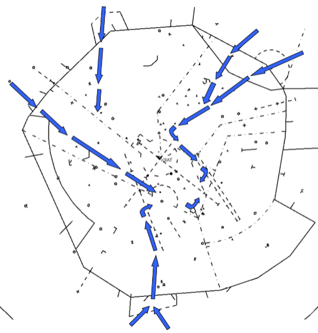
??? info "SKF 34 Arrivals"
    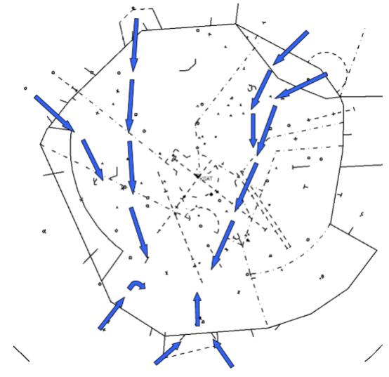
??? info "RND 33 Arrivals"
    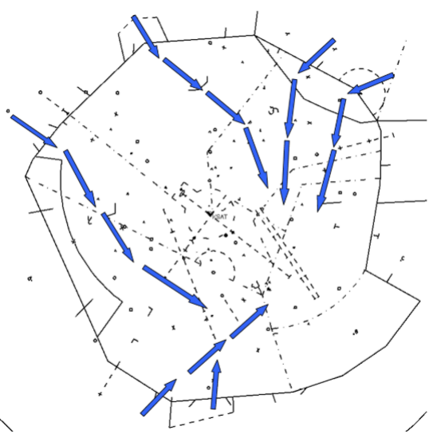

#### 22 Flow
??? info "SAT 22 Arrivals"
    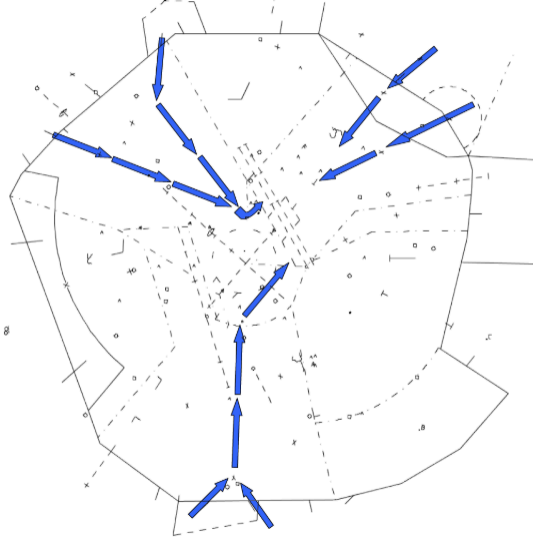
??? info "SKF 16 Arrivals"
    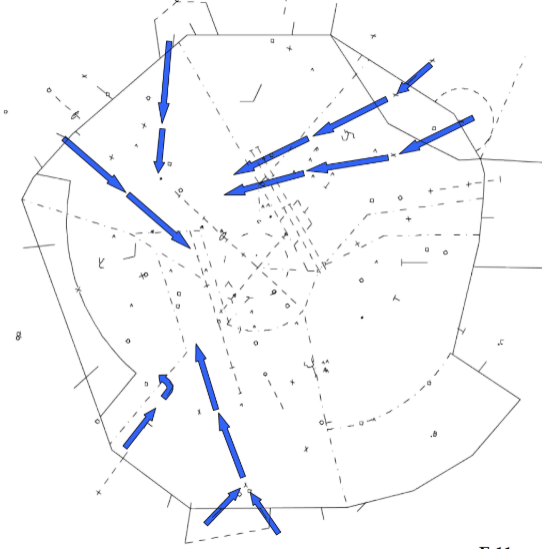
??? info "RND 15 Arrivals"
    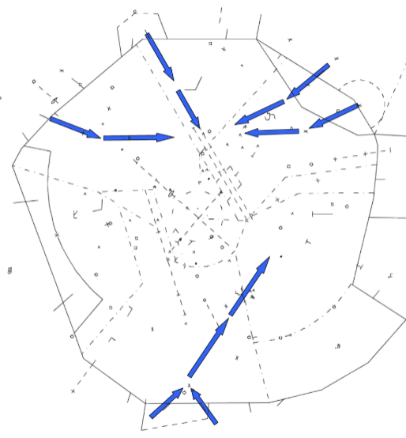

#### 4 Flow
??? info "SAT 4 Arrivals"
    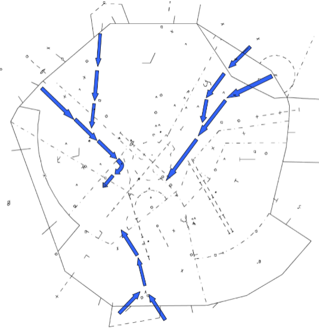
??? info "SKF 34 Arrivals"
    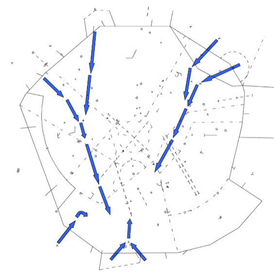
??? info "RND 33 Arrivals"
    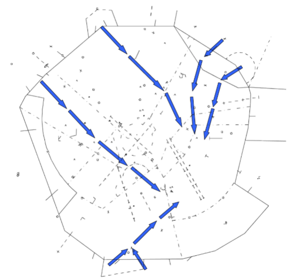

### A-8: TRACON Airspace Diagrams
??? info "13 Flow"
    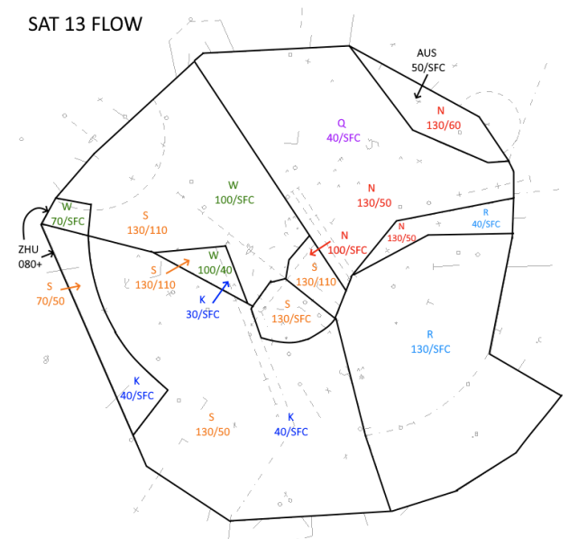
??? info "31 Flow"
    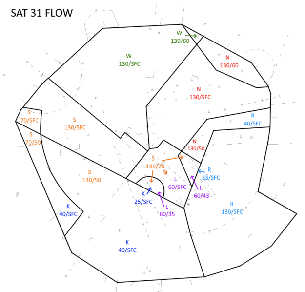
??? info "22 Flow"
    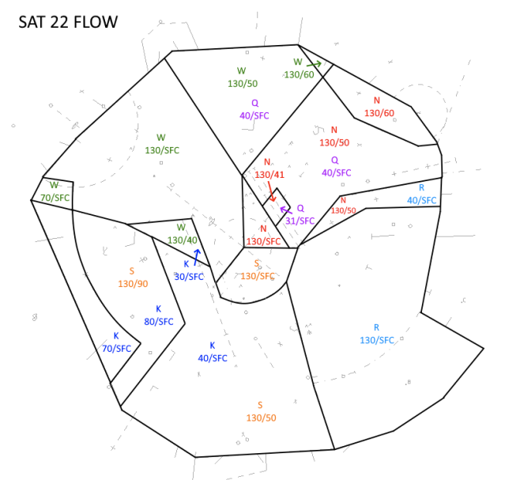
??? info "4 Flow"
    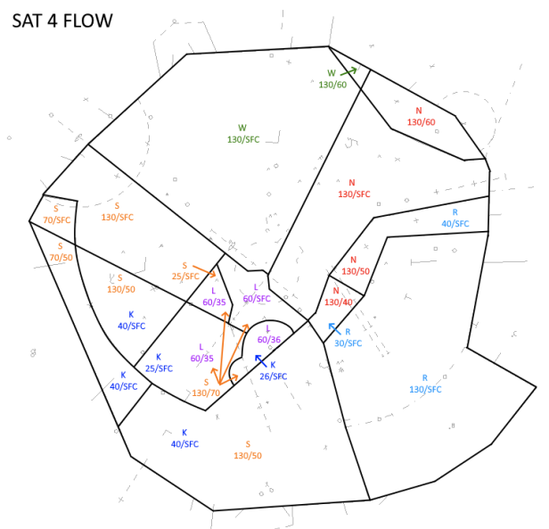

### A-9: Runway Intersection Distances
??? info "13R/31L Intersections"
    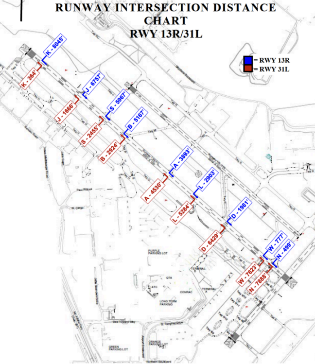
??? info "13L/31R Intersections"
    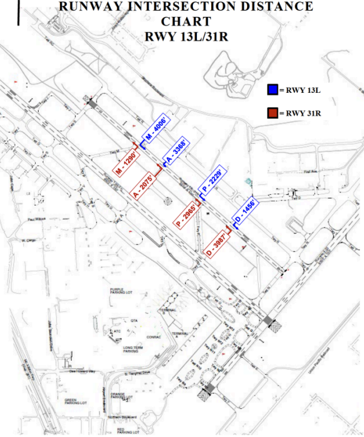
??? info "4/22 Intersections"
    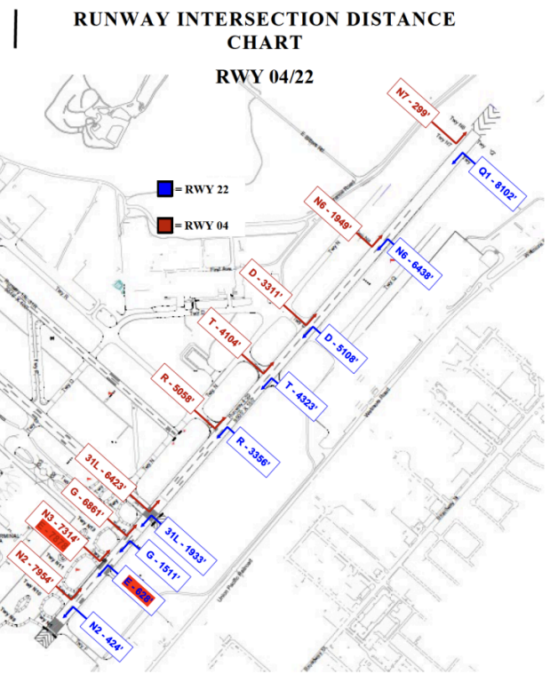